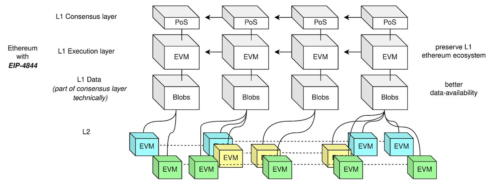

# Deploying Smart Contracts

After compiling your smart contract, you can deploy it to the Hedera network. The constructor's "_init code_" includes the contract's entire bytecode. When deploying, the EVM is expected to be supplied with both the smart contract [bytecode](../../support-and-community/glossary.md#bytecode) and the gas required to execute and deploy the contract. Post-deployment, the constructor is removed, leaving only the `runtime_bytecode` for future contract interactions.

**➡** [**Hyperledger Besu EVM**](deploying-smart-contracts.md#hyperledger-besu-evm-on-hedera)

**➡** [**Cancun Hard Fork**](deploying-smart-contracts.md#cancun-hard-fork)

**➡** [**Solidity Variables and Opcodes**](deploying-smart-contracts.md#solidity-variables-and-opcodes)

***

## Ethereum Virtual Machine (EVM)

The [Ethereum Virtual Machine (EVM)](../../support-and-community/glossary.md#ethereum-virtual-machine-evm) is a run-time environment for executing smart contracts written in EVM native programming languages, like Solidity. The source code must be compiled into bytecode for the EVM to execute a given smart contract.

On Hedera, users can interact with the EVM-compatible environment in several ways. They can submit `ContractCreate`, `EthereumTransaction`, or make `eth_sendRawTransaction` RPC calls with the contract bytecode directly. These various paths allow developers to deploy and manage smart contracts efficiently.

When the EVM receives the bytecode, it will be further broken down into operation codes ([opcodes](../../support-and-community/glossary.md#opcodes)). The EVM opcodes represent the specific instructions it can perform. Each opcode is one byte and has its own gas cost associated with it. The cost per opcode for the Ethereum Cancun hard fork can be found [here](https://www.evm.codes/?fork=cancun).

#### Smart Contract Opcode Example

```solidity
PUSH1 0x80 PUSH1 0x40 MSTORE CALLVALUE DUP1 ISZERO PUSH2 0x10 JUMPI PUSH1 0x0 DUP1 REVERT JUMPDEST POP PUSH1 0x40 MLOAD PUSH2 0x558 CODESIZE SUB DUP1 PUSH2 0x558 DUP4 CODECOPY DUP2 DUP2 ADD PUSH1 0x40 MSTORE PUSH1 0x20 DUP2 LT ISZERO PUSH2 0x33 JUMPI PUSH1 0x0 DUP1 REVERT JUMPDEST DUP2 ADD SWAP1 DUP1 DUP1 MLOAD PUSH1 0x40 MLOAD SWAP4 SWAP3 SWAP2 SWAP1 DUP5 PUSH5 0x100000000 DUP3 GT ISZERO PUSH2 0x53 JUMPI PUSH1 0x0 DUP1 REVERT JUMPDEST DUP4 DUP3 ADD SWAP2 POP PUSH1 0x20 DUP3 ADD DUP6 DUP2 GT ISZERO PUSH2 0x69 JUMPI PUSH1 0x0 DUP1 REVERT JUMPDEST DUP3 MLOAD DUP7 PUSH1 0x1 DUP3 MUL DUP4 ADD GT PUSH5 0x100000000 DUP3 GT OR ISZERO PUSH2 0x86 JUMPI PUSH1 0x0 DUP1 REVERT JUMPDEST DUP1 DUP4 MSTORE PUSH1 0x20 DUP4 ADD SWAP3 POP POP POP SWAP1 DUP1 MLOAD SWAP1 PUSH1 0x20 ADD SWAP1 DUP1 DUP4 DUP4 PUSH1 0x0 JUMPDEST DUP4 DUP2 LT ISZERO PUSH2 0xBA JUMPI DUP1 DUP3 ADD MLOAD DUP2 DUP5 ADD MSTORE PUSH1 0x20 DUP2 ADD SWAP1 POP PUSH2 0x9F JUMP JUMPDEST POP POP POP POP SWAP1 POP SWAP1 DUP2 ADD SWAP1 PUSH1 0x1F AND DUP1 ISZERO PUSH2 0xE7 JUMPI DUP1 DUP3 SUB DUP1 MLOAD PUSH1 0x1 DUP4 PUSH1 0x20 SUB PUSH2 0x100 EXP SUB NOT AND DUP2 MSTORE PUSH1 0x20 ADD SWAP2 POP JUMPDEST POP PUSH1 0x40 MSTORE POP POP POP CALLER PUSH1 0x0 DUP1 PUSH2 0x100 EXP DUP2 SLOAD DUP2 PUSH20 0xFFFFFFFFFFFFFFFFFFFFFFFFFFFFFFFFFFFFFFFF MUL NOT AND SWAP1 DUP4 PUSH20 0xFFFFFFFFFFFFFFFFFFFFFFFFFFFFFFFFFFFFFFFF AND MUL OR SWAP1 SSTORE POP DUP1 PUSH1 0x1 SWAP1 DUP1 MLOAD SWAP1 PUSH1 0x20 ADD SWAP1 PUSH2 0x144 SWAP3 SWAP2 SWAP1 PUSH2 0x14B JUMP JUMPDEST POP POP PUSH2 0x1E8 JUMP JUMPDEST DUP3 DUP1 SLOAD PUSH1 0x1 DUP2 PUSH1 0x1 AND ISZERO PUSH2 0x100 MUL SUB AND PUSH1 0x2 SWAP1 DIV SWAP1 PUSH1 0x0 MSTORE PUSH1 0x20 PUSH1 0x0 KECCAK256 SWAP1 PUSH1 0x1F ADD PUSH1 0x20 SWAP1 DIV DUP2 ADD SWAP3 DUP3 PUSH1 0x1F LT PUSH2 0x18C JUMPI DUP1 MLOAD PUSH1 0xFF NOT AND DUP4 DUP1 ADD OR DUP6 SSTORE PUSH2 0x1BA JUMP JUMPDEST DUP3 DUP1 ADD PUSH1 0x1 ADD DUP6 SSTORE DUP3 ISZERO PUSH2 0x1BA JUMPI SWAP2 DUP3 ADD JUMPDEST DUP3 DUP2 GT ISZERO PUSH2 0x1B9 JUMPI DUP3 MLOAD DUP3 SSTORE SWAP2 PUSH1 0x20 ADD SWAP2 SWAP1 PUSH1 0x1 ADD SWAP1 PUSH2 0x19E JUMP JUMPDEST JUMPDEST POP SWAP1 POP PUSH2 0x1C7 SWAP2 SWAP1 PUSH2 0x1CB JUMP JUMPDEST POP SWAP1 JUMP JUMPDEST JUMPDEST DUP1 DUP3 GT ISZERO PUSH2 0x1E4 JUMPI PUSH1 0x0 DUP2 PUSH1 0x0 SWAP1 SSTORE POP PUSH1 0x1 ADD PUSH2 0x1CC JUMP JUMPDEST POP SWAP1 JUMP JUMPDEST PUSH2 0x361 DUP1 PUSH2 0x1F7 PUSH1 0x0 CODECOPY PUSH1 0x0 RETURN INVALID PUSH1 0x80 PUSH1 0x40 MSTORE CALLVALUE DUP1 ISZERO PUSH2 0x10 JUMPI PUSH1 0x0 DUP1 REVERT JUMPDEST POP PUSH1 0x4 CALLDATASIZE LT PUSH2 0x36 JUMPI PUSH1 0x0 CALLDATALOAD PUSH1 0xE0 SHR DUP1 PUSH4 0x2E982602 EQ PUSH2 0x3B JUMPI DUP1 PUSH4 0x32AF2EDB EQ PUSH2 0xF6 JUMPI JUMPDEST PUSH1 0x0 DUP1 REVERT JUMPDEST PUSH2 0xF4 PUSH1 0x4 DUP1 CALLDATASIZE SUB PUSH1 0x20 DUP2 LT ISZERO PUSH2 0x51 JUMPI PUSH1 0x0 DUP1 REVERT JUMPDEST DUP2 ADD SWAP1 DUP1 DUP1 CALLDATALOAD SWAP1 PUSH1 0x20 ADD SWAP1 PUSH5 0x100000000 DUP2 GT ISZERO PUSH2 0x6E JUMPI PUSH1 0x0 DUP1 REVERT JUMPDEST DUP3 ADD DUP4 PUSH1 0x20 DUP3 ADD GT ISZERO PUSH2 0x80 JUMPI PUSH1 0x0 DUP1 REVERT JUMPDEST DUP1 CALLDATALOAD SWAP1 PUSH1 0x20 ADD SWAP2 DUP5 PUSH1 0x1 DUP4 MUL DUP5 ADD GT PUSH5 0x100000000 DUP4 GT OR ISZERO PUSH2 0xA2 JUMPI PUSH1 0x0 DUP1 REVERT JUMPDEST SWAP2 SWAP1 DUP1 DUP1 PUSH1 0x1F ADD PUSH1 0x20 DUP1 SWAP2 DIV MUL PUSH1 0x20 ADD PUSH1 0x40 MLOAD SWAP1 DUP2 ADD PUSH1 0x40 MSTORE DUP1 SWAP4 SWAP3 SWAP2 SWAP1 DUP2 DUP2 MSTORE PUSH1 0x20 ADD DUP4 DUP4 DUP1 DUP3 DUP5 CALLDATACOPY PUSH1 0x0 DUP2 DUP5 ADD MSTORE PUSH1 0x1F NOT PUSH1 0x1F DUP3 ADD AND SWAP1 POP DUP1 DUP4 ADD SWAP3 POP POP POP POP POP POP POP SWAP2 SWAP3 SWAP2 SWAP3 SWAP1 POP POP POP PUSH2 0x179 JUMP JUMPDEST STOP JUMPDEST PUSH2 0xFE PUSH2 0x1EC JUMP JUMPDEST PUSH1 0x40 MLOAD DUP1 DUP1 PUSH1 0x20 ADD DUP3 DUP2 SUB DUP3 MSTORE DUP4 DUP2 DUP2 MLOAD DUP2 MSTORE PUSH1 0x20 ADD SWAP2 POP DUP1 MLOAD SWAP1 PUSH1 0x20 ADD SWAP1 DUP1 DUP4 DUP4 PUSH1 0x0 JUMPDEST DUP4 DUP2 LT ISZERO PUSH2 0x13E JUMPI DUP1 DUP3 ADD MLOAD DUP2 DUP5 ADD MSTORE PUSH1 0x20 DUP2 ADD SWAP1 POP PUSH2 0x123 JUMP JUMPDEST POP POP POP POP SWAP1 POP SWAP1 DUP2 ADD SWAP1 PUSH1 0x1F AND DUP1 ISZERO PUSH2 0x16B JUMPI DUP1 DUP3 SUB DUP1 MLOAD PUSH1 0x1 DUP4 PUSH1 0x20 SUB PUSH2 0x100 EXP SUB NOT AND DUP2 MSTORE PUSH1 0x20 ADD SWAP2 POP JUMPDEST POP SWAP3 POP POP POP PUSH1 0x40 MLOAD DUP1 SWAP2 SUB SWAP1 RETURN JUMPDEST PUSH1 0x0 DUP1 SLOAD SWAP1 PUSH2 0x100 EXP SWAP1 DIV PUSH20 0xFFFFFFFFFFFFFFFFFFFFFFFFFFFFFFFFFFFFFFFF AND PUSH20 0xFFFFFFFFFFFFFFFFFFFFFFFFFFFFFFFFFFFFFFFF AND CALLER PUSH20 0xFFFFFFFFFFFFFFFFFFFFFFFFFFFFFFFFFFFFFFFF AND EQ PUSH2 0x1D1 JUMPI PUSH2 0x1E9 JUMP JUMPDEST DUP1 PUSH1 0x1 SWAP1 DUP1 MLOAD SWAP1 PUSH1 0x20 ADD SWAP1 PUSH2 0x1E7 SWAP3 SWAP2 SWAP1 PUSH2 0x28E JUMP JUMPDEST POP JUMPDEST POP JUMP JUMPDEST PUSH1 0x60 PUSH1 0x1 DUP1 SLOAD PUSH1 0x1 DUP2 PUSH1 0x1 AND ISZERO PUSH2 0x100 MUL SUB AND PUSH1 0x2 SWAP1 DIV DUP1 PUSH1 0x1F ADD PUSH1 0x20 DUP1 SWAP2 DIV MUL PUSH1 0x20 ADD PUSH1 0x40 MLOAD SWAP1 DUP2 ADD PUSH1 0x40 MSTORE DUP1 SWAP3 SWAP2 SWAP1 DUP2 DUP2 MSTORE PUSH1 0x20 ADD DUP3 DUP1 SLOAD PUSH1 0x1 DUP2 PUSH1 0x1 AND ISZERO PUSH2 0x100 MUL SUB AND PUSH1 0x2 SWAP1 DIV DUP1 ISZERO PUSH2 0x284 JUMPI DUP1 PUSH1 0x1F LT PUSH2 0x259 JUMPI PUSH2 0x100 DUP1 DUP4 SLOAD DIV MUL DUP4 MSTORE SWAP2 PUSH1 0x20 ADD SWAP2 PUSH2 0x284 JUMP JUMPDEST DUP3 ADD SWAP2 SWAP1 PUSH1 0x0 MSTORE PUSH1 0x20 PUSH1 0x0 KECCAK256 SWAP1 JUMPDEST DUP2 SLOAD DUP2 MSTORE SWAP1 PUSH1 0x1 ADD SWAP1 PUSH1 0x20 ADD DUP1 DUP4 GT PUSH2 0x267 JUMPI DUP3 SWAP1 SUB PUSH1 0x1F AND DUP3 ADD SWAP2 JUMPDEST POP POP POP POP POP SWAP1 POP SWAP1 JUMP JUMPDEST DUP3 DUP1 SLOAD PUSH1 0x1 DUP2 PUSH1 0x1 AND ISZERO PUSH2 0x100 MUL SUB AND PUSH1 0x2 SWAP1 DIV SWAP1 PUSH1 0x0 MSTORE PUSH1 0x20 PUSH1 0x0 KECCAK256 SWAP1 PUSH1 0x1F ADD PUSH1 0x20 SWAP1 DIV DUP2 ADD SWAP3 DUP3 PUSH1 0x1F LT PUSH2 0x2CF JUMPI DUP1 MLOAD PUSH1 0xFF NOT AND DUP4 DUP1 ADD OR DUP6 SSTORE PUSH2 0x2FD JUMP JUMPDEST DUP3 DUP1 ADD PUSH1 0x1 ADD DUP6 SSTORE DUP3 ISZERO PUSH2 0x2FD JUMPI SWAP2 DUP3 ADD JUMPDEST DUP3 DUP2 GT ISZERO PUSH2 0x2FC JUMPI DUP3 MLOAD DUP3 SSTORE SWAP2 PUSH1 0x20 ADD SWAP2 SWAP1 PUSH1 0x1 ADD SWAP1 PUSH2 0x2E1 JUMP JUMPDEST JUMPDEST POP SWAP1 POP PUSH2 0x30A SWAP2 SWAP1 PUSH2 0x30E JUMP JUMPDEST POP SWAP1 JUMP JUMPDEST JUMPDEST DUP1 DUP3 GT ISZERO PUSH2 0x327 JUMPI PUSH1 0x0 DUP2 PUSH1 0x0 SWAP1 SSTORE POP PUSH1 0x1 ADD PUSH2 0x30F JUMP JUMPDEST POP SWAP1 JUMP INVALID LOG2 PUSH5 0x6970667358 0x22 SLT KECCAK256 AND DIFFICULTY CHAINID 0x5F 0x5F PUSH20 0xDFD73A518B57770F5ADB27F025842235980D7A0F 0x4E ISZERO 0xB1 0xAC 0xB1 DUP15 PUSH5 0x736F6C6343 STOP SMOD STOP STOP CALLER
```

Reference: [https://ethervm.io/](https://ethervm.io/)

***

## Hyperledger Besu EVM on Hedera

The Hedera network nodes utilize the [HyperLedger Besu EVM ](../../support-and-community/glossary.md#hyperledger-besu-evm)Client written in Java as an execution layer for Ethereum-type transactions. The codebase is up to date with the current Ethereum Mainnet hard forks. The Besu EVM client library is used without hooks for Ethereum's consensus, networking, and storage features. Instead, Hedera hooks into its own Hashgraph consensus, Gossip communication, and [Virtual Merkle Trees](../../support-and-community/glossary.md#virtual-merkle-tree) components for greater fault tolerance, finality, and scalability.&#x20;

As of the Hedera Mainnet release [`0.50.0`](../../networks/release-notes/services.md#v0.50), the Besu EVM client is configured to support the Cancun hard fork of the Ethereum Mainnet, with some modifications.

### **Cancun Hard Fork**

The smart contract platform has been upgraded to support the visible EVM changes introduced in the [Cancun](https://github.com/ethereum/execution-specs/blob/master/network-upgrades/mainnet-upgrades/cancun.md) hard fork. This includes adding new opcodes for transient storage and memory copy, semantic updates for opcodes introduced certain operations introduced in the [Shanghai](https://github.com/ethereum/execution-specs/blob/master/network-upgrades/mainnet-upgrades/shanghai.md), [London](https://github.com/ethereum/execution-specs/blob/master/network-upgrades/mainnet-upgrades/london.md), [Istanbul](https://github.com/ethereum/execution-specs/blob/master/network-upgrades/mainnet-upgrades/istanbul.md), and [Berlin](https://github.com/ethereum/execution-specs/blob/master/network-upgrades/mainnet-upgrades/berlin.md) hard forks, except those with changes in block production, data serialization, and the double fee market.&#x20;

As of the Hedera Services [0.22](../../networks/release-notes/services.md#v0.22) release, gas and input data costs are charged. The amount of intrinsic gas consumed is a constant charge that occurs before any code executes. The intrinsic gas cost is 21,000. The associated cost of input data is 16 gas for each byte of data that is not zero and 4 gas for each byte of data that is zero. The amount of intrinsic gas consumed is charged in relation to the data supplied when making a contract call to the function parameters of external contracts. The gas schedule and the fees table can be found in the gas section of this documentation page.

<figure><figcaption><p><strong>EIP-4844 Unveiled: Paving the Way for Proto-Danksharding in Ethereum</strong></p></figcaption></figure>

#### Proto-Danksharding

As an interim solution to full sharding, introduced in the Cancun hard fork, the proto-danksharding offers some of the advantages of sharding with reduced complexity and infrastructure changes that are part of a sharding implementation. This, in turn, opens the gates for adding "blobs" of data to append to blocks to increase data availability further and allow more processing efficiency.

Blobs are big data objects within blocks. These can be utilized to store rollups (Layer 2 solutions) and different kinds of apps requiring big data objects to be stored in an efficient way. This is data off-chain for the validators and requires minimal processing on their part. It reduces the computational load on the network and hence reduces the transaction gas fee.

#### ❌ Blobs supported on Hedera?

Hedera does not provide blobs under [EIP-4844](https://eips.ethereum.org/EIPS/eip-4844). [HIP-866](https://hips.hedera.com/hip/hip-866) defines how Hedera behaves without blob support. To preserve compatibility and future design space, Hedera will act as if blobs are not being added. This allows existing contracts dependent on blob behavior to function without blobs. Blobs will be prevented from entering the system by prohibiting "Type 3" transactions, which enable blobs. This will keep blobs out of the EVM's concern without affecting other desirable interactions on Hedera.

### Solidity Variables and Opcodes

The table below defines the mapping of Solidity variables and operation codes to Hedera. The full list of supported Opcodes for the Cancun hard fork can be found [here](https://www.evm.codes/).&#x20;

<table><thead><tr><th width="245" align="center">Solidity</th><th width="170" align="center">Opcode</th><th>Hedera</th></tr></thead><tbody><tr><td align="center"><code>address</code></td><td align="center"></td><td>The address is a mapping of shard.realm.number (0.0.10) into a 20 byte Solidity address. The address can be a Hedera account ID or contract ID in Solidity format.</td></tr><tr><td align="center"><code>block.basefee</code></td><td align="center"><code>BASEFEE</code></td><td>The <code>BASEFEE</code> opcode will return zero. Hedera does not use the Fee Market mechanism this is designed to support.</td></tr><tr><td align="center"><code>block.chainId</code></td><td align="center"><code>CHAINID</code></td><td>The <code>CHAINID</code> opcode will return 295(hex <code>0x0127</code>) for mainnet, 296( hex <code>0x0128</code>) for testnet, 297( hex <code>0x0129</code>) for previewnet, and 298 (<code>0x12A</code>) for development networks.</td></tr><tr><td align="center"><code>block.coinbase</code></td><td align="center"><code>COINBASE</code></td><td>The <code>COINBASE</code> operation will return the funding account (Hedera transaction fee collecting account <code>0.0.98</code>).</td></tr><tr><td align="center"><code>block.number</code></td><td align="center"></td><td>The index of the record file (not recommended, use <code>block.timestamp</code>).</td></tr><tr><td align="center"><code>block.timestamp</code></td><td align="center"></td><td>The transaction consensus timestamp.</td></tr><tr><td align="center"><code>block.difficulty</code></td><td align="center"></td><td>Always zero.</td></tr><tr><td align="center"><code>block.gaslimit</code></td><td align="center"><code>GASLIMIT</code></td><td>The <code>GASLIMIT</code> operation will return the <code>gasLimit</code> of the transaction. The transaction <code>gasLimit</code> will be the lowest of the gas limit requested in the transaction or a global upper gas limit configured for all smart contracts.</td></tr><tr><td align="center"><code>msg.sender</code></td><td align="center"></td><td>The address of the Hedera contract ID or account ID in Solidity format that called this contract. For the root level or for delegate chains that go to the root, it is the account ID paying for the transaction.</td></tr><tr><td align="center"><code>msg.value</code></td><td align="center"></td><td>The value associated to the transaction associated in tinybar.</td></tr><tr><td align="center"><code>tx.origin</code></td><td align="center"></td><td>The account ID paying for the transaction, regardless of depth.</td></tr><tr><td align="center"><code>tx.gasprice</code></td><td align="center"></td><td>Fixed (varies with the global fee schedule and exchange rate).</td></tr><tr><td align="center"><p><code>selfdestruct</code></p><p><code>(address payable recipient)</code></p></td><td align="center"><code>SELFDESTRUCT</code></td><td>Address will not be reusable due to Hedera’s account numbering policies. On <code>SELFDESTRUCT</code> the contracts HBAR and HTS tokens are transferred to the recipients. If the recipient does not exist or does not have an allowance for any of the HTS tokens, this opcode will fail. </td></tr><tr><td align="center"><code>&#x3C;address>.code</code></td><td align="center"></td><td>Precompile contract addresses will report no code, including HTS System contract.</td></tr><tr><td align="center"><code>&#x3C;address>.codehash</code></td><td align="center"></td><td>Precompile contract addresses will report the empty code hash.</td></tr><tr><td align="center"></td><td align="center"><code>PRNGSEED</code></td><td>This opcode returns a random number based on the n-3 record running hash.</td></tr><tr><td align="center"><code>delegateCall</code></td><td align="center"></td><td>Contracts may no longer use <code>delegateCall()</code> to invoke system contracts. Contracts should instead use the <code>call()</code> method.</td></tr><tr><td align="center"><code>blobVersionedHashesAtIndex</code></td><td align="center"><code>BLOBHASH</code></td><td>The <code>BLOBHASH</code> operation will return all zeros at all times.</td></tr><tr><td align="center"><code>blobBaseFee</code></td><td align="center"><code>BLOBBASEFEE</code></td><td><p>The <code>BLOBBASEFEE</code> operation will return</p><p><code>1</code> at all times.</p></td></tr></tbody></table>

Reference: [HIP-866](https://hips.hedera.com/hip/hip-866), [HIP-868](https://hips.hedera.com/hip/hip-868)

***

### Limitation on `fallback()` / `receive()` Functions in Hedera Smart Contracts <a href="#limitation-on-fallback-receive-functions-in-hedera-smart-contracts" id="limitation-on-fallback-receive-functions-in-hedera-smart-contracts"></a>

When developing smart contracts on Hedera, it's important to understand that the `fallback()` and `receive()` functions **do not** get triggered when a contract receives HBAR via a crypto transfer.

In Ethereum, these functions act as "catch-all" mechanisms when a contract receives Ether. In Hedera, however, contract balances may change through native HAPI operations, independent of EVM message calls, making it impossible to maintain balance-related invariants with just the `fallback()` or `receive()` methods.

#### Impacted Variables

* **`msg.sender`:** The address initiating the contract call.
* **`msg.value`:** The amount of HBAR sent along with the call.

#### Key Points

* Developers should implement explicit functions to handle HBAR transfers.
* To disable native operations entirely, consider submitting a [Hedera Improvement Proposal (HIP)](https://hips.hedera.com/).

Understanding these differences is crucial for anyone developing smart contracts on Hedera, particularly those familiar with Ethereum.

***

## Deploying Your Smart Contract

**SDK**

You can use a [Hedera SDK](../../sdks-and-apis/sdks/) to deploy your smart contract bytecode to the network. This approach does not require using any EVM tools like Hardhat or an instance of the Hedera JSON-RPC Relay.


[deploy-your-first-smart-contract.md](../../tutorials/smart-contracts/deploy-your-first-smart-contract.md)


**Hardhat**

Hardhat can be used to deploy your smart contract by pointing to a community-hosted [JSON-RPC Relay](deploying-smart-contracts/json-rpc-relay.md). However, EVM tools do not support features that are native to Hedera smart contracts like:

* Admin Key
* Contract Memo
* Automatic Token Associations
* Auto Renew Account ID
* Staking Node ID or Account ID
* Decline Staking Rewards

If you need to set any of the above properties for your contract, you will have to call the `ContractCreateTransaction` API using one of the [Hedera SDKs.](../../sdks-and-apis/sdks/)


[deploy-a-smart-contract-using-hardhat-hedera-json-rpc-relay.md](../../tutorials/smart-contracts/deploy-a-smart-contract-using-hardhat-hedera-json-rpc-relay.md)


***

## FAQs

<details>

<summary><strong>Can I use Solidity functions directly with the Hedera EVM?</strong></summary>

Yes, you can use Solidity functions directly with the Hedera EVM. However, refer to the [Solidity Variables and Opcodes](deploying-smart-contracts.md#solidity-variables-and-opcodes) table to understand any modifications to opcode descriptions that better reflect their behavior on the Hedera network.

</details>

<details>

<summary><strong>What should I do if my contract relies on blob-related opcodes?</strong></summary>

If your contract relies on blob-related opcodes introduced in the Cancun hard fork, you can still deploy it on Hedera. The blob-related opcodes **will** **not** fail. They'll return default values as [specified by the EVM](https://www.evm.codes/?fork=cancun).&#x20;

</details>

<details>

<summary><strong>Are there any special considerations for using updated EVM opcodes on Hedera?</strong></summary>

Yes, while the Hedera EVM supports the updated opcodes from the Cancun hard fork, you should know the intrinsic gas costs and input data charges specific to Hedera. Refer to the [gas schedule and fees](gas-and-fees.md) table for more information.

</details>
