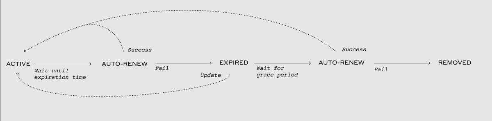

# Smart Contract Rent


🚨 **HEDERA COUNCIL HAS NOT ENABLED RENTS ON SMART CONTRACTS YET. RENTS PAY FOR THE ONGOING USAGE OF RESOURCES USED BY THE SMART CONTRACT. HEDERA INTENDS TO ENABLE THE RENTS IN THE FUTURE, AS DESCRIBED IN THIS SECTION. MORE DETAILS COMING SOON... 🚨**


Smart contract rent is a recurring payment mechanism designed to maintain resource allocation and is required for contracts to remain active on the network. For contracts, rent is comprised of two primary components:

**➡** [**Auto-Renewal**](smart-contract-rent.md#contract-auto-renewal)

**➡** [**Storage Payments**](smart-contract-rent.md#storage-payment)

***

## Contract Auto-Renewal

Auto-renewal is a feature that automatically renews the life of non-deleted smart contracts by a minimum of 90 days. Contract authors are encouraged to establish an auto-renew account specifically for this purpose.

The network will attempt to automatically charge the **renewal payment** to the expired contract's auto-renew account. The network will attempt to charge the contract if an auto-renew account has zero balance.

If the account lacks sufficient funds for renewal, the contract goes into a one-week grace period. During this time, the contract is inoperable unless funds are added, its expiry is extended (via `ContractUpdate`), or it receives HBAR. Failing to renew will result in the contract being purged from the state.

***

## Storage Payments

Contract storage payments on Hedera will activate once **100 million key-value pairs** are stored cumulatively across the network. The Hedera Coin Economics Committee is expected to set a rate of **$0.02 per key-value pair per year**. This applies to all contracts on Hedera, regardless of the contract being created before or after the rent payments go live.

Once storage payments are enabled on Hedera, each contract has **100 free key-value pairs** of storage available. Then, once a contract exceeds the first 100 free key-value pairs, it must pay storage fees.

> _Storage fees will be part of the rent payment collected when a contract is auto-renewed. Valid renewal windows are between \~30 and \~92 days (see_ [_HIP-372_](https://hips.hedera.com/hip/hip-372)_)._

If a high enough utilization threshold is reached, **congestion pricing applies.** In this case, prices charged will be inversely proportional to the remaining system capacity of the network (lower remaining capacity means higher pricing). This applies to all transactions.

***

## Smart Contract Rent - Frequently Asked Questions (FAQ)

Why do contracts have to pay rent on Hedera?

Distributed networks like Hedera have a finite amount of computational resources. When entities like smart contracts are deployed on a decentralized network, a portion of those resources are consumed. Thus, it is unfeasible to maintain an unlimited number of entities for an infinite amount of time on finite resources. Solving this problem is necessary, and it’s a key topic of discussion by Leemon and [others](https://www.coindesk.com/markets/2018/03/27/vitalik-wants-you-to-pay-to-slow-ethereums-growth/) in the layer 1 network space.

Contract rent is an economically and technically viable approach to manage smart contract entities and state storage.

Do all entities on Hedera have to pay rent or just contracts?

All other network entities (e.g., Tokens, accounts, topics, and files) will also pay rent. However, the timeline for the rent is not yet defined. Sufficient time and notice will be provided to the community before enabling rent for other entities.

What charges are included in contract rent?

Rent is defined as the recurring payment required for contracts (and, eventually, all other Hedera entities) to remain active on the network. For contracts, rent is comprised of **auto-renewal** and **storage** payments:

* **Auto-renewal payments** The auto-renewal fee for a contract is $0.026 USD per 90 days.
* **Storage payments** will start once a total of **100 million key-value pairs** are stored cumulatively across the network. These storage fees will be part of the rent payment collected when a contract is auto-renewed. The storage fee rate is $0.02 per key-value pair per year.

What are the steps in the renewal process? And what happens if a contract doesn’t pay rent?

Every entity on Hedera has the fields `expirationTime`, `autorenewPeriod`, and `autorenewAccount`.

1. When the `expirationTime` for a contract is reached, the network will first try to charge rent to the contract’s `autoRenewAccount`
   * If renewal is successful, then the contract remains active on the network
   * If renewal fails, then the contract is marked as `expired`
2. An `expired` entity is given a grace period before it is removed from the network. During the grace period, the entity (contract) is inactive, and all transactions involving it will fail, except for an update transaction to extend the `expirationTime`
   * A contract in the grace period can be immediately "re-activated" by either sending it some HBAR or manually extending its `expirationTime` via a contract update transaction
3. At the end of the grace period, the contract is permanently removed from the ledger if:
   * The contract and its `autoRenewAccount` still have a zero HBAR balance at the end of the grace period, OR
   * The contract is not manually extended during the grace period

Note that the ID number of a removed entity is not reused going forward. In addition, if an entity was marked as `deleted`, then it cannot have its `expirationTime` extended. Neither an update transaction nor an auto-renew will be able to extend it.

See the diagram below and [HIP-16](https://hips.hedera.com/hip/hip-16) for more details.

How long is the grace period for expired contracts?

The grace period between entity expiration and deletion is 30 days.

Who pays for the contract’s renewal and storage fees?

Smart contracts on Hedera can pay for rent in two ways: external funds or contract funds.

When the `expirationTime` for a contract is reached, the network will first try to charge rent to the contract’s `autoRenewAccount`:

* If the `autoRenewAccount` has sufficient HBAR to pay for the `autoRenewPeriod`, then the contract is successfully renewed
* If the `autoRenewAccount` has some HBAR but not enough to afford the full `autoRenewPeriod`, then the contract is extended for as long as possible (say, 1 week instead of 90 days). Once that extension (1 week) elapses, if the `autoRenewAccount` hasn't been re-funded to cover the `autoRenewPeriod`, then the contract account itself will be charged for rent
* If the `autoRenewAccount` has a zero HBAR balance, then the contract itself is charged
* If the `autoRenewAccount` and the contract both have a zero HBAR balance at the time that renewal fees are due, the contract is marked as `expired`

What happens if I call a contract that is expired?

Calling an `expired` contract will resolve to `CONTRACT_EXPIRED_AND_AWAITING_REMOVAL`.

When a contract is expired and deleted from the network, what happens to its account and assets?

If an expired contract that holds native Hedera Token Service (HTS) tokens reaches the deletion stage, then the assets held by that contract are returned to their respective treasury accounts.

If the deleted contract is being used as a specific key for an HTS token, then that key field will refer to a contract that no longer exists. That specific key can be changed, as long as an admin key was specified during token creation. If the token is immutable (no admin key), the specific key cannot be changed.

Contracts that are the treasury for HTS tokens do not expire at this moment (subject to change in the future).

For how long can I renew my contract?

The minimum renewal period possible is 2,592,000 seconds (\~30 days) and the maximum is 8,000,001 seconds (\~92 days).

See details in [HIP-372: Entity Auto-Renewals and Expiry Window](https://hips.hedera.com/hip/hip-372).

If I change the <code>autoRenewPeriod</code> of my contract from 30 to 90 days, what will the cost of my transaction be?

The cost of rent scales just about linearly with the length of the renewal period. So a renewal that pays for 90 days will cost \~3 times as much as a renewal that pays for 30 days.

Where can I seen when a contract will expire?

Mirror nodes provide the expiration time for contracts. You can obtain this information using the mirror node REST API (show it as `expiration_time`) and network explorers like HashScan (shows it as `Expires at`).

Where do the auto-renewal transactions appear? Can these be seen on network explorers like HashScan?

According to [HIP-16: Entity Auto-Renewal](https://hips.hedera.com/hip/hip-16), records of auto-renew charges will appear as `actions` in the record stream, and will be available via mirror nodes. In addition, the fee breakdown is provided in network explorers like HashScan for the contract update transaction. No receipts or records for auto-renewal actions will be available via HAPI queries.

[HIP-449](https://hips.hedera.com/hip/hip-449) provides technical details on how information for expiring contracts is included in the record stream.

Can the <code>autoRenewAccount</code> for a contract be set to another contract ID?

Yes, that is possible for contracts.

What are the key-value pair thresholds that I should be aware of that impact the size of the storage payment?

* Storage payments for contracts will only start being charged once **100 million key-value pairs** are reached cumulatively across the network
* After than, each contract has **100 free key-value pairs** of storage available. Once a contract exceeds the first 100 free key-value pairs, it must pay storage fees

For smart contracts created via <code>CREATE2</code>, how can I specify rent-related properties like<code>autorenewAccount</code> and <code>autorenewPeriod</code>?

Contracts created via `CREATE2` inside the EVM will inherit the `autorenewaccount` and `autorenewPeriod`of the `sender` address.

For example, if you call contract `0xab...cd` which has `autorenewAccount` `0.0.X` and `autorenewPeriod` of 45 days, and this contract deploys a new contract `0xcd...ef`, then the new contract will also have `autorenewAccount` `0.0.X`and `autorenewPeriod` of 45 days.

Also, remember that rent can be covered by the HBAR balance of a contract. Thus, developers can send HBAR to the contract or configure the contract to charge users a specific HBAR amount when executing operations.

