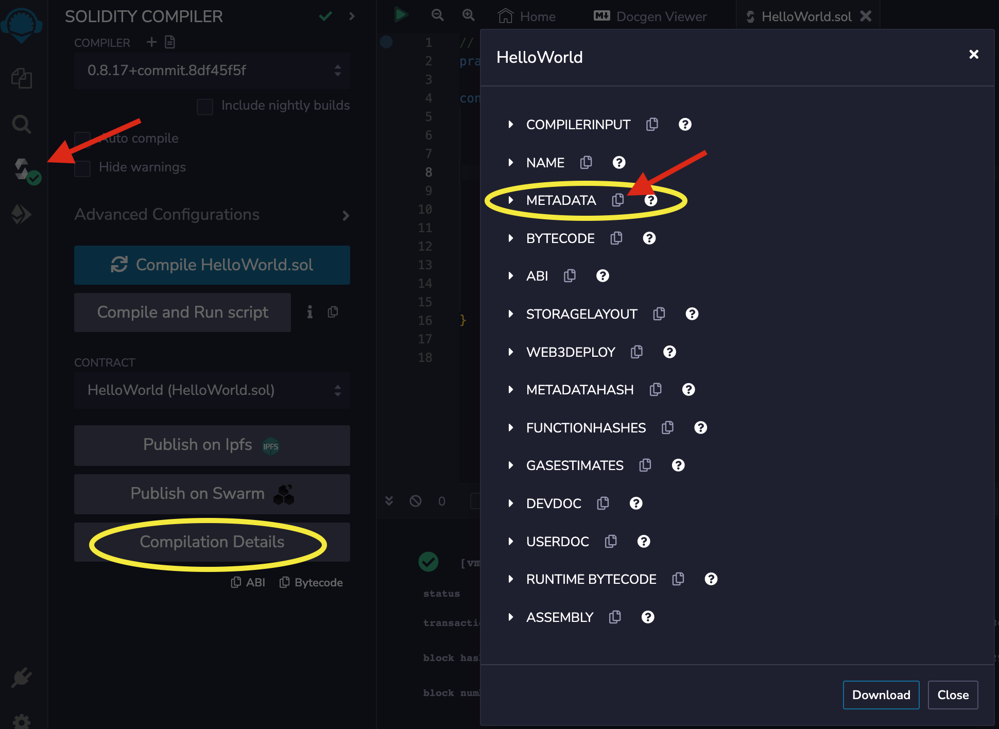
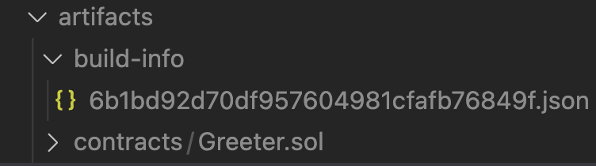
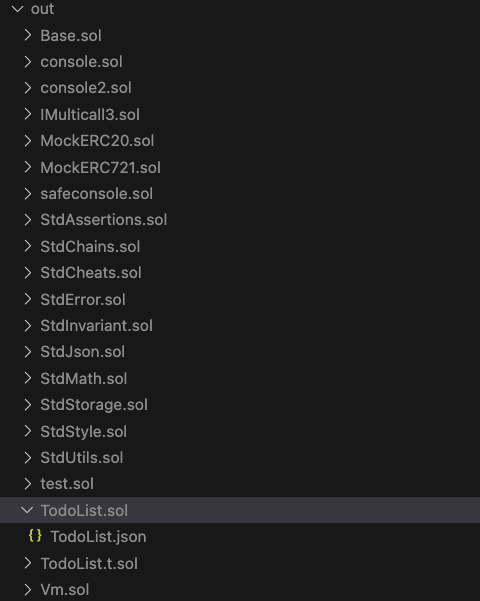

# Verifying Smart Contracts

Smart contract verification is the process of verifying that the smart contract bytecode uploaded to the network matches the expected smart contract source files. Verification is _not_ required for contracts deployed on the Hedera network, but it is best practice and essential to maintaining the contract's security and integrity by identifying vulnerabilities that could be exploited, as smart contracts are immutable once deployed. It also enables transparency and builds trust within the user community by proving that the deployed bytecode matches the contract's original source code.

To initiate verification, you can use a community-hosted Hedera Mirror Node Explorer, like [HashScan](https://hashscan.io/) ([Arkhia](https://explorer.arkhia.io/) and [Dragon Glass](https://app.dragonglass.me/) do not currently support this feature), that integrates with [Sourcify](../../support-and-community/glossary.md#sourcify): A Solidity source code and metadata verification tool. Once you upload your files to the verification tool, Sourcify recompiles the submitted source code and metadata files to check them against the deployed bytecode. If a match is found, the contract's verification status is updated to either a [_<mark style="color:green;">Full (Perfect) Match</mark>_](https://docs.sourcify.dev/docs/full-vs-partial-match/#full-perfect-matches) or a [_<mark style="color:green;">Partial Match</mark>_](https://docs.sourcify.dev/docs/full-vs-partial-match/#partial-matches)_<mark style="color:green;">.</mark>_

The verification status is publicly available across all community-hosted Hedera Mirror Node Explorers. To learn what differentiates a _Full (Perfect) Match_ from a _Partial Match_, check out the Sourcify documentation [here](https://docs.sourcify.dev/docs/full-vs-partial-match/).


**Note**: This is an initial beta release, and both the HashScan user interface and API functionalities are scheduled for enhancements in upcoming updates.


For verification, you will need the following items:

**➡** [**Smart Contract Source Code**](verifying-smart-contracts-beta.md#smart-contract-source-code)

**➡** [**The Metadata File**](verifying-smart-contracts-beta.md#the-metadata-file)

**➡** [**Deployed Smart Contract Address**](verifying-smart-contracts-beta.md#deployed-smart-contract-address)

***

## Smart Contract Source Code

This is the actual code for your smart contract written in Solidity. The source code includes all the contract's functions, variables, and logic. It's crucial for the verification process, where the deployed bytecode is compared to the compiled bytecode of this source code.

#### Example:

A simple `HelloWorld` Solidity smart contract:

```solidity
pragma solidity ^0.8.17;

contract HelloWorld {
   // the contract's owner, set in the constructor
   address owner;
   
   // the message we're storing, set in the constructor
   string message;
 
   constructor(string memory message_) {
      // set the owner of the contract for 'kill()'
      owner = msg.sender;
      message = message_; 
   }
   
   function set_message(string memory message_) public {
        // only allow the owner to update the message
        if (msg.sender != owner) return;
        message = message_;
    }

    // return a string
    function get_message() public view returns (string memory) {
        return message;
    }
}
```

***

## The Metadata File

When you compile a Solidity smart contract, it generates a JSON metadata file. This file contains settings used when the smart contract was originally compiled. These settings can include the compiler version, optimization details, and more. The metadata file is crucial for ensuring that the bytecode generated during verification matches the deployed bytecode.

> _Metadata is not part of the EVM spec because it's handled externally by compilers and tools like Sourcify. See Sourcify's Metadata documentation_ [_here_](https://docs.sourcify.dev/docs/metadata/#metadata)_._

You have options for generating the metadata file. The recommended skill levels for each option are in parentheses. Choose the option that best fits your experience with smart contracts:

<details>

<summary>Remix IDE (beginner)</summary>

To create a metadata file in Remix, compile your smart contract and the compiled artifacts will be saved in the `artifacts/` directory and the `<dynamic_hash>.json` metadata file will be under `artifacts/build-info` and used for verification. Alternatively, you can copy and paste it from the Solidity compiler tab. Please see the image below.



See the Remix IDE docs for more detailed documentation [here](https://remix-ide.readthedocs.io/en/latest/contract_metadata.html).

**Note:** Taking the bytecode and metadata from Remix and then deploying that on Hedera results in a _**full (perfect) match**_. Taking the bytecode and metadata from Remix _after_ deploying the contract on Hedera results in a _**partial match**_ or _**The deployed and recompiled bytecode don't match**_ error. _The requirement for verification with a contract compiled in Remix is just the smart contract's Solidity file._

</details>

<details>

<summary>Hardhat (intermediate)</summary>

To create the `.json` metadata file with Hardhat, compile the contract using the `npx hardhat compile` command. The compiled artifacts will be saved in the `artifacts/` directory and the `<dynamic_hash>.json` metadata file will be under `artifacts/build-info` and used for verification. See Sourcify Hardhat metadata documentation [here](https://docs.sourcify.dev/docs/metadata/#hardhat).



**Note**: The requirement for verification with a contract compiled with Hardhat is only the `build-info` JSON file.

</details>

<details>

<summary>Foundry (intermediate)</summary>

To create the metadata file with Foundry, compile the contract using the `forge build` command. The compilation outputs to `out/CONTRACT_NAME` folder. The `.json` file contains the metadata of the contract under `"rawMetadata"` and `"metadata"` fields. However, you don't need to extract the metadata manually for verification. See Sourcify Foundry metadata documentation [here](https://docs.sourcify.dev/docs/metadata/#foundry).



**Note**: The requirements for verification with a contract compiled with Foundry are both the `.json` metadata and the Solidity source file.

</details>

<details>

<summary><strong>Solidity compiler (advanced)</strong></summary>

You can pass the `--metadata` flag to the Solidity command line compiler to get the metadata output printed.

```
solc --metadata contracts/HelloWorld.sol
```

Write the metadata into a file with

```
solc --metadata contracts/HelloWorld.sol > metadata.json
```

**Note:`solc` vs. `solcjs`**

**📣** `solcjs` will not generate the metadata using the `--metadata` flag. The option is only supported in `solc`.

</details>

An example metadata file for the `HelloWorld` smart contract:

```json
{
  "compiler": "0.8.17",
  "language": "Solidity",
  "abi": [
    {
      "inputs": [
        {
          "internalType": "string",
          "name": "message_",
          "type": "string"
        }
      ],
      "stateMutability": "nonpayable",
      "type": "constructor"
    },
    {
      "inputs": [],
      "name": "get_message",
      "outputs": [
        {
          "internalType": "string",
          "name": "",
          "type": "string"
        }
      ],
      "stateMutability": "view",
      "type": "function"
    },
    {
      "inputs": [
        {
          "internalType": "string",
          "name": "message_",
          "type": "string"
        }
      ],
      "name": "set_message",
      "outputs": [],
      "stateMutability": "nonpayable",
      "type": "function"
    }
  ]
}
```

***

## Deployed Smart Contract Address

Even though Hedera uses the `0.0.XXXXXXX` account ID format, it accommodates Ethereum's address format for EVM compatibility. Once your smart contract is deployed on Hedera's network, you'll receive an address like the one below. This serves as your deployed smart contract address.

#### Example:

An example deployed EVM smart contract address:

```
0x403925982ef5a6461daba0a103bd6be20b9c4216
```


_**Note**: The `0.0.XXXXXXX` smart contract address format can not be used in the verification process._


***

## Different Instances of Sourcify: Hedera's Custom Approach

It's important to note that multiple instances of Sourcify do exist, tailored to the specific needs of different networks. Hedera runs an independent instance of Sourcify, distinct from the public-facing Sourcify.dev instances like Etherscan and other Etherscan clones.

Running an independent instance of Sourcify allows Hedera to have more control over the verification process, tailoring it to the custom needs of the Hedera ecosystem. For instance, after a testnet reset, Hedera requires the ability to reset testnet smart contract verifications - something Sourcify.dev cannot accommodate.

> _**Verified Smart Contracts Testnet Reset:** When the Hedera Testnet is reset, the contract must be redeployed and verified. The contract will receive a new contract EVM address and contract ID. The smart contract will need to be verified using the new addresses._

An essential detail to remember is that smart contracts verified on Hedera's Sourcify instance won't automatically appear as verified on Sourcify.dev or vice versa. Users interested in having their smart contract recognized across multiple platforms should consider verifying on both instances.

***

## Verify Your Smart Contract

Learn how to verify your smart contract on [HashScan](../../tutorials/smart-contracts/how-to-verify-a-smart-contract-on-hashscan.md) or programmatically using the [Sourcify API](../../sdks-and-apis/smart-contract-verification-api.md):





***

## Additional Resources

**➡** [**Sourcify Docs**](https://docs.sourcify.dev/docs/intro)

**➡** [**Smart Contract Verification API**](../../sdks-and-apis/smart-contract-verification-api.md)

**➡** [**HashScan Network Explorer**](https://hashscan.io/)

**➡** [**Smart Contract Verifier Page**](https://verify.hashscan.io/)

**➡** [**Full vs Partial Match Docs**](https://docs.sourcify.dev/docs/full-vs-partial-match/)

**➡** [**Hardhat Documentation**](https://hardhat.org/hardhat-runner/docs/guides/compile-contracts)

**➡** [**Solidity Documentation**](https://docs.soliditylang.org/en/v0.8.23/)
