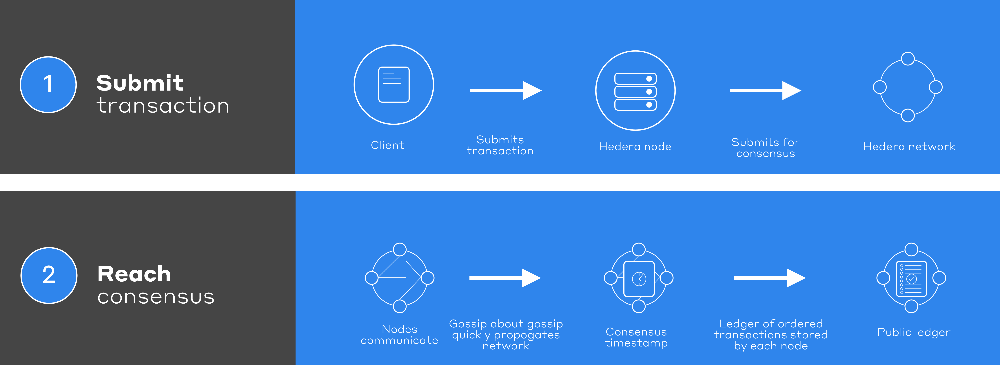

# Transactions and Queries

## Transactions

**Transactions** are requests sent by a client to a node with the expectation that they are submitted to the network for processing into consensus order and subsequent application to state. Each transaction (e.g. `TokenCreateTransaction()`) has an associated transaction fee compensating the Hedera network for processing and subsequent maintenance in a consensus state. Users can set a maximum transaction fee, which is the amount they are willing to spend. The user is only charged the actual transaction fee.

**Transaction ID**

Each transaction has a unique transaction ID. The transaction ID is used for the following:

* Obtaining receipts, records
* Internally by the network for detecting when duplicate transactions are submitted

The transaction ID is composed by using the transaction's valid start time and the account ID of the account that is paying for the transaction. The transaction's valid start time is the time the transaction begins to be processed on the network. The transaction's valid start time can be set to a future date/time. A transaction ID looks something like `0.0.9401@1598924675.82525000`where `0.0.9401` is the transaction fee payer account ID and `1598924675.82525000` is the timestamp in `seconds.nanoseconds`.

Transactions have a valid duration of up to 180 seconds and begin at the transaction's valid start time. This means that the transaction has up to 180 seconds to be accepted by one of the nodes in the network. If the transaction is not accepted in this timeframe, the transaction will expire. The transaction will have to be created, signed, and submitted again.

A **transaction** generally includes the following:

* **Node Account**: the account of the node the transaction is being sent to (e.g. `0.0.3`)
* **Transaction ID**: the identifier for a transaction has two components: the account ID of the paying account plus the transaction’s valid start time
* **Transaction Fee**: the maximum fee the paying account is willing to pay for the transaction
* **Valid Duration**: the number of seconds that the client wishes the transaction to be deemed valid for, starting at the transaction's valid start time
* **Memo**: a string of text up to 100 bytes of data (optional)
* **Transaction**: type of request, for instance, an HBAR transfer or a smart contract call
* **Signatures**: at minimum, the paying account will sign the transaction as authorization. Other signatures may be present as well.

The lifecycle of a transaction in the Hedera ecosystem begins when a client creates a transaction. Once the transaction is created it is cryptographically signed at a minimum by the account paying for the fees associated with the transaction. Additional signatures may be required depending on the properties set for the account, topic, or token. The client can stipulate the maximum fee it is willing to pay for the processing of the transaction and, for a smart contract operation, the maximum amount of gas. Once the required signatures are applied to the transaction the client then submits the transaction to any node on the Hedera network.

The receiving node validates (for instance, confirms the paying account has sufficient balance to pay the fee) the transaction and, if validation is successful, submits the transaction to the Hedera network for consensus by adding the transaction to an event and gossiping that event to another node. Quickly, that event flows out to all the other nodes. The network receives this transaction exponentially fast via the [gossip about gossip protocol](hashgraph-consensus-algorithms/gossip-about-gossip.md). The consensus timestamp for an event (and so the transactions within) is calculated by each node independently calculating the median of the times that the network nodes received that event. You may find more information on how the consensus timestamp is calculated [here](https://docs.hedera.com/docs/hashgraph-overview#section-fair-timestamps). The hashgraph algorithm delivers the finality of consensus. Once assigned a consensus timestamp the transaction is then applied to the consensus state in the order determined by each transaction’s consensus timestamp. At that point, the transaction fees are also processed. In this manner, every node in the network maintains a consensus state because they all apply the same transactions in the same order. Each node also creates and temporarily stores receipts/records in support of the client, subsequently querying for the status of a transaction.

### Nested Transactions

A **nested transaction** triggers subsequent transactions after executing a top-level transaction. The top-level transaction that a user submits is a **parent transaction**. For each subsequent transaction, the parent transaction triggers a **child transaction** as a result of the execution of the parent transaction. An example of a nested transaction is when a user submits the top-level transfer transaction to an account alias that triggers an account creation transaction behind the scenes. This parent/child transaction relationship is also observed with Hedera contracts interacting with HTS precompile. A parent transaction supports up to 999 child transactions since the platform reserves 1000 nanoseconds per user-submitted transaction.

**Transaction IDs**

Parent and child transactions share the payer account ID and transaction valid start timestamp. The child transaction IDs have an additional **nonce** value representing the order in which the child transactions were executed. The parent transaction has a nonce value of 0. The nonce value of child transactions increments by 1 for each child transaction executed due to the parent transaction.

Parent Transaction ID: <mark style="color:red;">payerAccountId</mark>@<mark style="color:blue;">transactionValidStart</mark>

Child Transaction ID: <mark style="color:red;">payerAccountId</mark>@<mark style="color:blue;">transactionValidStart</mark>/<mark style="color:green;">nonce</mark>

Example:

* Parent Transaction ID: <mark style="color:red;">0.0.2252</mark>@<mark style="color:blue;">1640119571.329880313</mark>
* Child 1 Transaction ID: <mark style="color:red;">0.0.2252</mark>@<mark style="color:blue;">1640119571.329880313</mark>/<mark style="color:green;">1</mark>
* Child 2 Transaction ID: <mark style="color:red;">0.0.2252</mark>@<mark style="color:blue;">1640119571.329880313</mark>/<mark style="color:green;">2</mark>

**Transaction Records**

Nested transaction records are returned by requesting the record for the parent transaction and setting the `setIncludeChildren(<value>)` to true. This returns records for all child transactions associated with the parent transaction. Child transaction records include the parent consensus timestamp and the child transaction ID.

The parent consensus timestamp field in a child transaction record is not populated when the child transaction was triggered **before** the parent transaction. An example of this case is creating an account using an account alias. The user submits the transfer transaction to create and fund the new account using the account alias. The transfer transaction (parent) triggers the account create transaction (child). However, the child transaction occurs before the parent transaction, so the new account is created before completing the transfer. The parent consensus timestamp is not populated in this case.

**Transaction Receipts**

Nested transaction receipts can be returned by requesting the parent transaction receipt and setting the boolean value equal to true to return all child transaction receipts.

**Child Transaction Fees**

The transaction fee for the child transaction is included in the record of the parent transaction. The transaction fee will return zero in the child transaction.

## Queries

**Queries** are processed only by the single node to which they are sent. Clients send queries to retrieve some aspect of the current consensus state, like an account balance. Certain queries are free, but generally, they are subject to fees. The full list of queries can be found [here](../sdks-and-apis/sdks/queries.md).

A query includes a header that includes a normal HBAR transfer transaction that will serve as how the client pays the node the appropriate fee. There is no way to give partial payment to a node for processing the query, meaning if a user overpaid for the query, the user will not receive a refund. The node processing the query will submit that payment transaction to the network for processing into a consensus statement to receive its fee.

A client can determine the appropriate fee for a query by asking a node for the cost, not the actual data. Such a COST\_ANSWER query is free to the client.

For more information about query fees, please visit Hedera API fees [overview](https://www.hedera.com/fees).

### Recall:


Recall

Hedera does not have **miners** or a special group of nodes responsible for adding transactions to the ledger like alternative distributed ledger solutions. Each node's influence on determining the consensus timestamp for an event is proportional to its stake in HBAR.


Once a transaction has been submitted to the network, clients may seek confirmation that it was successfully processed. Multiple confirmation methods are available, varying in the level of information provided, the duration for which the confirmation is available, the degree of trust, and the corresponding cost.

## Confirmations

* **Receipts:** Receipts provide minimal information - simply whether or not the transaction was successfully processed into a consensus state. Receipts are generated by default and are persisted for 3 minutes. Receipts are free.
* **Records:** Records provide greater detail about the transaction than do receipts — such as the consensus timestamp it received or the results of a smart contract function call. Records are generated by default but are persisted for 3 minutes.
* **State proofs (coming soon):** When querying for a record, a client can optionally indicate that it desires the network to return a state proof in addition to the record. A state-proof documents network consensus on the contents of that record in the consensus state — this collective assertion includes signatures of most of the network nodes. Because state proofs are cryptographically signed by a supermajority of the network, they are secure and potentially admissible in a court of law.


[rest-api.md](../sdks-and-apis/rest-api.md)


For a more detailed review of the confirmation methods, please check out this [blog post](https://www.hedera.com/blog/transaction-confirmation-methods-in-hedera).

## FAQ

What are the transaction and query fees associated with using Hedera?

You can refer to the fees page on Hedera's website for a detailed breakdown of transaction and query costs. If you're looking for an estimation tool, you can use the [Hedera fee estimator](https://hedera.com/fees).

What are transactions?

Transactions are requests sent by a client to a node with the expectation that they are submitted to the network for processing into consensus order and subsequent application to state. Each transaction has a unique transaction ID composed of the transaction's valid start time and the account ID of the account that is paying for the transaction. This ID is used for obtaining receipts, records, and state proofs and for detecting when duplicate transactions are submitted.

What are queries?

Queries are requests processed only by the single node to which they are sent. [Clients](../support-and-community/glossary.md#client) send queries to retrieve some aspect of the current consensus state, like the balance of an account. Certain queries are free, but generally, queries are subject to fees.

What is the difference between receipts and records?

Receipts provide minimal information - whether or not the transaction was successfully processed into a consensus state. Records provide greater detail about the transaction than receipts, such as the consensus timestamp it received or the results of a smart contract function call.&#x20;

