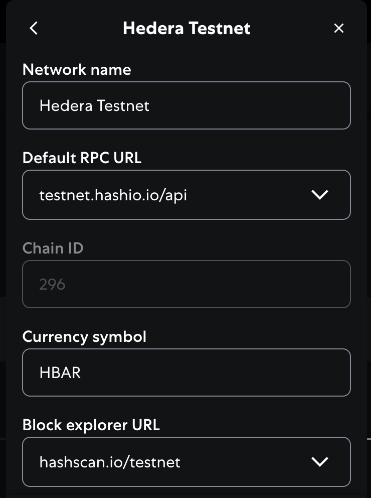
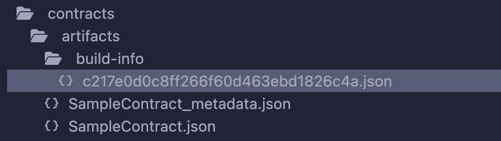
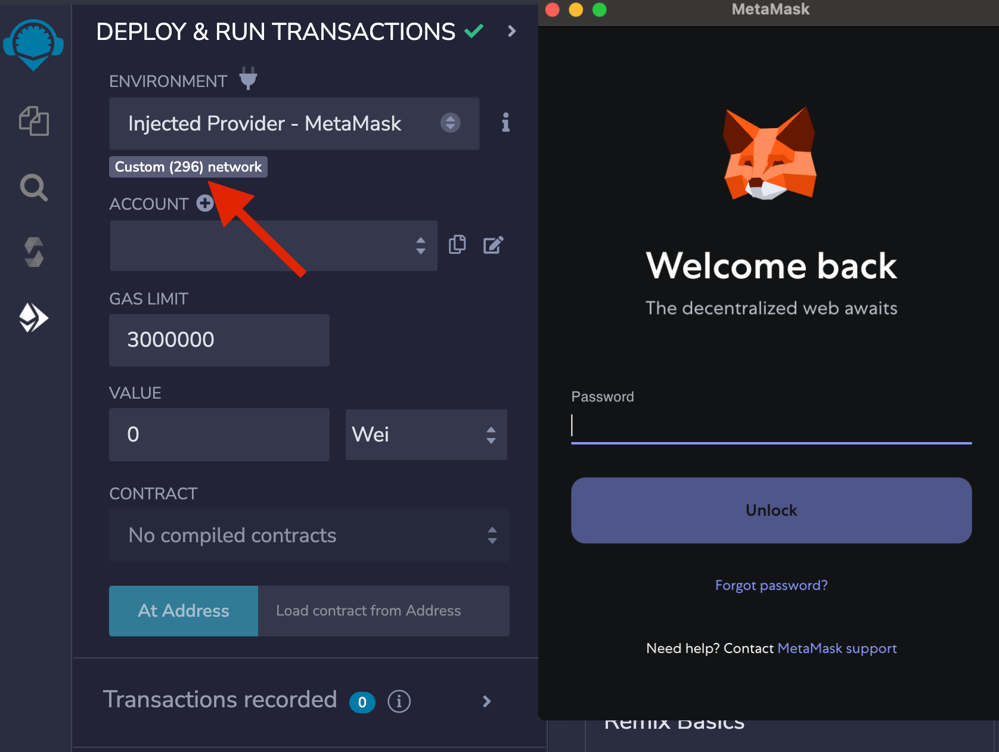
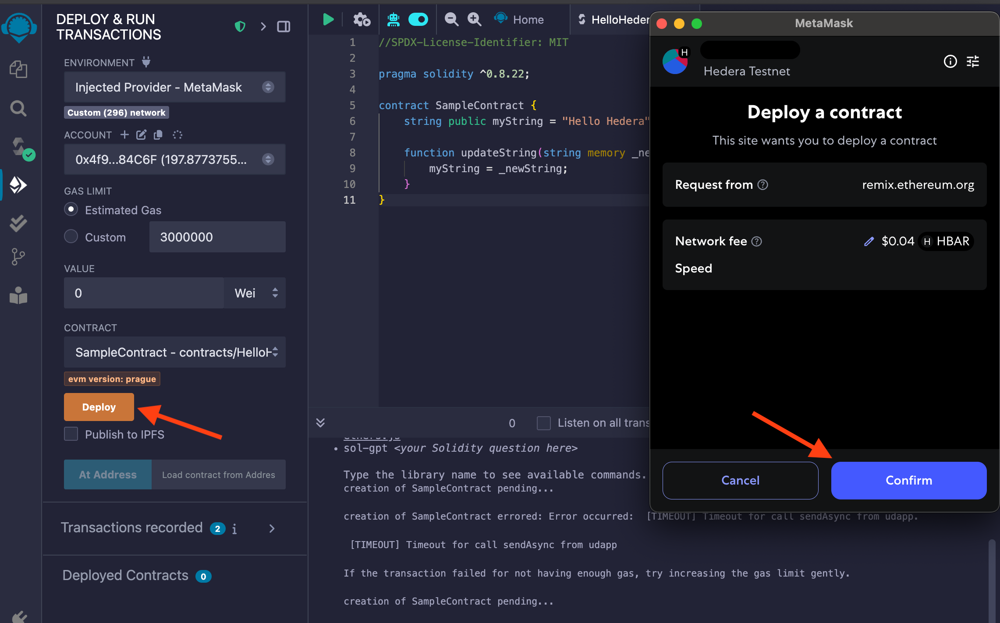
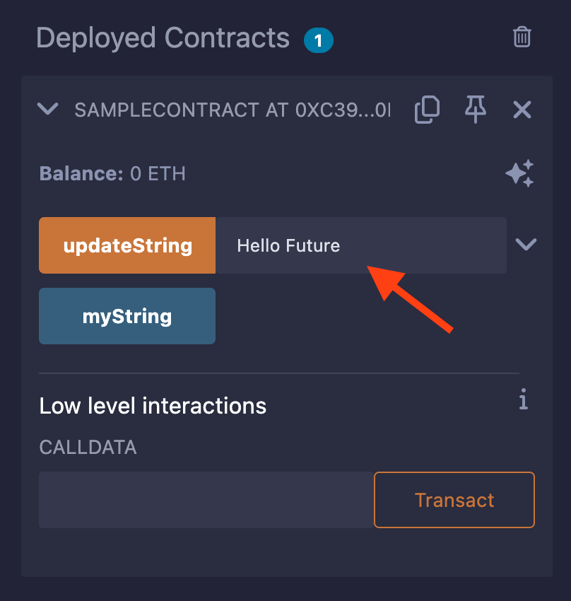
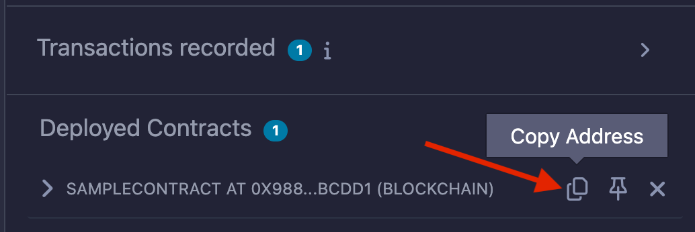
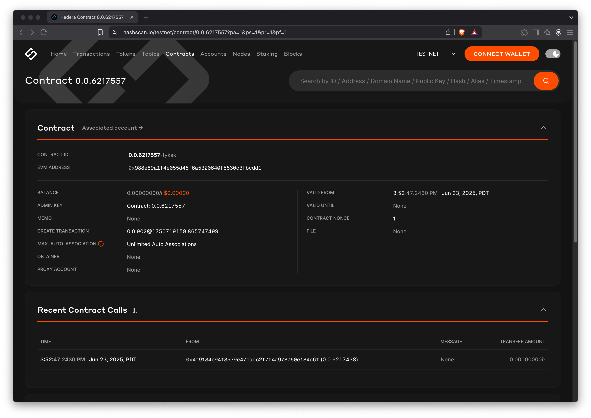

# Deploy a Smart Contract with Remix

## Introduction to Remix IDE

Remix IDE is an open-source tool for developing smart contracts in Solidity. It was originally built for the Ethereum network and supports deploying to EVM-compatible networks like Hedera. Remix includes built-in tools for compiling, debugging, and deploying contracts directly from the browser.

In this tutorial, you’ll use Remix IDE to write and deploy a simple smart contract to the Hedera testnet.

***

## Prerequisites <a href="#prerequisites" id="prerequisites"></a>

* Web browser with access to [Remix IDE](https://remix.ethereum.org/)
* [Download](https://metamask.io/download/) the MetaMask wallet browser extension

***

## Add Hedera Testnet to MetaMask

Smart contracts deployed on Hedera are compatible with EVM wallets like MetaMask. To interact with the network, you must first add Hedera’s JSON-RPC endpoint as a custom network in your wallet. Click on the button below for a one-click configuration.

<a href="https://chainlist.org/chain/296/" class="button primary" data-icon="plus-large">ADD HEDERA TESTNET</a>

<div align="left"><figure><figcaption></figcaption></figure></div>

<details>

<summary><strong>Alternatively, manually add Hedera's JSON-RPC endpoint ↓</strong></summary>

1. Open MetaMask and click the network selection dropdown at the top of the extension.
2. Click **Add Network**, then **Add Network Manually**
3. Enter the following network details:
   1. **Network Name**: Hedera Testnet
   2. **New RPC URL**: `https://testnet.hashio.io/api`
   3. **Chain ID**: `296`
   4. **Currency Symbol**: `HBAR`
   5. **Block Explorer URL**: `https://hashscan.io/testnet`
4. Tap the **Save** button to save the Hedera Testnet

</details>

***

## Fund Your Hedera Testnet Account

Navigate to the [Hedera Faucet](https://portal.hedera.com/faucet) to get testnet HBAR tokens necessary for deploying a smart contract.

***

## Deploy a Smart Contract Using Remix



#### Open Remix and Create Contract

Open your web browser and navigate to Remix IDE. Click on the file icon in the **File Explorer** tab to create a new file and name it `HelloHedera.sol` .

<div align="left"><figure><figcaption></figcaption></figure></div>



#### Add Contract Code

Copy and paste this sample contract to the new file you created:


```solidity
//SPDX-License-Identifier: MIT

pragma solidity ^0.8.22;

contract SampleContract {
    string public myString = "Hello Hedera";

    function updateString(string memory _newString) public {
        myString = _newString;
    }
}
```




#### Compile the Contract

Navigate to the **Solidity Compiler** tab in the left sidebar and check that your compiler version is within the versions specified in the `pragma solidity` statement. Then, compile your `HelloHedera.sol` contract.

<figure><figcaption></figcaption></figure>

When a compilation for a Solidity file succeeds, Remix creates three JSON files for each compiled contract. **Files can be seen in the `File Explorers plugin` as:**

* _`artifacts/<contractName>.json`: contains the link to the libraries, the bytecode, the deployed bytecode, the gas estimation, the method identifiers, and the ABI. It is used for linking a library address to the file._
* _`artifacts/<contractName_metadata>.json`: contains the metadata from the output of Solidity compilation._
* _`artifacts/build-info/<dynamic_hash>.json`: contains info about `solc` compiler version, compiler input and output. This file is generated similar to the files generated through Hardhat compilation. You can also try_ [_Hardhat compilation_](https://remix-ide.readthedocs.io/en/latest/hardhat.html#enable-hardhat-compilation) _from Remix._

<div align="center"><figure><figcaption></figcaption></figure></div>


_Please note that to generate these artifact files, the **Generate contract metadata** box in the **General settings** section of the **Settings** module needs to be checked. By default, it is checked._




#### Deploy to Hedera testnet

* Go to the **Deploy & Run Transactions** tab and
* Select **Injected Provider - MetaMask** as the environment

If you're not signed into your MetaMask account, a window will pop up prompting you to log in. Sign in and make sure you're connected to the **Hedera Testnet** and verify that the network is configured correctly to **Custom (296) network**.

<div align="left"><figure><figcaption></figcaption></figure></div>

Once you click **Deploy** in the **Deploy & Run Transactions** tab, hit **Confirm** in the MetaMask notification window to approve and pay for the contract deployment transaction.

<figure><figcaption></figcaption></figure>



#### Interact with the Smart Contract on Hedera

Once the transaction is successful, you can interact with the smart contract through Remix. Select the dropdown on the newly deployed contract at the bottom of the left panel to view the contract's functions under **Deployed Contracts**. Write a new message to the `updateString` function using the input and confirm the write transaction in the MetaMask window to pay.

<div align="left"><figure><figcaption></figcaption></figure></div>



#### View Contract Details on HashScan Network Explorer

Copy the contract address from the Deployed Contracts window.

<div align="left"><figure><figcaption></figcaption></figure></div>

Navigate to the [HashScan](https://hashscan.io/) network explorer and use the contract address to search for your contract to view the details.

<div align="left"><figure><figcaption><p>HashScan</p></figcaption></figure></div>



**Congratulations 🎉 Your smart contract is live on Hedera testnet!**

You've successfully:

* Configured MetaMask for Hedera testnet
* Created and funded a testnet account
* Deployed a smart contract using Remix
* Interacted with it on the Hedera testnet

***

## Next Step: Verify Your Smart Contract

If you're up for it, you can verify your deployed contract using the Smart Contract Verifier tool on HashScan network explorer.



***

## Additional Resources

* [**Remix IDE Documentation**](https://remix-ide.readthedocs.io/en/latest/)
* [**Hedera Contract Builder**](https://portal.hedera.com/contract-builder)
* [**Smart Contracts Documentation**](../core-concepts/smart-contracts/)

<table data-card-size="large" data-view="cards"><thead><tr><th align="center"></th><th data-hidden data-card-target data-type="content-ref"></th></tr></thead><tbody><tr><td align="center"><p>Editor: Krystal, DX Engineer</p><p><a href="https://github.com/theekrystallee">GitHub</a> | <a href="https://x.com/theekrystallee">X</a></p></td><td><a href="https://x.com/theekrystallee">https://x.com/theekrystallee</a></td></tr></tbody></table>
