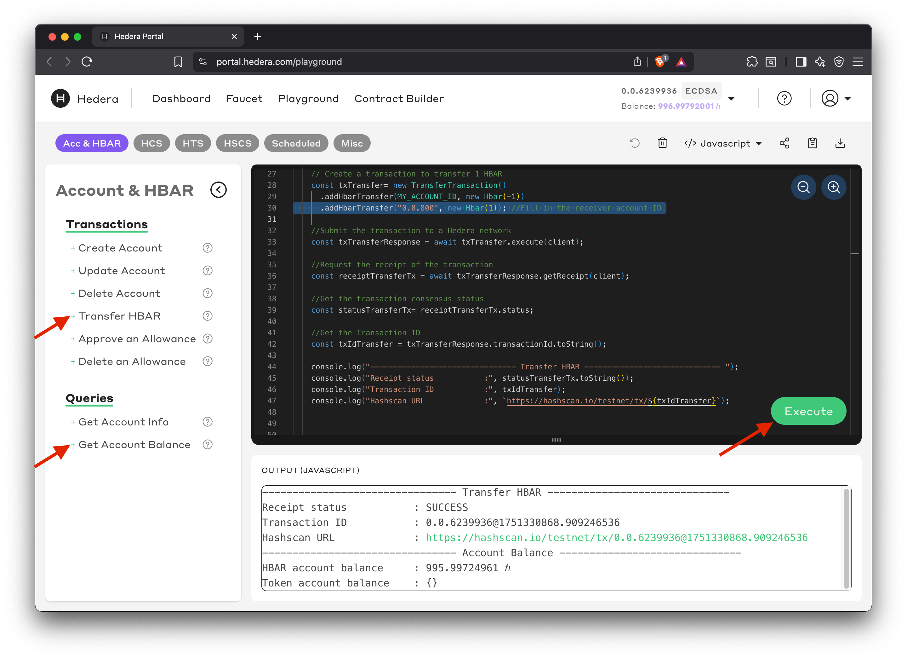
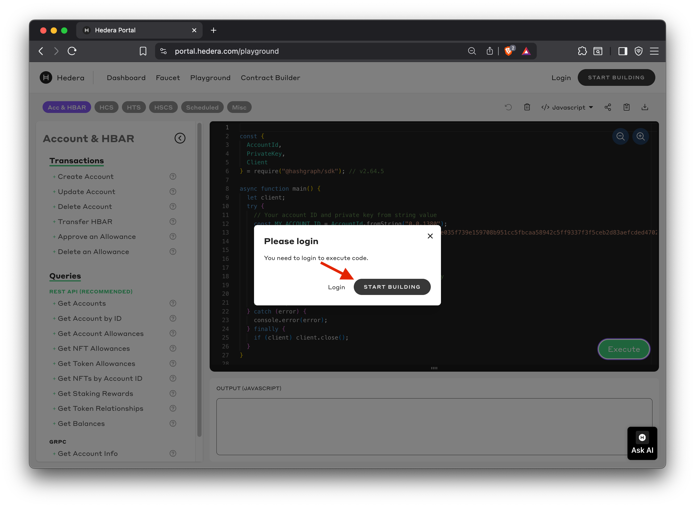
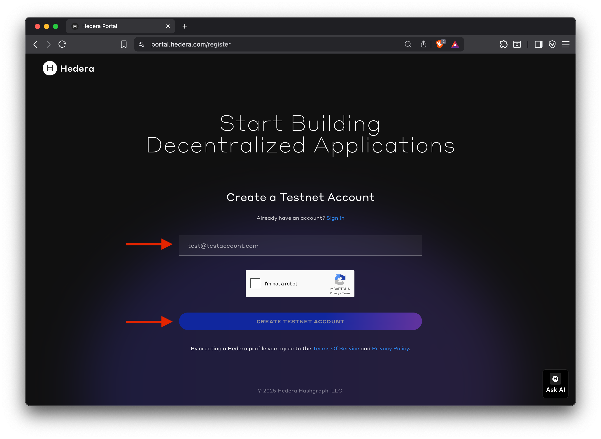
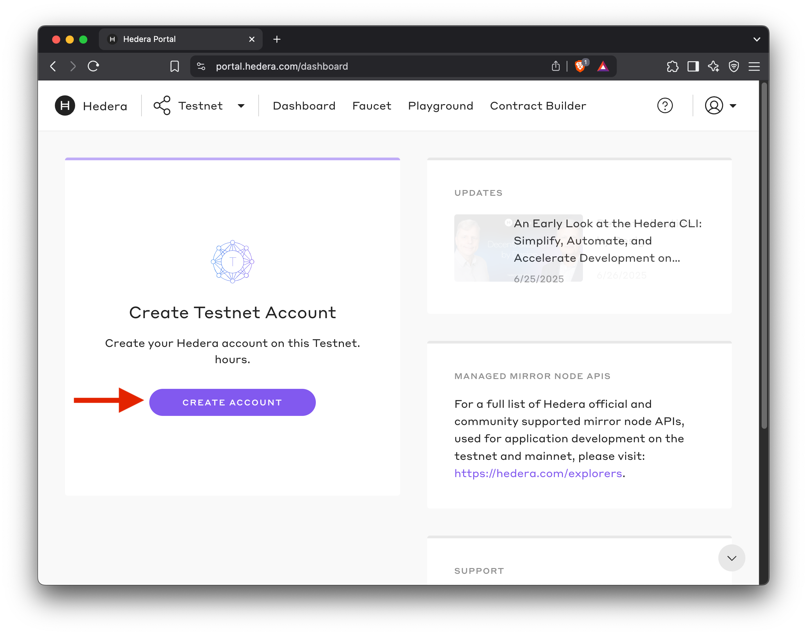
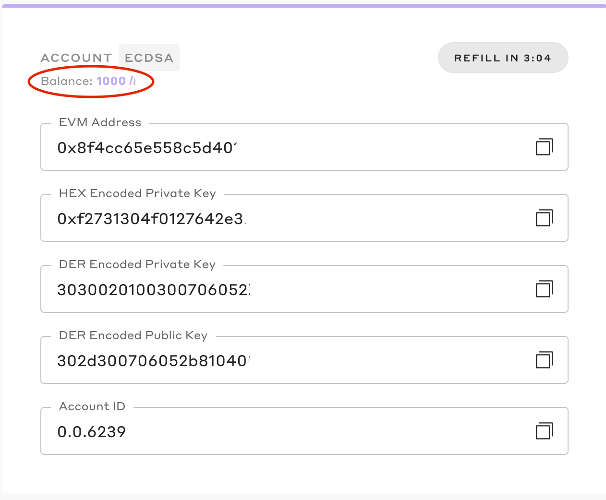

# Quickstart

This quickstart walks you through submitting your first Hedera transaction using the playground, creating and funding a testnet account via the developer portal, and viewing the transaction on HashScan.

***

## Submit Your First Transaction



#### Open the Playground

<a href="https://portal.hedera.com/playground" class="button primary" data-icon="rectangle-terminal">OPEN PLAYGROUND</a>



#### Transfer HBAR transaction

Under the **Account & HBAR** native services, click the **Transfer HBAR** transaction from the left navigation

1. Replace `receiverAccount` with account ID "0.0.800"
2. Then click on **Get Account Balance** under Queries



#### Execute transaction

Click the **Execute** button to submit your first transaction.

<figure><figcaption></figcaption></figure>



#### Create a Hedera testnet account

When you click **Execute**, you’ll be prompted to sign up for a developer portal account. Once logged in, click the **CREATE ACCOUNT** button to complete the testnet account creation flow.

<figure><figcaption></figcaption></figure> <figure><figcaption></figcaption></figure> <figure><figcaption></figcaption></figure>

Your new testnet account will be automatically funded with **1000 HBAR**. View your account ID and key pair from the portal dashboard.

<figure><figcaption></figcaption></figure>



#### View the transaction on HashScan

View and verify the transaction details and success confirmation. Click the HashScan link from the transaction output on the playground. View your transaction details, account history, and network activity.

<pre><code>-------------------------------- Transfer HBAR ------------------------------ 
Receipt status           : SUCCESS
Transaction ID           : 0.0.6239936@1751330868.909246536
<strong>Hashscan URL             : https://hashscan.io/testnet/tx/0.0.6239936@1751330868.909246536
</strong>-------------------------------- Account Balance ------------------------------
HBAR account balance     : 995.99724961 ℏ
Token account balance    : {}
</code></pre>



***

## Next Step

* [Create an Account](create-an-account.md)
* [Create a Token](create-a-token.md)
* [Create a Topic](create-a-topic.md)
