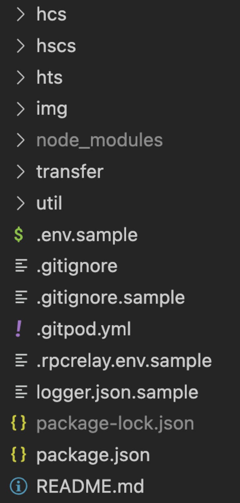
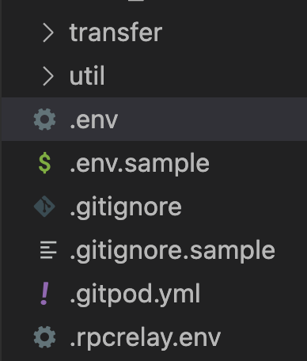

# Environment Setup

This environment setup guide outlines the steps needed to get your development environment ready for building applications on the Hedera network.&#x20;

#### What you will accomplish

By the end of this guide, you will be able to:

* Set up a project and install dependencies.
* Create and configure a `.env` file to store environment variables.

***

## Prerequisites

Before you begin, you should have **completed** the following guide:

* [x] [Create and Fund Your Hedera Testnet Account](../tutorials/more-tutorials/create-and-fund-your-hedera-testnet-account.md)

<details>

<summary><strong>Also, you should have the following set up on your computer ⬇</strong></summary>

* POSIX-compliant shell
  * For Linux & Mac: The shell that ships with the operating system will work. Either `bash` or `zsh` will work.
  * For Windows: The shells that ship with the operating system (`cmd.exe`, `powershell.exe`) _will not_ work.
    * Recommended: `git-bash` which ships with `git-for-windows`. [Install Git for Windows (Git for Windows)](https://gitforwindows.org/)
    * Recommended (alternative): Windows Subsystem for Linux. [Install WSL (Microsoft)](https://learn.microsoft.com/en-us/windows/wsl/install)
* `git` installed
  * Minimum version: 2.37
    * Check version: `git version`
  * Recommended: [Install Git (Github)](https://github.com/git-guides/install-git)
* A code editor or IDE
  * Recommended: VS Code. [Install VS Code (Visual Studio)](https://code.visualstudio.com/docs/setup/setup-overview)
* NodeJs + `npm` installed
  * Minimum version of NodeJs: 18
    * Check version: `node -v`
  * Minimum version of `npm`: 9.5
    * Check version: `npm -v`
  * Recommended for Linux & Mac: [`nvm`](https://github.com/nvm-sh/nvm)
  * Recommended for Windows: [`nvm-windows`](https://github.com/coreybutler/nvm-windows)

</details>

### Gitpod (Optional)

To skip the setup steps and quickly get started, open the project repository in your language of choice and click the <mark style="background-color:green;">**Open in Gitpod**</mark> button. This will launch a Gitpod workspace/environment that automatically installs all the dependencies.&#x20;

#### ➡️ Try now with Gitpod:

* [JavaScript](https://github.com/hedera-dev/hello-future-world-js?tab=readme-ov-file#how-to-run-using-gitpod)
* [Java](https://github.com/hedera-dev/hello-future-world-java?tab=readme-ov-file#how-to-run-using-gitpod)
* [Go](https://github.com/hedera-dev/hello-future-world-go?tab=readme-ov-file#how-to-run-using-gitpod)


Once your workspace is fully launched, you will see the instructions to enter values for the prompts:

> 🟣 _Please enter values requested, or accept defaults, in the interactive prompts below._

1. Follow the prompts in the Gitpod console to configure your `.env` file. Refer to the [<mark style="background-color:yellow;">Prompts</mark>](environment-setup.md#prompts) expandable in [Step 2](environment-setup.md#step-2-create-your-.env-file) for guidance on completing your .env file setup.
2. Refer to [Step 3](environment-setup.md#step-3-progress-metrics-optional) for guidance on managing metrics. Learn how to disable them in Gitpod if you prefer not to store your progress metrics [on-chain](../support-and-community/glossary.md#on-chain).
3. Once everything is set up, head to the [Next Steps](environment-setup.md#next-steps-choose-your-developer-learning-path) section to choose your learning path and start building.


***

## Step 1: Project Setup

Clone the project repository in your language of choice.  `git clone` the repo and `cd` into the project's root directory.



```bash
git clone https://github.com/hedera-dev/hello-future-world-js
cd hello-future-world-js
```



```bash
git clone https://github.com/hedera-dev/hello-future-world-java
cd hello-future-world-java
```



```bash
git clone https://github.com/hedera-dev/hello-future-world-go
cd hello-future-world-go
```



Install all dependencies:

```bash
./util/03-get-dependencies.sh 
```

Open your project directory in your code editor or IDE. This is what it should look like.

<figure><figcaption></figcaption></figure>

***

## Step 2: Create Your `.env` File

When setting up your project, you must create a `.env` file to store your environment variables. To make this process easier, run the script below. It will interactively prompt you for input and automatically populate the required values in the file based on your responses.&#x20;

In your project root directory, run:

```bash
./util/00-main.sh
```

<details>

<summary>  <mark style="background-color:yellow;"><strong>Prompts</strong></mark><strong> ⬇</strong></summary>

1.  **Enter a** [**BIP-39**](../support-and-community/glossary.md#bip-39) **seed phrase**&#x20;

    (enter a blank value to generate a new one at random)

    * If you don't have one to provide, click enter, and a 12-word seed phrase will be created for you.
2.  **Enter a number of testnet accounts to generate from your BIP-39 seed phrase**&#x20;

    Default: "**3**" (enter a blank value to use the default value)

    * The default number of accounts will enable you to complete all examples.&#x20;
3.  **Enter your preferred JSON-RPC endpoint URL**&#x20;

    Current: "https://7546-hederadev-hellofuturewo-l2r7cpgqrcv.ws-us117.gitpod.io" (enter a blank value to use the default value)

    * List of public endpoints [here](../core-concepts/smart-contracts/json-rpc-relay.md).
    * Note that the default value will be different if you are using Gitpod.
4.  **Enter your operator account (ECDSA) private key**

    (enter a blank value to use the first account created from the BIP-39 seed phrase as the operator account)

    * This is the [_hex-encoded private key_](#user-content-fn-1)[^1] ([_ECDSA secp256k1_](../support-and-community/glossary.md#ecdsa-secp256k1)_)_ from the testnet account created on the Hedera Portal or HashPack wallet.&#x20;
    * If you used the Hedera [faucet](../support-and-community/glossary.md#crypto-faucet) to create a testnet account, this would be its corresponding private key.
5.  **Do you wish to overwrite the .env file with the above?**&#x20;

    (restart/yes/No)

    * Enter _**yes**_ to complete creating the `.env` file.
    * Enter _**no**_ if you prefer to manually configure the file.
    * Enter _**restart**_ if you entered the wrong values and need to start the setup process over.&#x20;

</details>

After the last prompt,  you should see a new `.env` file in your project root directory. Check that each of the environment variables has a value.

<figure><figcaption></figcaption></figure>


#### **⚠️ Warning**

Storing private keys in a `.env` file is not considered best practice. There is always a risk of accidentally committing and pushing to a public GitHub repo and exposing your keys. Make it a habit to add `.env` to your `.gitignore` file as a precautionary measure.

<pre class="language-gitignore" data-title=".gitignore"><code class="lang-gitignore">node_modules
package-lock.json
<strong>/.env
</strong>/.rpcrelay.env
/logger.json
</code></pre>

We **highly advise against** using a private key with mainnet funds.


***

## Step 3: Progress Metrics (Optional)

Your progress will captured as metrics and published to the Hedera network for you to share with others! If you would like to disable publishing the metrics to the public ledger and viewable in a network explorer, please change `metricsHcsDisabled` value to `true` in the `logger.json` file located in the root directory. The metrics are enabled by default with the value `false`.

Example `logger.json` file:



```json
{
  "config": {
    "scriptCategory": "config",
    "ansiDisabled": false,
    "metricsId": "",
    "metricsHcsTopicId": "0.0.4573319",
    "metricsHcsTopicMemo": "HFWV2",
    "metricsAccountId": "",
    "metricsAccountKey": "",
    "metricsHcsDisabled": false
  }
}
```



```json
{
  "config": {
    "scriptCategory": "config",
    "ansiDisabled": true,
    "metricsId": "",
    "metricsHcsTopicId": "0.0.4573319",
    "metricsHcsTopicMemo": "HFWV2",
    "metricsAccountId": "",
    "metricsAccountKey": "",
    "metricsHcsDisabled": true
  }
}
```



***

## Complete

Congratulations, you have completed the **Environment Setup** guide in the Getting Started series!

You have learned how to:

* [x] Clone the project repository.
* [x] Create a `.env` file to store environment variables.

***

## Next Steps: Choose Your Developer Learning Path

Now that your environment is set up, you can start building on the Hedera Testnet! Based on your experience level and development needs, choose one of the following paths that best describes you:

<table data-card-size="large" data-view="cards"><thead><tr><th align="center"></th><th></th><th align="center"></th><th data-hidden data-card-target data-type="content-ref"></th></tr></thead><tbody><tr><td align="center"><strong>Web2 Developers</strong></td><td>Choose this path if you're a web2 developer or a student new to web3 and Hedera. Learn to build on Hedera using SDKs in Java, JavaScript, or Go. Start with transferring HBAR, creating tokens, and managing topics.</td><td align="center"><p></p><p><strong>➡</strong> <a href="web2-developers/"><strong>LEARN MORE</strong></a> </p></td><td><a href="web2-developers/">web2-developers</a></td></tr><tr><td align="center"><strong>EVM Developers</strong></td><td>Choose this path if you have experience deploying Solidity contracts on Ethereum and other EVM networks. Learn to write, compile, deploy, and verify smart contracts using familiar EVM-compatible tools.</td><td align="center"><p></p><p><strong>➡</strong> <a href="evm-developers/"><strong>LEARN MORE</strong></a></p></td><td><a href="evm-developers/">evm-developers</a></td></tr></tbody></table>


**Have questions?** Join the [Hedera Discord](https://hedera.com/discord) and post them in the [`developer-general`](https://discord.com/channels/373889138199494658/373889138199494660) channel or ask on [Stack Overflow](https://stackoverflow.com/questions/tagged/hedera-hashgraph).


[^1]: _(e.g., 0xabcdef1234567890abcdef1234567890abcdef1234567890abcdef1234567890)_
