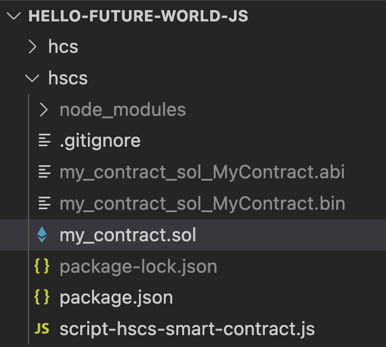

# Deploy a Contract

## Deploying a Contract Using the Hedera Smart Contract Service

This tutorial will walk you through writing and compiling a Solidity smart contract. You'll then deploy and interact with it on the Hedera network using the [Hedera Smart Contract Service (HSCS)](../../support-and-community/glossary.md#hedera-smart-contract-service-hscs) and familiar EVM tools like Ethers.js, connecting via the [JSON-RPC relay](../../core-concepts/smart-contracts/deploying-smart-contracts/json-rpc-relay.md).&#x20;

#### What you will accomplish

By the end of this tutorial, you will be able to:

* Write a smart contract
* Compile a smart contract
* Deploy a smart contract
* Update smart contract state
* Query smart contract state


**Note:** This tutorial is currently supported only in the Getting Started [JavaScript](https://github.com/hedera-dev/hello-future-world-js) series and is not available for other languages.


***

## Prerequisites

Before you begin, you should have **completed** the following tutorials:

* [x] [Create and Fund Your Hedera Testnet Account](../../tutorials/more-tutorials/create-and-fund-your-hedera-testnet-account.md)
* [x] [Environment Setup](../environment-setup.md)&#x20;
* [x] [Configure RPC Connection](../../tutorials/more-tutorials/json-rpc-connections/) ( not required for Gitpod )

***

## Step 1: Navigate to the `hscs` Directory and Start the Relay

Navigate to the `hscs` directory to deploy a smart contract example:

```bash
cd hscs
```

If you completed a previous example in the series, you can go back to the root directory and `cd` into this example.

```bash
cd ../hscs
```

If you want to get back to the root directory, you can `cd` out from any directory with this command

```bash
cd ../
```

### Start the JSON-RPC Relay


#### This step is not required for Gitpod


From the root directory of the `hedera-future-world-js` project, run a Hedera JSON-RPC Relay instance with the below script:

```bash
./util/04-rpcrelay-run.sh
```

#### What exactly is the JSON-RPC Relay?

The Hedera JSON-RPC Relay connects your dApps to Hedera’s EVM-compatible nodes, translating JSON-RPC requests from tools like [`ethers.js`](https://github.com/ethers-io/ethers.js) or [`web3.js`](https://github.com/web3/web3.js) into commands Hedera understands. This enables seamless interaction with smart contracts on Hedera.

#### Why is it important?

* Developers can use familiar EVM tools and workflows on Hedera without learning new tooling.
* Provides compatibility and support for Solidity smart contracts.
* Enables smooth communication between dApps and Hedera.


#### Next: Code Walkthrough

In the next code walkthrough step, you can follow along or skip ahead to [Step 3](deploy-a-contract.md#step-3-deploy-contract-and-verify-on-hashscan-mirror-node-explorer) to execute and deploy the contract. If you decide to skip ahead, [compile the smart contract ](deploy-a-contract.md#compile-the-smart-contract)first.&#x20;


***

## Step 2: Guided Code Walkthrough

Open these two files located in the `/hscs` directory in a code editor, such as VS Code or your GitPod instance, to follow along:

* `my_contract.sol`
* `script-hscs-smart-contract`

### Write the Smart Contract

For this tutorial, a simple smart contract, `my_contract.sol`, has already been prepared for you. You will only need to make one modification (outlined below) for it to compile successfully.

#### Get the Name Stored in Mapping

Inside the `greet()` function, we want to access the `names` mapping to retrieve the name of the account calling this function. The account is identified by its [EVM account alias](../../core-concepts/accounts/account-properties.md#evm-address-account-alias) and can be accessed using `msg.sender` in Solidity.


```solidity
// SPDX-License-Identifier: MIT
pragma solidity 0.8.17;

contract MyContract {
    string public constant scriptId = 'HFWV2_hscsSC';

    mapping(address => string) public names;

    function introduce(string memory name) public {
        names[msg.sender] = name;
    }

    function greet() public view returns (string memory) {
        // NOTE: Store name in smart contract
        string memory name = names[msg.sender];
        return string.concat("Hello future! - ", name);
    }
}
```



_**Note**: This smart contract has two functions, `introduce` and `greet`. You will invoke both of them later on._


### Compile the Smart Contract

Once you have completed writing the smart contract in Solidity, you must compile it using the Solidity compiler.&#x20;

Install the dependencies using `npm`. You will also need to install a Solidity compiler using the `--global` flag.

```bash
npm install && npm install --global solc@0.8.17
```

Invoke the compiler on your Solidity file. Then list (`ls`) files in the current directory.

```bash
solcjs --bin --abi ./my_contract.sol
ls
```

You should see a console output similar to the following:

```bash
my_contract.sol
my_contract_sol_MyContract.abi
my_contract_sol_MyContract.bin
```


* The `.abi` file contains the JSON representation of the interface used to interact with the smart contract.
* The `.bin` file contains EVM bytecode, which is used in deploying the smart contract.

Note that while the `.abi` file is human-readable, the `.bin` file is _not intended_ to be human-readable.


After compiling your smart contract, your project directory should look similar to the following:

<figure><figcaption></figcaption></figure>

### Write the Deployment Script

#### Initialize Wallet and RPC Connection

The following code snippet from the `script-hscs-smart-contract` file will read your credentials from the `.env` file to initialize your wallet (operator account) and establish an RPC connection to interact with the Hedera network.&#x20;


```javascript
async function scriptHscsSmartContract() {
    logger.logStart('Hello Future World - HSCS smart contract - start');
    
    // Read in environment variables from `.env` file in parent directory
    dotenv.config({ path: '../.env' });

    // Initialize the operator account
    const operatorIdStr = process.env.OPERATOR_ACCOUNT_ID;
    const operatorKeyStr = process.env.OPERATOR_ACCOUNT_PRIVATE_KEY;
    const rpcUrl = process.env.RPC_URL;
    if (!operatorIdStr || !operatorKeyStr || !rpcUrl) {
        throw new Error('Must set OPERATOR_ACCOUNT_ID, OPERATOR_ACCOUNT_PRIVATE_KEY, and RPC_URL environment variables');
    }

    logger.logSection('Initializing operator account');
    const rpcProvider = new JsonRpcProvider(rpcUrl);
    const operatorWallet = new Wallet(operatorKeyStr, rpcProvider);
    const operatorAddress = operatorWallet.address;
    logger.log('Operator account initialized:', operatorAddress);
}
```



**I**f you have not configured your RPC connection to the Hedera network, do so by choosing one of the options from the [How to Connect to Hedera Networks Over RPC](../../tutorials/more-tutorials/json-rpc-connections/) tutorial before moving on to the next step. Then run `./util/04-rpcrelay-run.sh` to run a Hedera JSON-RPC relay instance.&#x20;


#### Prepare Smart Contract for Deployment

This section of the code reads the compiled ABI and bytecode files of the smart contract using the `fs` (file system) module. The first 32 characters of both the ABI and bytecode are then displayed in the console to confirm that they have been successfully read and are ready for deployment.&#x20;


```javascript
const abi = await fs.readFile(`${solidityFileName}.abi`, {
  encoding: 'utf8',
});
const evmBytecode = await fs.readFile(`${solidityFileName}.bin`, {
    encoding: 'utf8',
});
logger.log(
  'Compiled smart contract ABI:',
  abi.substring(0, 32),
  CHARS.HELLIP,
);
logger.log(
  'Compiled smart contract EVM bytecode:',
  evmBytecode.substring(0, 32),
  CHARS.HELLIP,
);
```


The `ContractFactory` class deploys the smart contract to the network using the ABI, bytecode, and the `operatorWallet` to authorize the transaction. After deployment, the contract's address, accessible via the address property of the `myContract` object, is displayed in the console and uniquely identifies the contract on the network. This deployment result is stored in the `myContract` variable, which is used in subsequent steps and already set up in the script.


```javascript
const myContractFactory = new ContractFactory(abi, evmBytecode, operatorWallet);
const myContract = await myContractFactory.deploy();
const deployTx = myContract.deployTransaction;
const deploymentTxReceipt = await deployTx.wait();
console.log('Smart contract deployment transaction fee', calculateTransactionFeeFromViem(deploymentTxReceipt));

const deploymentTxAddress = myContract.address;
const deploymentTxHashscanUrl = `https://hashscan.io/testnet/contract/${deploymentTxAddress}`;

logger.log('Smart contract deployment address:', deploymentTxAddress);
logger.log('Smart contract deployment Hashscan URL:\n',
        ...logger.applyAnsi('URL', deploymentTxHashscanUrl),
    );
```


### Write Data to the Smart Contract

Next, you will invoke the `introduce` function on your deployed smart contract.  This function call initiates a state-changing transaction on the smart contract.&#x20;


```javascript
// Write data to smart contract
// NOTE: Invoke a smart contract transaction
await logger.logSection('Write data to smart contract');
const scWriteTxRequest = await myContract.functions.introduce(
    `${logger.version} - ${logger.scriptId}`,
  );
  const scWriteTxReceipt = await scWriteTxRequest.wait();
  logger.log(
    'Smart contract write transaction fee',
    calculateTransactionFeeFromViem(scWriteTxReceipt),
  );
  const scWriteTxHash = scWriteTxReceipt.transactionHash;
  const scWriteTxHashscanUrl = `https://hashscan.io/testnet/transaction/${scWriteTxHash}`;
  logger.log('Smart contract write transaction hash', scWriteTxHash);
  logger.log(
    'Smart contract write transaction Hashscan URL:\n',
    ...logger.applyAnsi('URL', scWriteTxHashscanUrl),
  );
```


The [transaction hash](../../support-and-community/glossary.md#transaction-hash) and a link to view it on HashScan will be provided in your console. See the example output [here](deploy-a-contract.md#step-3-deploy-contract-and-verify-on-hashscan).

### Read Data from the Smart Contract

In the previous step, you changed the state of the smart contract by invoking the `introduce` function. This involved submitting a transaction to the network, which stored new data in the smart contract, such as an introduction message or relevant information. This change was recorded on the network as part of the transaction.

This time, you will read the state of the smart contract. Unlike the previous operation, reading the state is simpler since it does not require submitting a transaction or modifying the contract.

Finally, invoke the `greet` function to read data from the smart contract and save its response to a variable, `myContractQueryResult`. This operation is **read-only** and does not modify the state. This function will return stored data without creating a transaction.


```javascript
// Read data from smart contract
// NOTE: Invoke a smart contract query
await logger.logSection('Read data from smart contract');
const [scReadQueryResult] = await myContract.functions.greet();
logger.log('Smart contract read query result:', scReadQueryResult);
```



When invoking functions in a smart contract, you may do so in two different ways:

* With a transaction **→** Smart contract state may be changed.
* Without a transaction **→** Smart contract state may be queried but may not be changed.


***

## Step 3: Deploy Contract and Verify on HashScan Mirror Node Explorer

In the terminal, `cd` into the `hscs` directory and run the contract create transaction script to deploy the smart contract:

```bash
node script-hscs-smart-contract.js
```

Sample output:

<pre><code>🏁 Hello Future World - HSCS smart contract - start  …

🟣 Initializing operator account  …
↪️ file:///workspace/hello-future-world-js/hscs/script-hscs-smart-contract.js:37:10
(Hit the "return" key when ready to proceed)Operator account initialized: 0xc8Cc82640c2D47162Ecd441C4a1e9752D75ee2De

🟣 Reading compiled smart contract artefacts  …
↪️ file:///workspace/hello-future-world-js/hscs/script-hscs-smart-contract.js:44:16
Compiled smart contract ABI: [{"inputs":[],"name":"greet","ou …
Compiled smart contract EVM bytecode: 608060405234801561001057600080fd …

🟣 Deploying smart contract  …
↪️ file:///workspace/hello-future-world-js/hscs/script-hscs-smart-contract.js:64:16
Smart contract deployment transaction fee 0.05690034 ℏ
Smart contract deployment address: 0xd3127d5544615326343e4c0E4516B94bf06552B7
<strong>Smart contract deployment Hashscan URL:
</strong><strong> https://hashscan.io/testnet/contract/0xd3127d5544615326343e4c0E4516B94bf06552B7
</strong>
🟣 Write data to smart contract  …
↪️ file:///workspace/hello-future-world-js/hscs/script-hscs-smart-contract.js:87:16
Smart contract write transaction fee 0.02866563 ℏ
Smart contract write transaction hash 0x45cc36108088958a245dd591a68c1e7c615ec93b32884c1579e5587eab61aa53
Smart contract write transaction Hashscan URL:
 https://hashscan.io/testnet/transaction/0x45cc36108088958a245dd591a68c1e7c615ec93b32884c1579e5587eab61aa53

🟣 Read data from smart contract  …
↪️ file:///workspace/hello-future-world-js/hscs/script-hscs-smart-contract.js:106:16
Smart contract read query result: Hello future! - 0.2.1-7487be2e - hscsSC

🎉 Hello Future World - HSCS smart contract - complete  …
</code></pre>

Open the [smart contract deployment Hashscan URL](https://hashscan.io/testnet/contract/0xd3127d5544615326343e4c0E4516B94bf06552B7) in your browser and check that:

<figure><figcaption><p>HSCS contract in Hashscan, with annotated items to check.</p></figcaption></figure>

* The contract exists
* Under the "Contract Bytecode" section, its "Compiler Version" field matches the version of the Solidity compiler that you used (`0.8.17`) **(2)**
* Under the "Recent Contract Calls" section, There should be _two_ transactions:
  * The transaction with the _earlier timestamp_ (bottom) should be the _deployment_ transaction. **(3A)**
    * Navigate to this transaction by clicking on the timestamp.
    * Under the "Contract Result" section, the "Input - Function & Args" field should be a _relatively long_ set of hexadecimal values.
    * This is the EVM bytecode output by the Solidity compiler.
    * Navigate back to the Contract page (browser `⬅` button).
  * The transaction with the _later timestamp_ (top) should be the _function invocation_ transaction, of the `introduce` function. **(3B)**
    * Navigate to this transaction by clicking on the timestamp.
    * Under the "Contract Result" section, the "Input - Function & Args" field should be a _relatively short_ set of hexadecimal values.
    * This is the representation of
      * the function identifier as the first _eight_ characters (e.g. `0xc63193f6` for the `introduce` function), and
      * the input string value (e.g. `0x5626775697a0` for `bguiz`).
    * Navigate back to the Contract page (browser `⬅` button).

<details>

<summary><strong>Additional</strong></summary>

The steps above are sufficient to check that you have deployed and interacted with the same contract successfully. You may optionally wish to perform these additional checks as well.

Open `myContractWriteTxExplorerUrl` in your browser. This should be the same page as "the transaction with the later timestamp" in **3B** from the previous checks. Check that:

* The transaction exists
* Its "Type" field is "ETHEREUM TRANSACTION"
* Under the "Contract Result" section, its "From" field matches the value of `accountId`
* Under the "Contract Result" section, its "To" field matches the value of `myContractAddress`

</details>

***

## Code Check ✅

* File: [`my_contract.sol`](https://github.com/hedera-dev/hello-future-world-js/blob/main/hscs/my_contract.sol)
* File: [`script-hscs-smart-contract.js`](https://github.com/hedera-dev/hello-future-world-js/blob/main/hscs/script-hscs-smart-contract.js)

***

## Complete

Congratulations, you have completed the **Deploy a Contract** tutorial in the Getting Started series for the EVM Developers learning path!  🎉🎉🎉!

You learned how to:

* [x] Write a smart contract
* [x] Compile the smart contract
* [x] Deploy a smart contract
* [x] Update smart contract state
* [x] Query smart contract state

***

## Next Steps

Explore the tutorials below to discover all the EVM-compatible tools available on Hedera. Happy building!&#x20;








**Have questions?** Join the [Hedera Discord](https://hedera.com/discord) and post them in the [`developer-general`](https://discord.com/channels/373889138199494658/373889138199494660) channel or ask on [Stack Overflow](https://stackoverflow.com/questions/tagged/hedera-hashgraph).

