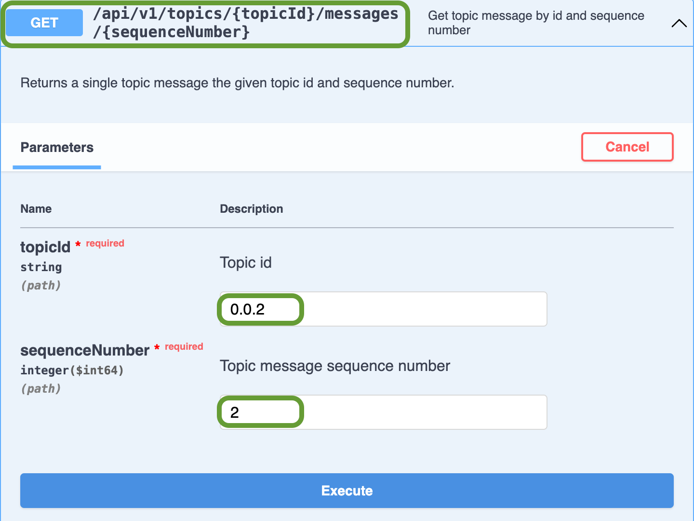
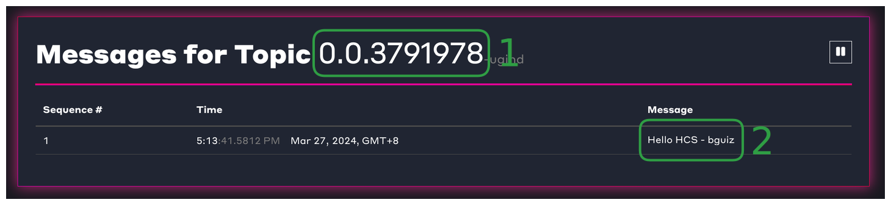

# Create a Topic

## Introduction to Creating a Topic

This tutorial will walk you through a `TopicCreateTransaction` to create a new consensus topic and a `TopicMessageSubmitTransaction` to publish your first message using the [Hedera Consensus Service (HCS)](../../support-and-community/glossary.md#hedera-consensus-service-hcs). The service provides developers a decentralized tool for logging, ordering, and timestamping messages or transactions on the Hedera network.&#x20;

#### What you will accomplish

By the end of this tutorial, you will be able to:

* Create new consensus topics using HCS.
* Publish your first message using HCS.
* Query the transaction via Mirror Node API.
* View your transaction on a Mirror Node Explorer.

***

## Prerequisites

Before you begin, you should have **completed** the following tutorials:

* [x] [Create and Fund Your Hedera Testnet Account](../../tutorials/more-tutorials/create-and-fund-your-hedera-testnet-account.md)
* [x] [Environment Setup](../environment-setup.md)&#x20;

***

## Step 1: Navigate to the `hcs` example in the project directory

From the root directory of the `hedera-future-world-language` project CD (change directories) to the topic create transaction example.&#x20;

```bash
cd hcs
```

If you completed a previous example in the series you can use to go back to the root directory and cd into this example.

```bash
cd ../hcs
```

If you want to get back to the root directory, you can CD out from any directory with this command

```bash
cd ../
```

You can follow along through the code walkthrough or skip ahead to execute the program [here](create-a-topic.md#step-3-run-and-verify-topic-on-hashscan).&#x20;

***

## Step 2: Guided Code Walkthrough

Open the HCS create a topic script (e.g., `/hcs/script-hcs-topic.js`) in a code editor llike [VS Code](https://code.visualstudio.com/), [IntelliJ](https://www.jetbrains.com/idea/), or a [Gitpod](https://gitpod.io/) instance.. The imports at the top include modules for interacting with the Hedera network via the SDK. The `@hashgraph/sdk` enables account management and transactions like creating a topic while the `dotenv` package loads environment variables from the `.env` file, such as the operator account ID, private key, and name variables.




```javascript
import {
    Client,
    PrivateKey,
    AccountId,
    TokenCreateTransaction,
    TokenType,
} from '@hashgraph/sdk';
import dotenv from 'dotenv';
import {
    createLogger,
} from '../util/util.js';

const logger = await createLogger({
    scriptId: 'htsFt',
    scriptCategory: 'task',
});
let client;

async function scriptHtsFungibleToken() {
    logger.logStart('Hello Future World - HTS Fungible Token - start');

    // Read in environment variables from `.env` file in parent directory
    dotenv.config({ path: '../.env' });
    logger.log('Read .env file');

    // Initialise the operator account
    const operatorIdStr = process.env.OPERATOR_ACCOUNT_ID;
    const operatorKeyStr = process.env.OPERATOR_ACCOUNT_PRIVATE_KEY;
    if (!operatorIdStr || !operatorKeyStr) {
        throw new Error('Must set OPERATOR_ACCOUNT_ID and OPERATOR_ACCOUNT_PRIVATE_KEY environment variables');
    }
    const operatorId = AccountId.fromString(operatorIdStr);
    const operatorKey = PrivateKey.fromStringECDSA(operatorKeyStr);
    client = Client.forTestnet().setOperator(operatorId, operatorKey);
    logger.log('Using account:', operatorIdStr);
}
```





```java
package hcs;

import java.net.http.HttpClient;
import java.net.http.HttpRequest;
import java.net.http.HttpResponse;
import java.nio.charset.StandardCharsets;
import java.util.ArrayList;
import java.util.Base64;
import java.util.List;
import java.net.URI;

import com.google.gson.JsonArray;
import com.google.gson.JsonElement;
import com.google.gson.JsonObject;
import com.google.gson.JsonParser;

import com.hedera.hashgraph.sdk.*;

import io.github.cdimascio.dotenv.Dotenv;

public class ScriptHcsTopic {
    public static void main(String[] args) throws Exception {
        System.out.println("🏁 Hello Future World - HCS Topic - start");

	    // Load environment variables from .env file
        Dotenv dotenv = Dotenv.configure().directory("../").load();
        String operatorIdStr = dotenv.get("OPERATOR_ACCOUNT_ID");
        String operatorKeyStr = dotenv.get("OPERATOR_ACCOUNT_PRIVATE_KEY");
        if (operatorIdStr == null || operatorKeyStr == null) {
            throw new RuntimeException("Must set OPERATOR_ACCOUNT_ID, OPERATOR_ACCOUNT_PRIVATE_KEY");
        }
        if (operatorKeyStr.startsWith("0x")) {
            operatorKeyStr = operatorKeyStr.substring(2);
        }
        // Initialize the operator account
        AccountId operatorId = AccountId.fromString(operatorIdStr);
        PrivateKey operatorKey = PrivateKey.fromStringECDSA(operatorKeyStr);
        System.out.println("Using account: " + operatorIdStr);
}
```





```go
package main

import (
	"encoding/json"
	"encoding/base64"
	"fmt"
	"log"
	"os"
	"strings"
	"time"

	"github.com/hashgraph/hedera-sdk-go/v2"
	"github.com/imroc/req/v3"
	"github.com/joho/godotenv"
)

type TopicMessagesMNAPIResponse struct {
	Messages []struct {
		SequenceNumber int64 `json:"sequence_number"`
		Message string `json:"message"`
	} `json:"messages"`
}

func main() {
	fmt.Println("🏁 Hello Future World - HCS Topic - start")

	// Load environment variables from .env file
	err := godotenv.Load("../.env")
	if err != nil {
		log.Fatal("Error loading .env file")
	}

	// Initialize the operator account
	operatorIdStr := os.Getenv("OPERATOR_ACCOUNT_ID")
	operatorKeyStr := os.Getenv("OPERATOR_ACCOUNT_PRIVATE_KEY")
	if operatorIdStr == "" || operatorKeyStr == "" {
		log.Fatal("Must set OPERATOR_ACCOUNT_ID, OPERATOR_ACCOUNT_PRIVATE_KEY")
	}

	operatorId, _ := hedera.AccountIDFromString(operatorIdStr)
	// Necessary because Go SDK v2.37.0 does not handle the `0x` prefix automatically
	// Ref: https://github.com/hashgraph/hedera-sdk-go/issues/1057
	operatorKeyStr = strings.TrimPrefix(operatorKeyStr, "0x")
	operatorKey, _ := hedera.PrivateKeyFromStringECDSA(operatorKeyStr)
	fmt.Printf("Using account: %s\n", operatorId)
	fmt.Printf("Using operatorKey: %s\n", operatorKeyStr)
```




### Create a Hedera Testnet Client

To set up your Hedera Testnet client, create the client and configure the operator using your Testnet account ID and private key. The operator account covers transaction and query fees in HBAR, with all transactions requiring a signature from the operator's private key for authorization.




```javascript
// The client operator ID and key is the account that will be automatically set to pay for the transaction fees for each transaction
client = Client.forTestnet().setOperator(operatorId, operatorKey);

//Set the default maximum transaction fee (in Hbar)
client.setDefaultMaxTransactionFee(new Hbar(100));

//Set the maximum payment for queries (in Hbar)
client.setDefaultMaxQueryPayment(new Hbar(50));
```





```java

Client client = Client.forTestnet().setOperator(operatorId, operatorKey);

//Set the default maximum transaction fee (in HBAR)
client.setDefaultMaxTransactionFee(new Hbar(100));
        
//Set the default maximum payment for queries (in HBAR)
client.setDefaultMaxQueryPayment(new Hbar(50));
```





```go
// The client operator ID and key is the account that will be automatically set to pay for the transaction fees for each transaction
client := hedera.ClientForTestnet()
client.SetOperator(operatorId, operatorKey)

// Set the default maximum transaction fee (in HBAR)
client.SetDefaultMaxTransactionFee(hedera.HbarFrom(100, hedera.HbarUnits.Hbar))
	
// Set the default maximum payment for queries (in HBAR)
client.SetDefaultMaxQueryPayment(hedera.HbarFrom(50, hedera.HbarUnits.Hbar))
```





To avoid encountering the **`INSUFFICIENT_TX_FEE`** error while executing transactions, you can also specify the maximum transaction fee limit through the **`.setDefaultMaxTransactionFee()`** method and the maximum query payment through the **`.setDefaultMaxQueryPayment()`** method to control costs, ensuring your client operates within your desired financial limits on the Hedera Testnet.


<details>

<summary><strong>🚨 How to resolve the <code>INSUFFICIENT_TX_FEE</code> error</strong></summary>

To resolve this error, you must adjust the max transaction fee to a higher value suitable for your needs.

Here is a simple example addition to your code:

Copy

```javascript
const maxTransactionFee = new Hbar(XX); // replace XX with desired fee in Hbar
```

In this example, you can set `maxTransactionFee` to any value greater than 5 HBAR (or 500,000,000 tinybars) to avoid the "_INSUFFICIENT\_TX\_FEE_" error for transactions greater than 5 HBAR. Please replace `XX` with the desired value.

To implement this new max transaction fee, you use the `setDefaultMaxTransactionFee()` method as shown below:

Copy

```javascript
client.setDefaultMaxTransactionFee(maxTransactionFee);
```

</details>

### Create a Topic Create Transaction

To create your first topic, you will use the `TopicCreateTransaction()`, set its properties, and submit it to the Hedera network. In this guide, you will create a **public topic** by not setting any properties on the topic. This means that anyone can send messages to your topic. Refer to the transaction and query [fees table](https://docs.hedera.com/hedera/networks/mainnet/fees#transaction-and-query-fees) for the full list of base transaction fees.

After the transaction is completed, you'll need to extract the `topicID` from the transaction receipt, as it's required for submitting messages to the topic. This step has already been completed for you, no further modification is necessary.




```javascript
// Create a new HCS topic
const topicCreateTx = await new TopicCreateTransaction()
    .setTopicMemo(`Hello Future World topic - ${logger.version}`)
    // Freeze the transaction to prepare for signing
    .freezeWith(client);

// Get the transaction ID of the transaction.
// The SDK automatically generates and assigns a transaction ID when the transaction is created
const topicCreateTxId = topicCreateTx.transactionId;
logger.log("The topic create transaction ID: ", topicCreateTxId.toString());

// Sign the transaction with the account key that will be paying for this transaction
const topicCreateTxSigned = await topicCreateTx.sign(operatorKey);

// Submit the transaction to the Hedera Testnet
const topicCreateTxSubmitted = await topicCreateTxSigned.execute(client);

// Get the transaction receipt
const topicCreateTxReceipt = await topicCreateTxSubmitted.getReceipt(client);

// Get the topic ID
const topicId = topicCreateTxReceipt.topicId;
logger.log('topicId:', topicId.toString());
```





```java
// Create a Hedera Consensus Service (HCS) topic
TopicCreateTransaction topicCreateTx = new TopicCreateTransaction()
     .setTopicMemo("Hello Future World topic - xyz")
     // Freeze the transaction to prepare for signing
     .freezeWith(client);

// Get the transaction ID of the transaction.
// The SDK automatically generates and assigns a transaction ID when the transaction is created
TransactionId topicCreateTxId = topicCreateTx.getTransactionId();
System.out.println("The topic create transaction ID: " + topicCreateTxId.toString());

// Sign the transaction with the account key that will be paying for this transaction
TopicCreateTransaction topicCreateTxSigned = topicCreateTx.sign(operatorKey);

// Submit the transaction to the Hedera Testnet
TransactionResponse topicCreateTxSubmitted = topicCreateTxSigned.execute(client);

// Get the transaction receipt
TransactionReceipt topicCreateTxReceipt = topicCreateTxSubmitted.getReceipt(client);

// Get the topic ID
TopicId topicId = topicCreateTxReceipt.topicId;
System.out.println("Topic ID:" + topicId.toString());
```





```go
// Create a Hedera Consensus Service (HCS) topic
topicCreateTx, _ := hedera.NewTopicCreateTransaction().
SetTopicMemo("Hello Future World topic - xyz").
// Freeze the transaction to prepare for signing
FreezeWith(client);

// Get the transaction ID of the transaction.
// The SDK automatically generates and assigns a transaction ID when the transaction is created
topicCreateTxId := topicCreateTx.GetTransactionID();
fmt.Printf("The topic create transaction ID: %s\n", topicCreateTxId.String())

// Sign the transaction with the private key of the treasury account (operator key)
topicCreateTxSigned := topicCreateTx.Sign(operatorKey)

// Submit the transaction to the Hedera Testnet
topicCreateTxSubmitted, _ := topicCreateTxSigned.Execute(client)

// Get the transaction receipt
topicCreateTxReceipt, _ := topicCreateTxSubmitted.GetReceipt(client)

// Get the token ID
topicId := topicCreateTxReceipt.TopicID
fmt.Printf("Topic ID: %s\n", topicId.String())
```




### Publish a Message to the New Topic

Now you are ready to submit your first message to the topic. You will use the `TopicMessageSubmitTransaction()` class to submit your first message to the topic. This involves setting the `topicId` and the message content, signing the transaction, and submitting it to the Hedera network. Messages can be any data up to _1024 bytes_, and each message costs [$0.0001](https://docs.hedera.com/hedera/networks/mainnet/fees#consensus-service) to send. This means you can send 10,000 messages for just $1 on the Hedera network. For the message content, use a string in the format `"Hello HCS!"`.&#x20;




```javascript
// Publish a message to the HCS topic
const topicMsgSubmitTx = await new TopicMessageSubmitTransaction()
    //Set the transaction memo with the hello future world ID
    .setTransactionMemo(`Hello Future World topic message - ${logger.version}`)
    .setTopicId(topicId)
    //Set the topic message contents
    .setMessage('Hello HCS!')
    // Freeze the transaction to prepare for signing
    .freezeWith(client);

// Get the transaction ID of the transaction. The SDK automatically generates and assigns a transaction ID when the transaction is created
const topicMsgSubmitTxId = topicMsgSubmitTx.transactionId;
logger.log('The message submit create transaction ID: ',
    topicMsgSubmitTxId.toString());

// Sign the transaction with the account key that will be paying for this transaction
const topicMsgSubmitTxSigned = await topicMsgSubmitTx.sign(operatorKey);

// Submit the transaction to the Hedera Testnet
const topicMsgSubmitTxSubmitted = await topicMsgSubmitTxSigned.execute(client);

// Get the transaction receipt
const topicMsgSubmitTxReceipt = await topicMsgSubmitTxSubmitted.getReceipt(client);

// Get the topic message sequence number
const topicMsgSeqNum = topicMsgSubmitTxReceipt.topicSequenceNumber;
logger.log('topicMsgSeqNum:', topicMsgSeqNum.toString());
```





```java
   // Publish a message to the Hedera Consensus Service (HCS) topic
        System.out.println("🟣 Publish message to HCS topic");
        TopicMessageSubmitTransaction topicMsgSubmitTx = new TopicMessageSubmitTransaction()
            //Set the transaction memo with the hello future world ID
            .setTransactionMemo("Hello Future World topic message - xyz")
            .setTopicId(topicId)
            //Set the topic message contents
            .setMessage("Hello HCS!")
            // Freeze the transaction to prepare for signing
            .freezeWith(client);

        // Get the transaction ID of the transaction.
        // The SDK automatically generates and assigns a transaction ID when the transaction is created
        TransactionId topicMsgSubmitTxId = topicMsgSubmitTx.getTransactionId();
        System.out.println(
            "The topic message submit transaction ID: " +
            topicMsgSubmitTxId.toString()
        );

        // Sign the transaction with the account key that will be paying for this transaction
        TopicMessageSubmitTransaction topicMsgSubmitTxSigned = topicMsgSubmitTx.sign(operatorKey);

        // Submit the transaction to the Hedera Testnet
        TransactionResponse topicMsgSubmitTxSubmitted =
            topicMsgSubmitTxSigned.execute(client);

        // Get the transaction receipt
        TransactionReceipt topicMsgSubmitTxReceipt =
            topicMsgSubmitTxSubmitted.getReceipt(client);

        // Get the topic message sequence number
        Long topicMsgSeqNum = topicMsgSubmitTxReceipt.topicSequenceNumber;
        System.out.println("Topic Message Sequence Number:" + topicMsgSeqNum.toString());
```





```go
// Publish a message to the Hedera Consensus Service (HCS) topic
topicMsgSubmitTx, _ := hedera.NewTopicMessageSubmitTransaction().
//Set the transaction memo with the hello future world ID
SetTransactionMemo("Hello Future World topic message - xyz").
SetTopicID(*topicId).
// Set the topic message contents
SetMessage([]byte("Hello HCS!")).
// Freeze the transaction to prepare for signing
FreezeWith(client);

// Get the transaction ID of the transaction.
// The SDK automatically generates and assigns a transaction ID when the transaction is created
topicMsgSubmitTxId := topicMsgSubmitTx.GetTransactionID();
fmt.Printf("The topic message submit transaction ID: %s\n", topicMsgSubmitTxId.String())

// Sign the transaction with the private key of the treasury account (operator key)
topicMsgSubmitTxSigned := topicMsgSubmitTx.Sign(operatorKey)

// Submit the transaction to the Hedera Testnet
topicMsgSubmitTxSubmitted, _ := topicMsgSubmitTxSigned.Execute(client)

// Get the transaction receipt
topicMsgSubmitTxReceipt, _ := topicMsgSubmitTxSubmitted.GetReceipt(client)

// Get the topic message sequence number
topicMsgSeqNum := topicMsgSubmitTxReceipt.TopicSequenceNumber
fmt.Printf("Topic Message Sequence Number: %v\n", topicMsgSeqNum)
```




The total cost to create a topic and send a message to it is approximately [**$0.0101**](../../networks/mainnet/fees/#consensus-service), making it an affordable way to interact with the Hedera network.&#x20;



### Query the Topic Data from the Mirror Node API

To query the specified topic ID and verify the messages within the topic, you will want to use the Mirror Node API with the path `/api/v1/topics/{topicId}/messages` for this task.

* Specify `topicId` within the URL path
* Specify `base64` as the `encoding` query parameter
* Specify `5` as the `limit` query parameter
* Specify `asc` as the `order`  query parameter
* Specify `1` as the `sequencenumber` query parameter

The constructed `topicVerifyMirrorNodeApiUrl` should look like this:


```javascript
const topicVerifyMirrorNodeApiUrl =
    `https://testnet.mirrornode.hedera.com/api/v1/topics/${topicId.toString()}/
    messages?encoding=base64&limit=5&order=asc&sequencenumber=1`;
```


<details>

<summary>Learn more about Mirror Node APIs</summary>

You can explore the Mirror Node APIs interactively via its Swagger page: [Hedera Testnet Mirror Node REST API](https://testnet.mirrornode.hedera.com/api/v1/docs/#/).

You can perform the same Mirror Node API query as `topicVerifyMirrorNodeApiUrl` above. This is what the relevant part of the Swagger page would look like when doing so:



_➡  You can learn more about the Mirror Nodes via its documentation:_ [_REST API_](https://docs.hedera.com/hedera/sdks-and-apis/rest-api)_._

</details>

***

## Step 3: Run and Verify Topic on HashScan

In the terminal, `cd` into the `hcs` directory and run the topic create transaction script:



```bash
node script-hcs-topic.js
```



```bash
gradle run
```



```bash
go mod tidy
go run script-hcs-topic.go
```



Sample output:

```bash
🏁 Hello Future World - HCS Topic - start
Using account: 0.0.1455
Using operatorKey: 1a83c7c0fe90a1d24b8f5bcd3b074aecad834d7a9fbe130ea133eb4e01775300
🟣 Creating new HCS topic
The topic create transaction ID: 0.0.1455@1732734923.966673221
Topic ID: 0.0.5181441
🟣 Publish message to HCS topic
The topic message submit transaction ID: 0.0.1455@1732734922.264842548
Topic Message Sequence Number: 1
🟣 View the topic on HashScan
Topic Hashscan URL: https://hashscan.io/testnet/topic/0.0.5181441
🟣 Get topic data from the Hedera Mirror Node
The token Hedera Mirror Node API URL: https://testnet.mirrornode.hedera.com/api/v1/topics/0.0.5181441/messages?encoding=base64&limit=5&order=asc&sequencenumber=1
Messages retrieved from this topic:
#1: Hello HCS!
🎉 Hello Future World - HCS Topic - complete
```

To verify that both the `TopicCreateTransaction` and `TopicMessageSubmitTransaction` have been successful, check the transaction details on HashScan. Open _View the topic on HashScan_ URL from the console output in your browser and check that:

<figure><figcaption><p>HCS topic in Hashscan, with annotated items to check.</p></figcaption></figure>

* The topic exists, and its topic ID matches `topicId` output by the script. **(1)**
* There is one entry in the topic, and its message is `Hello HCS -` followed by your name/ nickname. **(2)**

***

## Code Check ✅

* [**Java**](https://github.com/hedera-dev/hello-future-world-java/blob/main/hcs/src/main/java/hcs/ScriptHcsTopic.java)
* [**JavaScript**](https://github.com/hedera-dev/hello-future-world-js/blob/main/hcs/script-hcs-topic.js)
* [**Go**](https://github.com/hedera-dev/hello-future-world-go/blob/main/hcs/script-hcs-topic.go)

***

## Complete <a href="#complete" id="complete"></a>

Congratulations, you have completed the **Create a Topic** tutorial in the Getting Started series for the Web2 Developers learning path!  🎉🎉🎉!

You learned how to:

* [x] Create new consensus topics using HCS.
* [x] Publish your first message using HCS.
* [x] Query the transaction via Mirror Node API.
* [x] View the transaction in a Mirror Node explorer.

***

## Next Steps

Continue building on Hedera with another tutorial in the series to explore more Hedera services.

<table data-card-size="large" data-view="cards"><thead><tr><th></th><th></th><th align="center"></th><th data-hidden><select multiple><option value="MB66z3fRYAlS" label="Accounts" color="blue"></option><option value="ZtnVYE29eArB" label="Topics" color="blue"></option><option value="TDPtoF12LPsm" label="Consensus Service" color="blue"></option><option value="FA8tkDPySmBL" label="Smart Contract Service" color="blue"></option><option value="VB4WYIKreZrZ" label="Token Service" color="blue"></option><option value="ILNVVpFoQpVk" label="Transactions" color="blue"></option><option value="CyJdTxHORHj7" label="Mirror Node" color="blue"></option><option value="6rVFgdKhOqrP" label="Keys &#x26; Signatures" color="blue"></option><option value="1ea0c60597qU" label="Queries" color="blue"></option><option value="iVX52i9gmTP4" label="Cryptocurrency" color="blue"></option></select></th><th data-hidden><select multiple><option value="WZtQiM8yq8qW" label="Accounts" color="blue"></option><option value="pr6gYjjHGJYO" label="Tokens" color="blue"></option><option value="0Vfu6ryyddVV" label="Smart Contracts" color="blue"></option><option value="paNqgxe1BUOW" label="EVM" color="blue"></option><option value="TtBMmEvGoSry" label="Transactions &#x26; Queries" color="blue"></option><option value="aNiFPpmkJ3uC" label="Keys &#x26; Signatures" color="blue"></option><option value="iq5mK7i8IkXM" label="Cryptocurrency" color="blue"></option><option value="RMY8nJInTzMv" label="Topics" color="blue"></option><option value="LPy3Gd1S3ilQ" label="Consensus Service" color="blue"></option><option value="zC34wTqgyTq8" label="Token Service" color="blue"></option><option value="dJ5dfPXSBQaX" label="Smart Contracts Service" color="blue"></option></select></th><th data-hidden data-card-target data-type="content-ref"></th></tr></thead><tbody><tr><td><strong>Transfer HBAR</strong> </td><td>Learn how to transfer HBAR, Hedera's native cryptocurrency, between accounts. </td><td align="center"><a href="transfer-hbar.md"><strong>LEARN MORE</strong></a></td><td><span data-option="MB66z3fRYAlS">Accounts, </span><span data-option="6rVFgdKhOqrP">Keys &#x26; Signatures, </span><span data-option="ILNVVpFoQpVk">Transactions, </span><span data-option="1ea0c60597qU">Queries</span></td><td></td><td><a href="broken-reference">Broken link</a></td></tr><tr><td><strong>Create a Token</strong>  </td><td>Learn how to create fungible tokens using the <a href="../../support-and-community/glossary.md#hedera-token-service-hts">Hedera Token Service</a> (HTS). </td><td align="center"><a href="create-a-token.md"><strong>LEARN MORE</strong></a></td><td><span data-option="ZtnVYE29eArB">Topics, </span><span data-option="TDPtoF12LPsm">Consensus Service</span></td><td></td><td><a href="create-a-token.md">create-a-token.md</a></td></tr></tbody></table>


**Have questions?** Join the [Hedera Discord](https://hedera.com/discord) and post them in the [`developer-general`](https://discord.com/channels/373889138199494658/373889138199494660) channel or ask on [Stack Overflow](https://stackoverflow.com/questions/tagged/hedera-hashgraph).

