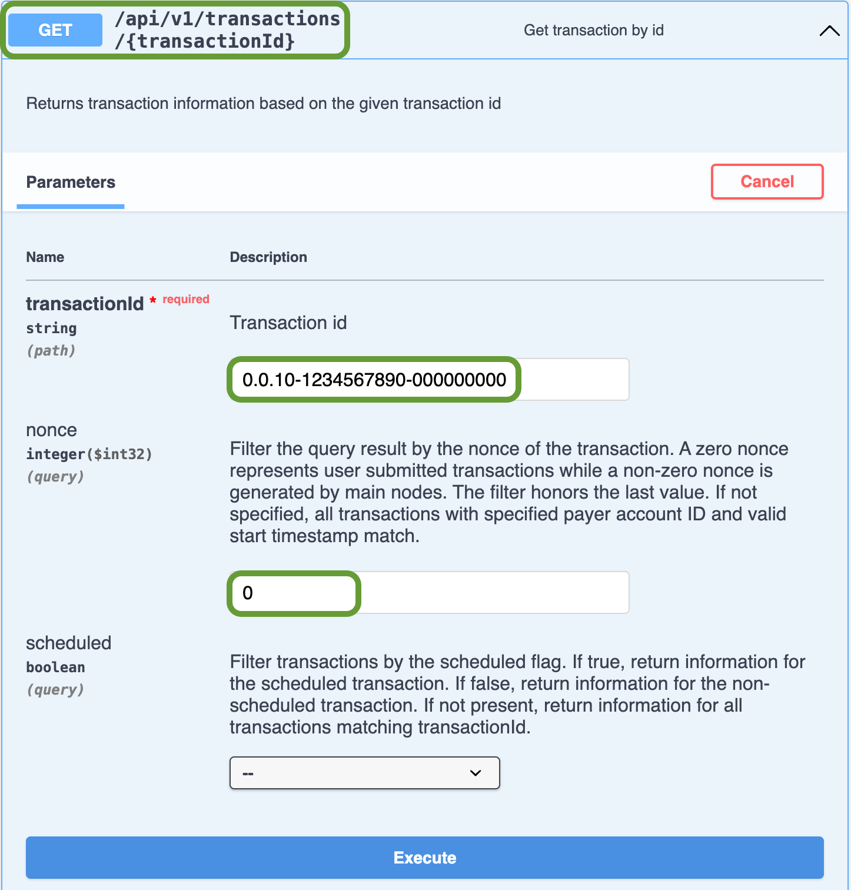
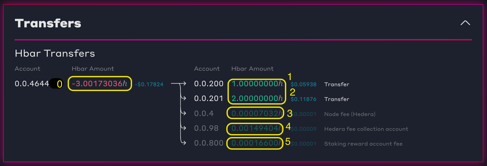

# Transfer HBAR

## Introduction to Transferring HBAR

This tutorial will walk you through a `TransferTransaction` and show you how to transfer HBAR between accounts, initialize a Hedera client, securely sign and submit a transfer transaction, and verify the transaction was successful using the Hedera Mirror Node.

#### What you will accomplish

By the end of this tutorial, you will be able to:

* Create and send a transfer transaction.
* Send an account balance query.
* Query the transaction via Mirror Node API.
* View your transaction on a Mirror Node Explorer.

***

## Prerequisites

Before you begin, you should have **completed** the following tutorials:

* [x] [Create and Fund Your Hedera Testnet Account](../../tutorials/more-tutorials/create-and-fund-your-hedera-testnet-account.md)
* [x] [Environment Setup](../environment-setup.md)&#x20;

***

## Step 1: Navigate to the `transfer` example in the project directory

From the root directory of the project, `cd` (change directories) into the transfer transaction example script.&#x20;

```bash
cd transfer
```

If you completed a previous example in the series, you can go back to the root directory and `cd` into this example.

```bash
cd ../transfer
```

If you want to get back to the root directory, you can CD out from any directory with this command

```bash
cd ../
```

You can follow along through the code walkthrough or skip ahead to execute the program [here](transfer-hbar.md#step-3-run-the-transfer-transaction-script).&#x20;

***

## Step 2: Guided Code Walkthrough

Open the transfer HBAR script (e.g., `/transfer/script-transfer-hbar...`) in a code editor like [VS Code](https://code.visualstudio.com/), [IntelliJ](https://www.jetbrains.com/idea/), or a [Gitpod](https://gitpod.io/) instance. The imports at the top include modules for interacting with the Hedera network via the SDK. The `@hashgraph/sdk` enables account management and transactions like creating a token while the `dotenv` package loads environment variables from the `.env` file, such as the operator account ID, private key, and name variables.




```java
package transfer;

import java.net.http.HttpClient;
import java.net.http.HttpRequest;
import java.net.http.HttpResponse;
import java.util.ArrayList;
import java.util.Comparator;
import java.util.List;
import java.util.Objects;
import java.net.URI;

import com.google.gson.JsonArray;
import com.google.gson.JsonElement;
import com.google.gson.JsonObject;
import com.google.gson.JsonParser;

import com.hedera.hashgraph.sdk.*;

import io.github.cdimascio.dotenv.Dotenv;

public class ScriptTransferHbar {
    public static void main(String[] args) throws Exception {
        System.out.println("🏁 Hello Future World - Transfer HBAR - start");

	    // Load environment variables from .env file
        Dotenv dotenv = Dotenv.configure().directory("../").load();
        String operatorIdStr = dotenv.get("OPERATOR_ACCOUNT_ID");
        String operatorKeyStr = dotenv.get("OPERATOR_ACCOUNT_PRIVATE_KEY");
        if (operatorIdStr == null || operatorKeyStr == null) {
            throw new RuntimeException("Must set OPERATOR_ACCOUNT_ID, OPERATOR_ACCOUNT_PRIVATE_KEY");
        }
        if (operatorKeyStr.startsWith("0x")) {
            operatorKeyStr = operatorKeyStr.substring(2);
        }

	    // Initialize the operator account
        AccountId operatorId = AccountId.fromString(operatorIdStr);
        PrivateKey operatorKey = PrivateKey.fromStringECDSA(operatorKeyStr);
        Client client = Client.forTestnet().setOperator(operatorId, operatorKey);
        System.out.println("Using account: " + operatorIdStr);
}
```





```javascript
import {
    Client,
    PrivateKey,
    AccountId,
    TransferTransaction,
    Hbar,
    HbarUnit,
    AccountBalanceQuery,
} from '@hashgraph/sdk';
import dotenv from 'dotenv';
import {
    convertTransactionIdForMirrorNodeApi,
    createLogger,
} from '../util/util.js';

const logger = await createLogger({
    scriptId: 'transferHbar',
    scriptCategory: 'task',
});
let client;

async function scriptTransferHbar() {
    logger.logStart('Hello Future World - Transfer Hbar - start');

    // Read in environment variables from `.env` file in parent directory
    dotenv.config({ path: '../.env' });
    logger.log('Read .env file');

    // Initialise the operator account
    const operatorIdStr = process.env.OPERATOR_ACCOUNT_ID;
    const operatorKeyStr = process.env.OPERATOR_ACCOUNT_PRIVATE_KEY;

    if (!operatorIdStr || !operatorKeyStr) {
        throw new Error('Must set YOUR_NAME, OPERATOR_ACCOUNT_ID, OPERATOR_ACCOUNT_PRIVATE_KEY');
    }
    const operatorId = AccountId.fromString(operatorIdStr);
    const operatorKey = PrivateKey.fromStringECDSA(operatorKeyStr);
    logger.log('Using account:', operatorIdStr);
}
```





```go
package main

import (
	"encoding/json"
	"fmt"
	"log"
	"math"
	"os"
	"sort"
	"strings"
	"time"

	"github.com/hashgraph/hedera-sdk-go/v2"
	"github.com/imroc/req/v3"
	"github.com/joho/godotenv"
)

type TransferMNAPIResponse struct {
	Account string `json:"account"`
	Amount  int64  `json:"amount"`
}
type TransferTransactionMNAPIResponse struct {
	Transactions []struct {
		Transfers []TransferMNAPIResponse `json:"transfers"`
	} `json:"transactions"`
}

func main() {
	fmt.Println("🏁 Hello Future World - Transfer Hbar - start")

	// Load environment variables from .env file
	err := godotenv.Load("../.env")
	if err != nil {
		log.Fatal("Error loading .env file")
	}

	// Initialize the operator account
	operatorIdStr := os.Getenv("OPERATOR_ACCOUNT_ID")
	operatorKeyStr := os.Getenv("OPERATOR_ACCOUNT_PRIVATE_KEY")
	if operatorIdStr == "" || operatorKeyStr == "" {
		log.Fatal("Must set OPERATOR_ACCOUNT_ID, OPERATOR_ACCOUNT_PRIVATE_KEY")
	}

	operatorId, _ := hedera.AccountIDFromString(operatorIdStr)
	// Necessary because Go SDK v2.37.0 does not handle the `0x` prefix automatically
	// Ref: https://github.com/hashgraph/hedera-sdk-go/issues/1057
	operatorKeyStr = strings.TrimPrefix(operatorKeyStr, "0x")
	operatorKey, _ := hedera.PrivateKeyFromStringECDSA(operatorKeyStr)
	fmt.Printf("Using account: %s\n", operatorId)
	fmt.Printf("Using operatorKey: %s\n", operatorKeyStr)
```




### Create a Hedera Testnet Client

To set up your Hedera Testnet client, create the client and configure the operator using your testnet account ID and private key. The operator account covers transaction and query fees in HBAR, with all transactions requiring a signature from the operator's private key for authorization.




```java
//Create your Hedera Testnet client
Client client = Client.forTestnet();

//Set your account as the client's operator
client.setOperator(operatorId, operatorKey);

//Set the default maximum transaction fee (in Hbar)
client.setDefaultMaxTransactionFee(new Hbar(100));

//Set the maximum payment for queries (in Hbar)
client.setDefaultMaxQueryPayment(new Hbar(50));
```





```javascript
// The client operator ID and key is the account that will be automatically set to pay for the transaction fees for each transaction
client = Client.forTestnet().setOperator(operatorId, operatorKey);

//Set the default maximum transaction fee (in Hbar)
client.setDefaultMaxTransactionFee(new Hbar(100));

//Set the maximum payment for queries (in Hbar)
client.setDefaultMaxQueryPayment(new Hbar(50));
```




```go
//Create your testnet client
client := hedera.ClientForTestnet()
client.SetOperator(myAccountId, myPrivateKey)

// Set default max transaction fee
client.SetDefaultMaxTransactionFee(hedera.HbarFrom(100, hedera.HbarUnits.Hbar))

// Set max query payment
client.SetDefaultMaxQueryPayment(hedera.HbarFrom(50, hedera.HbarUnits.Hbar))
```




To avoid encountering the **`INSUFFICIENT_TX_FEE`** error while executing transactions, you can also specify the maximum transaction fee limit through the **`.setDefaultMaxTransactionFee()`** method and the maximum query payment through the **`.setDefaultMaxQueryPayment()`** method to control costs, ensuring your client operates within your desired financial limits on the Hedera Testnet.


<details>

<summary><strong>🚨 How to resolve the <code>INSUFFICIENT_TX_FEE</code> error</strong></summary>

To resolve this error, you must adjust the max transaction fee to a higher value suitable for your needs.

Here is a simple example addition to your code:

Copy

```javascript
const maxTransactionFee = new Hbar(XX); // replace XX with desired fee in Hbar
```

In this example, you can set `maxTransactionFee` to any value greater than 5 HBAR (or 500,000,000 tinybars) to avoid the "_INSUFFICIENT\_TX\_FEE_" error for transactions greater than 5 HBAR. Please replace `XX` with the desired value.

To implement this new max transaction fee, you use the `setDefaultMaxTransactionFee()` method as shown below:

Copy

```javascript
client.setDefaultMaxTransactionFee(maxTransactionFee);
```

</details>

### Create a Transfer Transaction

Create and initialize a transfer transaction (`TransaferTransaction`) by specifying the sender account, receiver account, and transfer amount. Refer to the transaction and query [fees table](https://docs.hedera.com/hedera/networks/mainnet/fees#transaction-and-query-fees) for the base transaction fee. In the code snippet below, you use the new testnet account you created in the [Get Your Testnet Account](broken-reference) guide to debit from your operator account (-3 **HBAR**) and credit accounts `0.0.200`(1 **HBAR**) and `0.0.201` (2 **HBAR**).




```java
AccountId recipientAccount1 = AccountId.fromString("0.0.200");
AccountId recipientAccount2 = AccountId.fromString("0.0.201");
TransferTransaction transferTx = new TransferTransaction()
     .setTransactionMemo("Hello Future World transfer - xyz")
     // Debit  3 HBAR from the operator account (sender)
     .addHbarTransfer(operatorId, Hbar.from(-3, HbarUnit.HBAR))
     // Credit 1 HBAR to account 0.0.200 (1st recipient)
     .addHbarTransfer(recipientAccount1, Hbar.from(1, HbarUnit.HBAR))
     // Credit 2 HBAR to account 0.0.201 (2nd recipient)
     .addHbarTransfer(recipientAccount2, Hbar.from(2, HbarUnit.HBAR))
     // Freeze the transaction to prepare for signing
     .freezeWith(client);

// Get the transaction ID for the transfer transaction
TransactionId transferTxId = transferTx.getTransactionId();
System.out.println("The transfer transaction ID: " + transferTxId.toString());
```





```javascript
// Create the transfer transaction
const transferTx = await new TransferTransaction()
    .setTransactionMemo(`Hello Future World transfer - ${logger.version}`)
    // Debit 3 HBAR from the operator account (sender)
    .addHbarTransfer(operatorId, new Hbar(-3, HbarUnit.Hbar))
    // Credit 1 HBAR to account 0.0.200 (1st recipient)
    .addHbarTransfer('0.0.200', new Hbar(1, HbarUnit.Hbar))
    // Credit 2 HBAR to account 0.0.201 (2nd recipient)
    .addHbarTransfer('0.0.201', new Hbar(2, HbarUnit.Hbar))
    // Freeze the transaction to prepare for signing
    .freezeWith(client);

// Get the transaction ID for the transfer transaction
const transferTxId = transferTx.transactionId;
logger.log('The transfer transaction ID:', transferTxId.toString());
```





```go
recipientAccount1, _ := hedera.AccountIDFromString("0.0.200")
recipientAccount2, _ := hedera.AccountIDFromString("0.0.201")
transferTx, _ := hedera.NewTransferTransaction().
     SetTransactionMemo(fmt.Sprintf("Hello Future World transfer - xyz")).
     // Debit  3 HBAR from the operator account (sender)
     AddHbarTransfer(operatorId, hedera.HbarFrom(-3, hedera.HbarUnits.Hbar)).
     // Credit 1 HBAR to account 0.0.200 (1st recipient)
     AddHbarTransfer(recipientAccount1, hedera.HbarFrom(1, hedera.HbarUnits.Hbar)).
     // Credit 2 HBAR to account 0.0.201 (2nd recipient)
     AddHbarTransfer(recipientAccount2, hedera.HbarFrom(2, hedera.HbarUnits.Hbar)).
     // Freeze the transaction to prepare for signing
     FreezeWith(client)

// Get the transaction ID for the transfer transaction
transferTxId := transferTx.GetTransactionID()
fmt.Printf("The transfer transaction ID: %s\n", transferTxId.String())
```




### Sign the Transfer Transaction

The transaction must be signed using the private key of the sender's (operator) account. This ensures that the sender authorizes the transfer. Since you are transferring from the account associated with the client, you do not need to sign the transaction explicitly, as the operator account (the account transferring the **HBAR**) signs all transactions to authorize the transaction fee payment.&#x20;




```java
// Sign with the operator key
TransferTransaction transferTxSigned = transferTx.sign(operatorKey);

// Submit the transaction to the Hedera Testnet
TransactionResponse transferTxSubmitted = transferTxSigned.execute(client);
```





```javascript
// Sign with the operator key
const transferTxSigned = await transferTx.sign(operatorKey);

// Submit the transfer transaction to the Hedera network
const transferTxSubmitted = await transferTxSigned.execute(client);    
```





```go
// Sign with the operator key
transferTxSigned := transferTx.Sign(operatorKey)

// Submit the transaction to the Hedera Testnet
transferTxSubmitted, err := transferTxSigned.Execute(client)
if err != nil {log.Fatalf("Error executing TransferTransaction: %v\n", err)}
```




To verify that the transaction has reached consensus on the network, submit a request for the transaction receipt. The request returns the transaction's status to your console. If the console returns a `SUCCESS` status, the transaction was successfully processed into the consensus state.&#x20;




```javascript
// Get the transfer transaction receipt 
const transferTxReceipt = await transferTxSubmitted.getReceipt(client);

// Get the transaction consensus status
const transactionStatus = transferTxReceipt.status;

// Log the transaction status
logger.log('The transfer transaction status is:', transactionStatus.toString(),);
```





```java
// Get the transfer transaction receipt
TransactionReceipt transferTxReceipt = transferTxSubmitted.getReceipt(client);

// Get the transaction consensus status
Status transactionStatus = transferTxReceipt.status;

// Print the transaction status
System.out.println(
    "The transfer transaction status is: " + transactionStatus.toString()
);
```





```go
// Get the transfer transaction receipt
transferTxReceipt, err := transferTxSubmitted.GetReceipt(client)
if err != nil {
    log.Fatalf("Error getting receipt for TransferTransaction: %v\n", err)
}

// Get the transaction consensus status
transactionStatus := transferTxReceipt.Status

// Print the transaction status
fmt.Printf("The transfer transaction status is: %s\n", transactionStatus.String())
```




### Query the Account Balance

Verify the account balance was updated for the account (`0.0.201`, `0.0.200`) you transferred HBAR to by sending an account balance query. This query will check the current balance of the specified account. The current account balance should be the sum of the initial balance plus the transfer amount. For example, if the initial account balance is 100 HBAR, the balance after transferring 2 HBAR will be 102 HBAR.  &#x20;




```java
// Query HBAR balance using AccountBalanceQuery
AccountBalance newAccountBalance = new AccountBalanceQuery()
    .setAccountId(operatorId)
    .execute(client);
    
// Get the new HBAR balance
Hbar newHbarBalance = newAccountBalance.hbars;

// Print the new account balance after the transfer
System.out.println(
    "The new account balance after the transfer: " +
    newHbarBalance.toString()
);
```





```javascript
// Query HBAR balance using AccountBalanceQuery
const newAccountBalance = new AccountBalanceQuery()
    .setAccountId('0.0.201')
    .execute(client);
    
// Wait for the query result and get the HBAR balance
const newHbarBalance = (await newAccountBalance).hbars;

// Log the new account balance after the transfer
logger.log(
    'The new account balance after the transfer:', newHbarBalance.toString()
);
```





```go
// Query HBAR balance using
newAccountBalance, _ := hedera.NewAccountBalanceQuery().
	SetAccountID(operatorId).
	Execute(client)
	
// Get the new HBAR balance
newHbarBalance := newAccountBalance.Hbars

// Print the new account balance after the transfer
fmt.Printf("The new account balance after the transfer: %s\n", 
newHbarBalance.String())
```




### Query the Transfer Transaction via Mirror Node API

[Mirror nodes](../../core-concepts/mirror-nodes/) store the history of transactions that took place on the network. To query the transaction, use the Mirror Node API with the path `/api/v1/transactions/${transferTxIdMirrorNodeFormat}`. This API endpoint allows you to retrieve the details of a specified transfer transaction ID.&#x20;

* Specify `transferTxId` within the URL path
* Specify `0` as the `nonce` query parameter

The constructed `transferTxVerifyMirrorNodeApiUrl` string should look like this:




```java
String transferTxVerifyMirrorNodeApiUrl =
    "https://testnet.mirrornode.hedera.com/api/v1/transactions/" + 
    transferTxIdMirrorNodeFormat;
```





```javascript
const transferTxVerifyMirrorNodeApiUrl = 
    `https://testnet.mirrornode.hedera.com/api/v1/transactions/
    ${transferTxIdMirrorNodeFormat}`;
```





```go
transferTxVerifyMirrorNodeApiUrl :=
    fmt.Sprintf(
    "https://testnet.mirrornode.hedera.com/api/v1/transactions/%s?nonce=0", 
        transferTxIdMirrorNodeFormat)
```




<details>

<summary><strong>Learn more about Mirror Node APIs</strong></summary>

You can explore the Mirror Node APIs interactively via its Swagger page: [Hedera Testnet Mirror Node REST API](https://testnet.mirrornode.hedera.com/api/v1/docs/#/).

You can perform the same Mirror Node API query as `transferTxVerifyMirrorNodeApiUrl` above. This is what the relevant part of the Swagger page would look like when doing so:



_➡  You can learn more about the Mirror Nodes via its documentation:_ [_REST API_](https://docs.hedera.com/hedera/sdks-and-apis/rest-api)_._

</details>

***

## Step 3: Run the Transfer Transaction Script

In the terminal, `cd` into the `./transfer` directory and run the transfer transaction script:



```bash
node script-transfer-hbar.js
```



```bash
gradle run
```



```bash
go mod tidy
go run script-transfer-hbar.go
```



Sample output:

<pre class="language-sh"><code class="lang-sh">🏁 Hello Future World - Transfer Hbar - start  …
Read .env file
Using account: 0.0.1455

🟣 Creating, signing, and submitting the transfer transaction  …
↪️ file:///workspace/hello-future-world-x/transfer/script-transfer-hbar...
The transfer transaction ID: 0.0.1455@1724452532.168163302
The transfer transaction status is: SUCCESS
The new account balance after the transfer: 3655.62282828 ℏ

🟣 View the transfer transaction transaction in HashScan  …
↪️ file:///workspace/hello-future-world-x/transfer/script-transfer-hbar...
Copy and paste this URL in your browser:
<strong> https://hashscan.io/testnet/transaction/0.0.1455@1724452532.168163302
</strong>
🟣 Get transfer transaction data from the Hedera Mirror Node  …
↪️ file:///workspace/hello-future-world-x/transfer/script-transfer-hbar...
The transfer transaction Hedera Mirror Node API URL:
 https://testnet.mirrornode.hedera.com/api/v1/transactions/0.0.1455-1724452532-168163302?nonce=0
The debit, credit, and transaction fee amounts of the transfer transaction:
┌─────────┬───────────────┬─────────────────┐
│ (index) │ Account ID    │ Amount          │
├─────────┼───────────────┼─────────────────┤
│ 0       │ '0.0.1455'    │ '-3.00173036 ℏ' │
│ 1       │ '0.0.200'     │ '1 ℏ'           │
│ 2       │ '0.0.201'     │ '2 ℏ'           │
└─────────┴───────────────┴─────────────────┘

🎉 Hello Future World - Transfer Hbar - complete  …
</code></pre>

## View the Transfer Transaction and Transaction Fees in HashScan

To view and verify the transaction details, copy, paste, and open the HashScan URL from the console output in your browser.

<pre class="language-bash"><code class="lang-bash">🟣 View the transfer transaction transaction in HashScan  …
↪️ file:///workspace/hello-future-world-x/transfer/script-transfer-hbar...
Copy and paste this URL in your browser:
<strong> https://hashscan.io/testnet/transaction/0.0.1455@1724452532.168163302
</strong></code></pre>

The Hedera network Transaction fees are split between two accounts. Most of the fee goes to the fee collection account **{ 2 }** to cover network expenses like processing, bandwidth, and storage costs. The remaining portion is paid to account `0.0.7` **{ 1 }**, the consensus node fee collection account, which plays a critical role in the Hedera network's consensus by validating and processing transactions. This fee structure reflects the actual costs of transactions, protecting against abuse such as Denial of Service (DoS) attacks and ensuring scalable network usage.&#x20;

<figure><figcaption><p>Transfer transaction in HashScan, with annotated items to check.</p></figcaption></figure>

* **{ 0 }**  _Debit (add 1 - 5 for exact amount) from operator account `0.0.464xxx`_ _<mark style="color:red;">**-3.00173036**</mark>_&#x20;**&#x20;ℏ**
* **{ 1 }** _Credit new account `0.0.200`_  _<mark style="color:green;">**1**</mark>_ **ℏ** &#x20;
* **{ 2 }** _Credit new account `0.0.201`_   _<mark style="color:green;">**2**</mark>_ **ℏ** &#x20;
* **{ 3 }** _&#x4E;_&#x6F;de fee is paid to account `0.0.4`   _<mark style="color:green;">**0.00007032**</mark>_ **ℏ**&#x20;
* **{ 4 }** _Hedera fee collection account `0.0.98`_  _<mark style="color:green;">**0.00149404**</mark>_ **ℏ**&#x20;
* **{ 5 }**  _Staking reward account fee to `0.0.800`_  _<mark style="color:green;">**0.00016600**</mark>_ **ℏ**
  * _**0.00007032 + 0.00149404 + 0.00016600 + 10 = 3.00173036**_


_**Note**: Please see the transaction and query_ [_fees_](https://docs.hedera.com/hedera/networks/mainnet/fees#transaction-and-query-fees) _table for the base transaction fee._


***

## **Code Check ✅**

* [**Java**](https://github.com/hedera-dev/hello-future-world-java/blob/main/transfer/src/main/java/transfer/ScriptTransferHbar.java)
* [**JavaScript**](https://github.com/hedera-dev/hello-future-world-js/blob/main/transfer/script-transfer-hbar.js)
* [**Go**](https://github.com/hedera-dev/hello-future-world-go/blob/main/transfer/script-transfer-hbar.go)

***

## Complete

Congratulations, you have completed the **Transfer HBAR** tutorial in the Getting Started series for the Web2 Developers learning path!  🎉🎉🎉

You learned how to:

* [x] Create and send a transfer transaction.
* [x] Send an HBAR account balance query.
* [x] Query the transaction via Mirror Node API.
* [x] View the transaction in a Mirror Node explorer.

***

## Next Steps

Continue building on Hedera with another tutorial in the series to explore more Hedera services.

<table data-card-size="large" data-view="cards"><thead><tr><th></th><th></th><th align="center"></th><th data-hidden><select multiple><option value="MB66z3fRYAlS" label="Accounts" color="blue"></option><option value="ZtnVYE29eArB" label="Topics" color="blue"></option><option value="TDPtoF12LPsm" label="Consensus Service" color="blue"></option><option value="FA8tkDPySmBL" label="Smart Contract Service" color="blue"></option><option value="VB4WYIKreZrZ" label="Token Service" color="blue"></option><option value="ILNVVpFoQpVk" label="Transactions" color="blue"></option><option value="CyJdTxHORHj7" label="Mirror Node" color="blue"></option><option value="6rVFgdKhOqrP" label="Keys &#x26; Signatures" color="blue"></option><option value="1ea0c60597qU" label="Queries" color="blue"></option><option value="iVX52i9gmTP4" label="Cryptocurrency" color="blue"></option></select></th><th data-hidden><select multiple><option value="WZtQiM8yq8qW" label="Accounts" color="blue"></option><option value="pr6gYjjHGJYO" label="Tokens" color="blue"></option><option value="0Vfu6ryyddVV" label="Smart Contracts" color="blue"></option><option value="paNqgxe1BUOW" label="EVM" color="blue"></option><option value="TtBMmEvGoSry" label="Transactions &#x26; Queries" color="blue"></option><option value="aNiFPpmkJ3uC" label="Keys &#x26; Signatures" color="blue"></option><option value="iq5mK7i8IkXM" label="Cryptocurrency" color="blue"></option><option value="RMY8nJInTzMv" label="Topics" color="blue"></option><option value="LPy3Gd1S3ilQ" label="Consensus Service" color="blue"></option><option value="zC34wTqgyTq8" label="Token Service" color="blue"></option><option value="dJ5dfPXSBQaX" label="Smart Contracts Service" color="blue"></option></select></th><th data-hidden data-card-target data-type="content-ref"></th></tr></thead><tbody><tr><td><strong>Create a Token</strong>  </td><td>Learn how to create fungible tokens using the <a href="../../support-and-community/glossary.md#hedera-token-service-hts">Hedera Token Service</a> (HTS). </td><td align="center"><a href="create-a-token.md"><strong>LEARN MORE</strong></a></td><td><span data-option="VB4WYIKreZrZ">Token Service</span></td><td></td><td><a href="create-a-token.md">create-a-token.md</a></td></tr><tr><td><strong>Create a Topic</strong>  </td><td>Learn how to create topics and publish messages using the <a href="../../support-and-community/glossary.md#hedera-consensus-service-hcs">Hedera Consensus Service</a> (HCS). </td><td align="center"><a href="create-a-topic.md"><strong>LEARN MORE</strong></a></td><td><span data-option="ZtnVYE29eArB">Topics, </span><span data-option="TDPtoF12LPsm">Consensus Service</span></td><td></td><td><a href="create-a-topic.md">create-a-topic.md</a></td></tr></tbody></table>


**Have questions?** Join the [Hedera Discord](https://hedera.com/discord) and post them in the [`developer-general`](https://discord.com/channels/373889138199494658/373889138199494660) channel or ask on [Stack Overflow](https://stackoverflow.com/questions/tagged/hedera-hashgraph).

