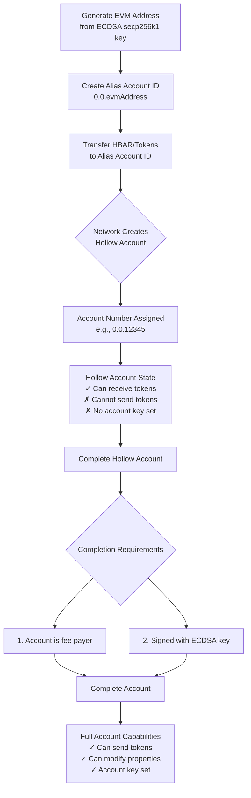

Auto account creation is a unique flow in which applications, like wallets and exchanges, can create free user "accounts" instantly, even without an internet connection. Applications can make these by generating an **account alias.** The alias account ID format used to specify the account alias in Hedera transactions comprises the shard ID, realm ID, and account alias `<shardNum>.<realmNum>.<alias>`. This is an alternative account identifier compared to the standard account number format `<shardId>.<realmId>.<accountNum>`.

The account alias can be either one of the supported types:

<Accordion title="Public Key">
The public key alias can be an ED25519 or ECDSA secp256k1 public key type.

**Example**

ECDSA secp256k1 Public Key:
`02d588ec1000770949ab77516c77ee729774de1c8fe058cab6d64f1b12ffc8ff07`

DER Encoded ECDSA secp256k1 Public Key Alias:
`302d300706052b8104000a03220002d588ec1000770949ab77516c77ee729774de1c8fe058cab6d64f1b12ffc8ff07`

ECDSA secp256k1 Public Key Alias Account ID:
`0.0.302d300706052b8104000a03220002d588ec1000770949ab77516c77ee729774de1c8fe058cab6d64f1b12ffc8ff07`


EDDSA ED25519 Public Key:
`1a5a62bb9f35990d3fea1a5bb7ef6f1df0a297697adef1e04510c9d4ecc5db3f`

DER Encoded EDDSA ED25519 Public Key Alias:
`302a300506032b65700321001a5a62bb9f35990d3fea1a5bb7ef6f1df0a297697adef1e04510c9d4ecc5db3f`

EDDSA ED25519 Public Key Alias Account ID:
`0.0.302a300506032b65700321001a5a62bb9f35990d3fea1a5bb7ef6f1df0a297697adef1e04510c9d4ecc5db3f`
</Accordion>

<Accordion title="EVM Address">
The EVM address alias is created by using the rightmost 20 bytes of the 32 byte `Keccak-256` hash of an `ECDSA secp256k1` public key. This calculation is in the manner described by the [Ethereum Yellow Paper](https://ethereum.github.io/yellowpaper/paper.pdf). The EVM address is not equivalent to the ECDSA public key.

The acceptable format for Hedera transactions is the EVM Address Alias Account ID. The acceptable format for Ethereum public addresses to denote an account address is the hex encoded public address.

**Example**

EVM Address: `b794f5ea0ba39494ce839613fffba74279579268`

HEX Encoded EVM Address: `0xb794f5ea0ba39494ce839613fffba74279579268`

EVM Address Alias Account ID: `0.0.b794f5ea0ba39494ce839613fffba74279579268`
</Accordion>

The `<shardNum>.<realmNum>.<alias>` format is only acceptable when specified in the `TransferTransaction`, `AccountInfoQuery`, and `AccountBalanceQuery` transaction types. If this format is used to specify an account in any other transaction type, the transaction will not succeed.

Reference Hedera Improvement Proposal: [HIP-583](https://hips.hedera.com/hip/hip-583)

## **Auto Account Creation Flow**

### **1. Create an account alias**

Create an account alias and convert it to the alias account ID format. The alias account ID format requires appending the shard number and realm numbers to the account alias. This form of account is purely a local account, i.e., not registered with the Hedera network.

### **2. Deposit tokens to the account alias account ID**

Once the alias Account ID exists, create a **TransferTransaction** that sends HBAR or HTS tokens to that alias. Sending tokens triggers auto account creation on the network, and the first token transferred is automatically associated with the new account.

When the transfer executes, the network:

* Creates a **child** account-creation transaction just before the transfer
* Assigns a new account number and stores the alias on the account
* Sets the memo to indicate an auto-created account
* Sets the account key if the alias is a public key, or leaves the account **hollow** if the alias is an EVM address

The **parent** transaction is the token transfer. The **child** is the account creation. They share a transaction ID; the child uses the same ID with a nonce increment. To fetch the new account ID, query the child record or request the parent record with child records included.

The **payer** of the transfer covers both the token transfer fee and the account creation fee.

<Info>
#### **Note**

The account-creation child transaction is timestamped just before the transfer (a minimal offset).\
Parent and child share the same Transaction ID; the child uses the same ID with a nonce increment.\
Fees for both the account creation and the transfer are charged **in tinybars** to the payer of the parent transfer.\
To retrieve the new Account ID, either request the parent record with child records included or query the child record directly by incrementing the nonce.
</Info>

### **3. Get the new account number**

You can obtain the new account number in any of the following ways:

* Request the parent transaction record or receipt and set the child transaction record boolean flag equal to true.
* Request the transaction receipt or record of the account create transaction by using the transaction ID of the parent transfer transaction and incrementing the nonce value from 0 to 1.
* Specify the account alias account ID in an `AccountInfoQuery` transaction request. The response will return the account's account number account ID.
* Inspect the parent transfer transaction record transfer list for the account with a transfer equal to the token transfer value.

## Auto Account Creation with an EVM Address

When the alias is an EVM address, the network creates a **hollow account**. A hollow account has an account number and alias but no key. It can receive tokens, but it cannot send tokens or modify account properties until it is a complete account.

### Hollow Account Creation Flow



<Warning>
#### Key differences: hollow vs complete accounts

**Hollow Account:**
- Has an account number and EVM address alias
- **No account key** is set on the account
- Can **only receive** HBAR and tokens
- **Cannot initiate** transactions or transfers
- **Cannot modify** account properties
- Created automatically when tokens are sent to an EVM address alias

**Complete Account:**
- Has an account number, alias, **and account key**
- Can **send and receive** HBAR and tokens
- Can **initiate** any transaction type
- Can **modify** account properties
- Created by making the hollow account the fee payer and signing with the matching ECDSA key
</Warning>

### Hollow vs Complete Account Capabilities

| Operation | Hollow Account | Complete Account |
|-----------|----------------|------------------|
| Receive HBAR | ✅ Yes | ✅ Yes |
| Receive HTS tokens | ✅ Yes | ✅ Yes |
| Send HBAR | ❌ No | ✅ Yes |
| Send HTS tokens | ❌ No | ✅ Yes |
| Initiate transfers | ❌ No | ✅ Yes |
| Update account properties | ❌ No | ✅ Yes |
| Create smart contracts | ❌ No | ✅ Yes |
| Sign transactions | ❌ No | ✅ Yes |
| Act as transaction fee payer | ❌ No (except completion) | ✅ Yes |
| Has account key set | ❌ No | ✅ Yes |
| Query account info | ✅ Yes | ✅ Yes |
| Query account balance | ✅ Yes | ✅ Yes |

## Complete a Hollow Account

<Note>
**Important:** Completing a hollow account is required before you can send tokens or perform any account operations beyond receiving funds.
</Note>

To complete a hollow account, you must submit a Hedera transaction that satisfies **both** requirements:

1. The hollow account must be the **transaction fee payer**
2. The transaction must be signed with the **ECDSA private key** that corresponds to the EVM address

If either condition is missing, the transaction will be rejected with an error. After successful completion, the account behaves like a regular Hedera account with full capabilities.

### Step-by-step: Complete using HAPI SDKs

<Steps>
<Step title="Obtain the hollow account ID">
After creating the hollow account via token transfer, retrieve the account number using one of these methods:
- Query the parent transaction record with child records
- Use `AccountInfoQuery` with the alias account ID
- Check the transfer list in the transaction record

```javascript
// Query account info using alias
const accountInfo = await new AccountInfoQuery()
    .setAccountId(AccountId.fromEvmAddress(0, 0, evmAddress))
    .execute(client);

const hollowAccountId = accountInfo.accountId;
console.log(`Hollow account ID: ${hollowAccountId}`);
```
</Step>

<Step title="Create a transaction with the hollow account as payer">
Build any transaction (typically a small HBAR transfer) and explicitly set the hollow account as the transaction fee payer.

```javascript
// JavaScript SDK example
const transaction = new TransferTransaction()
    .addHbarTransfer(hollowAccountId, Hbar.fromTinybars(-1))
    .addHbarTransfer(recipientId, Hbar.fromTinybars(1))
    .setTransactionId(TransactionId.generate(hollowAccountId))
    .freezeWith(client);
```

```java
// Java SDK example
TransferTransaction transaction = new TransferTransaction()
    .addHbarTransfer(hollowAccountId, Hbar.fromTinybars(-1))
    .addHbarTransfer(recipientId, Hbar.fromTinybars(1))
    .setTransactionId(TransactionId.generate(hollowAccountId))
    .freezeWith(client);
```

```go
// Go SDK example
transaction, err := hedera.NewTransferTransaction().
    AddHbarTransfer(hollowAccountId, hedera.HbarFromTinybar(-1)).
    AddHbarTransfer(recipientId, hedera.HbarFromTinybar(1)).
    SetTransactionID(hedera.TransactionIDGenerate(hollowAccountId)).
    FreezeWith(client)
```
</Step>

<Step title="Sign with the ECDSA private key">
Sign the transaction with the ECDSA secp256k1 private key that corresponds to the EVM address used to create the hollow account.

```javascript
// JavaScript SDK example
const signedTransaction = await transaction.sign(ecdsaPrivateKey);
```

```java
// Java SDK example
transaction.sign(ecdsaPrivateKey);
```

```go
// Go SDK example
transaction.Sign(ecdsaPrivateKey)
```
</Step>

<Step title="Execute the transaction">
Submit the signed transaction to the network. Upon successful execution, the hollow account becomes a complete account.

```javascript
// JavaScript SDK example
const response = await signedTransaction.execute(client);
const receipt = await response.getReceipt(client);

console.log(`Account completion status: ${receipt.status}`);
```

```java
// Java SDK example
TransactionResponse response = transaction.execute(client);
TransactionReceipt receipt = response.getReceipt(client);

System.out.println("Account completion status: " + receipt.status);
```

```go
// Go SDK example
response, err := transaction.Execute(client)
receipt, err := response.GetReceipt(client)

fmt.Printf("Account completion status: %v\n", receipt.Status)
```
</Step>

<Step title="Verify account completion">
Query the account to confirm it now has a key set and full capabilities.

```javascript
// Verify the account is now complete
const updatedAccountInfo = await new AccountInfoQuery()
    .setAccountId(hollowAccountId)
    .execute(client);

console.log(`Account key: ${updatedAccountInfo.key}`);
console.log(`Account is complete: ${updatedAccountInfo.key !== null}`);
```
</Step>
</Steps>

### Step-by-step: Complete using EVM wallets

<Steps>
<Step title="Import the account into an EVM wallet">
Use the ECDSA private key to import the account into MetaMask, Rainbow, or another EVM-compatible wallet. The wallet will derive the EVM address from the private key.
</Step>

<Step title="Configure the wallet for Hedera">
Add the Hedera network to your wallet:
- **Network Name:** Hedera Mainnet (or Testnet)
- **RPC URL:** `https://mainnet.hashio.io/api` (or testnet equivalent)
- **Chain ID:** 295 (mainnet) or 296 (testnet)
- **Currency Symbol:** HBAR
</Step>

<Step title="Send any transaction from the wallet">
Initiate any transaction from the wallet (e.g., send HBAR to another address). The EVM wallet automatically:
- Sets the hollow account as the transaction fee payer
- Signs the transaction with the ECDSA private key
- Submits the transaction via JSON-RPC relay

No additional configuration is needed—the account completes automatically on the first transaction.
</Step>

<Step title="Verify completion">
After the transaction confirms, the hollow account is now a complete account with full capabilities. You can verify by checking the account has a key set using an explorer or `AccountInfoQuery`.
</Step>
</Steps>

<Tip>
**Best practice:** Use a small HBAR transfer (1 tinybar) as the completion transaction to minimize costs while testing.
</Tip>

### Common pitfalls and errors

<AccordionGroup>
<Accordion title="Error: INVALID_SIGNATURE - Transaction not signed with correct key">
**Cause:** The transaction was not signed with the ECDSA private key that corresponds to the EVM address used to create the hollow account.

**Solution:** Verify you're using the correct private key. The EVM address must match the rightmost 20 bytes of the Keccak-256 hash of the public key derived from your private key.

```javascript
// Verify your EVM address matches
const publicKey = ecdsaPrivateKey.publicKey;
const evmAddress = publicKey.toEvmAddress();
console.log(`Expected EVM address: ${evmAddress}`);
```
</Accordion>

<Accordion title="Error: INVALID_ACCOUNT_ID - Account does not exist">
**Cause:** The hollow account was not created yet, or you're using the wrong account ID format.

**Solution:** Ensure you've completed the token transfer step to create the hollow account first. Use `AccountInfoQuery` with the alias to get the account number.

```javascript
// First create the hollow account
const transferTx = await new TransferTransaction()
    .addHbarTransfer(senderAccountId, Hbar.from(-10))
    .addHbarTransfer(AccountId.fromEvmAddress(0, 0, evmAddress), Hbar.from(10))
    .execute(client);

await transferTx.getReceipt(client);

// Then query for the account ID
const accountInfo = await new AccountInfoQuery()
    .setAccountId(AccountId.fromEvmAddress(0, 0, evmAddress))
    .execute(client);
```
</Accordion>

<Accordion title="Error: INSUFFICIENT_PAYER_BALANCE - Not enough HBAR for fees">
**Cause:** The hollow account doesn't have enough HBAR to pay for the completion transaction fees.

**Solution:** Transfer more HBAR to the hollow account before attempting completion. Ensure at least 0.05 HBAR for transaction fees.

```javascript
// Transfer sufficient HBAR first
await new TransferTransaction()
    .addHbarTransfer(fundingAccountId, Hbar.from(-1))
    .addHbarTransfer(hollowAccountId, Hbar.from(1))
    .execute(client);
```
</Accordion>

<Accordion title="Error: INVALID_TRANSACTION_ID - Transaction ID payer mismatch">
**Cause:** The transaction ID was not generated with the hollow account as the payer.

**Solution:** Explicitly set the transaction ID using the hollow account.

```javascript
// Correct way to set transaction ID
const transaction = new TransferTransaction()
    .addHbarTransfer(hollowAccountId, Hbar.fromTinybars(-1))
    .addHbarTransfer(recipientId, Hbar.fromTinybars(1))
    .setTransactionId(TransactionId.generate(hollowAccountId)) // Must use hollow account
    .freezeWith(client);
```
</Accordion>

<Accordion title="Account still hollow after transaction">
**Cause:** Either the hollow account was not the fee payer, or the transaction was not signed with the correct ECDSA key (or both).

**Solution:** Verify both requirements are met:
1. Transaction ID must be generated with the hollow account
2. Transaction must be signed with the matching ECDSA private key

```javascript
// Complete example with both requirements
const transaction = new TransferTransaction()
    .addHbarTransfer(hollowAccountId, Hbar.fromTinybars(-1))
    .addHbarTransfer(recipientId, Hbar.fromTinybars(1))
    .setTransactionId(TransactionId.generate(hollowAccountId)) // Requirement 1
    .freezeWith(client);

const signedTx = await transaction.sign(ecdsaPrivateKey); // Requirement 2
await signedTx.execute(client);
```
</Accordion>

<Accordion title="Using wrong key type (ED25519 instead of ECDSA)">
**Cause:** Hollow accounts created from EVM addresses require ECDSA secp256k1 keys, not ED25519 keys.

**Solution:** Ensure you're using an ECDSA secp256k1 private key, not an ED25519 key.

```javascript
// Correct: ECDSA key
const ecdsaKey = PrivateKey.generateECDSA();

// Incorrect: ED25519 key (will not work for hollow accounts)
const ed25519Key = PrivateKey.generateED25519();
```
</Accordion>
</AccordionGroup>

### Frequently asked questions

<AccordionGroup>
<Accordion title="When does an account become hollow vs complete?">
An account becomes **hollow** when:
- It's created via auto account creation using an **EVM address alias**
- Tokens are transferred to the EVM address alias for the first time
- The network creates the account without setting an account key

An account becomes **complete** when:
- It's created via auto account creation using a **public key alias** (ED25519 or ECDSA)
- A hollow account is completed by acting as fee payer and signing with the matching ECDSA key
- It's created using the traditional `AccountCreateTransaction`

**Key distinction:** EVM address aliases → hollow accounts. Public key aliases → complete accounts.
</Accordion>

<Accordion title="Can I complete a hollow account multiple times?">
No. Once a hollow account is completed, it becomes a regular complete account permanently. The completion process is one-way and cannot be reversed. Subsequent transactions do not need to repeat the completion process.
</Accordion>

<Accordion title="What happens if I lose the private key for a hollow account?">
If you lose the ECDSA private key before completing the hollow account, the account becomes **permanently inaccessible**. The funds in the hollow account cannot be recovered or transferred because:
- The account has no key set (it's hollow)
- Only the matching ECDSA private key can complete the account
- Without completion, the account cannot initiate any transactions

**Best practice:** Securely back up your private keys immediately after generating them.
</Accordion>

<Accordion title="Can I use a hollow account with smart contracts?">
**Receiving funds:** Yes, a hollow account can receive HBAR and tokens from smart contracts.

**Interacting with contracts:** No, a hollow account cannot call smart contract functions or deploy contracts because it cannot initiate transactions. You must complete the hollow account first to interact with smart contracts.
</Accordion>

<Accordion title="Do I need to complete a hollow account to receive tokens?">
No. Hollow accounts can receive HBAR and HTS tokens without being completed. Completion is only required when you want to:
- Send or transfer tokens out of the account
- Modify account properties
- Initiate any transaction where the account is the fee payer
</Accordion>

<Accordion title="Can I complete a hollow account using an ED25519 key?">
No. Hollow accounts are created from EVM addresses, which are derived from ECDSA secp256k1 keys. You must use the ECDSA secp256k1 private key that corresponds to the EVM address. ED25519 keys are not compatible with EVM addresses and cannot complete hollow accounts.
</Accordion>

<Accordion title="How much HBAR do I need to complete a hollow account?">
You need enough HBAR in the hollow account to cover the transaction fee for the completion transaction. Typically, 0.05-0.1 HBAR is sufficient. The exact fee depends on network conditions and the transaction type used for completion.

**Recommendation:** Transfer at least 0.1 HBAR to the hollow account before attempting completion.
</Accordion>

<Accordion title="Can I query a hollow account's balance and info?">
Yes. Both `AccountBalanceQuery` and `AccountInfoQuery` work with hollow accounts. You can:
- Check the account balance
- View the account's EVM address alias
- See the account number
- Confirm the account has no key set (indicating it's hollow)

```javascript
const accountInfo = await new AccountInfoQuery()
    .setAccountId(hollowAccountId)
    .execute(client);

console.log(`Balance: ${accountInfo.balance}`);
console.log(`Key: ${accountInfo.key}`); // null for hollow accounts
console.log(`EVM Address: ${accountInfo.contractAccountId}`);
```
</Accordion>

<Accordion title="What's the difference between account alias and account number?">
- **Account Number:** The permanent numeric identifier assigned by the network (e.g., `0.0.12345`)
- **Account Alias:** An alternative identifier that can be a public key or EVM address (e.g., `0.0.b794f5ea0ba39494ce839613fffba74279579268`)

Both refer to the same account. The alias is stored on the account and can be used interchangeably with the account number in supported transaction types (`TransferTransaction`, `AccountInfoQuery`, `AccountBalanceQuery`).
</Accordion>

<Accordion title="Can I create multiple hollow accounts with the same EVM address?">
No. Each EVM address can only be associated with one account on the Hedera network. If you attempt to transfer tokens to an EVM address alias that already has an associated account, the transfer will go to the existing account rather than creating a new one.
</Accordion>
</AccordionGroup>

## **Automatic Token Associations for Completed Accounts**

Once a hollow account has been converted into a complete account by acting as the payer for a transaction and signing with its ECDSA private key, it inherits the default automatic association settings. Specifically, the account's `maxAutoAssociations` property defaults to `–1`, enabling unlimited automatic token associations. This means that any subsequent HTS tokens transferred to the completed account will be automatically associated, and the recipient does not need to manually associate with each token. This behavior is part of frictionless airdrops ([HIP‑904](https://hips.hedera.com/hip/hip-904)) and differs from earlier network versions where auto‑association for new tokens was not available.

## Examples

<Accordion title="Auto-create an account using a public key alias">
- [Java](https://github.com/hiero-ledger/hiero-sdk-java/blob/main/examples/src/main/java/com/hedera/hashgraph/sdk/examples/AccountAliasExample.java)
- [JavaScript](https://github.com/hiero-ledger/hiero-sdk-js/blob/main/examples/account-alias.js)
- [Go](https://github.com/hiero-ledger/hiero-sdk-go/blob/main/examples/alias_id_example/main.go)
</Accordion>

<Accordion title="Auto-create an account using an EVM address (public address) alias">
- [Java](https://github.com/hiero-ledger/hiero-sdk-java/blob/main/examples/src/main/java/com/hedera/hashgraph/sdk/examples/AutoCreateAccountTransferTransactionExample.java)
- [JavaScript](https://github.com/hiero-ledger/hiero-sdk-js/blob/main/examples/transfer-using-evm-address.js)
- [Go](https://github.com/hiero-ledger/hiero-sdk-go/blob/main/examples/account_create_token_transfer/main.go)
</Accordion>
