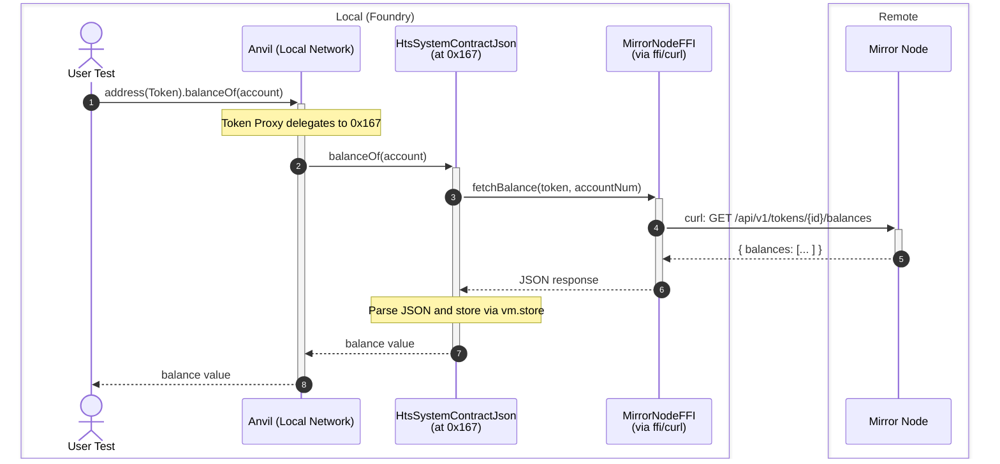
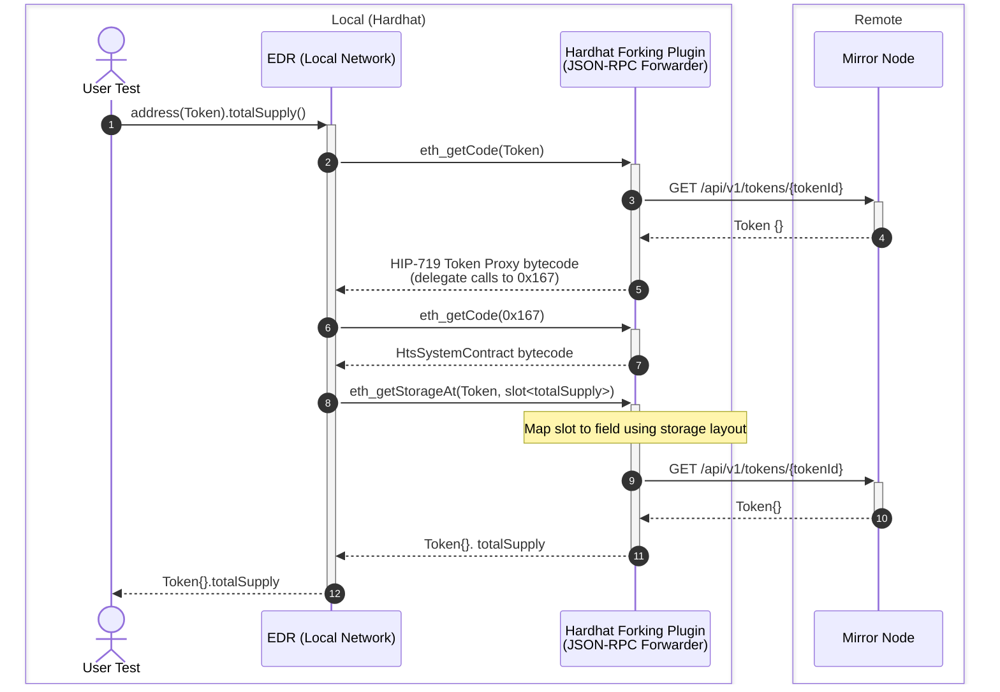

This guide explains how fork testing works on Hedera, how it differs from traditional EVM chains, and how the [hedera-forking](https://github.com/hashgraph/hedera-forking) library enables local development with Hedera System Contracts.

---

## What is Fork Testing?

**Fork Testing** (also known as **Fixtures**) is an Ethereum Development Environment feature that optimizes test execution for smart contracts. It enables:

- **Snapshotting blockchain state** - Avoiding recreation of the entire blockchain state for each test
- **Using remote state locally** - Any modifications only affect the local (forked) network
- **No private key requirements** - Test against remote network state without managing keys
- **Debugging tools** - Use `console.log` and other debugging features during testing

Popular Ethereum development environments that support fork testing include:

- [Foundry](https://book.getfoundry.sh/forge/fork-testing) (using Anvil)
- [Hardhat](https://hardhat.org/hardhat-network/docs/overview#mainnet-forking) (using EDR/EthereumJS)

---

## Why is Hedera Different?

### Standard EVM Contracts Work Out-of-the-Box

Fork testing works seamlessly for standard EVM smart contracts that don't involve Hedera-specific services. The local test networks provided by development environments are replicas of the Ethereum network.

### Hedera System Contracts Require Emulation

Fork testing does not work out-of-the-box for contracts that use Hedera-specific services like:

- **Hedera Token Service (HTS)** at address `0x167`
- **Exchange Rate** at address `0x168`
- **PRNG** at address `0x169`
- **Hedera Account Service** at address `0x16a`

This is because when the development environment tries to fetch the code at these addresses, the JSON-RPC Relay returns `0xfe` (invalid opcode):

```console
$ cast code --rpc-url https://mainnet.hashio.io/api 0x0000000000000000000000000000000000000167
0xfe
```

This leads to the error `EvmError: InvalidFEOpcode` when running tests.

---

## How Hedera Forking Works

The [hedera-forking](https://github.com/hashgraph/hedera-forking) project provides an emulation layer for Hedera System Contracts written in Solidity. Since it's written in Solidity, it can be executed in any development network environment.

### Architecture Overview

The project consists of two main components:

1. **Solidity Contracts** - Provide HTS emulation designed for forked networks
2. **JS Package** - Hooks into JSON-RPC layer to fetch appropriate data when HTS or Hedera Tokens are invoked (used by Hardhat)

Both the Foundry library and the Hardhat plugin use the main `HtsSystemContract` implementation. This contract provides the behavior of HTS, but it is state agnostic - meaning the HTS and token state must be provided elsewhere.

**Given Foundry and Hardhat provide different capabilities, they differ significantly in how the state is provided to HTS.**

---

## How Token State is Retrieved

<Info>
  Foundry and Hardhat use different mechanisms to retrieve token state from the
  Mirror Node. Understanding these differences is important for troubleshooting
  and optimizing your fork testing workflow.
</Info>

### Foundry Library Approach

The Foundry library uses a proactive prefetch approach where token state is fetched within Solidity contracts before it's needed.

**Key Components:**

- `HtsSystemContractJson` - Extends `HtsSystemContract` with JSON data source support
- `MirrorNodeFFI` - Fetches data from Mirror Node using Foundry's `ffi` cheatcode

**How it works:**

1. When your test calls `Hsc.htsSetup()`, the library deploys `HtsSystemContractJson` at address `0x167`
2. When you access token state (e.g., `balanceOf`), `HtsSystemContractJson` overrides the slot access
3. The contract calls `MirrorNodeFFI` which uses `ffi` to execute `curl` (or PowerShell on Windows) to fetch data from the Mirror Node
4. The fetched data is written to storage using `vm.store` cheatcode (not `sstore`) to avoid `StateChangeDuringStaticCall` errors
5. The data is then returned to your test



**Why FFI is Required:**

- Foundry does not allow creating a JSON-RPC forwarder like Hardhat
- However, Foundry allows hooking into internal contract calls via cheatcodes
- The `ffi` cheatcode enables executing external commands (like `curl`) from Solidity

### Hardhat Plugin Approach

The Hardhat plugin uses a reactive interception approach where a Worker thread intercepts JSON-RPC calls made by Hardhat.

**Key Components:**

- **JSON-RPC Forwarder** - A Worker thread that intercepts `eth_getCode` and `eth_getStorageAt` calls
- **MirrorNodeClient** (JavaScript) - Fetches data from Mirror Node using the `fetch` API

**How it works:**

1. When your test runs, Hardhat makes JSON-RPC calls to fetch remote state
2. The Hardhat plugin's Worker intercepts `eth_getCode` and `eth_getStorageAt` calls
3. For `eth_getCode(0x167)`: Returns the compiled `HtsSystemContract` bytecode
4. For `eth_getCode(tokenAddress)`: Returns the HIP-719 Token Proxy bytecode
5. For `eth_getStorageAt(token, slot)`: Uses the storage layout to map the slot to a field, then fetches the value from Mirror Node
6. The fetched data is returned to Hardhat's local network



**Why a Worker Thread is Required:**

- Hardhat does not allow hooking into internal contract calls (see [issue #56](https://github.com/hashgraph/hedera-forking/issues/56))
- The plugin must intercept at the JSON-RPC level before Hardhat processes the requests
- The Worker thread runs asynchronously to handle the interception

### Comparison: Foundry vs Hardhat Approaches

| Aspect             | Foundry Library                        | Hardhat Plugin                          |
| ------------------ | -------------------------------------- | --------------------------------------- |
| **State Fetching** | Proactive (prefetch in Solidity)       | Reactive (intercept JSON-RPC)           |
| **Data Fetcher**   | `MirrorNodeFFI` (Solidity + curl)      | `MirrorNodeClient` (JavaScript + fetch) |
| **Hook Point**     | Internal contract calls via cheatcodes | JSON-RPC layer via Worker thread        |
| **Requirement**    | `ffi = true` in foundry. toml          | `chainId` and `workerPort` in config    |
| **OS Dependency**  | curl (Unix) or PowerShell (Windows)    | Node.js fetch API                       |
| **Storage Writes** | `vm.store` cheatcode                   | Returned via JSON-RPC response          |

---

## HTS Supported Methods

The emulation layer supports a subset of HTS functionality. Here's what's available:

### Fungible Tokens (ERC-20 Interface)

| Function                                  | Description                             |
| ----------------------------------------- | --------------------------------------- |
| `name()`                                  | Returns the name of the token           |
| `symbol()`                                | Returns the symbol of the token         |
| `decimals()`                              | Returns the decimal places of the token |
| `totalSupply()`                           | Returns the total supply of tokens      |
| `balanceOf(address)`                      | Returns the balance of an account       |
| `transfer(address, uint256)`              | Transfers tokens to a recipient         |
| `transferFrom(address, address, uint256)` | Transfers tokens on behalf of an owner  |
| `approve(address, uint256)`               | Approves a spender to transfer tokens   |
| `allowance(address, address)`             | Returns the remaining allowance         |

### Non-Fungible Tokens (ERC-721 Interface)

| Function                                  | Description                         |
| ----------------------------------------- | ----------------------------------- |
| `name()`                                  | Returns the token collection name   |
| `symbol()`                                | Returns the token collection symbol |
| `totalSupply()`                           | Returns the total amount of tokens  |
| `balanceOf(address)`                      | Returns the number of tokens owned  |
| `ownerOf(uint256)`                        | Returns the owner of a token        |
| `tokenURI(uint256)`                       | Returns the URI for a token         |
| `approve(address, uint256)`               | Approves a transfer                 |
| `getApproved(uint256)`                    | Returns the approved address        |
| `setApprovalForAll(address, bool)`        | Approves an operator                |
| `isApprovedForAll(address, address)`      | Checks operator approval            |
| `transferFrom(address, address, uint256)` | Transfers a token                   |

### Association Methods (IHRC719)

| Function         | Description                                    |
| ---------------- | ---------------------------------------------- |
| `associate()`    | Associates the calling account with the token  |
| `dissociate()`   | Dissociates the calling account from the token |
| `isAssociated()` | Checks if the calling account is associated    |

### HTS System Contract Methods (at `0x167`)

| Function                           | Status       |
| ---------------------------------- | ------------ |
| `createFungibleToken(...)`         | ✅ Supported |
| `createNonFungibleToken(...)`      | ✅ Supported |
| `mintToken(...)`                   | ✅ Supported |
| `burnToken(...)`                   | ✅ Supported |
| `getTokenInfo(...)`                | ✅ Supported |
| `getFungibleTokenInfo(...)`        | ✅ Supported |
| `getNonFungibleTokenInfo(...)`     | ✅ Supported |
| `transferToken(...)`               | ✅ Supported |
| `transferTokens(...)`              | ✅ Supported |
| `transferNFT(...)`                 | ✅ Supported |
| `transferNFTs(...)`                | ✅ Supported |
| `transferFrom(...)`                | ✅ Supported |
| `transferFromNFT(...)`             | ✅ Supported |
| `associateToken(...)`              | ✅ Supported |
| `associateTokens(...)`             | ✅ Supported |
| `dissociateToken(...)`             | ✅ Supported |
| `dissociateTokens(...)`            | ✅ Supported |
| `approve(...)`                     | ✅ Supported |
| `approveNFT(...)`                  | ✅ Supported |
| `allowance(...)`                   | ✅ Supported |
| `getApproved(...)`                 | ✅ Supported |
| `isApprovedForAll(...)`            | ✅ Supported |
| `setApprovalForAll(...)`           | ✅ Supported |
| `getTokenKey(...)`                 | ✅ Supported |
| `getTokenType(...)`                | ✅ Supported |
| `getTokenExpiryInfo(...)`          | ✅ Supported |
| `getTokenCustomFees(...)`          | ✅ Supported |
| `getTokenDefaultFreezeStatus(...)` | ✅ Supported |
| `getTokenDefaultKycStatus(...)`    | ✅ Supported |
| `isToken(...)`                     | ✅ Supported |

---

## Limitations and Important Notes

<Warning>
The HTS emulation contract **SHOULD ONLY** be used to ease development workflow when working with Hedera Tokens. The HTS emulation contract **DOES NOT** replicate Hedera Token Services fully.  Behavior might differ when switching from local development to a real Hedera network.

**Always test your contracts against a real Hedera network before launching your contracts.**

</Warning>

### Key Limitations

1. **Behavior differences** - Some edge cases may behave differently in emulation vs. the real Hedera network.

2. **Block number considerations** - When forking from a specific block, ensure your deployed contracts exist at that block number.

3. **Rate limiting** - When running many tests (especially fuzz tests), you may hit RPC rate limits. Consider lowering fuzz run counts.

4. **Storage layout constraints** - Solidity `mapping`s compute storage slots that are not reversible, which required special handling in the emulation layer.

5. **Foundry `ffi` requirement** - The Foundry library requires `ffi = true` which allows executing external commands. This is necessary for `curl` calls to the Mirror Node.

6. **Hardhat async limitations** - The Hardhat plugin requires manual configuration of `chainId` and `workerPort` because Hardhat plugin loading is synchronous.

---

## Development Framework Support

### Foundry

The Foundry library uses `ffi` (Foreign Function Interface) to fetch remote state from the Mirror Node using `curl` (or PowerShell on Windows).

**Key setup:**

- Enable `ffi = true` in `foundry.toml`
- Call `Hsc.htsSetup()` in your test setup

**How it fetches data:**

```solidity
import {Hsc} from "hedera-forking/Hsc.sol";

function setUp() public {
    Hsc.htsSetup(); // Deploys HtsSystemContractJson at 0x167
}
```

When you access token state, the library:

1. Intercepts the storage slot access
2. Uses `MirrorNodeFFI` to call `curl` via `ffi`
3. Parses the JSON response
4. Writes data using `vm.store` cheatcode

### Hardhat

The Hardhat plugin intercepts JSON-RPC calls (`eth_getCode` and `eth_getStorageAt`) to provide HTS emulation.

**Key setup:**

- Install `@hashgraph/system-contracts-forking`
- Import the plugin in `hardhat.config. js`
- Configure `chainId` and `workerPort` in forking config

**Configuration example:**

```javascript
require("@hashgraph/system-contracts-forking/plugin");

module.exports = {
  networks: {
    hardhat: {
      forking: {
        url: "https://mainnet.hashio.io/api",
        blockNumber: 70531900,
        chainId: 295, // Required:  295 (mainnet), 296 (testnet), 297 (previewnet)
        workerPort: 1235 // Required: Any free port
      }
    }
  }
};
```

---

## Common Errors and Solutions

### `EvmError:  InvalidFEOpcode`

**Cause:** Trying to execute System Contract methods without the emulation layer enabled.

**Solution:** Enable the Foundry library (`Hsc.htsSetup()`) or Hardhat plugin.

### `No known hardfork for execution`

**Cause:** Hardhat doesn't know the hardfork history for Hedera networks.

**Solution:** Use the Hardhat plugin which automatically sets up hardfork history.

### `Missing access list`

**Cause:** EIP-1559 transactions missing the `accessField` when using `blockNumber`.

**Solution:** The Hardhat plugin provides an empty access list automatically.

### `keyExistsJson not found`

**Cause:** Outdated `forge-std` dependency.

**Solution:** Update with `forge update lib/forge-std`

### `StateChangeDuringStaticCall` (Foundry)

**Cause:** Attempting to write storage during a `view` call.

**Solution:** This is handled internally by the library using `vm.store` instead of `sstore`.

---

## Learn How to Fork the Hedera Network for Local Testing

<Card
  title="How to Fork the Hedera Network with Hardhat - Basic ERC-20 Tutorial"
  href="/hedera/tutorials/smart-contracts/how-to-fork-the-hedera-network-with-hardhat-basic-erc20"
/>
<Card
  title="How to Fork the Hedera Network with Hardhat - Advanced HTS Tutorial"
  href="/hedera/tutorials/smart-contracts/how-to-fork-the-hedera-network-with-hardhat-advanced-hts"
/>
<Card
  title="How to Fork the Hedera Network with Foundry - Basic ERC-20 Tutorial"
  href="/hedera/tutorials/smart-contracts/foundry/how-to-fork-the-hedera-network-with-foundry-basic-erc20"
/>

---

## Further Resources

- [hedera-forking GitHub Repository](https://github.com/hashgraph/hedera-forking)
- [Internals Documentation](https://github.com/hashgraph/hedera-forking/blob/main/INTERNALS.md)
- [FAQ](https://github.com/hashgraph/hedera-forking/blob/main/FAQ.md)
- [HIP-719: Token Proxy Contract](https://hips.hedera.com/hip/hip-719)
- [Foundry Fork Testing Documentation](https://book.getfoundry.sh/forge/fork-testing)
- [Hardhat Mainnet Forking Documentation](https://hardhat.org/hardhat-network/docs/overview#mainnet-forking)

<Columns cols={1}>
  <Card title="Writer: Kiran Pachhai, Developer Advocate" arrow>
    [GitHub](https://github.com/kpachhai) |
    [LinkedIn](https://www.linkedin.com/in/kiranpachhai/)
  </Card>
</Columns>
