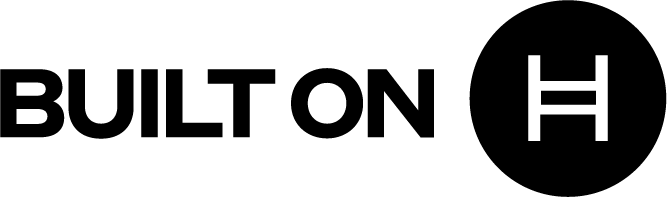

Incorporate official Hedera logos and iconography

The Decentralized on Hedera stamp is the official way to denote that your application uses the Hedera Hashgraph network. We think by using it it demonstrates to your users the trust that Hedera can provide to them.

For use on white or light backgrounds.

<Frame>

</Frame>

For use on black or dark backgrounds

<Frame>

</Frame>

For Hedera logo usage, details, and more view the complete [Hedera Brand page](https://hedera.com/brand).
