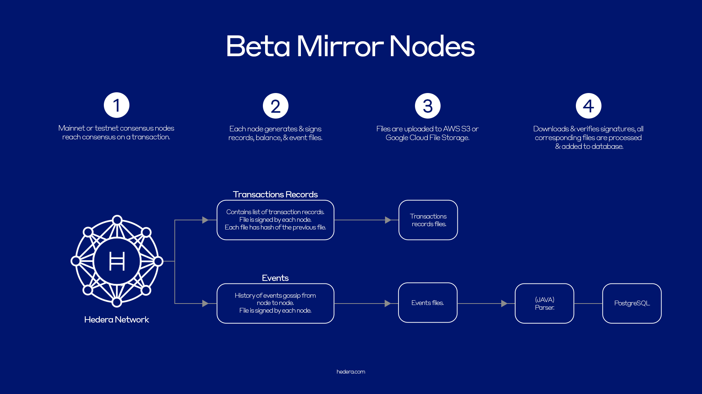

Mirror nodes provide a way to store and cost-effectively query historical data from the public ledger while minimizing the use of Hedera network resources. Mirror nodes support the Hedera network services currently available and can be used to retrieve the following information:

* Transactions and records
* Event files

## Understanding Mirror Nodes

Hedera Mirror Nodes receive information from Hedera network consensus nodes, either mainnet or testnet, and provide a more effective means to perform:

* Queries
* Analytics
* Audit support
* Monitoring

While mirror nodes receive information from the consensus nodes, they do not contribute to consensus themselves. The trust of Hedera is derived based on the consensus reached by the consensus nodes. That trust is transferred to the mirror nodes using signatures, chain of hashes, and state proofs.

To make the initial deployments easier, mirror nodes historically provided periodic files containing processed information (such as account balances or transaction records). However, starting from [Hedera release v0.42.0](https://github.com/hashgraph/hedera-services/releases/tag/v0.42.0), the generation and availability of account balance files by consensus nodes have been discontinued due to scalability challenges (see [HIP-794](https://hips.hedera.com/hip/hip-794)). Users needing balance information are now required to generate it from record files processed by mirror nodes.

The mirror node software reduces the processing burden by receiving pre-constructed files from the network, validating them, populating a database, and providing REST APIs.

Mirror nodes work by validating the signature files associated with record and event files (previously also balance files) from the consensus nodes that were uploaded to a cloud storage solution from the network.

As transactions reach consensus on the Hedera network, either mainnet or testnet, Hedera consensus nodes add the transaction and its associated records to a record file. A record file contains a series of ordered transactions and their associated records. After a given amount of time, a record file is closed and a new one is created. This process repeats as the network continues to receive transactions.

Once a record file is closed, the consensus nodes generate a signature file. The signature file contains a signature for the corresponding record file’s hash. Along with the signature file of the consensus node, the record file also contains the hash of the previous record file. The former record file can now be verified by matching the hash of the previous record file.

Hedera consensus nodes push new record files and signature files to the cloud storage provider – currently AWS S3 and Google File Storage are supported. Mirror nodes download these files, verify their signatures based on their hashes, and only then make them available to be processed.

### Smart Contract Synthetic Logs

Starting with [v0.79](/hedera/networks/release-notes/mirror-node#v0.79) of Hedera Mirror Node release, synthetic event logs for Hedera Token Service (HTS) token transactions have been introduced to mimic the behavior of smart contract tokens. Synthetic events are generated for transactions such as:

* `CryptoTransfer`
* `CryptoApproveAllowance`
* `CryptoDeleteAllowance`
* `TokenMint`
* `TokenWipe`
* `TokenBurn`

This feature enables developers to effectively monitor HTS token activities as if they were smart contract tokens. An example code implementation demonstrating using ethers.js to listen to synthetic events can be found [here](https://github.com/ed-marquez/hedera-example-hts-synthetic-events-sdk-ethers).

### REST API from Hedera

Hedera provides REST APIs to easily query a mirror node that is hosted by Hedera, removing the complexity of having to run your own. Check out the mirror node REST API docs below.

<Card
  title="Rest API"
  href="/hedera/sdks-and-apis/rest-api"
/>

### Run a Mirror Node

Anyone can run a Hedera Mirror Node by downloading and configuring the software on their computer. By running a mirror node, you are able to connect to the appropriate cloud storage and store account balance files, record files, and event files as described above. Please check out the below links on how to get started.

<Card
  title="Run Your Own Beta Mirror Node"
  href="/hedera/core-concepts/mirror-nodes/run-your-own-beta-mirror-node"
/>

<Card
  title="One Click Mirror Node Deployment"
  href="/hedera/core-concepts/mirror-nodes/one-click-mirror-node-deployment"
/>

## FAQ

<Accordion title="How is data stored in a Hedera Mirror Node? Is it a specific type of database, or does it use a unique data structure?">
Hedera Mirror Nodes use [PostgreSQL](/hedera/support-and-community/glossary#postgresql) databases to store the transaction and event data organized in a structure that mirrors the Hedera Network. Once the mirror node receives record files from Hedera Consensus nodes, the data is validated and loaded into the database.
</Accordion>

<Accordion title="How do I run my own Hedera Mirror Node? What are the hardware and software requirements?">
Setting up a Hedera Mirror Node involves both hardware and software components. The requirements can be found [here](/hedera/core-concepts/mirror-nodes/run-your-own-beta-mirror-node).

To run your mirror node, follow the steps in the "[Run Your Own Mirror Node](/hedera/core-concepts/mirror-nodes/run-your-own-beta-mirror-node)" guide.
</Accordion>

<Accordion title="Are there costs associated with running a mirror node?">
No, Hedera does not charge for running a mirror node. However, there are costs associated with purchasing the hardware, internet connection, and potential cloud service fees. The hardware and software requirements can be found [here](/hedera/core-concepts/mirror-nodes/run-your-own-beta-mirror-node).
</Accordion>

<Accordion title="How do I configure a mirror node and query data?">
You can configure your own Hedera Mirror Node by following the step-by-step instructions provided in the "[How to Configure a Mirror Node and Query Data](/hedera/tutorials/more-tutorials/how-to-configure-a-mirror-node-and-query-specific-data)" guide. The guide provides instructions on prerequisites, node setup, configuration, and querying the node. Additionally, you can find more details about retention and transaction and entity filtering in the guide.
</Accordion>

<Accordion title="How can I provide feedback or create an issue to log errors?">
To provide feedback or log errors, please refer to the [Contributing Guide](/hedera/support-and-community/contributing-guide) and submit an issue in the Hedera Docs [GitHub repository](https://github.com/hashgraph/hedera-json-rpc-relay/issues).
</Accordion>
