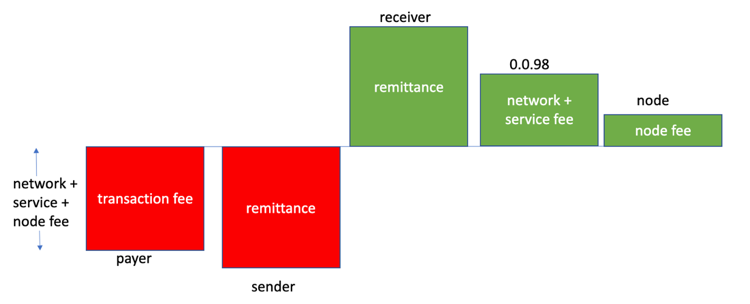
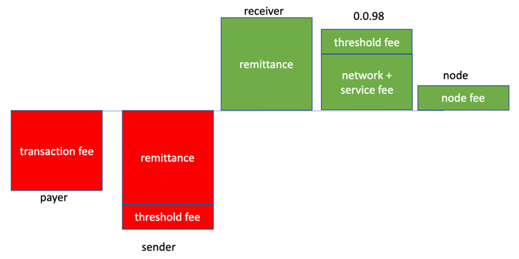
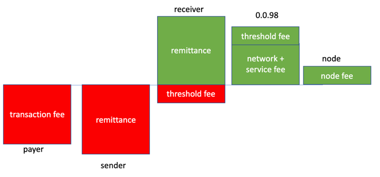
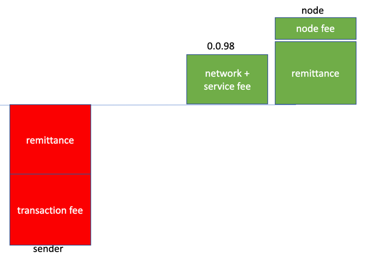

# Transaction Records

## Understanding Transaction Records – Remittances & Fees

Once a transaction has been successfully processed by the Hedera network into a consensus state or not, the network nodes create either a "record" or a "receipt," respectively, for that transaction, indicating its status and impact.

A key component of the information within a record for a transaction is how the transaction changed the balances of those Hedera accounts that were involved. An account’s balance can change due to a transaction either because of a fee (paid or received) or some other intentional transfer – which we refer to here as a ‘remittance’.

### Account Balances

Every transaction submitted to Hedera will cause the balances of a set of accounts to change – either because

1. The transaction directly directed specific balances to be changed, e.g. Alice sent 1000 hbars to Bob with a CryptoTransfer.
2. The transaction indirectly caused balances to change, e.g. execution of a ContractCall caused HBARs to be sent from the Smart Contract’s account to others.
3. Fees are paid for the processing of the transaction into a consensus state and the persistence of that changed state.
4. A fee is paid for the persistence of a ‘record’ for that transaction for a longer period of time than the default.

A transaction can cause a given account’s balance to change for any of the above reasons or, more generally, for a combination of the above reasons.

There are, in general, 5 types of accounts associated with a transaction:

1. Senders – the accounts from which HBARs are being sent
2. Receivers – the accounts to which HBARs are being sent
3. Payer – the account that pays the fees associated with the transaction.
4. Network – the Hedera account that receives the component of the fees that compensate the network for processing the transaction.
5. Node – the account of whichever node submits the transaction to the network for consensus

**Notes**

* For any transaction, the sum of transfers out of all accounts will always be equal to the sum of all transfers into all accounts.
* The payer, in general, is different than either the sender or receiver. Nevertheless, a typical case is that the sender will also be the payer.
* Not all transactions have a sender or receiver as there is no remittance aspect to the transaction, e.g. a FileCreate or ConsensusSubmitMessage transaction will have a fee but no associated remittance.
* A single CryptoTransfer can have multiple senders and multiple receivers.
* A remittance can be the number of HBARs a CryptoTransfer directs be moved, the amount of HBARs a CryptoCreate directs be funded into the new account, or the amount of HBARs in an account to be deleted, with those funds moved into another account.
* A remittance will need to be authorized by the owner of those HBARs.
* An account owner can specify thresholds for transfers in and out of that account. If a transaction causes an account’s threshold to be triggered, then the record for that transaction will persist for 25 hours and not the default 3 minutes.
* The account owner that specified the threshold will pay a threshold fee – distinct from the fee for the transaction itself - for that extra storage time.
* It is account 0.0.98 that receives the component of the transaction fee that compensates all the nodes for their work in processing the transaction into consensus
* 0.0.98 also collects any threshold record fees
* As of early February 2024, there are 31 nodes with account numbers in the range of 0.0.3-0.0.4698971.
* While accounts 0.0.98 and the node accounts are special with respect to receiving fees, they can also send & receive HBARs and, as such, could be the sender or receiver of a transaction.

### Scenarios

We explore scenarios below and how the HBARs flow between accounts for each.

#### Case 1 - Generic

In the most generic case, a sender is making a remittance to a receiver, and a separate account pays the associated fee. The size of the fee will depend on the nature of the transaction – uploading a large file will cost more than a simple crypto transfer.

The amount of that fee is split between account 0.0.98 (a special Hedera account that represents the network) and the specific node that submitted the transaction.

#### Case 2 - Fees only

Many transactions do not allow for an explicit remittance, for instance, a FileCreate or a ConsensusSubmitMessage. For such transactions, the only changes to account balances will be due to the fee for that transaction.

As before, the fee for the transaction is split between 0.0.98 and a node.

#### Case 3 - Sender account pays fees

It will often be the case that the fee for a CryptoTransfer sending remittance from a sender to a receiver is paid for by the sender. In this case, the balance for the sender will decrease by the sum of the remittance and the fee.

In principle, the receiver could pay the fee as well.

#### Case 4 - Sender account has a threshold that is crossed

Account owners can specify thresholds for their accounts so that any transfer in/out of the account that exceeds these thresholds will cause the created record to be persisted for 25 hours and not the default 3 minutes. The account that stipulated the threshold will pay a threshold fee for this prolonged storage of the record.

In this example, the threshold is specified on the sending account, and so it will be that account that pays this threshold fee. That account’s balance consequently decreases by the sum of the remittance and the threshold fee.

Account 98 receives the sum of the network, service, and also this threshold fee.

Not shown here but if it were also the case that the sender was paying the transaction fee (as above) then the balance of the sender’s account would decrease by the sum of the remittance, the transaction fee, and this threshold fee.

#### Case 5 - Receiver account has a threshold that is crossed

The receiving account can also have a threshold set that, if surpassed by the amount of HBARs being transferred into the account, will cause the record to be stored for 25 hours.

Threshold records can be particularly useful to receivers as a receiver may not be aware of the remittances sent to them (as they are not necessarily involved in the signing of the transaction, as is the case for the sender). The longer-lived threshold records allow an account owner to query on a daily basis for the records for any and all remittances they’ve received over the past 24 hours that they might not otherwise be aware of.

The receiving account will pay the associated threshold fee for this longer storage period of the record.

The net balance change of the receiving account will therefore be the remittance minus the threshold fee.

Account 98 receives the sum of the network, service, and the threshold fees.

The transaction fees are not impacted by the threshold fee being paid.

If the value of the remittance is less than the threshold fee, the transaction will fail.

#### Case 6 - Node account is receiver

Nodes may receive remittances like any other Hedera account.

As a specific example, clients compensate nodes for responding to a query by including within the query a CryptoTransfer that, when submitted to the network, will compensate that particular node with a suitable remittance.

In this scenario, the node account’s balance will increase by the sum of the node fee it receives for processing the CryptoTransfer plus the value of the actual remittance that pays the node for the query response.

### Transaction Records

After Hedera Mainnet nodes process a transaction into consensus state, the details are published to the outside world in a ‘transaction record’ that the nodes create and make available. Clients retrieve records and analyze the data within to verify the consequences of transactions, for instance the consensus timestamp that was assigned and how the associated account balances changed as a result of the transaction.

When retrieved from a mirror node and not the mainnet, the transaction that resulted in a given record will also be available. It is therefore this combined data structure that provides the richest set of information for analysing and differentiating between remittances and fees.

The flow of information is shown below:

A client that retrieves the pair of a transaction and its associated record may want to distinguish between remittances and fee components for the transaction - that is, what part of an account’s balance change was due to transaction fees, what part due to a threshold fee, and what part due to a remittance.

There is sufficient information in the combination of transaction and corresponding record to allow a client to unambiguously make such a distinction for each account.

A transaction record has a transfer list data structure that describes how HBARs moved between accounts as a result of the transaction.

In the R3 (the release prior to the update of February 10, 2020) version of the node software, there might be multiple transfers for each account involved in the transaction. For instance, there could be separate transfers indicating the 0.0.98 account receiving fees, which added up to the correct total fee.

Additionally, in R3

1. The determination of whether a threshold was exceeded for each account was made for each transfer. Consequently, a single account paying both a remittance and fees could pay for multiple threshold records if the threshold was set very low.
2. The order of the transfers in the R3 format was not predictable.

We have changed the record transfer list format in the R4 (the release of February 10, 2020) node software to address the above issues and to be more consistent and concise.

In the R4 release, the record transfer list shows, for all transaction types, only a single net transfer in or out for each relevant account.

The comparison of transfers in/out to an account’s thresholds is now made on that net transfer, and not on the constituent transfers that summed to the net. Consequently, any account will pay once for only a single threshold fee and not multiple times. This is cheaper for the user.

The change between R3 and R4 is shown below, for a representative transaction in which account 0.0.1002 is sending a remittance of 10,000 tinybars to account 0.0.1001 and both sender and receiver have thresholds of 1,000 tinybars set on their accounts.

As the remittance value exceeds these thresholds, both sender and receiver will pay a threshold fee.

**R3**

**R4**

In the R4 format, the record transfer list no longer has multiple transfers for the different accounts – each account has only a single transfer with a value that reflects the sum of the various transfers that impacted each account.

While the R4 format is more concise than the R3 format, some clients may want to determine the component transfers - that is to break out remittances, node fees, threshold fees, and other transaction fees. To facilitate this analysis, Hedera plans to add support to the mirror node REST API to allow a client to request either the default aggregated transfer list, or instead an itemized list of transfers (similar to the R3 format).
