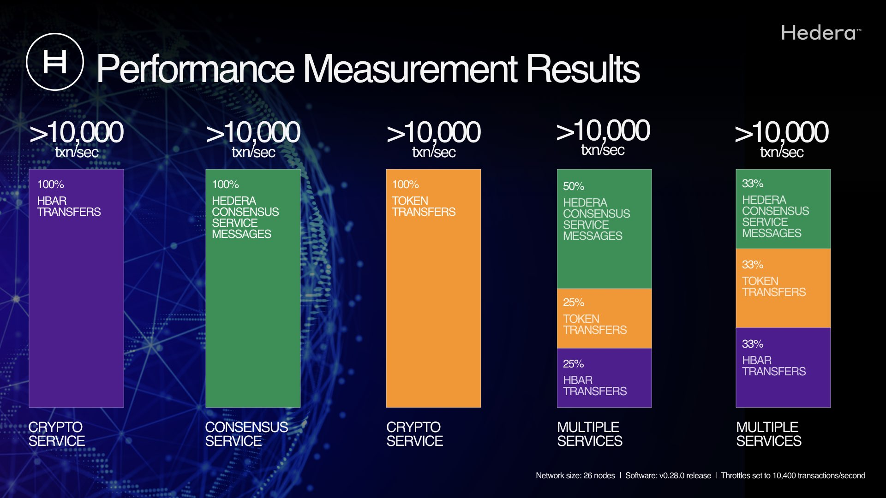

# Hedera Services

Visit the [Hedera status page](https://status.hedera.com/) for the latest versions supported on each network.

## Release v0.59


**MAINNET UPDATE SCHEDULED: MARCH 12, 2025**



**TESTNET UPDATE SCHEDULED: FEBRUARY 25, 2025**


### [Build 0.59.2](https://github.com/hiero-ledger/hiero-consensus-node/releases/tag/v0.59.2)

<details>

<summary><strong>What's Changed</strong></summary>

* chore: (0.59) Cherry-pick misc fixes by [@tinker-michaelj](https://github.com/tinker-michaelj) in [#18128](https://github.com/hiero-ledger/hiero-consensus-node/pull/18128)

**Full Changelog**: [v0.59.1...v0.59.2](https://github.com/hiero-ledger/hiero-consensus-node/compare/v0.59.1...v0.59.2)

</details>

### [Build 0.59.0](https://github.com/hashgraph/hedera-services/releases/tag/v0.59.0)

<details>

<summary><strong>What's Changed</strong></summary>

* refactor: 16436 Removed `MerkleRoot` interface. by [@imalygin](https://github.com/imalygin) in [#17130](https://github.com/hashgraph/hedera-services/pull/17130)
* fix: move and change value of Dockerfile environment variable by [@matteriben](https://github.com/matteriben) in [#16239](https://github.com/hashgraph/hedera-services/pull/16239)
* build: Roll hiero gradle conventions to version 0.1.4 by [@andrewb1269hg](https://github.com/andrewb1269hg) in [#17149](https://github.com/hashgraph/hedera-services/pull/17149)
* build(deps): bump actions/setup-java from 4.5.0 to 4.6.0 by [@dependabot](https://github.com/dependabot) in [#17113](https://github.com/hashgraph/hedera-services/pull/17113)
* build(deps): bump gradle/actions from 4.2.1 to 4.2.2 by [@dependabot](https://github.com/dependabot) in [#17111](https://github.com/hashgraph/hedera-services/pull/17111)
* chore: Update hedera-services to rename develop as main by [@rbarker-dev](https://github.com/rbarker-dev) in [#17091](https://github.com/hashgraph/hedera-services/pull/17091)
* chore: Update workrflow names to point to main instead of develop by [@rbarker-dev](https://github.com/rbarker-dev) in [#17158](https://github.com/hashgraph/hedera-services/pull/17158)
* ci: Update Check Integration/XTS Job State to include GH\_TOKEN by [@rbarker-dev](https://github.com/rbarker-dev) in [#17160](https://github.com/hashgraph/hedera-services/pull/17160)
* ci: add id\_token write permission to node-flow-deploy-release-artifact.yaml by [@rbarker-dev](https://github.com/rbarker-dev) in [#17161](https://github.com/hashgraph/hedera-services/pull/17161)
* feat: Support overwrites for interface bindings and endpoints by [@timo0](https://github.com/timo0) in [#17117](https://github.com/hashgraph/hedera-services/pull/17117)
* chore: Refactor hapi tests to use `hapiTest(...)` instead of `defaultHapiSpec(...)` (Part 3) by [@mhess-swl](https://github.com/mhess-swl) in [#16698](https://github.com/hashgraph/hedera-services/pull/16698)
* feat: consolidate hbar transfer list when decoding cryptoTransfer function by [@lukelee-sl](https://github.com/lukelee-sl) in [#17165](https://github.com/hashgraph/hedera-services/pull/17165)

**Full Changelog**: [v0.58.9...v0.59.0](https://github.com/hashgraph/hedera-services/compare/v0.58.9...v0.59.0)

</details>

## Release v0.58


**MAINNET UPDATE SCHEDULED: FEBRUARY 19, 2025**



**TESTNET UPDATE SCHEDULED: FEBRUARY 11, 2025**


This release introduces several new features, improvements, and bug fixes, including:

#### HIPs

* **HIP-423 Long-Term Scheduled Transactions**:  \
  Update to ScheduleSign throttles changed: The ScheduleSign transaction is now throttled like other transactions and can now be managed by the default throttling mechanism on the network.  ([#16958](https://github.com/hashgraph/hedera-services/issues/16958), [#16959](https://github.com/hashgraph/hedera-services/issues/16959)) This completes HIP-423.
* **HIP-755 authorizeSchedule(address)**\
  Adds functionality to the Hedera Schedule Service System contract so that a smart contract can sign a referenced scheduled transaction using its contract key, enabling automated execution of scheduled transactions directly from smart contracts. ([#16983](https://github.com/hiero-ledger/hiero-consensus-node/pull/16983)), the remaining outstanding features to complete HIP-755 will be provisioned in release .59.

#### Other Notable Changes

* Enabled mirror node to simulate contract calls:\
  The standalone transaction executor now supports custom Operations. Developers can use this feature to create and execute custom operations that are not part of the standard Hedera API.  ([#17354](https://github.com/hashgraph/hedera-services/issues/17354))\
  \

* **Enhancing Dynamic Address Book v2** NodeCreate and NodeDelete transaction signature requirements changed:&#x20;
  * The NodeCreate transaction now requires the admin key and one of the treasury account key, system admin key, or address book admin key to sign.&#x20;
    * The NodeDelete transaction is now a non-privileged transaction and requires one of the admin key, treasury account key, system admin key, or address book admin key to sign. ([#16900](https://github.com/hashgraph/hedera-services/issues/16900), [#17021](https://github.com/hashgraph/hedera-services/issues/17021), [#16990](https://github.com/hashgraph/hedera-services/issues/16990), [#17029](https://github.com/hashgraph/hedera-services/issues/17029))
* **Ensuring state changes are now in block streams**:\
  Refactored out-of-band state modifications:  All out-of-band state modifications have been refactored to be done in Schemas. ([#16843](https://github.com/hashgraph/hedera-services/issues/16843))
* Increased CryptoGetAccountBalance throttle:  The throttle for the CryptoGetAccountBalance query has been increased to the number of network nodes times 1,000,000 plus a buffer.  This change addresses an issue where the throttle was too low, leading to throttling errors.  ([#16850](https://github.com/hashgraph/hedera-services/issues/16850), [#16857](https://github.com/hashgraph/hedera-services/issues/16857))

### [Build 0.58.10](https://github.com/hiero-ledger/hiero-consensus-node/releases/tag/v0.58.10)

<details>

<summary><strong>What's Changed</strong></summary>

**Full Changelog**: [v0.58.9...v0.58.10](https://github.com/hiero-ledger/hiero-consensus-node/compare/v0.58.9...v0.58.10)

</details>

### [Build 0.58.9](https://github.com/hashgraph/hedera-services/releases/tag/v0.58.9)

<details>

<summary><strong>What's Changed</strong></summary>

* chore: Use weights from reclamped stakes in current address book by [@tinker-michaelj](https://github.com/tinker-michaelj) in [#17777](https://github.com/hashgraph/hedera-services/pull/17777)

**Full Changelog**: [v0.58.7...v0.58.9](https://github.com/hashgraph/hedera-services/compare/v0.58.7...v0.58.9)

</details>

### [Build 0.58.8](https://github.com/hashgraph/hedera-services/releases/tag/v0.58.8)

<details>

<summary><strong>What's Changed</strong></summary>

Re-tag of `v0.58.7` to trigger workflow

* chore: (0.58) Remove unwanted post-upgrade work by [@tinker-michaelj](https://github.com/tinker-michaelj) in [#17637](https://github.com/hashgraph/hedera-services/pull/17637)
* chore: 0.58-specific state migrations by [@tinker-michaelj](https://github.com/tinker-michaelj) in [#17690](https://github.com/hashgraph/hedera-services/pull/17690)

**ull Changelog**: [v0.58.6...v0.58.7](https://github.com/hashgraph/hedera-services/compare/v0.58.6...v0.58.7)

</details>

### [Build 0.58.7](https://github.com/hashgraph/hedera-services/releases/tag/v0.58.7)

<details>

<summary><strong>What's Changed</strong></summary>

* chore: (0.58) Remove unwanted post-upgrade work by [@tinker-michaelj](https://github.com/tinker-michaelj) in [#17637](https://github.com/hashgraph/hedera-services/pull/17637)
* chore: 0.58-specific state migrations by [@tinker-michaelj](https://github.com/tinker-michaelj) in [#17690](https://github.com/hashgraph/hedera-services/pull/17690)

**Full Changelog**: [v0.58.6...v0.58.7](https://github.com/hashgraph/hedera-services/compare/v0.58.6...v0.58.7)

</details>

### [Build 0.58.6](https://github.com/hashgraph/hedera-services/releases/tag/v0.58.6)

<details>

<summary><strong>What's Changed</strong></summary>

* chore: Reapply "FileService address book and node details" by [@mhess-swl](https://github.com/mhess-swl) in [#17543](https://github.com/hashgraph/hedera-services/pull/17543)

**Full Changelog**: [v0.58.5...v0.58.6](https://github.com/hashgraph/hedera-services/compare/v0.58.5...v0.58.6)

</details>

### [Build 0.58.5](https://github.com/hashgraph/hedera-services/releases/tag/v0.58.5)

<details>

<summary><strong>What's Changed</strong></summary>

* fix: 17283: Backport the fix for [#17218](https://github.com/hashgraph/hedera-services/issues/17218) to release 0.58 by [@artemananiev](https://github.com/artemananiev) in [#17296](https://github.com/hashgraph/hedera-services/pull/17296)
* chore: (0.58) Support custom `Operation`s in standalone executor by [@tinker-michaelj](https://github.com/tinker-michaelj) in [#17354](https://github.com/hashgraph/hedera-services/pull/17354)
* fix: retain override values on `ConfigProviderImpl.update()` ([#17424](https://github.com/hashgraph/hedera-services/pull/17424)) by [@tinker-michaelj](https://github.com/tinker-michaelj) in [#17430](https://github.com/hashgraph/hedera-services/pull/17430)
* fix: cherry-pick: FileService address book and node details should be updated at genesis by [@iwsimon](https://github.com/iwsimon) in [#17368](https://github.com/hashgraph/hedera-services/pull/17368)
* fix: 17467: Back out changes for 15448 from release 0.58 by [@artemananiev](https://github.com/artemananiev) in [#17473](https://github.com/hashgraph/hedera-services/pull/17473)
* fix: Revert "cherry-pick: FileService address book and node details" by [@mhess-swl](https://github.com/mhess-swl) in [#17539](https://github.com/hashgraph/hedera-services/pull/17539)

**Full Changelog**: [v0.58.3...v0.58.5](https://github.com/hashgraph/hedera-services/compare/v0.58.3...v0.58.5)

</details>

### [Build 0.58.3](https://github.com/hashgraph/hedera-services/releases/tag/v0.58.3)

<details>

<summary><strong>What's Changed</strong></summary>

* feat: cherry-pick: Generated Files 101 & 102 Sequentially Ordered by Node ID by [@iwsimon](https://github.com/iwsimon) in [#17289](https://github.com/hashgraph/hedera-services/pull/17289)

**Full Changelog**: [v0.58.2...v0.58.3](https://github.com/hashgraph/hedera-services/compare/v0.58.2...v0.58.3)

</details>

### [Build 0.58.0](https://github.com/hashgraph/hedera-services/releases/tag/v0.58.0)

<details>

<summary><strong>What's Changed</strong></summary>

* chore: Modify and mount default block streams output directory by [@mhess-swl](https://github.com/mhess-swl) in [#16719](https://github.com/hashgraph/hedera-services/pull/16719)
* fix: 16657: State validation fails for round 191161423 on LSE by [@artemananiev](https://github.com/artemananiev) in [#16757](https://github.com/hashgraph/hedera-services/pull/16757)
* feat: Add time-driven event processing for triggering scheduled transactions by [@JivkoKelchev](https://github.com/JivkoKelchev) in [#16017](https://github.com/hashgraph/hedera-services/pull/16017)
* chore: Integrate latest cryptography library changes by [@Neeharika-Sompalli](https://github.com/Neeharika-Sompalli) in [#16615](https://github.com/hashgraph/hedera-services/pull/16615)
* fix: Add validation for grpc certificate hash by [@Neeharika-Sompalli](https://github.com/Neeharika-Sompalli) in [#16776](https://github.com/hashgraph/hedera-services/pull/16776)
* ci: Add workflow for manual XTS failed tests log collection by [@mishomihov00](https://github.com/mishomihov00) in [#16662](https://github.com/hashgraph/hedera-services/pull/16662)
* ci: Update slack reporting for XTS failure and CITR build promotion by [@rbarkerSL](https://github.com/rbarkerSL) in [#16760](https://github.com/hashgraph/hedera-services/pull/16760)
* ci: Change from setup-gradle action to ./gradlew command usage by [@mishomihov00](https://github.com/mishomihov00) in [#16706](https://github.com/hashgraph/hedera-services/pull/16706)
* build(deps): bump codecov/codecov-action from 5.0.2 to 5.0.7 by [@dependabot](https://github.com/dependabot) in [#16725](https://github.com/hashgraph/hedera-services/pull/16725)
* fix: 16748 Fixed serialization for AddressBookTestingToolState by [@imalygin](https://github.com/imalygin) in [#16799](https://github.com/hashgraph/hedera-services/pull/16799)
* build(deps): bump docker/setup-qemu-action from 3.0.0 to 3.2.0 by [@dependabot](https://github.com/dependabot) in [#16232](https://github.com/hashgraph/hedera-services/pull/16232)

### New Contributors

* [@boooby19](https://github.com/boooby19) made their first contribution in [#16767](https://github.com/hashgraph/hedera-services/pull/16767)
* [@PavelSBorisov](https://github.com/PavelSBorisov) made their first contribution in [#16701](https://github.com/hashgraph/hedera-services/pull/16701)
* [@timfn-hg](https://github.com/timfn-hg) made their first contribution in [#16917](https://github.com/hashgraph/hedera-services/pull/16917)

**Full Changelog**: [v0.57.3...v0.58.0](https://github.com/hashgraph/hedera-services/compare/v0.57.3...v0.58.0)

</details>

<figure><figcaption></figcaption></figure>

## Release v0.57


**MAINNET UPDATE SCHEDULED: JANUARY 28, 2025**



**TESTNET UPDATE SCHEDULED: JANUARY 8, 2025**


### Release Highlights

This release introduces several new features, improvements, and bug fixes, including:

#### HIPs

* **HIP-423: Long-Term Scheduled Transactions:** This release completes the implementation of [HIP-423](https://hips.hedera.com/hip/hip-423), enabling schedules to execute transactions at a future date and time. This provides developers with a powerful tool for automating on-chain actions and building time-based applications. Benefits include:
  * **Automated Transactions:** Schedule transactions to execute automatically at a specific time.
  * **Time-Based Applications:** Build applications that rely on time-based events, such as recurring payments or token distributions.
  * **Enhanced Security:** Schedule transactions can be signed by multiple parties, ensuring that they are executed only when all required approvals are obtained.

#### New Features

* **Node Operator Queries:** This release introduces a dedicated gRPC port for node operators to perform free queries. This enables node operators to monitor the network and their nodes more efficiently without incurring transaction fees.
* **Proxy Redirect Contract for Schedule Entities:** This release adds support for a proxy redirect contract for calls to schedule transactions. This allows EOAs to make function calls in schedule entity addresses, enabling more flexible and dynamic interactions with scheduled transactions.
* **HSS System Contract:** This release introduces the Hedera Schedule Service (HSS) system contract, providing a set of functions for managing scheduled transactions, including signing and authorizing schedules.
* **Support for Extra Dispatch Authorizations:** The `ScheduleSignHandler` now supports authorizing `Key{contractID=0.0.X}` and `Key{delegatable_contract_id=0.0.X}` keys in a schedule's signatories list, enabling more granular control over schedule execution.

### [Build 0.57.5](https://github.com/hashgraph/hedera-services/releases/tag/v0.57.5)

<details>

<summary><strong>What's Changed</strong></summary>

* chore: Cherry pick fixes for update of default branch to main ([#17200](https://github.com/hashgraph/hedera-services/pull/17200)) by [@rbarkerSL](https://github.com/rbarkerSL) in [#17235](https://github.com/hashgraph/hedera-services/pull/17235)

**Full Changelog**: [v0.57.4...v0.57.5](https://github.com/hashgraph/hedera-services/compare/v0.57.4...v0.57.5)

</details>

### [Build 0.57.4](https://github.com/hashgraph/hedera-services/releases/tag/v0.57.4)

<details>

<summary><strong>What's Changed</strong></summary>

* chore: (0.57) Keep default schedule lifetime 30min no matter max lifetime by [@tinker-michaelj](https://github.com/tinker-michaelj) in [#17196](https://github.com/hashgraph/hedera-services/pull/17196)

**Full Changelog**: [v0.57.3...v0.57.4](https://github.com/hashgraph/hedera-services/compare/v0.57.3...v0.57.4)

</details>

### [Build 0.57.3](https://github.com/hashgraph/hedera-services/releases/tag/v0.57.3)

<details>

<summary><strong>What's Changed</strong></summary>

* fix: tokenClaimAirdrop throws NPE on null sender or receiver by [@kimbor](https://github.com/kimbor) in [#17096](https://github.com/hashgraph/hedera-services/pull/17096)

**Full Changelog**: [v0.57.2...v0.57.3](https://github.com/hashgraph/hedera-services/compare/v0.57.2...v0.57.3)

</details>

### [Build 0.57.2](https://github.com/hashgraph/hedera-services/releases/tag/v0.57.2)

<details>

<summary><strong>What's Changed</strong></summary>

* fix: Revert HIP-796 Protobuf changes (cherry-pick 0.57) by [@thomas-swirlds-labs](https://github.com/thomas-swirlds-labs) in [#17028](https://github.com/hashgraph/hedera-services/pull/17028)

**Full Changelog**: [v0.57.1...v0.57.2](https://github.com/hashgraph/hedera-services/compare/v0.57.1...v0.57.2)

</details>

### [Build 0.57.1](https://github.com/hashgraph/hedera-services/releases/tag/v0.57.1)

<details>

<summary><strong>What's Changed</strong></summary>

* ci: Fix cron jobs to use github token for gh cli calls and specify java version by [@rbarkerSL](https://github.com/rbarkerSL) in [#16175](https://github.com/hashgraph/hedera-services/pull/16175)
* build(deps): bump actions/setup-java from 4.0.0 to 4.5.0 by [@dependabot](https://github.com/dependabot) in [#16168](https://github.com/hashgraph/hedera-services/pull/16168)
* build(deps): bump actions/setup-python from 5.0.0 to 5.3.0 by [@dependabot](https://github.com/dependabot) in [#16169](https://github.com/hashgraph/hedera-services/pull/16169)
* build(deps): bump actions/cache from 4.0.1 to 4.1.2 by [@dependabot](https://github.com/dependabot) in [#16101](https://github.com/hashgraph/hedera-services/pull/16101)
* refactor: create event creator modules by [@mustafauzunn](https://github.com/mustafauzunn) in [#16138](https://github.com/hashgraph/hedera-services/pull/16138)
* refactor: gossip module names and extract FallenBehindManager to gossip module by [@mustafauzunn](https://github.com/mustafauzunn) in [#16113](https://github.com/hashgraph/hedera-services/pull/16113)
* ci: disable release 0.53 regression by [@JeffreyDallas](https://github.com/JeffreyDallas) in [#16188](https://github.com/hashgraph/hedera-services/pull/16188)
* feat: HIP-904 Reject Tokens System Contract implementation by [@stoyanov-st](https://github.com/stoyanov-st) in [#16118](https://github.com/hashgraph/hedera-services/pull/16118)
* feat: HIP 904 SetUnlimitedAutoAssociations System Contract Implementation by [@stoyanov-st](https://github.com/stoyanov-st) in [#16141](https://github.com/hashgraph/hedera-services/pull/16141)
* fix: LegacyConfigPropertiesLoader should not suppress ParseException by [@leninmehedy](https://github.com/leninmehedy) in [#16133](https://github.com/hashgraph/hedera-services/pull/16133)

**Full Changelog**: [v0.56.7...v0.57.1](https://github.com/hashgraph/hedera-services/compare/v0.56.7...v0.57.1)

</details>

### Performance Results

<figure><figcaption></figcaption></figure>

## Release v0.56


**MAINNET UPDATE SCHEDULED: DECEMBER 11, 2024**



**TESTNET UPDATE SCHEDULED: DECEMBER 4, 2024**


### Release Highlights

#### HIPs

**HIP-869 Dynamic Address Book—Stage 1**: This release includes the implementation of HIP-869, enabling the Dynamic Address Book. Node operators can now update node details and address books via Hedera transactions. This streamlines network operations and enables node operators to manage their associated node entries directly in the Address Book.\
\
**HIP-904 System Contract Functions**:  Implements the System Contract Functions section within [HIP-904](http://hips.hedera.com/hip/hip-904#system-contract-functions).  Introduces Hedera Token Service (HTS) support for the airdrop-related capabilities. These functions are implemented as system contract functions, making it possible for smart contracts to issue Frictionless Airdrops, Token Reject, and AutomaticToken Association configurations for efficient management.\
\
**HIP-632 - `isAuthorized()`**: The `isAuthorized()` function introduced in [HIP-632](https://hips.hedera.com/hip/hip-632) extends the Hedera Account Service (HAS) System Contract, enabling smart contracts to authenticate signatures against Hedera accounts. This provides functionality akin to the validation step following Ethereum's `ECRECOVER`, without recovering public keys. It supports ECDSA, ED25519, and complex keys such as threshold keys, though ECDSA is recommended for compatibility and interoperability with Ethereum. This builds on the previous functionality of `isAuthorizedRaw()` released in 0.52.\
\
**Other Notable Changes:**\
\
**Block Streams - Dev Access Preview:** Block Streams is a new output stream that will replace Hedera’s existing event and record streams into a single stream of verifiable data.  This consolidated approach not only simplifies data consumption but also enhances Hedera's capabilities by including state data. \
\
Starting with version 0.56, consensus nodes will publish preview block stream files alongside the existing record stream, which remains the authoritative source of truth for Hedera. This preview allows the community to explore, test, and provide feedback on this new feature, paving the way for its future adoption.\
\
**Migration from `.pfx` to `.pem` Cryptography Files**: The consensus node cryptography system was migrated from using `.pfx` files to more manageable `.pem` files.

### [Build 0.56.7](https://github.com/hashgraph/hedera-services/releases/tag/v0.56.7)

<details>

<summary><strong>What's Changed</strong></summary>

* chore: Cherry-Pick (0.56): Increase CryptoGetAccountBalance throttle by [@kimbor](https://github.com/kimbor) in [#16852](https://github.com/hashgraph/hedera-services/pull/16852)

**Full Changelog**: [v0.56.6...v0.56.7](https://github.com/hashgraph/hedera-services/compare/v0.56.6...v0.56.7)

</details>

### [Build 0.56.6](https://github.com/hashgraph/hedera-services/releases/tag/v0.56.6)

<details>

<summary><strong>What's Changed</strong></summary>

* chore: Cherry Pick: Modify and mount default block streams output directory by [@mhess-swl](https://github.com/mhess-swl) in [#16753](https://github.com/hashgraph/hedera-services/pull/16753)

**Full Changelog**: [v0.56.5...v0.56.6](https://github.com/hashgraph/hedera-services/compare/v0.56.5...v0.56.6)

</details>

### [**Build 0.56.5**](https://github.com/hashgraph/hedera-services/releases/tag/v0.56.5)

<details>

<summary><strong>What's Changed</strong></summary>

* fix: correct a missing conversion between AddressBook cert hash hex-string-as-bytes and actual SHA2-384 hash bytes for Node entries. by [@jsync-swirlds](https://github.com/jsync-swirlds) in [#16659](https://github.com/hashgraph/hedera-services/pull/16659)
* chore: Do stricter validation of X.509 gossip cert in DAB transactions by [@tinker-michaelj](https://github.com/tinker-michaelj) in [#16666](https://github.com/hashgraph/hedera-services/pull/16666)

**Full Changelog**: [v0.56.4...v0.56.5](https://github.com/hashgraph/hedera-services/compare/v0.56.4...v0.56.5)

</details>

### [**Build 0.56.0**](https://github.com/hashgraph/hedera-services/releases/tag/v0.56.0)

<details>

<summary><strong>What's Changed</strong></summary>

* test: Added a test to submit DAB transactions for JRS test by [@Neeharika-Sompalli](https://github.com/Neeharika-Sompalli) in [#15549](https://github.com/hashgraph/hedera-services/pull/15549)
* chore: cover HIP-869 test plan by [@tinker-michaelj](https://github.com/tinker-michaelj) in [#15568](https://github.com/hashgraph/hedera-services/pull/15568)
* test: Use DAB upgrade test in CI runs by [@Neeharika-Sompalli](https://github.com/Neeharika-Sompalli) in [#15618](https://github.com/hashgraph/hedera-services/pull/15618)
* ci: continuous integration tests and release initial phase 1 changes by [@rbarkerSL](https://github.com/rbarkerSL) in [#15363](https://github.com/hashgraph/hedera-services/pull/15363)
* perf: increase Health Monitor invocation frequency by [@OlegMazurov](https://github.com/OlegMazurov) in [#15627](https://github.com/hashgraph/hedera-services/pull/15627)
* feat: created iterface for inline PCES writer by [@timo0](https://github.com/timo0) in [#15629](https://github.com/hashgraph/hedera-services/pull/15629)
* feat: Add TSS related system transaction and state protobufs (Services) by [@thomas-swirlds-labs](https://github.com/thomas-swirlds-labs) in [#15515](https://github.com/hashgraph/hedera-services/pull/15515)
* feat: increase version to 0.56 by [@povolev15](https://github.com/povolev15) in [#15765](https://github.com/hashgraph/hedera-services/pull/15765)
* ci: Remove unnecessary check in node-flow-deploy-release-artifact by [@rbarkerSL](https://github.com/rbarkerSL) in [#15768](https://github.com/hashgraph/hedera-services/pull/15768)
* feat: Activate smart contract module 0.51 by [@david-bakin-sl](https://github.com/david-bakin-sl) in [#15772](https://github.com/hashgraph/hedera-services/pull/15772)
* chore: Add missing config files to `previewnet` config dir by [@mhess-swl](https://github.com/mhess-swl) in [#15778](https://github.com/hashgraph/hedera-services/pull/15778)
* test: Extend HAPI tests for TokenAirdrop with custom fees - royalty fees by [@Evdokia-Georgieva](https://github.com/Evdokia-Georgieva) in [#15518](https://github.com/hashgraph/hedera-services/pull/15518)
* feat: Added states for TssService by [@Neeharika-Sompalli](https://github.com/Neeharika-Sompalli) in [#15622](https://github.com/hashgraph/hedera-services/pull/15622)
* chore: remove unnecessary checks for value xfer to system contracts by [@lukelee-sl](https://github.com/lukelee-sl) in [#15774](https://github.com/hashgraph/hedera-services/pull/15774)
* chore: Cleanup `Signature` by [@timo0](https://github.com/timo0) in [#15570](https://github.com/hashgraph/hedera-services/pull/15570)
* chore: Add configuration properties for HIP-904 System Contracts by [@stoyanov-st](https://github.com/stoyanov-st) in [#15800](https://github.com/hashgraph/hedera-services/pull/15800)
* feat: Regenerate keys and update node names for tests by [@anthony-swirldslabs](https://github.com/anthony-swirldslabs) in [#15793](https://github.com/hashgraph/hedera-services/pull/15793)
* feat: Replaced AddressBook based NetworkInfo implementations by [@Neeharika-Sompalli](https://github.com/Neeharika-Sompalli) in [#15781](https://github.com/hashgraph/hedera-services/pull/15781)
* chore: Address review comments by [@Neeharika-Sompalli](https://github.com/Neeharika-Sompalli) in [#15826](https://github.com/hashgraph/hedera-services/pull/15826)
* chore: add node details/address book export validation in `DabEnabledUpgradeTest` by [@tinker-michaelj](https://github.com/tinker-michaelj) in [#15764](https://github.com/hashgraph/hedera-services/pull/15764)
* fix: Handle non-existent token IDs in token fee schedule updates by [@mhess-swl](https://github.com/mhess-swl) in [#15831](https://github.com/hashgraph/hedera-services/pull/15831)
* chore: Add Configuration support for GRPC messages by [@thomas-swirlds-labs](https://github.com/thomas-swirlds-labs) in [#15472](https://github.com/hashgraph/hedera-services/pull/15472)
* feat: use FileChannel for PCES by [@lpetrovic05](https://github.com/lpetrovic05) in [#15604](https://github.com/hashgraph/hedera-services/pull/15604)
* feat: create inline pces wiring by [@lpetrovic05](https://github.com/lpetrovic05) in [#15785](https://github.com/hashgraph/hedera-services/pull/15785)
* chore: remove nextNodeId from config.txt by [@edward-swirldslabs](https://github.com/edward-swirldslabs) in [#15791](https://github.com/hashgraph/hedera-services/pull/15791)
* chore: Make hedera-services also code owner of hedera-app by [@netopyr](https://github.com/netopyr) in [#15911](https://github.com/hashgraph/hedera-services/pull/15911)
* fix(container): adds resiliency to the deterministic image entrypoint script by [@nathanklick](https://github.com/nathanklick) in [#15914](https://github.com/hashgraph/hedera-services/pull/15914)
* chore: Correct locations of various TSS protos by [@mhess-swl](https://github.com/mhess-swl) in [#15780](https://github.com/hashgraph/hedera-services/pull/15780)
* chore: Add constructor for `Bytes` in `Hash` to avoid copying by [@timo0](https://github.com/timo0) in [#15783](https://github.com/hashgraph/hedera-services/pull/15783)
* fix: Add query handling metrics upload by [@mhess-swl](https://github.com/mhess-swl) in [#15900](https://github.com/hashgraph/hedera-services/pull/15900)
* fix: Airdrop transfer list size validation by [@JivkoKelchev](https://github.com/JivkoKelchev) in [#15933](https://github.com/hashgraph/hedera-services/pull/15933)
* ci: Move jenkins checks into its own workflow that executes when node-zxc-build-release artifact completes by [@rbarkerSL](https://github.com/rbarkerSL) in [#15928](https://github.com/hashgraph/hedera-services/pull/15928)
* ci: Fix invalid workflow introduced by 15928 by [@rbarkerSL](https://github.com/rbarkerSL) in [#15948](https://github.com/hashgraph/hedera-services/pull/15948)
* ci: Add skipped status as possible triggering conclusion by [@rbarkerSL](https://github.com/rbarkerSL) in [#15956](https://github.com/hashgraph/hedera-services/pull/15956)
* ci: ensure prepare xts branch launches when node deploy production build finishes by [@rbarkerSL](https://github.com/rbarkerSL) in [#15957](https://github.com/hashgraph/hedera-services/pull/15957)
* fix: 15959: Add more logging for 12311 by [@artemananiev](https://github.com/artemananiev) in [#15960](https://github.com/hashgraph/hedera-services/pull/15960)
* chore: remove unused wiring options by [@lpetrovic05](https://github.com/lpetrovic05) in [#15931](https://github.com/hashgraph/hedera-services/pull/15931)
* build(deps): bump actions/upload-artifact from 4.3.1 to 4.4.3 by [@dependabot](https://github.com/dependabot) in [#15940](https://github.com/hashgraph/hedera-services/pull/15940)
* build(deps): bump actions/checkout from 4.1.1 to 4.2.1 by [@dependabot](https://github.com/dependabot) in [#15902](https://github.com/hashgraph/hedera-services/pull/15902)
* ci: Checkout the code with GH\_ACCESS\_TOKEN and persist the credentials by [@rbarkerSL](https://github.com/rbarkerSL) in [#15965](https://github.com/hashgraph/hedera-services/pull/15965)
* ci: Updated XTS job to check statuses and added gpg key to prepare XTS by [@rbarkerSL](https://github.com/rbarkerSL) in [#15967](https://github.com/hashgraph/hedera-services/pull/15967)
* ci: Update tag scheme in prepare XTS flow by [@rbarkerSL](https://github.com/rbarkerSL) in [#15968](https://github.com/hashgraph/hedera-services/pull/15968)
* ci: Add message parameter to forced tag step by [@rbarkerSL](https://github.com/rbarkerSL) in [#15970](https://github.com/hashgraph/hedera-services/pull/15970)
* fix: support restarting from `RECORDS` -> `BOTH` by [@tinker-michaelj](https://github.com/tinker-michaelj) in [#15904](https://github.com/hashgraph/hedera-services/pull/15904)
* ci: Fix issue with zxf prepare extended test suite by [@rbarkerSL](https://github.com/rbarkerSL) in [#15974](https://github.com/hashgraph/hedera-services/pull/15974)
* fix: ensure configuration loading and name resolution is resilient by [@nathanklick](https://github.com/nathanklick) in [#15943](https://github.com/hashgraph/hedera-services/pull/15943)
* feat: wire skeleton `TssBaseService` handlers to submission-enabled `AppContext` by [@tinker-michaelj](https://github.com/tinker-michaelj) in [#15975](https://github.com/hashgraph/hedera-services/pull/15975)
* feat: permit unpaid queries when executed from localhost by [@MiroslavGatsanoga](https://github.com/MiroslavGatsanoga) in [#15554](https://github.com/hashgraph/hedera-services/pull/15554)
* feat: introduce NodeId.of(long) by [@anthony-swirldslabs](https://github.com/anthony-swirldslabs) in [#15952](https://github.com/hashgraph/hedera-services/pull/15952)
* feat: 15154 Added `createSnapshot` method to State API by [@imalygin](https://github.com/imalygin) in [#15543](https://github.com/hashgraph/hedera-services/pull/15543)
* fix: 15994: Need more logging in AbstractHashListener by [@artemananiev](https://github.com/artemananiev) in [#15995](https://github.com/hashgraph/hedera-services/pull/15995)
* build(deps): bump org.gradlex:java-module-dependencies from 1.7 to 1.7.1 in /gradle/plugins by [@dependabot](https://github.com/dependabot) in [#15958](https://github.com/hashgraph/hedera-services/pull/15958)
* fix: Ensure `getAccountInfo` returns correct EVM address by [@tinker-michaelj](https://github.com/tinker-michaelj) in [#15969](https://github.com/hashgraph/hedera-services/pull/15969)
* chore: Fix compiler warnings in token service by [@derektriley](https://github.com/derektriley) in [#15265](https://github.com/hashgraph/hedera-services/pull/15265)
* test: add block contents validator by [@MiroslavGatsanoga](https://github.com/MiroslavGatsanoga) in [#15522](https://github.com/hashgraph/hedera-services/pull/15522)
* build: update Java Module patching by [@jjohannes](https://github.com/jjohannes) in [#15578](https://github.com/hashgraph/hedera-services/pull/15578)
* chore: add links to TSS issues by [@tinker-michaelj](https://github.com/tinker-michaelj) in [#15999](https://github.com/hashgraph/hedera-services/pull/15999)
* build: generalize publishing setup by [@jjohannes](https://github.com/jjohannes) in [#15471](https://github.com/hashgraph/hedera-services/pull/15471)
* fix: detect post-upgrade txn in presence of pre-upgrade events by [@tinker-michaelj](https://github.com/tinker-michaelj) in [#15834](https://github.com/hashgraph/hedera-services/pull/15834)
* fix: update the Schema class import statement by [@albertopasqualetto](https://github.com/albertopasqualetto) in [#15927](https://github.com/hashgraph/hedera-services/pull/15927)
* fix: stabilize `keyRotationDoesNotChangeEvmAddress()` by [@tinker-michaelj](https://github.com/tinker-michaelj) in [#16006](https://github.com/hashgraph/hedera-services/pull/16006)
* feat: updateNode needs both admin key and council to sign. by [@iwsimon](https://github.com/iwsimon) in [#15988](https://github.com/hashgraph/hedera-services/pull/15988)
* chore: enable `BLOCKS`-only stream mode by [@tinker-michaelj](https://github.com/tinker-michaelj) in [#15634](https://github.com/hashgraph/hedera-services/pull/15634)
* test: create fake TSS library for testing by [@MiroslavGatsanoga](https://github.com/MiroslavGatsanoga) in [#15908](https://github.com/hashgraph/hedera-services/pull/15908)
* chore: Fix ownership of services protobufs by [@netopyr](https://github.com/netopyr) in [#16015](https://github.com/hashgraph/hedera-services/pull/16015)
* feat: Remove default memo for lazy created accounts and auto created accounts by [@netopyr](https://github.com/netopyr) in [#15302](https://github.com/hashgraph/hedera-services/pull/15302)
* chore: use `0s` as `@RepeatableHapiTest` valid start offset by [@tinker-michaelj](https://github.com/tinker-michaelj) in [#16028](https://github.com/hashgraph/hedera-services/pull/16028)
* fix: DefaultKycStatusCall correct returned values from System Contract by [@stoyanov-st](https://github.com/stoyanov-st) in [#15595](https://github.com/hashgraph/hedera-services/pull/15595)
* chore: Remove hedera-base as code owner by [@netopyr](https://github.com/netopyr) in [#16043](https://github.com/hashgraph/hedera-services/pull/16043)
* chore: use `fireAndForget()` for freeze period background traffic by [@tinker-michaelj](https://github.com/tinker-michaelj) in [#16031](https://github.com/hashgraph/hedera-services/pull/16031)
* chore: cherry-pick, Do not update file 102 during the first transaction after a freeze upgrade when DAB is disabled by [@iwsimon](https://github.com/iwsimon) in [#16050](https://github.com/hashgraph/hedera-services/pull/16050)
* chore: tolerate nextNodeId field in config.txt by [@edward-swirldslabs](https://github.com/edward-swirldslabs) in [#16048](https://github.com/hashgraph/hedera-services/pull/16048)
* feat: 14726: Proposal for consensus node architecture update by [@rbair23](https://github.com/rbair23) in [#14772](https://github.com/hashgraph/hedera-services/pull/14772)
* refactor: gossip modules creation by [@mustafauzunn](https://github.com/mustafauzunn) in [#15837](https://github.com/hashgraph/hedera-services/pull/15837)
* ci: Updating workflow permissions as per step-security recommendations. by [@san-est](https://github.com/san-est) in [#16036](https://github.com/hashgraph/hedera-services/pull/16036)
* chore: standardize and simplify `ScheduleService` by [@tinker-michaelj](https://github.com/tinker-michaelj) in [#16053](https://github.com/hashgraph/hedera-services/pull/16053)
* ci: Enable build promotion tagging and XTS completion by [@rbarkerSL](https://github.com/rbarkerSL) in [#15971](https://github.com/hashgraph/hedera-services/pull/15971)
* feat: Readable and Writable Roster state stores by [@derektriley](https://github.com/derektriley) in [#16120](https://github.com/hashgraph/hedera-services/pull/16120)
* chore: eliminate duplicated signature verification logic by [@tinker-michaelj](https://github.com/tinker-michaelj) in [#16075](https://github.com/hashgraph/hedera-services/pull/16075)
* test: add test to validate null admin key for contract can still xfer value by [@lukelee-sl](https://github.com/lukelee-sl) in [#16063](https://github.com/hashgraph/hedera-services/pull/16063)
* feat: Add logic for `TssMessageHandler` for happy path by [@Neeharika-Sompalli](https://github.com/Neeharika-Sompalli) in [#16062](https://github.com/hashgraph/hedera-services/pull/16062)
* ci: Temporarily disable Trigger ZXF Deploy Integration. by [@rbarkerSL](https://github.com/rbarkerSL) in [#16122](https://github.com/hashgraph/hedera-services/pull/16122)
* feat: HIP-904 Token Airdrop System Contract by [@stoyanov-st](https://github.com/stoyanov-st) in [#15912](https://github.com/hashgraph/hedera-services/pull/15912)
* docs: Provide Design document for HIP-904 System Contracts flows by [@stoyanov-st](https://github.com/stoyanov-st) in [#15435](https://github.com/hashgraph/hedera-services/pull/15435)
* chore: migrate cryptography from .pfx to .pem files by [@edward-swirldslabs](https://github.com/edward-swirldslabs) in [#16025](https://github.com/hashgraph/hedera-services/pull/16025)
* ci: Add logic to only delete xts-candidate tag if it already exists by [@rbarkerSL](https://github.com/rbarkerSL) in [#16140](https://github.com/hashgraph/hedera-services/pull/16140)
* ci: Fix ZXCron Promote Build Candidate Checkout Tagged Code step by [@rbarkerSL](https://github.com/rbarkerSL) in [#16154](https://github.com/hashgraph/hedera-services/pull/16154)
* ci: Fix bug with deleting xts-candidate tag prior to creation or use by [@rbarkerSL](https://github.com/rbarkerSL) in [#16159](https://github.com/hashgraph/hedera-services/pull/16159)
* feat: HIP-904 Implement TokenClaimAirdrop System Contract by [@stoyanov-st](https://github.com/stoyanov-st) in [#16054](https://github.com/hashgraph/hedera-services/pull/16054)
* ci: Specify java major minor and patch versions by [@mishomihov00](https://github.com/mishomihov00) in [#16176](https://github.com/hashgraph/hedera-services/pull/16176)
* feat: counting get balance throttle by [@netopyr](https://github.com/netopyr) in [#16178](https://github.com/hashgraph/hedera-services/pull/16178)
* feat: HIP-904 Implement Token Cancel Airdrop System Contract by [@stoyanov-st](https://github.com/stoyanov-st) in [#15996](https://github.com/hashgraph/hedera-services/pull/15996)
* feat: align state and records for self managed contract keys on create by [@lukelee-sl](https://github.com/lukelee-sl) in [#16095](https://github.com/hashgraph/hedera-services/pull/16095)
* feat: Update BlockStreamConfig StreamMode default to BOTH by [@derektriley](https://github.com/derektriley) in [#16167](https://github.com/hashgraph/hedera-services/pull/16167)
* chore: replace usages of AddressBook with Roster in tipset by [@anthony-swirldslabs](https://github.com/anthony-swirldslabs) in [#16102](https://github.com/hashgraph/hedera-services/pull/16102)
* chore: Address review comments on PR [#420](https://github.com/hashgraph/hedera-services/pull/420) in protobufs by [@Neeharika-Sompalli](https://github.com/Neeharika-Sompalli) in [#16148](https://github.com/hashgraph/hedera-services/pull/16148)
* feat: throttled tx metrics by [@kimbor](https://github.com/kimbor) in [#16130](https://github.com/hashgraph/hedera-services/pull/16130)
* feat: Set TSS candidate roster logic by [@mhess-swl](https://github.com/mhess-swl) in [#16131](https://github.com/hashgraph/hedera-services/pull/16131)
* chore: schedule 0.56 release branch creation by [@kimbor](https://github.com/kimbor) in [#16184](https://github.com/hashgraph/hedera-services/pull/16184)
* feat: Initial TssVoteHandler by [@derektriley](https://github.com/derektriley) in [#16061](https://github.com/hashgraph/hedera-services/pull/16061)

### New Contributors

* [@albertopasqualetto](https://github.com/albertopasqualetto) made their first contribution in [#15927](https://github.com/hashgraph/hedera-services/pull/15927)
* [@san-est](https://github.com/san-est) made their first contribution in [#16036](https://github.com/hashgraph/hedera-services/pull/16036)
* [@mishomihov00](https://github.com/mishomihov00) made their first contribution in [#16176](https://github.com/hashgraph/hedera-services/pull/16176)

**Full Changelog**: [v0.55.1...v0.56.0](https://github.com/hashgraph/hedera-services/compare/v0.55.1...v0.56.0)

</details>

### Performance Results

<figure><figcaption></figcaption></figure>


## Release v0.55


**MAINNET UPDATE SCHEDULED: NOVEMBER 13, 2024**



**TESTNET UPDATE SCHEDULED: NOVEMBER 5, 2024**


### Release Highlights

#### **Notable Change**

**Throttle for `AccountBalanceQuery`**

* A new throttle for `AccountBalanceQuery` requests to manage and optimize query load on the network.

### [Build 0.55.2](https://github.com/hashgraph/hedera-services/releases/tag/v0.55.2)

<details>

<summary><strong>What's Changed</strong></summary>

* chore: 16356 cherry pick java version fixes by [@rbarkerSL](https://github.com/rbarkerSL) in [#16358](https://github.com/hashgraph/hedera-services/pull/16358)
* feat: Cherry-Pick (0.55): Define throttle for GetBalance queries by [@vtronkov](https://github.com/vtronkov) in [#16339](https://github.com/hashgraph/hedera-services/pull/16339)

**Full Changelog**: [v0.55.1...v0.55.2](https://github.com/hashgraph/hedera-services/compare/v0.55.1...v0.55.2)

</details>

### [Build 0.55.1](https://github.com/hashgraph/hedera-services/releases/tag/v0.55.1)


**TESTNET UPDATE SCHEDULED: OCTOBER 29, 2024**


<details>

<summary><strong>What's Changed</strong></summary>

* chore: cherry-pick, do not update file 102 during the first transaction after a freeze upgrade when DAB is disabled by [@iwsimon](https://github.com/iwsimon) in [#16045](https://github.com/hashgraph/hedera-services/pull/16045)

**Full Changelog**: [v0.55.0...v0.55.1](https://github.com/hashgraph/hedera-services/compare/v0.55.0...v0.55.1)

</details>

### [Build 0.55.0](https://github.com/hashgraph/hedera-services/releases/tag/v0.55.0)

<details>

<summary><strong>What's Changed</strong></summary>


* docs: tss ledger id platform design proposal by [@edward-swirldslabs](https://github.com/edward-swirldslabs) in [#13747](https://github.com/hashgraph/hedera-services/pull/13747)
* chore: remove unused `hedera-evm-*` and `cli-clients` modules by [@tinker-michaelj](https://github.com/tinker-michaelj) in [#15271](https://github.com/hashgraph/hedera-services/pull/15271)
* chore: 11771 Added more unit tests for `WritablePlatformStateStore` by [@imalygin](https://github.com/imalygin) in [#15268](https://github.com/hashgraph/hedera-services/pull/15268)
* test: Token Claim Airdrop with receiverSigReq test by [@ibankov](https://github.com/ibankov) in [#15279](https://github.com/hashgraph/hedera-services/pull/15279)
* chore: rename directory 'swirlds-jasperdb' to 'swirlds-merkledb' by [@jjohannes](https://github.com/jjohannes) in [#15143](https://github.com/hashgraph/hedera-services/pull/15143)
* chore: remove 'itest' test set by [@jjohannes](https://github.com/jjohannes) in [#15276](https://github.com/hashgraph/hedera-services/pull/15276)
* fix: code style and javadoc fixes by [@kimbor](https://github.com/kimbor) in [#15298](https://github.com/hashgraph/hedera-services/pull/15298)
* test: add a sigRequired true additional test by [@povolev15](https://github.com/povolev15) in [#15267](https://github.com/hashgraph/hedera-services/pull/15267)
* fix: use `ServicesSoftwareVersion` by [@tinker-michaelj](https://github.com/tinker-michaelj) in [#15294](https://github.com/hashgraph/hedera-services/pull/15294)
* fix: if the directory exist, don't create it in UnzipUtility by [@iwsimon](https://github.com/iwsimon) in [#15319](https://github.com/hashgraph/hedera-services/pull/15319)
* fix: 10342: HashListByteBuffer releases DirectByteBuffers lazily, adds memory pressure by [@artemananiev](https://github.com/artemananiev) in [#15296](https://github.com/hashgraph/hedera-services/pull/15296)
* feat: 15146 Added `calculateHash`, `setHash` and `getHash` methods to `State` interface by [@imalygin](https://github.com/imalygin) in [#15274](https://github.com/hashgraph/hedera-services/pull/15274)
* chore: Refactor and Remove Duplicate Documentation in Services by [@thomas-swirlds-labs](https://github.com/thomas-swirlds-labs) in [#15286](https://github.com/hashgraph/hedera-services/pull/15286)
* fix: stop using raw types in `Call{Attempt,Translator}` by [@tinker-michaelj](https://github.com/tinker-michaelj) in [#15331](https://github.com/hashgraph/hedera-services/pull/15331)
* chore: Integrate protobufs to build by [@tinker-michaelj](https://github.com/tinker-michaelj) in [#15324](https://github.com/hashgraph/hedera-services/pull/15324)
* ci: disable release 0.52 regression by [@JeffreyDallas](https://github.com/JeffreyDallas) in [#15228](https://github.com/hashgraph/hedera-services/pull/15228)
* chore: Remove the script forensic/start-investigation.py by [@tungbq](https://github.com/tungbq) in [#14264](https://github.com/hashgraph/hedera-services/pull/14264)
* chore: add unit tests for `ServicesSoftwareVersion` utilities by [@tinker-michaelj](https://github.com/tinker-michaelj) in [#15326](https://github.com/hashgraph/hedera-services/pull/15326)
* fix: Prevent designating deleted accounts as custom fee collectors by [@mhess-swl](https://github.com/mhess-swl) in [#15339](https://github.com/hashgraph/hedera-services/pull/15339)
* chore: Bump services version to 0.55 by [@mhess-swl](https://github.com/mhess-swl) in [#15321](https://github.com/hashgraph/hedera-services/pull/15321)
* fix: skip checkSignatures when state.isPcesRound() by [@edward-swirldslabs](https://github.com/edward-swirldslabs) in [#15289](https://github.com/hashgraph/hedera-services/pull/15289)
* fix: ensure `StakePeriodManager` current stake period is always up-to-date by [@tinker-michaelj](https://github.com/tinker-michaelj) in [#15346](https://github.com/hashgraph/hedera-services/pull/15346)
* feat: HIP-632 alias-to-accounts and back by [@david-bakin-sl](https://github.com/david-bakin-sl) in [#15281](https://github.com/hashgraph/hedera-services/pull/15281)
* fix: allow absent agreement keys on disk and in state by [@edward-swirldslabs](https://github.com/edward-swirldslabs) in [#15340](https://github.com/hashgraph/hedera-services/pull/15340)
* chore: Allow injection of CacheWarmer's Executor by [@netopyr](https://github.com/netopyr) in [#15353](https://github.com/hashgraph/hedera-services/pull/15353)
* fix: complete block -> record translation for all PR checks by [@tinker-michaelj](https://github.com/tinker-michaelj) in [#15300](https://github.com/hashgraph/hedera-services/pull/15300)
* chore: logging config is automatically reloaded by [@hendrikebbers](https://github.com/hendrikebbers) in [#13919](https://github.com/hashgraph/hedera-services/pull/13919)
* build: update to latest versions - Gradle / Develocity plugin / Dependency Analysis plugin by [@jjohannes](https://github.com/jjohannes) in [#15372](https://github.com/hashgraph/hedera-services/pull/15372)
* build: add 'timeConsuming' test set by [@jjohannes](https://github.com/jjohannes) in [#15371](https://github.com/hashgraph/hedera-services/pull/15371)
* fix: Remove HederaFileNumbers and HederaAccountNumbers by [@povolev15](https://github.com/povolev15) in [#15360](https://github.com/hashgraph/hedera-services/pull/15360)
* chore: cleanup exception behavior and add javadocs by [@lukelee-sl](https://github.com/lukelee-sl) in [#15364](https://github.com/hashgraph/hedera-services/pull/15364)
* chore: use correct Nullable annotation in 'smart-contract-service-impl' by [@jjohannes](https://github.com/jjohannes) in [#15373](https://github.com/hashgraph/hedera-services/pull/15373)
* feat: add PBJ support to platform streams by [@lpetrovic05](https://github.com/lpetrovic05) in [#15400](https://github.com/hashgraph/hedera-services/pull/15400)
* chore: Use GossipEvent in PlatformEvent by [@timo0](https://github.com/timo0) in [#15207](https://github.com/hashgraph/hedera-services/pull/15207)
* build: avoid mergeJar / Protobuf gRPC update by [@jjohannes](https://github.com/jjohannes) in [#15374](https://github.com/hashgraph/hedera-services/pull/15374)
* chore: improve `noStakingInteractionsForExtendedPeriodIsFine()` spec by [@tinker-michaelj](https://github.com/tinker-michaelj) in [#15388](https://github.com/hashgraph/hedera-services/pull/15388)
* chore: 15405 move tss to hedera cryptography by [@mxtartaglia-sl](https://github.com/mxtartaglia-sl) in [#15406](https://github.com/hashgraph/hedera-services/pull/15406)
* docs: 15091: Design proposal: migrate Queue states from FCQueue to VirtualMap by [@artemananiev](https://github.com/artemananiev) in [#15165](https://github.com/hashgraph/hedera-services/pull/15165)
* chore: add `StateHashedNotification` by [@tinker-michaelj](https://github.com/tinker-michaelj) in [#15395](https://github.com/hashgraph/hedera-services/pull/15395)
* chore: remove hapiProtoVersion by [@jjohannes](https://github.com/jjohannes) in [#15399](https://github.com/hashgraph/hedera-services/pull/15399)
* chore: implement and test indirect block proofs by [@tinker-michaelj](https://github.com/tinker-michaelj) in [#15387](https://github.com/hashgraph/hedera-services/pull/15387)
* fix: set active `ExchangeRateSet` on triggered txn receipts by [@tinker-michaelj](https://github.com/tinker-michaelj) in [#15396](https://github.com/hashgraph/hedera-services/pull/15396)
* chore: fix/disable hammer tests that are not working by [@jjohannes](https://github.com/jjohannes) in [#15370](https://github.com/hashgraph/hedera-services/pull/15370)
* chore: default `TransactionExecutor` simulator to no-op system contract authorization checks by [@tinker-michaelj](https://github.com/tinker-michaelj) in [#15392](https://github.com/hashgraph/hedera-services/pull/15392)
* fix: 15385 Used `MerkleStateRoot.getReadablePlatformState` where possible to prevent race conditions by [@imalygin](https://github.com/imalygin) in [#15389](https://github.com/hashgraph/hedera-services/pull/15389)
* fix: permit 100:1 deflation for upgrade ZIP files by [@tinker-michaelj](https://github.com/tinker-michaelj) in [#15422](https://github.com/hashgraph/hedera-services/pull/15422)
* feat: BlockStreams-Inversion of control by [@Neeharika-Sompalli](https://github.com/Neeharika-Sompalli) in [#15325](https://github.com/hashgraph/hedera-services/pull/15325)
* fix: Check for usability in various ops by [@mhess-swl](https://github.com/mhess-swl) in [#15390](https://github.com/hashgraph/hedera-services/pull/15390)
* chore: Remove PeerInfo.nodeName by [@anthony-swirldslabs](https://github.com/anthony-swirldslabs) in [#15441](https://github.com/hashgraph/hedera-services/pull/15441)
* refactor: remove AbortException by [@lukelee-sl](https://github.com/lukelee-sl) in [#15004](https://github.com/hashgraph/hedera-services/pull/15004)
* feat: metadata view functions via smart contracts by [@mustafauzunn](https://github.com/mustafauzunn) in [#15019](https://github.com/hashgraph/hedera-services/pull/15019)
* fix: freeze time reset check by [@tinker-michaelj](https://github.com/tinker-michaelj) in [#15429](https://github.com/hashgraph/hedera-services/pull/15429)
* chore: correct the variable name in roster.proto by [@edward-swirldslabs](https://github.com/edward-swirldslabs) in [#15465](https://github.com/hashgraph/hedera-services/pull/15465)
* fix: Precision loss for gas calculation of HTS system contracts v2 by [@stoyanov-st](https://github.com/stoyanov-st) in [#15446](https://github.com/hashgraph/hedera-services/pull/15446)
* feat: introduce PbjRecordHasher and RosterUtils.hash(Roster) by [@anthony-swirldslabs](https://github.com/anthony-swirldslabs) in [#15457](https://github.com/hashgraph/hedera-services/pull/15457)
* feat: Add TokenUpdateNFTs as a smart contract operation v2 by [@stoyanov-st](https://github.com/stoyanov-st) in [#15445](https://github.com/hashgraph/hedera-services/pull/15445)
* chore: remove snapshot ops by [@tinker-michaelj](https://github.com/tinker-michaelj) in [#15462](https://github.com/hashgraph/hedera-services/pull/15462)
* fix: 15167: Remove timeout from reconnect/rehash Iterators by [@artemananiev](https://github.com/artemananiev) in [#15468](https://github.com/hashgraph/hedera-services/pull/15468)
* chore: testnet event hashing by [@lpetrovic05](https://github.com/lpetrovic05) in [#15432](https://github.com/hashgraph/hedera-services/pull/15432)
* docs: Proposal Process Update - Specify post-acceptance non-material update procedure by [@poulok](https://github.com/poulok) in [#15447](https://github.com/hashgraph/hedera-services/pull/15447)
* fix: recreate block hash from state by [@tinker-michaelj](https://github.com/tinker-michaelj) in [#15444](https://github.com/hashgraph/hedera-services/pull/15444)
* test: fix CryptographyTests by [@OlegMazurov](https://github.com/OlegMazurov) in [#15529](https://github.com/hashgraph/hedera-services/pull/15529)
* build: cleanup settings.gradle.kts / remove build.gradle.kts by [@jjohannes](https://github.com/jjohannes) in [#15470](https://github.com/hashgraph/hedera-services/pull/15470)
* fix: 15438: Eliminate busy loop in HalfDiskHashMap.endWriting() by [@artemananiev](https://github.com/artemananiev) in [#15439](https://github.com/hashgraph/hedera-services/pull/15439)
* docs: tss block signing proposal by [@edward-swirldslabs](https://github.com/edward-swirldslabs) in [#15160](https://github.com/hashgraph/hedera-services/pull/15160)
* fix: 15494: Improve VirtualLeafRecord serialization to bytes during flushes by [@artemananiev](https://github.com/artemananiev) in [#15512](https://github.com/hashgraph/hedera-services/pull/15512)
* feat: migrate event serialization to protobuf by [@lpetrovic05](https://github.com/lpetrovic05) in [#15417](https://github.com/hashgraph/hedera-services/pull/15417)
* fix: Validate `CustomFees` input arrays in `UpdateTokenCustomFeesDecoder` by [@stoyanov-st](https://github.com/stoyanov-st) in [#15520](https://github.com/hashgraph/hedera-services/pull/15520)
* chore: Add missing javadocs in Consensus Service by [@petreze](https://github.com/petreze) in [#15299](https://github.com/hashgraph/hedera-services/pull/15299)
* chore: add `TracerBinding` interface for `TransactionExecutors`. by [@tinker-michaelj](https://github.com/tinker-michaelj) in [#15480](https://github.com/hashgraph/hedera-services/pull/15480)
* test: unit test verifySyncInvalidEd25519() is not stable by [@OlegMazurov](https://github.com/OlegMazurov) in [#15534](https://github.com/hashgraph/hedera-services/pull/15534)
* test: New HAPI test for TokenAirdrop transaction by [@Evdokia-Georgieva](https://github.com/Evdokia-Georgieva) in [#15348](https://github.com/hashgraph/hedera-services/pull/15348)
* fix: remove dependencies to 'org.testcontainers' in production code by [@jjohannes](https://github.com/jjohannes) in [#15473](https://github.com/hashgraph/hedera-services/pull/15473)
* chore: use 4.28.2 for `com.google.protobuf` artifacts by [@tinker-michaelj](https://github.com/tinker-michaelj) in [#15564](https://github.com/hashgraph/hedera-services/pull/15564)
* refactor: 15413 Split `PlatformStateAccessor` into two interfaces by [@imalygin](https://github.com/imalygin) in [#15544](https://github.com/hashgraph/hedera-services/pull/15544)
* feat: decouple event constraints from deserialization by [@lpetrovic05](https://github.com/lpetrovic05) in [#15519](https://github.com/hashgraph/hedera-services/pull/15519)
* feat: add file 101 update during the first transaction after a freeze upgrade by [@iwsimon](https://github.com/iwsimon) in [#15563](https://github.com/hashgraph/hedera-services/pull/15563)
* docs: Update Tss-Library proposal by [@mxtartaglia-sl](https://github.com/mxtartaglia-sl) in [#15170](https://github.com/hashgraph/hedera-services/pull/15170)
* chore: reduce `EthereumTransaction` relayer fees by [@tinker-michaelj](https://github.com/tinker-michaelj) in [#15577](https://github.com/hashgraph/hedera-services/pull/15577)
* chore: Remove `ImmutableHash` by [@timo0](https://github.com/timo0) in [#15556](https://github.com/hashgraph/hedera-services/pull/15556)
* feat: create release branch 0.55 by [@povolev15](https://github.com/povolev15) in [#15609](https://github.com/hashgraph/hedera-services/pull/15609)
* test: (cherry-pick) Added a test to submit DAB transactions for JRS test ([#15549](https://github.com/hashgraph/hedera-services/pull/15549)) by [@Neeharika-Sompalli](https://github.com/Neeharika-Sompalli) in [#15616](https://github.com/hashgraph/hedera-services/pull/15616)
* ci: cherry pick changes to HAPI version checks into release 0.55 by [@rbarkerSL](https://github.com/rbarkerSL) in [#15771](https://github.com/hashgraph/hedera-services/pull/15771)
* feat: cherry pick smart contract module 051 activation by [@david-bakin-sl](https://github.com/david-bakin-sl) in [#15776](https://github.com/hashgraph/hedera-services/pull/15776)
* chore: (Cherry Pick) Standardize previewnet config dir with other envs by [@mhess-swl](https://github.com/mhess-swl) in [#15779](https://github.com/hashgraph/hedera-services/pull/15779)
* fix: Cherry-Pick: Handle non-existent token IDs in token fee schedule updates by [@mhess-swl](https://github.com/mhess-swl) in [#15832](https://github.com/hashgraph/hedera-services/pull/15832)
* fix: Cherry-Pick: Add query handling metrics upload by [@mhess-swl](https://github.com/mhess-swl) in [#15901](https://github.com/hashgraph/hedera-services/pull/15901)
* fix: Cherry-Pick (0.55): Airdrop transfer list size validation by [@mhess-swl](https://github.com/mhess-swl) in [#15936](https://github.com/hashgraph/hedera-services/pull/15936)
* chore: disable dab in 0.55 by [@iwsimon](https://github.com/iwsimon) in [#15951](https://github.com/hashgraph/hedera-services/pull/15951)
* fix: (0.55) post-upgrade txn detection in presence of pre-upgrade events by [@tinker-michaelj](https://github.com/tinker-michaelj) in [#15835](https://github.com/hashgraph/hedera-services/pull/15835)

### New Contributors

* [@tungbq](https://github.com/tungbq) made their first contribution in [#14264](https://github.com/hashgraph/hedera-services/pull/14264)

**Full Changelog**: [v0.54.2...v0.55.0](https://github.com/hashgraph/hedera-services/compare/v0.54.2...v0.55.0)

</details>

### **Performance Results**

<figure><figcaption></figcaption></figure>

## **R**elease v0.54


**MAINNET UPDATE SCHEDULED: OCTOBER 23, 2024**



**TESTNET UPDATE SCHEDULED: OCTOBER 16, 2024**


### Release Highlights&#x20;

This release introduces exciting new features and improvements, including HIP-904 for token airdrops, and HIP-1010 for updating custom fee via smart contracts.

#### **HIPs**

[**HIP-904**](https://hips.hedera.com/hip/hip-904)**: Token Airdrops and Claims**

Implementation: Partial implementation

Delivered in this release:

* TokenAirdrop transaction is similar to crypto transfers, but differs in one fundamental way - when an airdrop is performed and the receiver does not have available or automatic association slots, rather than failing, the transfer will be kept in state as a pending transfer. &#x20;
* TokenClaimAirdrop transaction introduced for recipients to claim pending airdropped tokens.
* TokenCancelAirdrop transaction introduced giving senders the ability to cancel unclaimed airdrops.

**Benefits**:&#x20;

* Streamlines token distribution, empowers token creators, developers, and projects by allowing them to distribute tokens more efficiently to a wider audience.\


[**HIP-1010**](https://hips.hedera.com/hip/hip-1010)**: Update Token Custom Fee Schedules via Smart Contracts**

Implementation: Full implementation

Delivered in this release:

* updateFungibleTokenCustomFees system contract function for updating custom fees for fungible tokens.
* updateNonFungibleTokenCustomFees system contract function for updating custom fees for non-fungible tokens.

**Benefits:**&#x20;

* Enables smart contracts to manage token custom fees, providing more dynamic and autonomous token management capabilities.

### [Build 0.54.2](https://github.com/hashgraph/hedera-services/releases/tag/v0.54.2)

<details>

<summary><strong>What's Changed</strong></summary>

* fix: Cherry-Pick (0.54): Airdrop transfer list size validation by [@mhess-swl](https://github.com/mhess-swl) in [#15937](https://github.com/hashgraph/hedera-services/pull/15937)

**Full Changelog**: [v0.54.1...v0.54.2](https://github.com/hashgraph/hedera-services/compare/v0.54.1...v0.54.2)

</details>

### [Build 0.54.1](https://github.com/hashgraph/hedera-services/releases/tag/v0.54.1)


**TESTNET UPDATE SCHEDULED: OCTOBER 2, 2024**


<details>

<summary><strong>What's Changed</strong></summary>

* fix: cherry-pick: remove dependencies to 'org.testcontainers' in production code by [@iwsimon](https://github.com/iwsimon) in [#15559](https://github.com/hashgraph/hedera-services/pull/15559)
* chore: reducer EthTx relayer fees by [@tinker-michaelj](https://github.com/tinker-michaelj) in [#15580](https://github.com/hashgraph/hedera-services/pull/15580)

**Full Changelog**: [v0.54.0...v0.54.1](https://github.com/hashgraph/hedera-services/compare/v0.54.0...v0.54.1)

</details>

### [Build 0.54.0](https://github.com/hashgraph/hedera-services/releases/tag/v0.54.0)

<details>

<summary><strong>What's Changed</strong></summary>

* feat: Enable health monitor by [@litt3](https://github.com/litt3) in [#14392](https://github.com/hashgraph/hedera-services/pull/14392)
* chore: rename detailed consensus event by [@lpetrovic05](https://github.com/lpetrovic05) in [#14364](https://github.com/hashgraph/hedera-services/pull/14364)
* refactor: Use PBJ EventDescriptor by [@timo0](https://github.com/timo0) in [#14432](https://github.com/hashgraph/hedera-services/pull/14432)
* fix: split new Reconnect metrics by NodeId in Grafana by [@anthony-swirldslabs](https://github.com/anthony-swirldslabs) in [#14430](https://github.com/hashgraph/hedera-services/pull/14430)
* perf: VirtualHasher.hash() keeps too many tasks in memory by [@OlegMazurov](https://github.com/OlegMazurov) in [#14470](https://github.com/hashgraph/hedera-services/pull/14470)
* feat: refactor CryptoTransferHandler by [@JivkoKelchev](https://github.com/JivkoKelchev) in [#14278](https://github.com/hashgraph/hedera-services/pull/14278)
* feat: improve hashing performance by [@lpetrovic05](https://github.com/lpetrovic05) in [#14444](https://github.com/hashgraph/hedera-services/pull/14444)
* test: add test for validating numeric values for HAS and ExchangeRate functions by [@stoyanov-st](https://github.com/stoyanov-st) in [#14424](https://github.com/hashgraph/hedera-services/pull/14424)
* ci: Add registry mirrors to daemon-config on crazy-max/ghaction-setup-docker by [@rbarkerSL](https://github.com/rbarkerSL) in [#14469](https://github.com/hashgraph/hedera-services/pull/14469)
* docs: Update glossary defns of aliases, triplets by [@david-bakin-sl](https://github.com/david-bakin-sl) in [#14372](https://github.com/hashgraph/hedera-services/pull/14372)&#x20;

**➡ See the full list of changes** [**here**](https://github.com/hashgraph/hedera-services/releases/tag/v0.54.0)**.**

</details>

### **Performance Results**

<figure><figcaption></figcaption></figure>

## Release v0.53


**MAINNET UPDATE SCHEDULED: SEPTEMBER 11, 2024**



**TESTNET UPDATE SCHEDULED: SEPTEMBER 4, 2024**


<details>

<summary><strong>Binaries (</strong><a href="https://builds.hedera.com/"><strong>builds.hedera.com</strong></a><strong>)</strong>
</summary>

Build version.0 - [zip](http://builds.hedera.com/node/software/v0.53/build-v0.53.0.zip)  [sha384](http://builds.hedera.com/node/software/v0.53/build-v0.53.0.sha384)

Build version.1 - [zip](http://builds.hedera.com/node/software/v0.53/build-v0.53.1.zip)  [sha384](http://builds.hedera.com/node/software/v0.53/build-v0.53.1.sha384)

Build version.2 - [zip](http://builds.hedera.com/node/software/v0.53/build-v0.53.2.zip)  [sha384](http://builds.hedera.com/node/software/v0.53/build-v0.53.2.sha384)

Build version.3 - [zip](http://builds.hedera.com/node/software/v0.53/build-v0.53.3.zip)  [sha384](http://builds.hedera.com/node/software/v0.53/build-v0.53.3.sha384)

Build version.4 - [zip](http://builds.hedera.com/node/software/v0.53/build-v0.53.4.zip)  [sha384](http://builds.hedera.com/node/software/v0.53/build-v0.53.4.sha384)

Build version.5 - [zip](http://builds.hedera.com/node/software/v0.53/build-v0.53.5.zip)  [sha384\
](http://builds.hedera.com/node/software/v0.53/build-v0.53.5.sha384)

</details>

### Release Highlights

#### [HIP-719](https://hips.hedera.com/hip/hip-719): Associate and Dissociate Tokens via Facade Contract

#### **Functionality**

Delivered in release 0.53

* `isAssociated` for token association via proxy facade contract.
  * Syntax
    * `<tokenAddress>.isAssociated()`
  * Example
    * IHRC719(\<tokenAddress>).isAssociated()

Delivered in prior release(0.38)

* Associate and Dissociate Tokens via proxy facade contract

**Benefits**

* Enables developers to call functions in a way familiar to [ERC-20](https://ethereum.org/en/developers/docs/standards/tokens/erc-20/) and [ERC-721](https://ethereum.org/en/developers/docs/standards/tokens/erc-721/).
* Token functions are callable by both EOAs and contracts.

#### [**HIP-904**](https://hips.hedera.com/hip/hip-904)**:** tokenReject, account infinite maxAutoAssociation & Sender pays auto association

#### **Functionality**

Partial completion of HIP-904 Delivered in 0.53

* Sender pays for association
  * Sender now pays for token association at the time of HTS transaction execution.
* Max\_auto\_associations
  * Default value for `max_auto_assocations` will now be `-1` meaning that if an account is created automatically by performing a token transfer to an alias that does not yet exist the account is configured with unlimited automatic token association.&#x20;
  * HAPI:CryptoCreate will continue to have `max_auto_associations` defaulting to `0`.&#x20;
  * Accounts created before the launch of this feature will remain unchanged.
* Token reject
  * Introduces _TokenReject_ Transaction.

#### Benefits

* `maxAutoAssociation` users can update their account preferences to unlimited association giving the ability to receive any airdrops without explicitly having to associate with that token.
* Slots are only paid for when used, and are initially paid for by the sender during automatic associations.

#### [HIP-850](https://hips.hedera.com/hip/hip-850): HTS Mutable metadata in treasury

#### Functionality

* Entire scope of HIP-850 delivered in release 0.53.
* Enables the Supply Key to update an NFT metadata field while the NFT is held in the treasury account via _TokenUpdateNftsTransaction_ function for a specific NFT serial number.

#### Benefits

* NFT owners can return an NFT to treasury custody in order to update parameters within the metadata of the NFT.&#x20;
* NFT cannot be updated by unauthorized parties once distributed.

#### [HIP-993](https://hips.hedera.com/hip/hip-993): Improve record stream legibility and extensibility

#### Functionality

Delivered in release .53:

* Itemized auto-creation fees
* Unified child consensus times
* Clean hollow account completion records
* Synthetic file creations at genesis
* Use natural order for preceding dispatch records

Planned for delivery in release .54:

* Fail fast on throttled child transactions

#### Benefits

* This HIP refines the legibility and extensibility of the record stream.

### [Build 0.53.5](https://github.com/hashgraph/hedera-services/releases/tag/v0.53.5)

#### What's Changed

* feat: add enableDAB flag to enable and disable DAB features by [@iwsimon](https://github.com/iwsimon) in [#15232](https://github.com/hashgraph/hedera-services/pull/15232)
* ci: resolves release issue preventing the publication of the docker images by [@nathanklick](https://github.com/nathanklick) in [#15158](https://github.com/hashgraph/hedera-services/pull/15158)
* fix: hedera-evm and hedera-evm-impl are overwriting each other in MC by [@rbarkerSL](https://github.com/rbarkerSL) in [#15175](https://github.com/hashgraph/hedera-services/pull/15175)

### [Build 0.53.1](https://github.com/hashgraph/hedera-services/releases/tag/v0.53.1)

#### What's changed

* fix: change order of descriptor variables by [@lpetrovic05](https://github.com/lpetrovic05) in [#15016](https://github.com/hashgraph/hedera-services/pull/15016)

### [Build 0.53.0](https://github.com/hashgraph/hedera-services/releases/tag/v0.53.0)

<details>

<summary><strong>What's Changed</strong></summary>

* docs: 13690 Added a design doc for `Ledger State API` by [@imalygin](https://github.com/imalygin) in [#13730](https://github.com/hashgraph/hedera-services/pull/13730)
* chore: update Gradle to 8.8 / setup-gradle to v3.4.2 by [@jjohannes](https://github.com/jjohannes) in [#13757](https://github.com/hashgraph/hedera-services/pull/13757)
* chore: Cleanup obsolete `test-clients` code and resources by [@tinker-michaelj](https://github.com/tinker-michaelj) in [#14050](https://github.com/hashgraph/hedera-services/pull/14050)
* docs: update token reject design doc by [@MiroslavGatsanoga](https://github.com/MiroslavGatsanoga) in [#14061](https://github.com/hashgraph/hedera-services/pull/14061)
* fix: passing upgrade `@HapiTest` by [@tinker-michaelj](https://github.com/tinker-michaelj) in [#13992](https://github.com/hashgraph/hedera-services/pull/13992)
* feat: Ensure overwritten operations check for sufficient gas first by [@lukelee-sl](https://github.com/lukelee-sl) in [#11441](https://github.com/hashgraph/hedera-services/pull/11441)
* test: HIP-904 Create HAPI tests for a hollow account on an alias on which we have a deleted account by [@zhpetkov](https://github.com/zhpetkov) in [#14036](https://github.com/hashgraph/hedera-services/pull/14036)
* feat: HIP-904 Charge automatic associations during `CryptoTransfer` by [@Neeharika-Sompalli](https://github.com/Neeharika-Sompalli) in [#14107](https://github.com/hashgraph/hedera-services/pull/14107)
* chore: inline pces proposal 2.0 by [@cody-littley](https://github.com/cody-littley) in [#14056](https://github.com/hashgraph/hedera-services/pull/14056)
* feat: implement HIP-632 `isAuthorizedRaw` method by [@david-bakin-sl](https://github.com/david-bakin-sl) in [#14130](https://github.com/hashgraph/hedera-services/pull/14130)

**➡ See the full list of changes** [**here**](https://github.com/hashgraph/hedera-services/releases/tag/v0.53.0)**.**

</details>

### **Performance Results**

<figure><figcaption></figcaption></figure>

## Release v0.52

### Release Highlights

#### [**HIP-632**](https://hips.hedera.com/hip/hip-632) **- isAuthorizedRaw**

#### **Functionality**

* Accepts three parameters:
  * `address`
  * `messageHash`
  * `signatureBlob`
* Validates the provided address (Hedera Account ID or virtual address)
* Determines signature type based on `signatureBlob` length:
  * 65 bytes: ECDSA
  * 64 bytes: ED25519

#### ECDSA Signature Handling

* Extracts `v`, `r`, and `s` components
* Runs ECRECOVER to recover signing address
* Compares result with the account's virtual addresses

#### ED25519 Signature Handling

* Retrieves Hedera address
* Checks for single associated key on account
* Verifies signature against message hash and account key

#### Benefits

* Similar functionality to Ethereum's ECRECOVER precompile
* Supports both ECDSA and ED25519 signature verification
* Works with Hedera Account IDs and virtual addresses
* Simplifies signature verification in smart contracts
* Streamlines transaction authentication within contracts
* Enhances Hedera-Ethereum authorization flow compatibility
* Improves developer experience with familiar authorization mechanism

#### [HIP 904](https://hips.hedera.com/hip/hip-904)

#### TokenRect Functionality

* Allows users to reject undesired tokens
* Transfers thefull balance of one or more tokens from the requesting account to the treasury
* Supports rejection of both fungible and non-fungible tokens
* Handles up to 10 token rejections in a single transaction
* Bypasses custom fees and royalties defined for the rejected tokens

#### Benefits of TokenReject

* Enables users to remove unwanted tokens from their accounts
* Protects users from potential scams or unwanted airdrops
* Allows rejection of tokens regardless of how they were acquired (manual or automatic association)
* Helps users manage their token holdings more effectively
* Prevents users from being forced to pay exorbitant or potentially malicious fees to remove tokens
* Maintains account association with the token, allowing for future transactions if desired
* Provides a simple mechanism for users to clean up their accounts
* Enhances user control over their token portfolio
* Improves overall user experience in token management

### [Build 0.52.3](https://github.com/hashgraph/hedera-services/releases/tag/v0.52.3)


**MAINNET UPDATE SCHEDULED: AUGUST 28, 2024**


#### What's Changed

* fix: invalid `feeSchedules.json` by [@Neeharika-Sompalli](https://github.com/Neeharika-Sompalli) in [#14881](https://github.com/hashgraph/hedera-services/pull/14881)

### [Build 0.52.2](https://github.com/hashgraph/hedera-services/releases/tag/v0.52.2)


**TESTNET UPDATE SCHEDULED: AUGUST 14, 2024**


#### What's Changed

* chore(0.52): updates the buildkit and docker daemon configuration to use the registry mirror by [@nathanklick](https://github.com/nathanklick) in [#14777](https://github.com/hashgraph/hedera-services/pull/14777)
* fix: immediately finalize transfer lists for scheduled crypto transfer by [@tinker-michaelj](https://github.com/tinker-michaelj) in [#14799](https://github.com/hashgraph/hedera-services/pull/14799)

### [Build 0.52.1](https://github.com/hashgraph/hedera-services/releases/tag/v0.52.1)

#### What's Changed

* ci: fix gradle publish failures in release-0.52 for hedera.com.evm by [@rbarkerSL](https://github.com/rbarkerSL) in [#14513](https://github.com/hashgraph/hedera-services/pull/14513)
* fix: 14489 cherry pick docker rate limit fix in release052 by [@rbarkerSL](https://github.com/rbarkerSL) in [#14490](https://github.com/hashgraph/hedera-services/pull/14490)
* fix(bug): Removed daemon config changes ([#14599](https://github.com/hashgraph/hedera-services/pull/14599)) by [@rbarkerSL](https://github.com/rbarkerSL) in [#14602](https://github.com/hashgraph/hedera-services/pull/14602)
* fix: cherry pick misc fixes by [@tinker-michaelj](https://github.com/tinker-michaelj) in [#14609](https://github.com/hashgraph/hedera-services/pull/14609)

### [Build 0.52.0](https://github.com/hashgraph/hedera-services/releases/tag/v0.52.0)


**TESTNET UPDATE SCHEDULED: JULY 31, 2024**


#### What's Changed

* The `accounts.maxNumber` and `nfts.MaxAllowedMints` values both remain at 20 million for this release
* feat: extract `HederaNetwork` interface with initial `SubProcessNetwork` impl by [@tinker-michaelj](https://github.com/tinker-michaelj) in [#13540](https://github.com/hashgraph/hedera-services/pull/13540)
* build: make annotation library dependencies transitive by [@jjohannes](https://github.com/jjohannes) in [#13643](https://github.com/hashgraph/hedera-services/pull/13643)
* chore: Address compiler warnings in LoggerApiSpecAssertions by [@jjohannes](https://github.com/jjohannes) in [#13644](https://github.com/hashgraph/hedera-services/pull/13644)
* chore: disabled new backpressure via settings by [@cody-littley](https://github.com/cody-littley) in [#13635](https://github.com/hashgraph/hedera-services/pull/13635)
* chore: Add `FakePlatform` and `FakeServicesRegistry` by [@Neeharika-Sompalli](https://github.com/Neeharika-Sompalli) in [#13549](https://github.com/hashgraph/hedera-services/pull/13549)
* docs: File Service design doc by [@derektriley](https://github.com/derektriley) in [#13615](https://github.com/hashgraph/hedera-services/pull/13615)
* build: (de)activate selection of javac lint features by [@jjohannes](https://github.com/jjohannes) in [#11838](https://github.com/hashgraph/hedera-services/pull/11838)
* fix(reconnect): use AtomicLong for anticipatedMessages counter by [@anthony-swirldslabs](https://github.com/anthony-swirldslabs) in [#13650](https://github.com/hashgraph/hedera-services/pull/13650)
* feat: Move to fully connected network by [@kfa-aguda](https://github.com/kfa-aguda) in [#13010](https://github.com/hashgraph/hedera-services/pull/13010)
* docs: add design document for HIP-904 token cancel airdrop transaction by [@MiroslavGatsanoga](https://github.com/MiroslavGatsanoga) in [#12787](https://github.com/hashgraph/hedera-services/pull/12787)

**➡ See the full list of changes** [**here**](https://github.com/hashgraph/hedera-services/releases/tag/v0.52.0)**.**

### **Performance Results**

<figure><figcaption></figcaption></figure>

## [v0.51](https://github.com/hashgraph/hedera-services/releases/tag/v0.51.5)


**MAINNET UPDATE: JULY 17, 2024**



**TESTNET UPDATE: JULY 2, 2024**


### Release Highlights

#### [HIP 206](https://hips.hedera.com/hip/hip-206)

**Functionality**

* Defines a new function to the Hedera Token Service system contract that allows for the atomic transfer of HBAR, fungible tokens and non-fungible tokens.
  * Function cryptoTransfer(TransferList transferList,TokenTransferList\[] tokenTransfer)
* Exposes an existing HAPI call via smart contracts.
* Transfer respects granted allowances. &#x20;

**Benefits**

* Enables native royalty support on the EVM since native $hbar can now be transferred using spending allowances
* Direct interaction with HBAR and HTS tokens
* Eliminates the need for token wrapping.
* Enhances efficiency and reduces complexity.
* Cuts costs by removing intermediary steps i.e., wrapping assets to interact with them.
* Enables native royalty support on the EVM since native HBAR can now be transferred using spending allowances

#### [HIP 906](https://hips.hedera.com/hip/hip-906)

**Functionality**

* Introduces a new Hedera Account Service system contract.
* Enables querying and granting approval of HBAR to a spender account from smart contracts code
  * hbarAllowance, hbarApprove
* Developers do not have to context switch out of smart contract code

**Benefits**

* Introduces new account proxy contract for HBAR allowances
* Enables grant, retrieve, and manage HBAR allowances within smart contracts
  * Developers do not have to context switch out of smart contracts code
* Simplifies workflows and enhances security
* Expands potential use cases, especially for DeFi and token marketplaces

### [0.51.5](https://github.com/hashgraph/hedera-services/releases/tag/v0.51.5)

#### What's Changed

* feat(reconnect): introduce ReconnectMapStats interface by [@anthony-swirldslabs](https://github.com/anthony-swirldslabs) in [#13027](https://github.com/hashgraph/hedera-services/pull/13027)
* chore: revert removal of CLI report tool by [@lpetrovic05](https://github.com/lpetrovic05) in [#13002](https://github.com/hashgraph/hedera-services/pull/13002)
* docs: add design document for HIP-904 token reject operation by [@MiroslavGatsanoga](https://github.com/MiroslavGatsanoga) in [#12786](https://github.com/hashgraph/hedera-services/pull/12786)
* feat: gossip facade by [@cody-littley](https://github.com/cody-littley) in [#12897](https://github.com/hashgraph/hedera-services/pull/12897)
* feat: add the ability to disable the running event hasher by [@cody-littley](https://github.com/cody-littley) in [#13083](https://github.com/hashgraph/hedera-services/pull/13083)
* fix: ignore token expiry status in `TokenDissociate` by [@tinker-michaelj](https://github.com/tinker-michaelj) in [#13104](https://github.com/hashgraph/hedera-services/pull/13104)
* feat: add javadoc and diagram, delete dead code by [@tinker-michaelj](https://github.com/tinker-michaelj) in [#13070](https://github.com/hashgraph/hedera-services/pull/13070)
* fix: use civilian payer for modified variants by [@tinker-michaelj](https://github.com/tinker-michaelj) in [#13020](https://github.com/hashgraph/hedera-services/pull/13020)
* fix: 12853: Memory leak from MerkleDbDataSource.copyStatisticsFrom() by [@artemananiev](https://github.com/artemananiev) in [#13097](https://github.com/hashgraph/hedera-services/pull/13097)
* feat: Updated hedera-services code to support DAB protobuf changes. by [@iwsimon](https://github.com/iwsimon) in [#13090](https://github.com/hashgraph/hedera-services/pull/13090)

**➡ See the full list of changes** [**here**](https://github.com/hashgraph/hedera-services/releases/tag/v0.51.5)**.**

### Performance Results

<figure><figcaption></figcaption></figure>

## [v0.50](https://github.com/hashgraph/hedera-services/releases/tag/v0.50.0)


**MAINNET UPDATE: JUNE 20, 2024**



**TESTNET UPDATE: JUNE 5, 2024**


### [0.50.1](https://github.com/hashgraph/hedera-services/releases/tag/v0.50.1)

#### What's Changed

* chore: Cherry pick 13648 into release 0.50 branch by [@lukelee-sl](https://github.com/lukelee-sl) in [#13662](https://github.com/hashgraph/hedera-services/pull/13662)
* fix(ci): cherry pick milestone assignee checks rel 50 by [@rbarkerSL](https://github.com/rbarkerSL) in [#13712](https://github.com/hashgraph/hedera-services/pull/13712)
* fix: (cherry-pick) Use restart method to all token schemas by [@Neeharika-Sompalli](https://github.com/Neeharika-Sompalli) in [#13676](https://github.com/hashgraph/hedera-services/pull/13676)
* fix: Enable tokens.balancesInQueries.enabled by [@netopyr](https://github.com/netopyr) in [#13716](https://github.com/hashgraph/hedera-services/pull/13716)
* chore: Enable tokens.balancesInQueries in code by [@netopyr](https://github.com/netopyr) in [#13769](https://github.com/hashgraph/hedera-services/pull/13769)

**➡ See the full list of changes** [**here**](https://github.com/hashgraph/hedera-services/compare/v0.50.0...v0.50.1)**.**

### [0.50.0](https://github.com/hashgraph/hedera-services/releases/tag/v0.50.0)

#### What's Changed

* feat: reorganize ISS wiring by [@alittley](https://github.com/alittley) in [#11685](https://github.com/hashgraph/hedera-services/pull/11685)
* feat(diff-testing): Script (python) to pull intervals - up to a day - from GCP by [@david-bakin-sl](https://github.com/david-bakin-sl) in [#11409](https://github.com/hashgraph/hedera-services/pull/11409)
* fix: 11750 Fixed synchronization in `BreakableDataSource.saveRecords` by [@imalygin](https://github.com/imalygin) in [#11756](https://github.com/hashgraph/hedera-services/pull/11756)
* feat: Differential testing: Enhance account store dumper to handle modular representation by [@vtronkov](https://github.com/vtronkov) in [#11489](https://github.com/hashgraph/hedera-services/pull/11489)
* test: add security v2 model tests for token associate by [@anastasiya-kovaliova](https://github.com/anastasiya-kovaliova) in [#11327](https://github.com/hashgraph/hedera-services/pull/11327)
* fix: stop checking for minimum birth round by [@cody-littley](https://github.com/cody-littley) in [#11769](https://github.com/hashgraph/hedera-services/pull/11769)
* feat: make the state compatible with birth rounds by [@cody-littley](https://github.com/cody-littley) in [#11780](https://github.com/hashgraph/hedera-services/pull/11780)
* fix: FilteredLoggingMonitor by [@mxtartaglia-sl](https://github.com/mxtartaglia-sl) in [#11754](https://github.com/hashgraph/hedera-services/pull/11754)
* feat: diagram tweaks by [@cody-littley](https://github.com/cody-littley) in [#11801](https://github.com/hashgraph/hedera-services/pull/11801)
* fix: wait longer for freeze transaction to be handled by [@JeffreyDallas](https://github.com/JeffreyDallas) in [#11790](https://github.com/hashgraph/hedera-services/pull/11790)

**➡ See the full list of changes** [**here**](https://github.com/hashgraph/hedera-services/releases/tag/v0.50.0)**.**

### Performance Results

<figure><figcaption></figcaption></figure>

## [v0.49](https://github.com/hashgraph/hedera-services/releases/tag/v0.49.0)


**MAINNET UPDATE: MAY 22, 2024**



**TESTNET UPDATE: MAY 14, 2024**


### [0.49.7](https://github.com/hashgraph/hedera-services/releases/tag/v0.49.7)

#### What's Changed

* fix: support crypto admin keys in system contract `tokenCreate()` by [@tinker-michaelj](https://github.com/tinker-michaelj) in [#13148](https://github.com/hashgraph/hedera-services/pull/13148)
* fix: remove balance adjustment limit from record in state, use `0` for initial gas snapshot by [@tinker-michaelj](https://github.com/tinker-michaelj) in [#13185](https://github.com/hashgraph/hedera-services/pull/13185)

### [0.49.6](https://github.com/hashgraph/hedera-services/releases/tag/v0.49.6)

#### What's Changed

* fix: cherry-pick midnight rate management on restart ([#13071](https://github.com/hashgraph/hedera-services/pull/13071)) by [@povolev15](https://github.com/povolev15) in [#13091](https://github.com/hashgraph/hedera-services/pull/13091)
* feat: auto-resubmit operations with modifications ([#12811](https://github.com/hashgraph/hedera-services/pull/12811)) by [@Neeharika-Sompalli](https://github.com/Neeharika-Sompalli) in [#13088](https://github.com/hashgraph/hedera-services/pull/13088)
* fix: ignore token expiry status in `TokenDissociate` by [@tinker-michaelj](https://github.com/tinker-michaelj) in [#13106](https://github.com/hashgraph/hedera-services/pull/13106)
* fix: avoid NPE when migrating from genesis (non-prod) state by [@tinker-michaelj](https://github.com/tinker-michaelj) in [#13123](https://github.com/hashgraph/hedera-services/pull/13123)

### [0.49.5](https://github.com/hashgraph/hedera-services/releases/tag/v0.49.5)

#### What's Changed

* fix: storage link management by [@tinker-michaelj](https://github.com/tinker-michaelj) in [#13056](https://github.com/hashgraph/hedera-services/pull/13056)

### [0.49.1](https://github.com/hashgraph/hedera-services/releases/tag/v0.49.1)

#### What's Changed

* fix: manage `StakingInfos` in restart by [@tinker-michaelj](https://github.com/tinker-michaelj) in [#12911](https://github.com/hashgraph/hedera-services/pull/12911)

### [0.49.0](https://github.com/hashgraph/hedera-services/releases/tag/v0.49.0)

#### What's changed&#x20;

* feat: address cold read issue in ExtCodeHash operation by [@lukelee-sl](https://github.com/lukelee-sl) in [#11323](https://github.com/hashgraph/hedera-services/pull/11323)
* fix: 11348: The fix for 11231 doesn't cover ParsedBucket by [@artemananiev](https://github.com/artemananiev) in [#11349](https://github.com/hashgraph/hedera-services/pull/11349)
* chore: Create ISS detector component by [@lpetrovic05](https://github.com/lpetrovic05) in [#11075](https://github.com/hashgraph/hedera-services/pull/11075)
* chore: Add `orderedSolderTo` method to OutputWire by [@poulok](https://github.com/poulok) in [#11330](https://github.com/hashgraph/hedera-services/pull/11330)
* chore: remove hashgraph demo by [@lpetrovic05](https://github.com/lpetrovic05) in [#11352](https://github.com/hashgraph/hedera-services/pull/11352)

**➡ See the full list of changes** [**here**](https://github.com/hashgraph/hedera-services/releases/tag/v0.49.0)**.**

### **Performance Results**

<figure><figcaption></figcaption></figure>

## [v0.48](https://github.com/hashgraph/hedera-services/releases/tag/v0.48.0)


**MAINNET UPDATE: APRIL 25, 2024**



**TESTNET UPDATE: APRIL 18, 2024**


### [0.48.1](https://github.com/hashgraph/hedera-services/releases/tag/v0.48.1)

#### What's Changed

* fix: remove adjustments limit by [@tinker-michaelj](https://github.com/tinker-michaelj) in [#12826](https://github.com/hashgraph/hedera-services/pull/12826)

### [0.48.0](https://github.com/hashgraph/hedera-services/releases/tag/v0.48.0)


**TESTNET UPDATE: APRIL 11, 2024**


#### What's Changed

* feat: Check platform status before syncing ([#11429](https://github.com/hashgraph/hedera-services/pull/11429)) by [@alittley](https://github.com/alittley) in [#12679](https://github.com/hashgraph/hedera-services/pull/12679)

### Performance Results

<figure><figcaption></figcaption></figure>

## [v0.47](https://github.com/hashgraph/hedera-services/releases/tag/v0.47.0)


**MAINNET UPDATE: APRIL 4, 2024**



**TESTNET UPDATE: MARCH 28, 2024**


### [0.47.4](https://github.com/hashgraph/hedera-services/releases/tag/v0.47.4)

#### What's Changed

* chore: cherry-pick unified CryptoCreate throttle reclamation ([#12339](https://github.com/hashgraph/hedera-services/pull/12339)).

### [0.47.3](https://github.com/hashgraph/hedera-services/releases/tag/v0.47.3)


**TESTNET UPDATE: MARCH 20, 2024**


#### What's Changed

* chore: Configure `maxAggregateRels` to 15 million (all envs) ([#12053](https://github.com/hashgraph/hedera-services/pull/12053)).

### [0.47.2](https://github.com/hashgraph/hedera-services/releases/tag/v0.47.2)

#### What's Changed

* fix: Update Configuration `hashesRamToDiskThreshold` to 0 in `MerkleDbConfig`
* fix: Backport the fix for virtual map flushes.

### [0.47.1](https://github.com/hashgraph/hedera-services/releases/tag/v0.47.1)


**TESTNET UPDATE: FEBRUARY 29, 2024**


#### What's Changed

* fix: only compare child time created against self-parent time created by [@alittley](https://github.com/alittley) in [#11673](https://github.com/hashgraph/hedera-services/pull/11673)
* chore: add an old-style queue thread for intake by [@cody-littley](https://github.com/cody-littley) in [#11671](https://github.com/hashgraph/hedera-services/pull/11671)
* fix: 11746: Backport the fix for [#11304](https://github.com/hashgraph/hedera-services/issues/11304) to release 0.47 by [@artemananiev](https://github.com/artemananiev) in [#11747](https://github.com/hashgraph/hedera-services/pull/11747)

### [0.47.0](https://github.com/hashgraph/hedera-services/releases/tag/v0.47.0)

#### What's Changed

* fix: bug when node is removed by [@cody-littley](https://github.com/cody-littley) in [#10687](https://github.com/hashgraph/hedera-services/pull/10687)
* fix: Fuzzy matching for CreateOperationSuite and Create2OperationSuite 09431 by [@JivkoKelchev](https://github.com/JivkoKelchev) in [#10185](https://github.com/hashgraph/hedera-services/pull/10185)
* fix: recordCache to commit added entries and implemented correctly the remove elements from the queue by [@povolev15](https://github.com/povolev15) in [#10523](https://github.com/hashgraph/hedera-services/pull/10523)
* fix: Fix and enable all Schedule HapiTests by [@povolev15](https://github.com/povolev15) in [#10551](https://github.com/hashgraph/hedera-services/pull/10551)
* fix: implement sidecars by [@JivkoKelchev](https://github.com/JivkoKelchev) in [#9815](https://github.com/hashgraph/hedera-services/pull/9815)
* feat: add setting for birth round ancient threshold by [@cody-littley](https://github.com/cody-littley) in [#10660](https://github.com/hashgraph/hedera-services/pull/10660)
* chore: drop chatter by [@cody-littley](https://github.com/cody-littley) in [#10670](https://github.com/hashgraph/hedera-services/pull/10670)
* chore: remove state info by [@cody-littley](https://github.com/cody-littley) in [#10685](https://github.com/hashgraph/hedera-services/pull/10685)
* chore: Rename contract causing services regression due to long name by [@stoqnkpL](https://github.com/stoqnkpL) in [#10700](https://github.com/hashgraph/hedera-services/pull/10700)
* fix: state leak by [@cody-littley](https://github.com/cody-littley) in [#10690](https://github.com/hashgraph/hedera-services/pull/10690)

**➡ See the full list of changes** [**here**](https://github.com/hashgraph/hedera-services/releases/tag/v0.47.0)**.**

### Performance Results

<figure><figcaption></figcaption></figure>

## [v0.46](https://github.com/hashgraph/hedera-services/releases/tag/v0.46.0)


**MAINNET UPDATE: FEBRUARY 21, 2024**



**TESTNET UPDATE: FEBRUARY 6, 2024**


### [**0.46.3**](https://github.com/hashgraph/hedera-services/releases/tag/v0.46.3)

#### What's Changed

* chore: bump HAPI proto version by [@tinker-michaelj](https://github.com/tinker-michaelj) in [#11232](https://github.com/hashgraph/hedera-services/pull/11232)

### [**0.46.2**](https://github.com/hashgraph/hedera-services/releases/tag/v0.46.2)


**TESTNET UPDATE: JANUARY 30, 2024**


#### What's Changed

* fix: Ensure that the pending creation customizer applies to the address being created by [@lukelee-sl](https://github.com/lukelee-sl) in [#11213](https://github.com/hashgraph/hedera-services/pull/11213)

### [**0.46.1**](https://github.com/hashgraph/hedera-services/releases/tag/v0.46.1)

#### What's Changed

* chore: bump HAPI proto version by [@tinker-michaelj](https://github.com/tinker-michaelj) in [#11232](https://github.com/hashgraph/hedera-services/pull/11232)

### [0.46.0](https://github.com/hashgraph/hedera-services/releases/tag/v0.46.0)


**TESTNET UPDATE: JANUARY 23, 2024**


#### What's Changed

* feat: wiring diagram improvements by [@cody-littley](https://github.com/cody-littley) in [#10233](https://github.com/hashgraph/hedera-services/pull/10233)
* chore: Change `HashMap` to `LinkedHashMap` in custom fees assessment by [@Neeharika-Sompalli](https://github.com/Neeharika-Sompalli) in [#10240](https://github.com/hashgraph/hedera-services/pull/10240)
* feat: add implementation in throttling facility to handle N-Of-Unscaled type of throttling by [@MiroslavGatsanoga](https://github.com/MiroslavGatsanoga) in [#10142](https://github.com/hashgraph/hedera-services/pull/10142)
* build: do not publish test fixtures by [@jjohannes](https://github.com/jjohannes) in [#10147](https://github.com/hashgraph/hedera-services/pull/10147)
* build: patch everything we use to be a real Java Module by [@jjohannes](https://github.com/jjohannes) in [#10056](https://github.com/hashgraph/hedera-services/pull/10056)
* chore!: More common tests moved to correct module by [@hendrikebbers](https://github.com/hendrikebbers) in [#10133](https://github.com/hashgraph/hedera-services/pull/10133)
* feat: Config constants created & used by [@hendrikebbers](https://github.com/hendrikebbers) in [#10117](https://github.com/hashgraph/hedera-services/pull/10117)
* feat: script for cleaning build files by [@cody-littley](https://github.com/cody-littley) in [#10190](https://github.com/hashgraph/hedera-services/pull/10190)
* fix: Compact last PCES file at boot time by [@cody-littley](https://github.com/cody-littley) in [#10257](https://github.com/hashgraph/hedera-services/pull/10257)
* feat: sync++- by [@cody-littley](https://github.com/cody-littley) in [#10260](https://github.com/hashgraph/hedera-services/pull/10260)

**➡ See the full list of changes** [**here**](https://github.com/hashgraph/hedera-services/releases/tag/v0.46.0)**.**

### Performance Results

<figure><figcaption></figcaption></figure>

## [v0.45](https://github.com/hashgraph/hedera-services/releases/tag/v0.45.0)


**MAINNET UPDATE: JANUARY 9, 2024**



**TESTNET UPDATE: DECEMBER 28, 2023**


### [0.45.2](https://github.com/hashgraph/hedera-services/releases/tag/v0.45.2)

#### What's Changed

* fix: Added a feature flag which is by default enabled to disable tokenBalances and tokenRelationships in `getAccountInfo`, `getAccountBalance` and `getContractInfo` queries. [#10639](https://github.com/hashgraph/hedera-services/pull/10639)

### [0.45.0](https://github.com/hashgraph/hedera-services/releases/tag/v0.45.0)

* Populate evm function result on failing eth transaction by [@stoqnkpL](https://github.com/stoqnkpL) in [#9453](https://github.com/hashgraph/hedera-services/pull/9453)
* Disable compression. by [@cody-littley](https://github.com/cody-littley) in [#9554](https://github.com/hashgraph/hedera-services/pull/9554)
* Fix tests in unique token management spec by [@mhess-swl](https://github.com/mhess-swl) in [#9537](https://github.com/hashgraph/hedera-services/pull/9537)
* enaled one more test and remove the other one that not really in use by [@povolev15](https://github.com/povolev15) in [#9557](https://github.com/hashgraph/hedera-services/pull/9557)
* Enable tests from CannotDeleteSystemEntitiesSuite by [@Ivo-Yankov](https://github.com/Ivo-Yankov) in [#9440](https://github.com/hashgraph/hedera-services/pull/9440)
* Fix tests in ContractBurnHTSSuite by [@agadzhalov](https://github.com/agadzhalov) in [#9572](https://github.com/hashgraph/hedera-services/pull/9572)
* Tune dependency scopes by [@jjohannes](https://github.com/jjohannes) in [#8455](https://github.com/hashgraph/hedera-services/pull/8455)
* unneeded calls to swirlds-common removed by [@hendrikebbers](https://github.com/hendrikebbers) in [#9003](https://github.com/hashgraph/hedera-services/pull/9003)
* Fixed CryptoRecordsSanityCheckSuite by [@iwsimon](https://github.com/iwsimon) in [#9551](https://github.com/hashgraph/hedera-services/pull/9551)
* Enable test from AssociatePrecompileSuite by [@mustafauzunn](https://github.com/mustafauzunn) in [#9571](https://github.com/hashgraph/hedera-services/pull/9571)

### Performance Results

<figure><figcaption></figcaption></figure>

## [v0.44](https://github.com/hashgraph/hedera-services/releases/tag/v0.44.0)


**MAINNET UPDATE: DECEMBER 19, 2023**



**TESTNET UPDATE: DECEMBER 12, 2023**


### [0.44.3](https://github.com/hashgraph/hedera-services/releases/tag/v0.44.3)

#### What's Changed

* Enforce NFT allowance check on auto-creation by [@tinker-michaelj](https://github.com/tinker-michaelj) in [e69d0a9](https://github.com/hashgraph/hedera-services/commit/e69d0a917c1c0a9417a3f335129a74ac3004b7c9)

### [0.44.2](https://github.com/hashgraph/hedera-services/releases/tag/v0.44.2)

#### What's Changed

* Catch UncheckedIOException during PCES file copy. ([#10083](https://github.com/hashgraph/hedera-services/pull/10083)) by [@cody-littley](https://github.com/cody-littley) in [#10087](https://github.com/hashgraph/hedera-services/pull/10087)

### [0.44.1](https://github.com/hashgraph/hedera-services/releases/tag/v0.44.1)

#### Bug Fixes

* Fix PCES copy bugs. ([#10057](https://github.com/hashgraph/hedera-services/pull/10057)) [#10062](https://github.com/hashgraph/hedera-services/pull/10062)

### [0.44.0](https://github.com/hashgraph/hedera-services/releases/tag/v0.44.0)

#### Features

* Re-add bootstrap.properties file to maintain downstream processes and increase accounts.maxNumber=20\_000\_000 [#8915](https://github.com/hashgraph/hedera-services/pull/8915)
* 8815: sort dirty leaves during flush [#8981](https://github.com/hashgraph/hedera-services/pull/8981)
* Add setting to disable critical quorum. [#8961](https://github.com/hashgraph/hedera-services/pull/8961)
* Add a doc for all system entity numbers [#8993](https://github.com/hashgraph/hedera-services/pull/8993)
* 08566 - Validate PCES Events When Loading State On Different Network [#8568](https://github.com/hashgraph/hedera-services/pull/8568)
* Differential testing analytic engine: State file file dumper now dumps special files [#8991](https://github.com/hashgraph/hedera-services/pull/8991)
* Added improved startup ASCII art. [#9028](https://github.com/hashgraph/hedera-services/pull/9028)
* Characterize invalid id failure modes for classic HTS calls [#9053](https://github.com/hashgraph/hedera-services/pull/9053)
* Add ordinals to status diagram, and update javadocs [#9108](https://github.com/hashgraph/hedera-services/pull/9108)
* 5552: Create a Grafana Data Dashboard to view all existing relevant data metrics [#8845](https://github.com/hashgraph/hedera-services/pull/8845)
* Update Besu to version 23.10.0 [#9168](https://github.com/hashgraph/hedera-services/pull/9168)

**➡ See the full list of changes** [**here**](https://github.com/hashgraph/hedera-services/releases/tag/v0.44.0)**.**

### Performance Results

<figure><figcaption></figcaption></figure>

## [v0.43](https://github.com/hashgraph/hedera-services/releases/tag/v0.43.0)


**MAINNET UPDATE: NOVEMBER 27, 2023**



**TESTNET UPDATE: NOVEMBER 2, 2023**


Services v0.43.0 adds the following features:

* HIP-786 ([#8620](https://github.com/hashgraph/hedera-services/pull/8620))

#### Enhancements

Services v0.43.0 adds the following enhancements:

* Update Besu to 23.10.0 - cherry pick ([#9199](https://github.com/hashgraph/hedera-services/pull/9199))
* Update the Besu EVM library to version 23.7.2 ([#8472](https://github.com/hashgraph/hedera-services/pull/8472))
* "Productizing" contract disassembler at last ([#8563](https://github.com/hashgraph/hedera-services/pull/8563))
* Auto sidecar validations ([#8404](https://github.com/hashgraph/hedera-services/pull/8404))
* Create fat jar with services CLI so it can be run standalone ([#8519](https://github.com/hashgraph/hedera-services/pull/8519))

### Performance Results

<figure><figcaption></figcaption></figure>

## [v0.42](https://github.com/hashgraph/hedera-services/releases/tag/v0.42.0)


**MAINNET UPDATE: OCTOBER 24, 2023**



**TESTNET UPDATE: SEPTEMBER 26, 2023**


### [0.42.6](https://github.com/hashgraph/hedera-services/releases/tag/v0.42.6)

This release updates the platform SDK version from `0.42.0` to `0.42.6`, which removes `reconnect.asyncStreamTimeout` from the settings files. Doing so ensures that this property will default to the value specified in code (300 seconds).

#### Changes

* Upgrade platform SDK ([#9224](https://github.com/hashgraph/hedera-services/pull/9224))

### [0.42.2](https://github.com/hashgraph/hedera-services/releases/tag/v0.42.2)

#### Changes

* 0.42 account balance test ([#8866](https://github.com/hashgraph/hedera-services/pull/8866))
* Re-add bootstrap.properties file and increase `accounts.maxNumber=20_000_000` ([#8928](https://github.com/hashgraph/hedera-services/pull/8928))

### [0.42.1](https://github.com/hashgraph/hedera-services/releases/tag/v0.42.1)

#### Changes

* Chore: normalize configuration values (release/0.42) ([#8668](https://github.com/hashgraph/hedera-services/pull/8668))
* 8751: No data source metrics for accounts, NFTs, or token rels ([#8798](https://github.com/hashgraph/hedera-services/pull/8798))

### [0.42.0](https://github.com/hashgraph/hedera-services/releases/tag/v0.42.0)

* Add EIP 2930 support to EthTXData ([#7696](https://github.com/hashgraph/hedera-services/pull/7696))
* Provide entity and throttle dashboards ([#7774](https://github.com/hashgraph/hedera-services/pull/7774))
* 07748 Postconsensus signature gathering ([#7776](https://github.com/hashgraph/hedera-services/pull/7776))
* Enable EIP-2930 transactions by default ([#7786](https://github.com/hashgraph/hedera-services/pull/7786))
* 7570: Remove JasperDB ([#7803](https://github.com/hashgraph/hedera-services/pull/7803))
* Remove support for legacy sync gossip. ([#8059](https://github.com/hashgraph/hedera-services/pull/8059))
* Disable account balance exports ([#8272](https://github.com/hashgraph/hedera-services/pull/8272))
* Modify config to support state on disk by default ([#8510](https://github.com/hashgraph/hedera-services/pull/8510))

### Performance Results

<figure><figcaption></figcaption></figure>

## [v0.41](https://github.com/hashgraph/hedera-services/releases/tag/v0.41.0)


**MAINNET UPDATE: SEPTEMBER 20, 2023**



**TESTNET UPDATE: AUGUST 22, 2023**


* Ethereum transaction type support is expanded to include type 1 transactions ([#7670](https://github.com/hashgraph/hedera-services/issues/7670)) which follow EIP 2930 RLP encoding. This increases the number of native EVM tools and scenarios the Hedera Smart Contract Service supports.
* NFT mint pricing is changed to linearly scale based on number of serials minted. Also, minting a single NFT in collection is changed to cost $0.02 from $0.05. [#7769](https://github.com/hashgraph/hedera-services/issues/7769)

### Performance Results

<figure><figcaption></figcaption></figure>

## [v0.40](https://github.com/hashgraph/hedera-services/releases/tag/v0.40.0)


**MAINNET UPDATE: AUGUST 15, 2023**



**TESTNET UPDATE: AUGUST 8, 2023**



**TESTNET UPDATE: JULY 19, 2023**


The 0.40 release of Hedera Services delivers [HIP-729 \~ "Contract Accounts Nonce Externalization"](https://hips.hedera.com/hip/hip-729). Smart contract developers using the Hedera public mirror node can now track contract nonces as they would on e.g., Ethereum. Use cases might include troubleshooting failed contract calls or writing unit tests that validate transaction ordering based on `CREATE1` addresses (once these are set by default in release 0.41+).

Open source contributors to the project will notice major refinements in the Gradle build, thanks to [@jjohannes](https://github.com/jjohannes)'s expert touch.

### Performance Results

<figure><figcaption></figcaption></figure>

## [v0.39](https://github.com/hashgraph/hedera-services/tags)


**MAINNET UPDATE: JULY 11, 2023**



**TESTNET UPDATE: JUNE 21, 2023**


Services v0.39.0 adds the following features:

* VirtualRootNode constructor creates a cache object that doesn't get reused [#6321](https://github.com/hashgraph/hedera-services/pull/6321)
* Implement blocklisting of EVM addresses [#5799](https://github.com/hashgraph/hedera-services/pull/5799)
* Optimize virtual node cache flush strategy [#5568](https://github.com/hashgraph/hedera-services/pull/5568)
* HIP-721: 06026 - add software version to events [#6236](https://github.com/hashgraph/hedera-services/pull/6236)
* Implement CryptoCreate handle method [#6112](https://github.com/hashgraph/hedera-services/pull/6112)
* UtilPrng handle Implementation [#6310](https://github.com/hashgraph/hedera-services/pull/6310)
* Add a PCLI sub command to sign services stream files [#6309](https://github.com/hashgraph/hedera-services/pull/6309)
* Implement token freeze handling [#6467](https://github.com/hashgraph/hedera-services/pull/6467)
* Implement token unfreeze handle() [#6502](https://github.com/hashgraph/hedera-services/pull/6502)
* Combine Admin and Network modules [#6511](https://github.com/hashgraph/hedera-services/pull/6511)
* Implement the modular Pre-Handle Workflow [#6291](https://github.com/hashgraph/hedera-services/pull/6291)
* Move hashes out of leaves node in VirtualMap [#5825](https://github.com/hashgraph/hedera-services/pull/5825)
* TokenFeeScheduleUpdate handle() implementation [#6582](https://github.com/hashgraph/hedera-services/pull/6582)
* Basic File service implementation [#6522](https://github.com/hashgraph/hedera-services/pull/6522)
* Implement Token Association to Account [#6609](https://github.com/hashgraph/hedera-services/pull/6609)
* Implementation of handle workflow [#6476](https://github.com/hashgraph/hedera-services/pull/6476)
* Implement the modular record cache [#6754](https://github.com/hashgraph/hedera-services/pull/6754)
* CryptoDelete handle implementation [#6694](https://github.com/hashgraph/hedera-services/pull/6694)

### Performance Results

<figure><figcaption></figcaption></figure>

## [v0.38](https://github.com/hashgraph/hedera-services/releases/tag/v0.38.0)


**MAINNET UPDATE: JUNE 8, 2023**



**TESTNET UPDATE: JUNE 1, 2023**



**TESTNET UPDATE: MAY 18, 2023**


* Upgrade EVM to Shanghai [#5964](https://github.com/hashgraph/hedera-services/pull/5964)
* EVM version update and optimizations [#5962](https://github.com/hashgraph/hedera-services/pull/5962)
* Turn on the Shanghai version of the EVM in previewnet [#6212](https://github.com/hashgraph/hedera-services/pull/6212)
* Update hedera-protobufs-java version to 0.38.10 [#6579](https://github.com/hashgraph/hedera-services/pull/6579)
* Add PCLI command to sign account balance files [#6264](https://github.com/hashgraph/hedera-services/pull/6264)

### Performance Results

<figure><figcaption></figcaption></figure>

## [v0.37](https://github.com/hashgraph/hedera-services/releases/tag/v0.37.0)


**MAINNET UPDATE: MAY 17, 2023**



**TESTNET UPDATE: APRIL 24, 2023**


### Features

* Implement topic deletion prehandle ([#5033](https://github.com/hashgraph/hedera-services/pull/5033))
* Generalize workflows enabled and add workflow ports ([#5032](https://github.com/hashgraph/hedera-services/pull/5032))
* Pre-handle improvements ([#5056](https://github.com/hashgraph/hedera-services/pull/5056))
* Support auto-scheduling operations by type within a suite ([#5054](https://github.com/hashgraph/hedera-services/pull/5054))
* Add SPI and App components supporting TransactionDispatcher for modularized HCS ([#5062](https://github.com/hashgraph/hedera-services/pull/5062))
* added the missing functionality to FileSignTool ([#5100](https://github.com/hashgraph/hedera-services/pull/5100))
* Consensus Message Submission Prehandle ([#5059](https://github.com/hashgraph/hedera-services/pull/5059))
* Add IngestChecker mono adapters for sigs and solvency ([#5098](https://github.com/hashgraph/hedera-services/pull/5098))
* \[HIP-583] Finalize hollow accounts via any required signature in a txn ([#4990](https://github.com/hashgraph/hedera-services/pull/4990))
* Remove CryptoCreate capability to create hollow accounts ([#4998](https://github.com/hashgraph/hedera-services/pull/4998))
* Populate EVM Address in CryptoTranscation ([#5010](https://github.com/hashgraph/hedera-services/pull/5010))
* Enable All EVM E2E suites to run with Ethereum Calls ([#4375](https://github.com/hashgraph/hedera-services/pull/4375))

### Performance Results

<figure><figcaption></figcaption></figure>

## [v0.36](https://github.com/hashgraph/hedera-services/releases/tag/v0.36.0)


**MAINNET UPDATE: APRIL 20, 2023**



**TESTNET UPDATE: APRIL 13, 2023**



**TESTNET UPDATE: APRIL 4, 2023**


#### Features

Services v0.36.0 adds the following functionality:

* Add tracking of property changes for hollow account completion ([#4647](https://github.com/hashgraph/hedera-services/pull/4647))
* Adding support for Redirect Token Calls fro evm-module ([#4880](https://github.com/hashgraph/hedera-services/pull/4880))
* Update FileSignTool ([#4988](https://github.com/hashgraph/hedera-services/pull/4988))
* Adding block number tool ([#4997](https://github.com/hashgraph/hedera-services/pull/4997))
* Add client.workflow.operations and test with workflows ([#5053](https://github.com/hashgraph/hedera-services/pull/5053))
* update hedera-services to use FSTS CLI instead of system properties
* 6166: Migrate VirtualMap data from JasperDB to MerkleDb data sources
* Implementation of current network functionality in new, modularized application architecture: consensus operations, query workflow, and various preHandle implementations

### Security Updates: Hedera Smart Contract Service Security Model Changes

Changes from services v0.35.2 have also been ported to v0.36.0.

* After the security incident on March 9th, the engineers conducted a thorough analysis of the Smart Contract Service and the Hedera Token Service system contracts.
* As part of this exercise, we did not find any additional vulnerabilities that could result in an attack that that which we witnessed on March 9th.
* The team also looked for any disparities between the expectations of a typical smart contract developer who is used to working with the Ethereum Virtual Machine (EVM) or ERC token APIs and the behaviors of the Hedera Token Service system contract APIs. Such differences in behavior could be used by a malicious smart contract developer in unexpected ways.
* In order to eliminate the possibility of these behavioral differences being utilized as attack vectors in the future, the consensus node software will align the behaviors of the Hedera Smart Contract Service token system contracts with those of EVM and typical token APIs such as ERC 20 and ERC 721.
* As a result, the following changes are made as of the mainnet 0.35.2 release on March 31st:
  * An EOA (externally owned account) will have to provide explicit approval/allowance to a contract if they want the contract to transfer value from their account balance.
  * The behavior of `transferFrom` system contract will be exactly the same as that of the ERC 20 and ERC 721 spec `transferFrom` function.
  * For HTS specific token functionality (e.g. Pause, Freeze, or Grant KYC), a contract will be authorized to perform the associated token management function only if the ContractId is listed as a key on the token (i.e. Pause Key, Freeze Key, KYC Key respectively).
  * The `transferToken` and `transferNFT` APIs will behave as `transfer` in ERC20/721 if the caller owns the value being transferred, otherwise it will rely on approve spender allowances from the token owner.
  * The above model will dictate entity (EOA and contracts) permissions during contract executions when modifying state. Contracts will no longer rely on Hedera transaction signature presence, but will instead be in accordance with EVM, ERC and ContractId key models noted.
* As part of this release, the network will include logic to grandfather in previous contracts.
  * Any contracts created from this release onwards will utilize the stricter security model and as such will not have considerations for top-level signatures on transactions to provide permissions.
  * Existing contracts deployed prior to this upgrade will be automatically grandfathered in and continue to use the old model that was in place prior to this release for a limited time to allow for DApp/UX modification to work with the new security model.
  * The grandfather logic will be maintained for an approximate period of 3 months from this release. In a future release in July 2023, the network will remove the grandfather logic, and all contracts will follow the new security model.
  * Developers are encouraged to test their DApps with new contracts and UX using the new security model to avoid unintended consequences. If any DApp developers fail to modify their applications or upgrade their contracts (as applicable) to adhere to the new security model, they may experience issues in their applications.

### Performance Results

<figure><figcaption></figcaption></figure>

## [v0.35](https://github.com/hashgraph/hedera-services/releases)


**MAINNET UPDATE: MARCH 31, 2023**



**TESTNET UPDATE: MARCH 16, 2023**


### [0.35.2 Hedera Smart Contract Service Security Model Changes](https://github.com/hashgraph/hedera-services/releases/tag/v0.35.2)

* After the security incident on March 9th, the engineers conducted a thorough analysis of the Smart Contract Service and the Hedera Token Service system contracts.
* As part of this exercise, we did not find any additional vulnerabilities that could result in an attack that that which we witnessed on March 9th.
* The team also looked for any disparities between the expectations of a typical smart contract developer who is used to working with the Ethereum Virtual Machine (EVM) or ERC token APIs and the behaviors of the Hedera Token Service system contract APIs. Such differences in behavior could be used by a malicious smart contract developer in unexpected ways.
* In order to eliminate the possibility of these behavioral differences being utilized as attack vectors in the future, the consensus node software will align the behaviors of the Hedera Smart Contract Service token system contracts with those of EVM and typical token APIs such as ERC 20 and ERC 721.
* As a result, the following changes are made as of the mainnet 0.35.2 release on March 31st:
  * An EOA (externally owned account) will have to provide explicit approval/allowance to a contract if they want the contract to transfer value from their account balance.
  * The behavior of `transferFrom` system contract will be exactly the same as that of the ERC 20 and ERC 721 spec `transferFrom` function.
  * For HTS specific token functionality (e.g. Pause, Freeze, or Grant KYC), a contract will be authorized to perform the associated token management function only if the ContractId is listed as a key on the token (i.e. Pause Key, Freeze Key, KYC Key respectively).
  * The `transferToken` and `transferNFT` APIs will behave as `transfer` in ERC20/721 if the caller owns the value being transferred, otherwise it will rely on approve spender allowances from the token owner.
  * The above model will dictate entity (EOA and contracts) permissions during contract executions when modifying state. Contracts will no longer rely on Hedera transaction signature presence, but will instead be in accordance with EVM, ERC and ContractId key models noted.
* As part of this release, the network will include logic to grandfather in previous contracts.
  * Any contracts created from this release onwards will utilize the stricter security model and as such will not have considerations for top-level signatures on transactions to provide permissions.
  * Existing contracts deployed prior to this upgrade will be automatically grandfathered in and continue to use the old model that was in place prior to this release for a limited time to allow for DApp/UX modification to work with the new security model.
  * The grandfather logic will be maintained for an approximate period of 3 months from this release. In a future release in July 2023, the network will remove the grandfather logic, and all contracts will follow the new security model.
  * Developers are encouraged to test their DApps with new contracts and UX using the new security model to avoid unintended consequences. If any DApp developers fail to modify their applications or upgrade their contracts (as applicable) to adhere to the new security model, they may experience issues in their applications.

#### Features

* [HIP-583](https://hips.hedera.com/hip/hip-583) to expand alias support in CryptoCreate & CryptoTransfer Transactions.

This includes,

* CryptoTransfer to non-existing EVM address alias causing hollow-account creation.
* Finalizing a hollow account with the payer signature in an incoming transaction

Use cases for HIP-583 that work in this release :

1. As a user with an ECDSA based account from another chain I can have a new Hedera account created based on my evm-address alias.
2. As a developer, I can create a new account using a evm-address alias via the CryptoTransfer transaction.
3. As a developer, I can transfer HBAR or tokens to a Hedera account using their evm-address alias.
4. As a Hedera user with an Ethereum-native wallet, I can receive HBAR or tokens in my account by sharing only my evm-address alias.
5. As a Hedera user with a Hedera-native wallet, I can transfer HBAR or tokens to another account using only the recipient's evm-address alias.

#### Configuration Changes

```
autoCreation.enabled=true
lazyCreation.enabled=true
cryptoCreateWithAliasAndEvmAddress.enabled=false
contracts.evm.version=v0.34
```

### Performance Results

<figure><figcaption></figcaption></figure>

## [**v0.34**](https://github.com/hashgraph/hedera-services/releases/tag/v0.34.0)


**MAINNET UPDATE: FEBRUARY 9, 2023**



**TESTNET UPDATE: JANUARY 24, 2023**


### [0.34.3](https://github.com/hashgraph/hedera-services/releases/tag/v0.34.3)

Use `v0.34.3` SDK.

### [0.34.0](https://github.com/hashgraph/hedera-services/releases/tag/v0.34.0)

Services `v0.34.0` completes the implementation of [HIP-583](https://hips.hedera.com/hip/hip-583).

To ensure full test coverage of this intricate feature, it will first be enabled **only on previewnet**.

This release will not enable smart contract rent.

### Performance Results

<figure><figcaption></figcaption></figure>

## [v0.33](https://github.com/hashgraph/hedera-services/releases/tag/v0.33.0)


**MAINNET UPDATE: JANUARY 12, 2023**



**TESTNET UPDATE: DECEMBER 22, 2022**


Services v0.33.0 adds the following features:

* Hyperledger Besu EVM updated to version 22.10.x
* 'accounts send' subcommand added to yahcli to support sending HTS token units
* Developer documentation updates

<figure><figcaption></figcaption></figure>

## [v0.31](https://github.com/hashgraph/hedera-services/releases/tag/v0.31.0)


**MAINNET UPDATE: DECEMBER 9, 2022**



**TESTNET UPDATE: DECEMBER 1, 2022**



**TESTNET UPDATE: NOVEMBER 11, 2022**



**TESTNET UPDATE: OCTOBER 27, 2022**


Services 0.31 completes the following features:

* [HIP-542 roadmap](https://hips.hedera.com/hip/hip-542) for making payer of the `CryptoTransfer` sponsor for `auto-creation`. It also enables auto-creation with Token transfers in addition to Hbar transfers.
* [HIP-564 roadmap](https://hips.hedera.com/hip/hip-564) for allowing zero unit fungible token transfers
* [HIP-573 roadmap](https://hips.hedera.com/hip/hip-573) for enabling token creators an option to exempt _all_ of their token’s fee collectors from a custom fee.

In addition to the above features,

* Adds support of the ERC20/721 `transferFrom` method for HTS precompiles from [HIP-514 roadmap](https://hips.hedera.com/hip/hip-514).
* Enables Smart Contract Traceability.
* Adds some changes related to testability improvements.

<figure><figcaption></figcaption></figure>

## [v0.30](https://github.com/hashgraph/hedera-services/releases/tag/v0.30.0)


**MAINNET UPDATE: OCTOBER 21, 2022**



**TESTNET UPDATE: OCTOBER 19, 2022**



**TESTNET UPDATE: OCTOBER 6, 2022**


Services 0.30 completes the [HIP-514 roadmap](https://hips.hedera.com/hip/hip-514) for making Hedera native tokens manageable via smart contracts. There are five new system contracts: `getTokenExpiryInfo(address)`, `updateTokenExpiryInfo(address, Expiry)`, `isToken(address token)`, `getTokenType(address token)`, and `updateTokenInfo(address, HederaToken)`.

The `updateTokenInfo(address, HederaToken)` call is especially powerful. If a token's admin key signs the transaction calling a contract, that contract can now make itself the token's treasury, assume authority to mint or burn units or NFTs, and so on.

⚠️ Contract authors should know this release initiates Hedera's [expiration and rent model for contracts](https://hedera.com/blog/smart-contract-rent-on-hedera-is-coming-what-you-need-to-know). There will be two visible effects immediately after the 0.30 upgrade:

* All non-deleted contracts will have their expiry extended to at least 90 days after the upgrade date.
* Deleted contracts will start to be purged from state; so a `getContractInfo` query that previously\
  returned `CONTRACT_DELETED` may now report `INVALID_CONTRACT_ID`.

About 90 days after the 0.30 upgrade, some contracts will begin to expire. The network will try to automatically charge the renewal fee (approximately `$0.026` for 90 days) to the expired contract's auto-renew account. If an auto-renew account has zero balance, the network will then try to charge the contract itself.

A contract unable to pay renewal fees will enter a week-long "grace period" during which it is unusable, unless its expiry is extended via `ContractUpdate` or it receives hbar. After this grace period, the contract will be purged from state.

We **strongly** encourage all contract authors to set an auto-renew account for their contract. This isolates the contract logic from the existence of rent.

This release also brings two peripheral improvements:

1. It will become possible to schedule a `CryptoApproveAllowance` transaction.
2. Mirror node operators will be able to use the daily `NodeStakeUpdate` export to track the current values of [several key staking properties](https://github.com/hashgraph/hedera-protobufs/blob/main/services/node_stake_update.proto#L45). Please review the linked protobuf comments for more details on these properties.

<figure><figcaption></figcaption></figure>

## [v0.29](https://github.com/hashgraph/hedera-services/releases/tag/v0.29.0)


**MAINNET UPDATE: SEPTEMBER 27, 2022**



**TESTNET UPDATE: SEPTEMBER 7, 2022**



**TESTNET UPDATE: AUGUST 30, 2022**


### Contract-managed tokens 🪙

In Services 0.29 we have followed the [HIP-514 roadmap](https://hips.hedera.com/hip/hip-514) to give contract authors many new ways to inspect and manage HTS tokens.

The HIP enumerates the ways; examples include a contract that revokes an account's KYC for a token, or deletes a token for which it has admin privileges, or even changes a token's supply key based on the metadata in an NFT!

Note there are four HIP-514 functions that will be part of release 0.30, as follows: `getTokenExpiryInfo(address)`, `updateTokenExpiryInfo(address, Expiry)`, `updateTokenInfo(address, HederaToken)`, `isToken(address token)` and `getTokenType(address token)`.

[HIP-435 Record Stream v6](https://hips.hedera.com/hip/hip-435) will be enabled on testnet and mainnet in this release.

### Deprecations

Please note this [important deprecation](https://github.com/hashgraph/hedera-protobufs/blob/main/services/crypto_get_info.proto#L141) that will change how clients fetch token associations and balances after the November release in this year. At that time, mirror nodes will become the exclusive source of token association metadata. This is because [HIP-367](https://hips.hedera.com/hip/hip-367) made token associations unlimited, so in the long run it will not be efficient for consensus nodes to serve this information.

<figure><figcaption></figcaption></figure>

## [v0.28](https://github.com/hashgraph/hedera-services/releases/tag/v0.28.0)


**MAINNET UPDATE: AUGUST 25, 2022**



**TESTNET UPDATE: JULY 29, 2022**


Services 0.28 gives Hedera devs a new dApp building block in [HIP-351 (Pseudorandom Numbers)](https://hips.hedera.com/hip/hip-351). HAPI has a new [`UtilService`](https://hashgraph.github.io/hedera-protobufs/#proto.UtilService) with a `prng` transaction that generates a record with either a pseudorandom 48-byte seed, or an integer in a requested range.

Smart contracts can also get pseudorandom values by calling a new system contract at address `0x169`, using the interface [here](https://github.com/hashgraph/hedera-services/blob/master/test-clients/src/main/resource/contract/contracts/PrngSystemContract/IPrngSystemContract.sol#L4) as in [this example](https://github.com/hashgraph/hedera-services/blob/master/test-clients/src/main/resource/contract/contracts/PrngSystemContract/PrngSystemContract.sol). Applications might include NFT mint contracts, lotteries, and so on.

📝 The HIP-351 text does not yet reflect the name change from `RandomGenerate` to `prng`, or the system contract specification. It does explain in detail how `prng` derives its entropy from the running hash of transaction records generated by the network.

This release also includes some bug fixes and smaller improvements; notably, it:

1. Extends [`ContractCallLocal` support](https://github.com/hashgraph/hedera-services/issues/3632) to the ERC-20 and ERC-721 functions `allowance`, `getApproved`, and `isApprovedForAll`.
2. Permits staking to contract accounts.



## [v0.27](https://github.com/hashgraph/hedera-services/releases)

### v0.27.7


**MAINNET UPDATE: AUGUST 9, 2022**


Any ledger that will grow to billions of entities must have an efficient way to remove expired entities. In the Hedera network, this means keeping a list of NFTs owned by an account, so that when an account expires, we can return its NFTs to their respective treasury accounts.

Under certain conditions in the 0.27.5 release, a bug in the logic maintaining these lists could cause NFT transfers to fail, without refunding fees.

We appreciate the Hedera community working with us on this issue. We invite any users who were affected by this bug to contact support at support@hedera.com.

### v0.27.0


**MAINNET UPDATE: JULY 21, 2022**



**TESTNET UPDATE: JULY 1, 2022**


The 0.27 release of Hedera Services initiates the first phase of [HIP-406 (Staking)](https://hips.hedera.com/hip/hip-406). We deeply appreciate the community’s feedback on this critical feature!

As wallets and exchanges roll out client support, users will now have the choice to stake their hbar to a node. As nodes accumulate stake, from both individuals and organizations, they will become eligible to pay rewards to their stakers. At this point, once the `0.0.800` account balance has crossed a threshold to be set by the council coin committee, rewards will be permanently activated.

This will set the stage for the second phase of staking, in which a node’s contribution to consensus becomes a direct function of its stake, and community nodes with sufficient stake can begin to participate in consensus. Please note the decentralized nature of this process makes it hard to predict exactly when each milestone and phase will be achieved. The immediately visible consequences of the 0.27 release will be simply,

1. The consensus nodes handle `CryptoCreate` and `CryptoUpdate` transactions with staking elections---even if not all wallets and exchanges are updated to make these elections just yet.

Observant readers might recall that an earlier [alpha release](https://github.com/hashgraph/hedera-services/releases/tag/v0.27.0-alpha.5) of Services 0.27 _also_ enabled [HIP-423 (Long Term Scheduled Transactions)](https://hips.hedera.com/hip/hip-423). This is a complex feature with some deep implications, and we have decided to defer for one more release before going to production.


## [v0.26](https://github.com/hashgraph/hedera-services/releases)


**MAINNET UPDATE: JUNE 9, 2022**



**TESTNET UPDATE: MAY 25, 2022**


In this release, we are excited to deploy support for [HIP-410 (Wrapping Ethereum Transaction Bytes in a Hedera Transaction)](https://github.com/hashgraph/hedera-improvement-proposal/blob/master/HIP/hip-410.md). and [HIP-415 (Introduction Of Blocks)](https://github.com/hashgraph/hedera-improvement-proposal/blob/master/HIP/hip-415.md).

HIP-410 adds a HAPI `EthereumTransaction` by which an account that was [auto-created](https://hips.hedera.com/hip/hip-32) with an [ECDSA(secp256k1) key](https://hips.hedera.com/hip/hip-222) can submit Ethereum transactions to Hedera by signing with its ECDSA key. (Standard Ethereum restrictions on the sender's `nonce` apply.) Please see HIP-410 for details, including a summary of some very compelling use cases that the `EthereumTransaction` enables---for example, "I want to use MetaMask to create a transaction to transfer HBAR to another account".

HIP-415 also anticipates such use cases by standardizing the concept of a Hedera "block"; this is important for a full implementation of the [Ethereum JSON-RPC API](https://eth.wiki/json-rpc/API). The definition is simple: One _block_ is all the transactions in a record stream file. The _block hash_ is the 32-byte prefix of the transaction running hash at the end of the file. And the _block number_ is the index of the record file in the full stream history, where the first file had index `0`.

Hedera Services 0.26 implements [HIP-376](https://hips.hedera.com/hip/hip-376), allowing smart contract developers to use the familiar [EIP-20](https://eips.ethereum.org/EIPS/eip-20) and [EIP-721](https://eips.ethereum.org/EIPS/eip-721) "operator approval" with both fungible and non-fungible HTS tokens.

Approved operators can manage an owner's tokens on their behalf; this is necessary for many consignment use cases with third party brokers/wallets/auctioneers.

Any permissions granted in a contract through `approve()` or `setApprovalForAll()` have an equivalent HAPI `cryptoApproveAllowance` or `cryptoDeleteAllowance` expression---and this expression is externalized as a HAPI `TransactionBody` in the record stream. That is, the HIP-376 system contracts expose a subset of the native HAPI operations, only within the EVM.

.png>)

## [v0.25](https://github.com/hashgraph/hedera-services/releases/tag/v0.25.0)


**MAINNET UPDATE: MAY 19, 2022**



**TESTNET UPDATE: APRIL 26, 2022**



**TESTNET UPDATE: APRIL 21, 202**


The Hedera Services 0.25 release brings good news for HTS users who manage large numbers of token types, as it delivers [HIP-367 (Unlimited Token Associations per Account)](https://hips.hedera.com/hip/hip-367). In particular, a single account can now serve as treasury for any number of token types. (Please do note the `CryptoService` HAPI queries still return information for only an account’s 1000 most recently associated tokens; mirror nodes remain the best source for full history.)

We are also very excited to announce support for [HIP-358 (Allow `TokenCreate` through Hedera Token Service Precompiled Contract)](https://hips.hedera.com/hip/hip-358). This HIP supercharges contract integration, making it possible for a smart contract to create a new HTS token---fungible or non-fungible, with or without custom fees. (An interested Solidity developer might consult the examples in [this contract](https://github.com/hashgraph/hedera-services/blob/master/test-clients/src/main/resource/contract/solidity/FeeHelper.sol).)

In a harbinger of [more upcoming HTS precompile support](https://hips.hedera.com/hip/hip-376), this release will also enable [HIP-336 (Approval and Allowance API for Tokens)](https://github.com/hashgraph/hedera-improvement-proposal/blob/master/HIP/hip-336.md). Token owners can now approve other accounts to manage their HTS tokens or NFTs, in direct analogy to the `approve()` and `transferFrom()` mechanisms in ERC-20 and ERC-721 style tokens.

### Enhancements

* HIP-336 implementation [#2814](https://github.com/hashgraph/hedera-services/issues/2814)
* HIP-358 implementation [#3015](https://github.com/hashgraph/hedera-services/issues/3015)
* HIP-367 implementation [#2917](https://github.com/hashgraph/hedera-services/issues/2917)

### Fixes

* ERC `view` functions now usable in `ContractCallLocalQuery` [#3061](https://github.com/hashgraph/hedera-services/issues/3061)

.png>)

## [v0.24](https://github.com/hashgraph/hedera-services/releases/tag/v0.24.0)


**MAINNET UPDATE: APRIL 15, 2022**



**TESTNET UPDATE: APRIL 7, 2022**



**TESTNET UPDATE: MARCH 31, 2022**



**TESTNET UPDATE: MARCH 24, 2022**


In the 0.24 release of Hedera Services, we are excited to give smart contract developers a new level of interoperability with native Hedera Token Service (HTS) tokens via [HIP-218 (Smart Contract interactions with Hedera Token Accounts)](https://hips.hedera.com/hip/hip-218). The Hedera EVM now exposes every HTS fungible token as an ERC-20 token at the address of the token’s `0.0.X` entity id; and analogously, every HTS non-fungible token appears as an ERC-721 token. This means a smart contract can look up its balance of a fungible HTS token; or change its behavior based on the owner of a particular HTS NFT. Please see the linked HIP for full details.

This upgrade also creates two new system accounts 0.0.800 and 0.0.801 that will hold reward funds.

One change to the Hedera API (HAPI) is that we now have enough evidence to conclude the experimental `getAccountNftInfos` and `getTokenNftInfos` queries do not have a favorable cost/benefit ratio, and these queries are now [permanently disabled](https://hashgraph.github.io/hedera-protobufs/#proto.TokenService).

.jpeg>)

## [v0.23](https://github.com/hashgraph/hedera-services/releases/tag/v0.23.0)


**MAINNET UPDATE: MARCH 10, 2022**



**TESTNET UPDATE: FEBRUARY 17, 2022**


Hedera Services 0.23 fleshes out our smart contract service via the implementation of [HIP-329 (Support `CREATE2` opcode)](https://hips.hedera.com/hip/hip-329). Smart contract developers are now free to use the `CREATE2` EVM opcode. A typical use case is a distributed exchange that wants its pair contracts to have deterministic addresses based on the tokens in the pair.

Please note two issues fixed in this release. [First](https://github.com/hashgraph/hedera-services/issues/2841), in release 0.22, the nodes returned the `bytes ledger_id` stipulated by [HIP-33](https://hips.hedera.com/hip/hip-33) as a UTF-8 encoding of a hex string. The returned bytes are now the big-endian representation of the ledger's numeric id. [Second](https://github.com/hashgraph/hedera-services/issues/2857), prior to this release, the record of a `dissociateToken` from a deleted token did not list the discarded balance of the dissociated account if the token's treasury was missing. This is now fixed.

.jpeg>)

## [v0.22](https://github.com/hashgraph/hedera-services/releases/tag/v0.22.1)


**MAINNET UPDATE: FEBRUARY 3, 2022**



**TESTNET UPDATE: JANUARY 20, 2022**


The 0.22 release is a paradigm shift for Hedera Services, as we deliver the next major step in our Smart Contracts 2.0 roadmap on the strength of the protean [HIP-25](https://hips.hedera.com/hip/hip-25), a technical foundation for scaling the world state of our ledger to billions of entities _without_ sacrificing the high TPS enabled by the hashgraph consensus algorithm.

Highlights of this release include:

* Network EVM capacity increased to 15M `gas`-per-second. (Please see [HIP-185](https://hips.hedera.com/hip/hip-185) for details.)
* Gas limit per `ContractCreate` or `ContractCall` raised to 4M.
* Per-contract storage capacity increased to 10MB.
* Solidity integration with native HTS tokens. (Please see [HIP-206](https://hips.hedera.com/hip/hip-206) for details.)

We expect more progress in these directions over the coming releases. Do note that the gas usage of the HTS integrations is still evolving; follow [this issue](https://github.com/hashgraph/hedera-services/issues/2786) to track the finalized gas charges leading up to mainnet release.

There are two other HIP's included in this release not related to the smart contract service. First, [HIP-33](https://hips.hedera.com/hip/hip-33) enhances queries like `CryptoGetInfo` with a _ledger id_ that marks which Hedera network answered the query. Second, [HIP-31](https://hips.hedera.com/hip/hip-31) allows a client to include the expected decimals for a token in a `CryptoTransfer`. This means a hardware wallet can guarantee its token transactions will have the precision seen by the user in the device display.

While we are gaining momentum in our smart contracts roadmap, we are also deeply committed to improving the developer experience, and welcome issues and ideas in our [GitHub repository](https://github.com/hashgraph/hedera-services) and [Discord](https://hedera.com/discord)!

.jpeg>)

## [v0.21.0](https://github.com/hashgraph/hedera-services/releases/tag/v0.21.0-rc.1)


**MAINNET UPDATE: JANUARY 13, 2022**



**TESTNET UPDATE: DECEMBER 21, 2021**


In Hedera Services 0.21 we are pleased to announce support for [ECDSA(secp256k1) keys](https://hips.hedera.com/hip/hip-222) and [auto-account creation](https://hips.hedera.com/hip/hip-32).

The Ethereum network makes heavy use of ECDSA cryptography with the secp256k1 curve, and by supporting these keys we ease the developer experience of migrating a dApp to Hedera. Anywhere a Ed25519 key can be used in the Hedera API, it is now possible to substitute an ECDSA(secp256k1) key.

Auto-account creation lets a new user receive ℏ via a `CryptoTransfer` _without_ having already created an `0.0.X` id on the network. The new user only needs to provide their public key, and when a sponsor account sends ℏ "to" their key via a new [`AccountID.alias` field](https://hashgraph.github.io/hedera-protobufs/#proto.AccountID), the network automatically creates an account with their key. Additional transfers to and from an auto-created account may also use its alias instead of the account id.

An alias may also be used to get the account balance and account info for the account. (Do note there is a [known issue](https://github.com/hashgraph/hedera-services/issues/2653) that causes the `getAccountInfo` query response to echo back the account alias instead of its `0.0.<num>` id; this will be fixed in the next release. Please use the free `getAccountBalance` query to check the `0.0.<num>` id that corresponds to an alias.) You will be able to use the alias in all other transactions and queries in a future release.

Meanwhile, our team continues exhaustive due diligence for Smart Contracts 2.0... 🚀


## [v0.20.0](https://github.com/hashgraph/hedera-services/releases/tag/v0.20.0)


**MAINNET UPDATE: DECEMBER 2,2021**



**TESTNET UPDATE: NOVEMBER 18, 2021**


Hedera Services 0.20 is primarily a scaffolding release, as our team is working heads-down to deliver the Smart Contract Service refresh with massive new scale and performance; as well as smart contract integration with native tokens created using the Hedera Token Service. The scope of this refresh is significant, and we believe it will be well worth the wait.

The main deliverables in this release are improved automation for node operators to use in software upgrades; and a handful of minor bug fixes, including for [<mark style="color:purple;">#2432</mark>](https://github.com/hashgraph/hedera-services/issues/2432).

Please also note the following deprecations in the Hedera API protobufs:

* The [<mark style="color:purple;">`ContractUpdateTransactionBody.fileID`</mark> <mark style="color:purple;">field</mark>](https://github.com/hashgraph/hedera-protobufs/blob/main/services/contract_update.proto#L82), which is redundant given the existence of the [<mark style="color:purple;">`ContractGetBytecode`</mark> <mark style="color:purple;">quer</mark>y](https://github.com/hashgraph/hedera-protobufs/blob/main/services/smart_contract_service.proto#L63).
* The [<mark style="color:purple;">`ContractCallLocalQuery.maxResultSize`</mark> <mark style="color:purple;">field</mark>](https://github.com/hashgraph/hedera-protobufs/blob/main/services/contract_call_local.proto#L136), as this limit is now simply a side-effect of the given gas limit.

%20\(1\)%20\(1\)%20\(1\)%20\(1\)%20\(1\)%20\(1\)%20\(1\)%20\(1\)%20\(1\)%20\(1\)%20\(1\)%20\(1\)%20\(1\)%20\(1\).jpeg)

## [v0.19.4](https://github.com/hashgraph/hedera-services/releases/tag/v0.19.4)


**MAINNET UPDATE: NOVEMBER 4,2021**



**TESTNET UPDATE: OCTOBER 28, 2021**


## [v0.19.3](https://github.com/hashgraph/hedera-services/releases/tag/v0.19.1)


**TESTNET UPDATE: OCTOBER 21, 2021**


In Hedera Services 0.19, we are thrilled to announce migration of the Hedera smart contract service to the Hyperledger Besu EVM, as laid out in [HIP-26](https://github.com/hashgraph/hedera-improvement-proposal/blob/master/HIP/hip-26.md). This enables support for the latest v0.8.9 Solidity contracts, and harmonizes our gas schedule with that of the “London” hard fork. The Besu migration also sets the stage for a step change in smart contract performance on Hedera.

Two other HIPs targeting the Hedera Token Service go live in this release. First, the [HIP-23](https://github.com/hashgraph/hedera-improvement-proposal/blob/master/HIP/hip-23.md) feature set is now enabled, so that any account that has been configured with a non-zero `maxAutoAssociations` can receive air-drops (i.e., units or NFTs of a token type without explicit association). Second, we have also implemented [HIP-24](https://github.com/hashgraph/hedera-improvement-proposal/blob/master/HIP/hip-24.md), which provides a safety measure for token types created with a `pauseKey`. If a `TokenPause` is submitted with this key’s signature, then all operations on the token will be suspended until a subsequent `TokenUnpause`.

## [v0.18.1](https://github.com/hashgraph/hedera-services/releases/tag/v0.18.1)


**MAINNET UPDATE: OCTOBER 7, 2021**


In Hedera Services 0.18.1, we have a new scalability profile for NFTs in the Hedera Token Service (HTS). Up to fifty million (50M) NFTs, each with 100 bytes of metadata, may now be minted. Of course our `CryptoTransfer` and `ConsensusSubmitMessage` operations are still supported at 10k TPS even with this scale.

In this release, we have also enabled automatic reconnect. This feature comes into play when a network partition causes a node to "fall behind" in the consensus protocol. With reconnect enabled, the node can use a special form of gossip to "catch up" and resume participation in the network with no human intervention. This works even when the node has missed many millions of transactions, and the world state is very different from when it was last active.

We are happy to also announce that accounts can be customized to take advantage of the upcoming [HIP-23 (Opt-in Token Associations)](https://github.com/hashgraph/hedera-improvement-proposal/blob/master/HIP/hip-23.md) feature set. That is, an account owner can now "pre-pay" for token associations via a [`CryptoCreate`](https://hashgraph.github.io/hedera-protobufs/#proto.CryptoCreateTransactionBody) or [`CryptoUpdate`](https://hashgraph.github.io/hedera-protobufs/#proto.CryptoUpdateTransactionBody) transaction, _without_ knowing in advance which specific token types they will use.

Once HIP-23 is fully enabled in release 0.19, when their account receives units or NFT's of a new token type via a `CryptoTransfer`, the network will automatically create the needed association---no explicit `TokenAssociate` transaction needed. This supports several interesting use cases; please see the linked HIP-23 for more details.

There are three other points of interest in this release.

First, we have removed the HIP-18 limitations noted in the previous release. The `tokenFeeScheduleUpdate` transaction has been re-enabled, and multiple royalty fees can now be charged for a non-fungible token type.

Second, the address books in system files `0.0.101` and `0.0.102` will now populate their `ServiceEndpoint` fields. (However, the deprecated `ipAddress`, `portno`, and `memo` fields will no longer be populated after the next release.)

Third, please note that the `TokenService` `getTokenNftInfos` and `getAccountNftInfos` queries are now **deprecated** and will be removed in a future release. The best answers to such queries demand historical context that only Mirror Nodes have; so these and related queries will move to mirror REST APIs.

Developers will likely appreciate two other release 0.18.1 items. First, we have migrated to [Dagger2](https://dagger.dev/) for dependency injection. Second, there is a new `getExecutionTime` query in the [`NetworkService`](https://hashgraph.github.io/hedera-protobufs/#proto.NetworkService) that supports granular performance testing in development environments.

.png>)

## v0.18.0


**TESTNET UPDATE: SEPTEMBER 23, 2021**


In Hedera Services 0.18.0, we are happy to announce support for [HIP-23 (Opt-in Token Associations)](https://github.com/hashgraph/hedera-improvement-proposal/blob/master/HIP/hip-23.md). This feature lets an Hedera account owner "pre-pay" for token associations via a [`CryptoCreate`](https://hashgraph.github.io/hedera-protobufs/#proto.CryptoCreateTransactionBody) or [`CryptoUpdate`](https://hashgraph.github.io/hedera-protobufs/#proto.CryptoUpdateTransactionBody) transaction, _without_ knowing in advance which specific token types they will use.

Then, when their account receives units or NFT's of a new token type via a `CryptoTransfer`, the network automatically creates the needed association---no explicit `TokenAssociate` transaction needed. This supports several interesting use cases; please see the linked HIP-23 for more details.

There are three other points of interest in this release.

First, we have removed the HIP-18 limitations noted in the previous release. The `tokenFeeScheduleUpdate` transaction has been re-enabled, and multiple royalty fees can now be charged for a non-fungible token type.

Second, the address books in system files `0.0.101` and `0.0.102` will now populate their `ServiceEndpoint` fields. (However, the deprecated `ipAddress`, `portno`, and `memo` fields will not be no longer be populated after the next release.)

Third, please note that the `TokenService` `getTokenNftInfos` and `getAccountNftInfos` queries are now **deprecated** and will be removed in a future release. The best answers to such queries demand historical context that only Mirror Nodes have; so these and related queries will move to mirror REST APIs.

Developers will likely appreciate two other release 0.18.0 items. First, we have migrated to [Dagger2](https://dagger.dev/) for dependency injection. Second, there is a new `getExecutionTime` query in the [`NetworkService`](https://hashgraph.github.io/hedera-protobufs/#proto.NetworkService) that supports granular performance testing in development environments.

**Performance Measurement Results:**


## [v0.17.4](https://github.com/hashgraph/hedera-services/releases/tag/v0.17.3)


**MAINNET UPDATE: SEPTEMBER 2, 2021**



**TESTNET UPDATE: AUGUST 30, 2021**


In Hedera Services 0.17.2, we are excited to announce support for [HIP-17 (Non-fungible Tokens)](https://github.com/hashgraph/hedera-improvement-proposal/blob/master/HIP/hip-17.md), with a complementary extension to [HIP-18 (Custom Hedera Token Service Fees)](https://github.com/hashgraph/hedera-improvement-proposal/blob/master/HIP/hip-18.md) that lets an NFT creator set a royalty fee to be charged when fungible value is exchanged for one of their creations.

Unique token types and minted NFTs are more natural for many use cases than fungible token types. The Hedera Token Service now supports both natively, so that a single `CryptoTransfer` can perform atomic swaps with any arbitrary combination of fungible, non-fungible, and ℏ transfers. (Please do note that the "paged" `getAccountNftInfos` and `getTokenNftInfos` queries will remain disabled until release 0.18.0, as several large performance improvements are pending.)

In this release we have made it possible to denominate a fixed fee in the units of the token to which it is attached (assuming the type of this token is `FUNGIBLE_COMMON`). Custom fractional fees may now also be set as "net-of-transfer". In this case the recipient(s) in the transfer list receive the stated amounts, and the assessed fee is charged to the sender.

There are a few final points of more specialized interest. First, users of the scheduled transaction facility may now also schedule `TokenBurn` and `TokenMint` transactions. Second, network administrators issuing a `CryptoUpdate` to change the treasury account's key must now sign with the new treasury key. Third, the supported TLS cipher suites have been updated to the following list:

1. `TLS_DHE_RSA_WITH_AES_256_GCM_SHA384` (TLS v1.2)
2. `TLS_ECDHE_ECDSA_WITH_AES_256_GCM_SHA384` (TLS v1.2)
3. `TLS_AES_256_GCM_SHA384` (TLS v1.3)

⚠️ There are two temporary limitations to HIP-18 in this release. First, the `tokenFeeScheduleUpdate` transaction is not currently available. Second, only one royalty fee will be charged for a non-fungible token type. Both limitations will be removed in release 0.18.0.

#### Performance Measurement Results:


## [v0.17.3](https://github.com/hashgraph/hedera-services/releases/tag/v0.17.3-rc.1)


**TESTNET UPDATE: AUGUST 24, 2021**


Please see 0.17.4 release notes.

## [v0.17.2](https://github.com/hashgraph/hedera-services/releases/tag/v0.17.2)


**TESTNET UPDATE: AUGUST 19, 2021**


Please see 0.17.4 release notes.

## [v0.16.1](https://github.com/hashgraph/hedera-services/releases/tag/v0.16.1)


**MAINNET UPDATE COMPLETED: AUGUST 5, 2021**



**TESTNET UPDATE COMPLETED: JULY 22, 2021**


In Hedera Services 0.16.0, we are excited to announce support for [HIP-18 (Custom Hedera Token Service Fees)](https://github.com/hashgraph/hedera-improvement-proposal/blob/master/HIP/hip-18.md).

Hedera tokens can now be created with a schedule of up to 10 custom fees, which are either _fixed_ in units of ℏ or another token; or _fractional_ and computed in the units of the owning token. The ledger automatically charges custom fees to accounts as they send units of a fungible token (or ownership of a NFT, see below) via a `CryptoTransfer`.

When a custom fee cannot be charged, the `CryptoTransfer` fails atomically, changing no balances other than for the Hedera network fees.

The five case studies in [this document](https://github.com/hashgraph/hedera-services/blob/master/docs/fees/custom-fees-characterization.md) show the basics of how custom fees are charged, and how they appear in records. Note that at most two "levels" of custom HTS fees are allowed, and custom fee-charging cannot require changing more than 20 account balances.

⚠️ There is one variation on custom fees that requires a work-around in this release. Specifically, if a fixed fee should be collected _in the units of the "parent" token to whose schedule it belongs_, then in Release 0.16.0 this must be accomplished using a `FractionalFee` as described in [this issue](https://github.com/hashgraph/hedera-services/issues/1925). In Release 0.17.0 the more natural `FixedFee` configuration will be available.

In this release, we have also enabled previewnet support for [HIP-17 (Non-fungible Tokens)](https://github.com/hashgraph/hedera-improvement-proposal/blob/master/HIP/hip-17.md). Unique token types and minted NFTs are more natural for many use cases than fungible token types. The Hedera Token Service will soon support both natively, so that a single `CryptoTransfer` can perform atomic swaps with any arbitrary combination of fungible, non-fungible, and ℏ transfers.

We are very grateful to the Hedera user community for these interesting and powerful new feature sets.

#### Performance Measurement Results:


## [v0.15.1](https://github.com/hashgraph/hedera-services/releases/tag/v0.15.1)


**MAINNET UPDATE COMPLETED: JULY 1, 2021**



**TESTNET UPDATE COMPLETED: JUNE 17, 2021**


In Hedera Services 0.15.1, we improved performance and integrated with the latest Platform SDK to enable full support of network reconnect.

These performance improvements let us augment the Hedera world state with records of all transactions handled in the three minutes of consensus time, even when handling 10,000 transactions per second. The HAPI `GetAccountRecords` query now returns, from state, all such records for which the queried account was the payer account.

We have also finalized the design for the non-fungible token (NFT) support to be added to the Hedera Token Service (HTS) in release 0.16.0. The protobufs for new HAPI operations are available in the 0.15.0 tag of the[ hedera-protobufs](https://github.com/hashgraph/hedera-protobufs) GitHub repository.\
\
To simplify fee calculations, there is now a maximum entity lifetime of a century for any entity whose lifetime is not \_already\_ constrained by the maximum auto-renew period. A HAPI transaction that tries to set an expiration further than a century from the current consensus time will resolve to `INVALID_EXPIRATION_TIME`.

## [v0.14.0](https://github.com/hashgraph/hedera-services/releases/tag/0.14.0)


**MAINNET UPDATE COMPLETED: JUNE 3, 2021**



**TESTNET UPDATE COMPLETED: MAY 20, 2021**


In Hedera Services 0.14.0, we have implemented account auto-renewal according to the specifications of [HIP-16](https://github.com/hashgraph/hedera-improvement-proposal). This feature will not be enabled until a later date, after ensuring universal awareness of its impact in the user community.

This release includes notable infrastructure work to enable use of the Platform reconnect feature. Reconnect allows a node that has fallen behind in consensus gossip to catch back up dynamically.

A minor improvement to the Hedera API is that the GetVersionInfo query now includes the optional pre-release version and build metadata fields from the Semantic Versioning spec (if applicable).

To simplify life for system admins who are updating a system account's key, we now waive the signing requirement for the account's new key.

## [v0.13.2](https://github.com/hashgraph/hedera-services/releases/tag/v0.13.2)


**MAINNET UPDATE COMPLETED: MAY 6, 2021**



**TESTNET UPDATE COMPLETED: APRIL 29, 2021 \[v0.13.2]**



**TESTNET UPDATE COMPLETED: APRIL 22, 2021 \[v0.13.0]**


In Hedera Services v0.13.0, we have [redesigned](https://github.com/hashgraph/hedera-services/blob/master/docs/scheduled-transactions/revised-spec.md) schedule transactions. The new design gives collaborating nodes a well-defined workflow if they happen to schedule identical transactions, _even if_ they are using different gRPC client libraries (for example, Go and JavaScript). The new design also reduces the number of signatures required to submit a valid `ScheduleSign` transaction in many common use cases. Users will be able to schedule `CryptoTransfer` and `ConsensusSubmitMessage` transactions in this release. Other transaction types will be introduced in future releases.


**Note:** The schedule transactions feature will not be enabled in this release; it's expected to be enabled on testnet in a subsequent v0.13.2 update on April 29th. This feature is enabled on previewnet.


This release deprecates three fields in the [protobuf](https://hashgraph.github.io/hedera-protobufs/#proto.NodeAddress) for system files `0.0.101` and `0.0.102`. The three deprecated fields are `ipAddress`, `portno`, and `memo`. When we rely on these fields, we cannot concisely represent node with multiple IP addresses. For example, take mainnet node 0 (account `0.0.3`), which as of this writing has proxy IPs `13.82.40.153`, `34.239.82.6`, and `35.237.200.180`. The mainnet `0.0.101` file must include a `NodeAddress` entry for each proxy, which means duplicating fields like `nodeCertHash`.

The new protobuf avoid this duplication, letting us represent node 0 in a protobuf equivalent of,

```
{
    "nodeId" : 0,
    "certHash" : "337390d8fea144afc12e81254a28dac6ea82893836ac072effd85e0a7748580ef28096648c5a7f8dbb4ce81476815137",
    "nodeAccount" : "0.0.3",
    "serviceEndpoints" : [ {
      "ipAddressV4" : "13.82.40.153",
      "port" : 50211
    }, {
      "ipAddressV4" : "34.239.82.6",
      "port" : 50211
    }, {
      "ipAddressV4" : "35.237.200.180",
      "port" : 50211
    } ]
}
```

However, Services will continue to populate the deprecated fields in duplicate entries for six months, to give all consumers of files `0.0.101` and `0.0.102` time to prepare for exclusive use of the new format. After six months, we will eliminate the duplication and the `ipAddress`, `portno`, and `memo` fields will be left empty. (The fields will never be removed to ensure it remains possible to parse early versions of these system files.)

In a minor point, Services now rejects any protobuf `string` field whose UTF-8 encoding includes the zero-byte character; that is, Unicode code point 0, `NUL`. Databases (for example, PostgreSQL) commonly reserve this character as a delimiter in their internal formats, so allowing it to occur in entity fields can make life harder for Mirror Node operators.

To simplify tasks for network admins, we have also streamlined the signing requirements for updates to system accounts, and introduced a Docker-based utility called "yahcli" for admin actions such as updating system files.

## [v0.12.0](https://github.com/hashgraph/hedera-services/releases/tag/v0.12.0-rc.2)


**MAINNET UPDATE COMPLETED: MARCH 12, 2021**



**TESTNET UPDATE COMPLETED: FEBRUARY 26, 2021**


In Hedera Services v0.12.0, we completed the MVP implementation of the Hedera Scheduled Transaction Service (HSTS) as detailed in [this](https://github.com/hashgraph/hedera-services/blob/master/docs/scheduled-transactions/spec.md) design document. This service decouples _what_ should execute on the ledger from _when_ it should execute, giving new flexibility and programmability to users. Note that HSTS operations are enabled on Previewnet, but remain disabled on Testnet and Mainnet at this time.

We have given users of the Hedera Token Service (HTS) more control over the lifecycle of their token associations. In v0.11.0, deleted tokens were immediately dissociated from all accounts. This automatic dissociation no longer occurs. If account `X` is associated with token `Y`, then even if token `Y` is marked for deletion, a `getAccountInfo` query for `X` will continue to show the association with `Y` \_until\_it is explicitly removed via a `tokenDissociateFromAccount` transaction. Note that for convenience, queries that return token balances now also return the `decimals` value for the relevant token. This allows a user to interpret e.g. `balance=10050` as `100.50` tokens given `decimals=2`.

In a final Hedera API (HAPI) change, we have extended the `memo` field present on contract and topic entities to the account, file, token, and scheduled transaction entities. (Note this `memo` is distinct from the short-lived `memo` that may be given to any `TransactionBody`for inclusion in the `TransactionRecord`.) All of these changes to HAPI are now more easily browsed via GitHub pages [here](https://hashgraph.github.io/hedera-protobufs/); the new [`hashgraph/hedera-protobufs` repository](https://github.com/hashgraph/hedera-protobufs) is now the authoritative source of the protobuf files defining HAPI.

Apart from these enhancements to HAPI, the "streams" consumable by mirror node operators now include an alpha version of a protobuf file that contains the same information as the `_Balances.csv` files. The type of this file is [`AllAccountBalances`](https://hashgraph.github.io/hedera-protobufs/#proto.AllAccountBalances).

## [v0.11.0](https://github.com/hashgraph/hedera-services/releases/tag/v0.11.0)


**MAINNET UPDATE COMPLETED: FEBRUARY 4, 2021**



**TESTNET UPDATE COMPLETED: JANUARY 26, 2021**


In Hedera Services v0.11.0, we upgraded the record stream format from v2 to v5 and the event stream format from v3 to v5. These changes are described in detail in the "Record and Event Stream File Formats" [article](https://docs.hedera.com/guides/docs/record-and-event-stream-file-formats).

We also updated startup code to make the number of system accounts in development and pre-production networks match the number of system accounts on mainnet, [creating](https://github.com/hashgraph/hedera-services/issues/784) account numbers `900-1000` on startup if they do not exist.

## [v0.10.0](https://github.com/hashgraph/hedera-services/releases/tag/v0.10.0)


**MAINNET UPDATE COMPLETED: JANUARY 7, 2021**



**TESTNET UPDATE COMPLETED: DECEMBER 17, 2020**


In Hedera Services v0.10.0, we improved the usability of the Hedera Token Service (HTS) with a `newTotalSupply` field in the receipts of `TokenMint` and `TokenBurn` transactions. Without this field, a client must follow the entire record stream of a token's supply changes to be certain of its supply at the consensus timestamp in the receipt. (Note that HTS operations are now enabled on Previewnet and Testnet, but remain disabled on Mainnet at this time. Please consult the [SDK documentation](https://docs.hedera.com/452354233115445331/token-service) for HTS semantics.)

Also for HTS, we added a property `fees.tokenTransferUsageMultiplier` that scales the resource usage assigned to a `CryptoTransfer` that changes token balances. This scaling factor is expected to be set so that the cost of a `CryptoTransfer` that changes two token balances is roughly 10x the cost of a `CryptoTransfer` that changes only two hbar balances.

Apart from HTS, this release drops a restriction on what payer accounts can be used for `CryptoUpdate` transactions that target system accounts. (That is, accounts with numbers not greater than `hedera.numReservedSystemEntities`.) In earlier versions, only three payers were accepted: The target account itself, the system admin account, or the treasury account. Other payers resulted in a status of `AUTHORIZATION_FAILED`. This entire restriction is removed, with one exception---the treasury must pay for a `CryptoUpdate` targeting the treasury.

Apart from these functional changes, we fixed an unintentional change in the naming of the crypto balances CSV file, and improved the usefulness of clients under _test-clients/_ for testing reconnect scenarios.

## [v0.9.0](https://github.com/hashgraph/hedera-services/releases/tag/v0.9.0-rc.1)


**MAINNET UPDATE COMPLETED: DECEMBER 3, 2020**



**TESTNET UPDATE COMPLETED: NOVEMBER 19, 2020**


In Hedera Services v0.9.0, we finished the alpha implementation of the Hedera Token Service (HTS). Note that all HTS operations are enabled on Previewnet, but remain disabled on Testnet and Mainnet. Please consult the [SDK documentation](https://docs.hedera.com/452354233115445331/token-service) for HTS semantics.

We made several changes to the HAPI protobuf. First, we removed the deprecated `SignatureList` message type. Second, we added a top-level `signedTransactionBytes` field to the `Transaction` message to ensure deterministic transaction hashes across different client libraries; the top-level `bodyBytes` and `sigMap` fields are now deprecated and the already-deprecated `body` field is removed. Third, we deprecated all fields related to non-payer records, include account send and receive thresholds. This followed from the effective removal of non-payer records in v0.8.1.

For the same reason, the semantics of the `CryptoGetRecords` and `ContractGetRecords` queries have also changed. The only queryable records are now those granted to the effective payer of a transaction that was handled while the network property `ledger.keepRecordsInState=true`. Such records have an expiry of 180 seconds. It is important to note that because a contract account can never be the effective payer for a transaction, any `ContractGetRecords` query will always return an empty record list, and we have deprecated the query.

## [v0.8.1](https://github.com/hashgraph/hedera-services/releases/tag/v0.8.1-rc1)


**MAINNET UPDATE COMPLETED: OCTOBER 22, 2020**



**TESTNET UPDATE COMPLETED: OCTOBER 7, 2020**


The mainnet release includes the 0.8.0 version updates.

## [v0.8.0](https://github.com/hashgraph/hedera-services/releases/tag/v0.8.0-rc1)


**TESTNET UPDATE COMPLETED: SEPTEMBER 17, 2020**


In Hedera Services v0.8.0, we made several minor fixes and improvements. This tag also includes pre-release implementations of several operations for an incipient Hedera Token Service (HTS).

**NOTE:** HTS operations will remain disabled in non-development environments for some time. These operations are under active development; please consult `master` for up-to-date semantics.

### Enhancements

* Deprecated fields related to threshold records in HAPI protobuf [#506](https://github.com/hashgraph/hedera-services/issues/506)
* Update Receipt proto to pair each Status with NodeID - Receipt is deleted only when the latest (duplicate) transaction expires. `getTxRecord` API will continue to return ALL records with the transaction ID.
* First drafts of `tokenCreate`, `tokenUpdate`, `tokenDelete`, `tokenTransfer`, `tokenFreeze`, `tokenUnfreeze`, `tokenGrantKyc`, `tokenRevokeYc`, `tokenWipe`, and `getTokenInfo` HAPI operations. [#505](https://github.com/hashgraph/hedera-services/pull/505) and [#522](https://github.com/hashgraph/hedera-services/pull/522)

## [v0.7.0](https://github.com/hashgraph/hedera-services/releases/tag/v0.7.0-alpha1)


**MAINNET UPDATE COMPLETED: SEPTEMBER 8, 2020**



**TESTNET UPDATE COMPLETED: AUGUST 20, 2020**


In Hedera Services v0.7.0, we’ve moved to Swirlds SDK release `0.7.3` which enables zero-stake nodes to be part of a network without affecting consensus. Hedera Services v0.7.0 migrated to new interfaces and methods provided in this version of the Swirlds SDK. HCS topic running hashes are now calculated including the payer account id. The release includes other minor fixes and improvements.

**Enhancements**

* Migrate to Swirlds SDK release `0.7.3` with appropriate settings and logging configurations [#347](https://github.com/hashgraph/hedera-services/issues/347), [#427](https://github.com/hashgraph/hedera-services/issues/427)
* Update HCS topic running hash to include the payer account id [#88](https://github.com/hashgraph/hedera-services/issues/88)
* Add zero-stake node functionality [#274](https://github.com/hashgraph/hedera-services/issues/274)
* Add new stats for the average size of HCS submit message transactions that got handled and for counting the number of platform transactions not created per second [#316](https://github.com/hashgraph/hedera-services/issues/316), [#334](https://github.com/hashgraph/hedera-services/issues/334)
* Change gRPC CipherSuite to be CNSA compliant [#215](https://github.com/hashgraph/hedera-services/issues/215)
* Make recordLogPeriod dynamic with a default of 2 seconds [#315](https://github.com/hashgraph/hedera-services/issues/315)
* Add record with 3-min expiry to effective payer account after handling transaction [#348](https://github.com/hashgraph/hedera-services/issues/348)
* Enhancements for going open source [#378](https://github.com/hashgraph/hedera-services/issues/378), [#379](https://github.com/hashgraph/hedera-services/issues/379)

**Documentation changes**

* Clarify interpretation of response codes `UNKNOWN` and `PLATFORM_TRANSACTION_NOT_CREATED` [#314](https://github.com/hashgraph/hedera-services/issues/314), [#394](https://github.com/hashgraph/hedera-services/issues/394)

**Bug fixes**

* Prevent `CryptoCreate` and `CryptoUpdate` transactions from giving an account an empty key [#58](https://github.com/hashgraph/hedera-services/issues/58), [#60](https://github.com/hashgraph/hedera-services/issues/60)
* Fix incorrect submitted smart contract transactions count [#371](https://github.com/hashgraph/hedera-services/issues/371)
* Validate total ledger balance before starting up Services [#258](https://github.com/hashgraph/hedera-services/issues/258)
* Add a new rolling file to log all queries with controlled maximum rate [#59](https://github.com/hashgraph/hedera-services/issues/59)
* Other minor bugs [#373](https://github.com/hashgraph/hedera-services/issues/373)

## [v0.6.0](https://github.com/hashgraph/hedera-services/releases/tag/v0.6.0)


**MAINNET UPGRADE COMPLETED: AUGUST 6, 2020**



**TESTNET UPGRADE COMPLETED: JULY 16, 2020**


In Hedera Services v0.6.0, we’ve enhanced the Hedera Consensus Service by supporting [HCS Topic Fragmentation](https://github.com/hashgraph/hedera-services/issues/53). We added, into the `ConsensusSubmitMessageTransactionBody`, an optional field for the current chunk information. For every chunk, the payer account that is part of the `initialTransactionID` must match the Payer Account of this transaction. The entire `initialTransactionID` should match the `transactionID` of the first chunk, but this is not checked or enforced by Hedera except when the chunk number is 1.

**Enhancements**

* Add support for HCS Topic Fragmentation

**Documentation changes**

* Protobuf v0.6.0 with HAPI doc update to support HCS Topic Fragmentation

## [**v0.5.8**](https://github.com/hashgraph/hedera-services/releases/tag/oa-release-r5-rc8)


**MAINNET UPGRADE COMPLETED: JUNE 18, 2020**

v0.5.8 includes all of the updates found in [v0.5.0](services.md#v-0-5-0)



**TESTNET UPGRADE COMPLETED: JUNE 8, 2020**


Version 0.5.8 includes a patch which addresses the resilience of peer-to-peer networking in the hashgraph consensus platform.

## **v0.5.0**


**TESTNET UPGRADE COMPLETED: MAY 5, 2020**


In Hedera Services v0.5.0, we’ve added TLS for trusted communication with nodes on the Hedera network. For better security, only TLS v1.2 and v1.3 with TLS\_ECDHE\_ECDSA\_WITH\_AES\_256\_GCM\_SHA384 and TLS\_RSA\_WITH\_AES\_256\_GCM\_SHA384 cipher suites are allowed.

We’ve added new metadata in the Hedera NodeAddressBook, accessible in system file 0.0.101. The versions of the node software and gRPC Hedera API (HAPI) are now queryable via GetVersionInfo under the new NetworkService for node and network-scoped operations.

For Hedera Consensus Service, we’ve updated the topic running hash calculation to use the SHA-384 hash of the submitted message, rather than the message itself. This reduces the storage requirements needed to validate the hash of a topic. The record of a ConsensusSubmitMessage transaction that uses the new hashing scheme will have a new topicRunningHashVersion field in its receipt. The value of the field will be 2.

Hedera File Service also has several fixes of note. First, we enabled immutable files. Second, we relaxed the signing requirements for a FileDelete transaction to match the semantics of a revocation service. Third, we fixed a fee calculation bug that overcharged certain FileUpdate transactions.

For Hedera Smart Contract Service, we’ve improved visibility into transactions that create child contracts using the new keyword by putting created ids in the record of the transaction; and we now propagate parent contract metadata to created children.

Finally, if you use the throttle properties in system file 0.0.121 to estimate network performance limits, you will also be interested in a new standardized format of those properties. The lists below contain these and other minor updates, bug fixes, and documentation changes.

**Enhancements**

* Add support for TLS
* Expand address book metadata
* Return all created contract ids
* Propagate creator contract metadata
* Introduce GetVersionInfo query
* Standardize throttle configuration
* Enforce file.encoding=utf-8 on startup
* Make duration properties inclusive for readability

**Bug fixes**

* Use message SHA-384 hash in running hash
* Enable immutable files
* Relax FileDelete signing requirements
* Fix sbh calculation in FileUpdate
* Return metadata for deleted files
* Enforce receiver signing requirements during contract execution
* Reject invalid CryptoGetInfo
* Reject CryptoCreate with empty key
* Return NOT\_SUPPORTED for state proof queries
* Waive fees for 0.0.57 updating 0.0.111
* Waive signing requirements for 0.0.55 updating 0.0.121/0.0.122
* Waive all fees for 0.0.2
* Do not throttle system accounts

**Documentation changes**

* Replace “claim” with “livehash” as appropriate
* Standardize and clarify HAPI doc

## v0.4.1

* Software update includes the ability for Hedera to dynamically set throttles on network transaction types.
* The following throttles would be updated to: 1000 submit messages per second and 5 topic creates per second.
* Reassigning of new Council Member nodes

## v0.4.0

* Say hello to the Hedera Consensus Service! This release is the first to include HCS, allowing verifiable timestamping and ordering of application messages.
* Network pricing has been updated to include HCS transactions and queries
* Network throttle for HCS set to 1000 tps for submitting messages, and 100 tps for each of the other HCS operations.
* Improved end to end testing.
* General code clean up and refactoring.
* ContractCall - TransactionReceipt response to ContractCall no longer includes the contractID called
* CryptoUpdate - TransactionReceipt response to CryptoUpdate no longer includes the accountID updated
* CryptoTransfer – CryptoTransfer transactions resulting in INSUFFICIENT\_ACCOUNT\_BALANCE error no longer list Transfers in the TransactionRecord transferList that were not applied

### Miscellaneous

### SDKs

* Java SDK has been updated to support the Hedera Consensus Service
* JavaScript/Typescript SDK has reached version 1.0.0, supporting all four mainnet services
* JavaScript/Typescript SDK supports both running in the browser (with Envoy Proxy) and in Node.
* Go SDK now supports all four mainnet services.

**Fees**

* Transfer list within transaction records now shows only a single net amount in or out for each account, reflecting both transfers and any fees paid.
* Fixed bug in fee schedule that had resulted in fees for ContractCallLocal, ContractGetBytecode, and getVersion queries being undercharged by \~33%
* You may get more information regarding transaction record fees [here](https://docs.hedera.com/guides/mainnet/fees/transaction-records).

### SDK Extension Components

* The Hedera SDK Extension Components (SXC) is an open sourced set of pre-built components that aim to provide additional functionality over and above HCS to make it easier and quicker to develop applications, particularly if they require secure communications between participants.
* Components use the Hedera Java SDK to communicate with the Hedera Consensus Service.
* Learn more about Hedera SXC [here](https://github.com/hashgraph/hedera-hcs-sxc).
