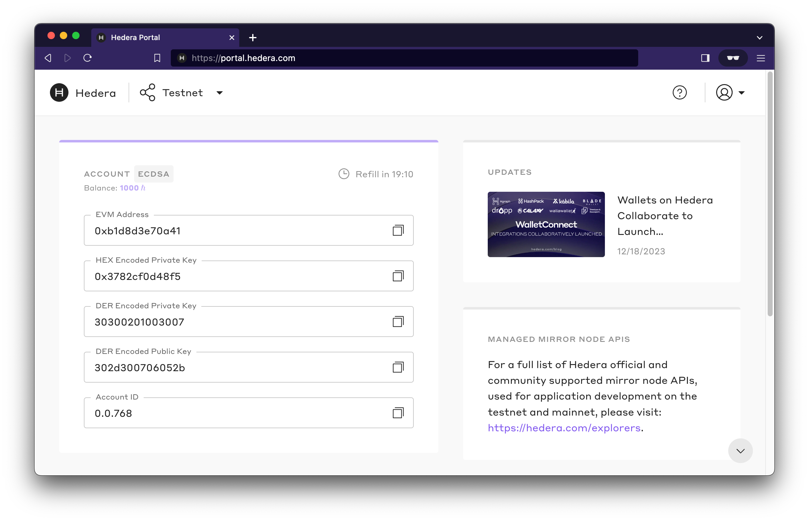

# Testnet Accounts

You will need a Hedera **Testnet** or **Previewnet** account to interact with and pay for any network services (cryptocurrency, consensus, tokens, files, and smart contracts). Your Hedera Testnet account holds a balance of HBAR for transfers to other accounts or payments for network services.

### Step 1: Create Hedera Portal Profile

To create your Hedera Portal profile, register [here](https://portal.hedera.com/register) and complete your profile. Once you've completed setting up your profile, select the test network (Testnet or Previewnet) from the network drop-down menu and create an account. After account creation, your portal account will automatically receive 1000 HBAR.&#x20;

You can easily copy your `accountId`, `public key`, and `private key` information to your clipboard to use when configuring your SDK environment for testnet.&#x20;


_**Note:** When previewnet or testnet is reset, new account IDs will be generated. The public and private key pair remain consistent during previewnet and testnet resets. If you receive an invalid account ID response from the network it is likely you need to update your previewnet or testnet account ID._ [_Create an Personal Access Token/API key_](../../tutorials/more-tutorials/how-to-create-a-personal-access-token-api-key-on-the-hedera-portal.md) _to streamline the process of account recreation and management when there is a network reset._&#x20;


You're now ready to build your application on testnet!
