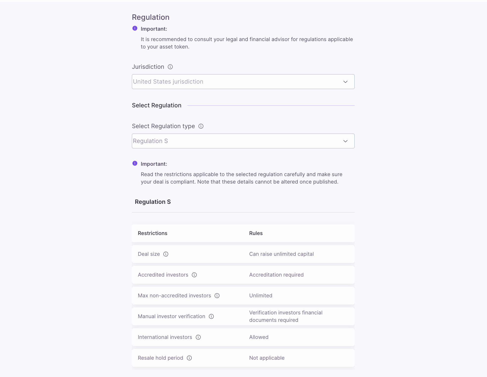
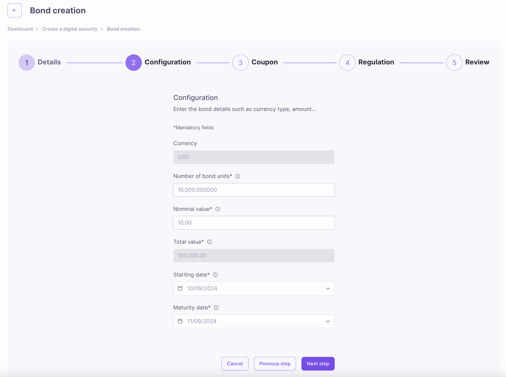
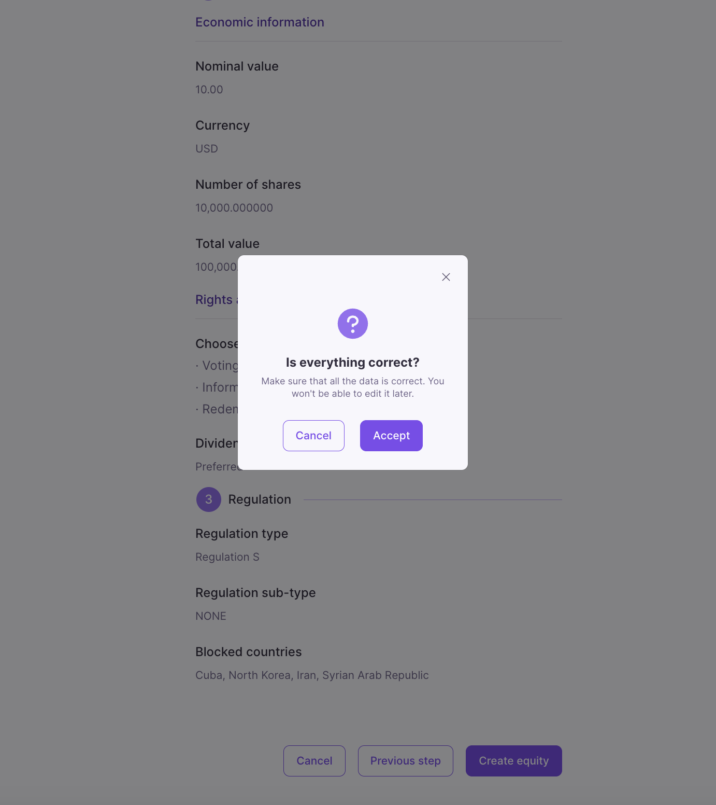
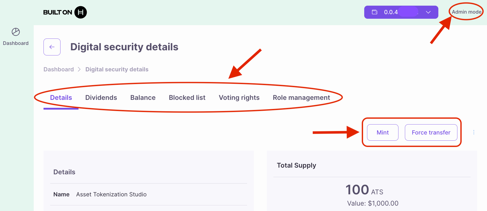

# Web User Interface (UI)

The Asset Tokenization Studio (ATS) web user interface offers an easy-to-use platform for tokenizing and managing real-world assets (RWAs). It guides users through every feature, from setup to advanced asset management. By the end of this tutorial, you'll know how to set up assets, manage roles, and handle key tasks like corporate actions and regulatory compliance.

***

## Prerequisites

* [Hedera Testnet Account](https://portal.hedera.com/)
* [HashPack](../../tutorials/more-tutorials/create-and-fund-your-hedera-testnet-account.md#option-3-hashpack-wallet) or [MetaMask Wallet](../../tutorials/more-tutorials/how-to-connect-metamask-to-hedera.md)

***

## Start Interactive Demo

To interact with the demo, you will need to first set up a [Hedera Testnet account](https://portal.hedera.com/) with testnet HBAR. After setting up an account, head to the interactive demo site ([tokenization-studio.hedera.com](https://tokenization-studio.hedera.com/)) and connect your wallet:

<figure><figcaption>
<a href="https://tokenization-studio.hedera.com/">tokenization-studio.hedera.com</a>
</figcaption></figure>

#### Create New Digital Security

Once your wallet is connected, click "Create new digital security" at the top right of the dashboard.

<figure><figcaption></figcaption></figure>

<figure><figcaption></figcaption></figure>

#### Digital Security Type

Choose the type of digital security to start the tokenization process and follow along.

<table data-card-size="large" data-view="cards"><thead><tr><th align="center"></th><th></th><th data-hidden data-card-cover data-type="files"></th><th data-hidden data-card-target data-type="content-ref"></th></tr></thead><tbody><tr><td align="center"><a href="web-user-interface-ui.md#create-new-bond"><strong>Create New Bond</strong></a></td><td>New bonds are debt securities issued by entities (corporate or government) to raise money. Investors receive periodic interest (coupons) and the principal at maturity. Tokenizing a bond digitally represents it on the blockchain or other form of distributed ledger, allowing fractional ownership and easier transferability of tokens.</td><td><a href="../../.gitbook/assets/file-service-icon.png">file-service-icon.png</a></td><td><a href="web-user-interface-ui.md#create-new-bond">#create-new-bond</a></td></tr><tr><td align="center"><a href="web-user-interface-ui.md#create-new-equity"><strong>Create New Equity</strong></a></td><td>New equity represents ownership in a company or asset, entitling holders to a share of assets, profits, dividends, and voting rights. Through asset tokenization, digital tokens representing shares are issued on a blockchain or other form of distributed ledger, offering investors easy access, transferability, and voting rights.</td><td><a href="../../.gitbook/assets/token-service-icon.png">token-service-icon.png</a></td><td><a href="web-user-interface-ui.md#create-new-equity">#create-new-equity</a></td></tr></tbody></table>

***

## Regulations

Before we start tokenizing assets into digital securities, let's review some important regulatory information to understand the applicable restrictions and rules for both types (bonds and equities) of securities that ATS supports. The current jurisdiction for digital securities is limited to the United States, meaning all legal and regulatory frameworks concerning the issuance, management, and trading of the tokenized asset are in conformity with U.S. laws. While designed to be flexible for more jurisdictions in the near future, for the time being, all the offerings of tokenized instruments shall fall under the ambit of American laws.


**Important**: Please read the restrictions applicable to the selected regulation carefully and ensure your deal is compliant. Once published, these details cannot be altered. It is recommended to consult your legal and financial advisor for regulations applicable to your digital security.


#### Restrictions and Rules

<strong>Regulation S</strong> 

* **Deal Size**: Can raise unlimited capital.
* **Accredited Investors**: Accreditation required.&#x20;
* **Max Non-Accredited Investors**: Unlimited
* **Manual Investor Verification**: Verification of investor's financial documents required.
* **International Investors**: Allowed.
* **Resale Hold Period**: Not applicable.

The above terms are defined [here](web-user-interface-ui.md#regulation-restrictions-and-rules-terms-defined).&#x20;

<strong>Regulation D (506 B)</strong>

#### Restrictions and Rules

* **Deal Size**: Can raise unlimited capital.
* **Accredited Investors**: Accreditation required.&#x20;
* **Max Non-Accredited Investors**: 35.
* **Manual Investor Verification:** Manual verification of the investor's financial documents is required.
* **International Investors**: Not allowed.
* **Resale Hold Period**: Applicable from 6 months to 1 year.

The above terms are defined [here](web-user-interface-ui.md#regulation-restrictions-and-rules-terms-defined).&#x20;

<strong>Regulation D (506 C)</strong>

#### Restrictions and Rules

* **Deal Size**: Can raise unlimited capital.
* **Accredited Investors**: Accreditation required.&#x20;
* **Max Non-Accredited Investors**: Unlimited.
* **Manual Investor Verification:** Manual verification of the investor's financial documents is required.
* **International Investors**: Not allowed.
* **Resale Hold Period**: Applicable from 6 months to 1 year.

The above terms are defined [here](web-user-interface-ui.md#regulation-restrictions-and-rules-terms-defined).&#x20;

<figure><figcaption></figcaption></figure>

<strong>Regulation Terms Defined</strong>

* **Deal Size**: The total amount of capital that can be raised through this offering. This could represent an unlimited or capped amount, depending on the specific tokenization project or regulatory constraints.&#x20;

- **Accredited Investors**: Investors who meet specific financial criteria (e.g., income, net worth) as defined by regulatory standards. Participation in certain tokenized offerings may be restricted to accredited investors due to regulatory requirements.

* **Max Non-Accredited Investors**: The maximum number of non-accredited investors allowed to participate in the digital security offering. Digital securities may impose limits on non-accredited investor participation to comply with securities regulations, ensuring the offering remains within certain legal frameworks.

- **Manual Investor Verification**: This is a process where investors must provide financial documentation or proof of identity, which is manually verified to ensure compliance with KYC (Know Your Customer) and AML (Anti-Money Laundering) regulations. In digital securities offerings, this step ensures that only eligible participants can invest in the asset.

* **International Investors**: Refers to the participation of investors from other countries in the digital security offering. Tokenized offerings may allow or restrict international investors based on local or international regulations, tax considerations, and compliance requirements.

- **Resale Hold Period**: The minimum time an investor must wait before they can resell their digital security on secondary markets. The resale hold period is often mandated by regulatory bodies to prevent early liquidation and to comply with securities laws, ensuring the stability and legality of the offering.

#### Blocklist

The blocklist is responsible for prohibiting specific investors from participating in a tokenized offering. Investors from the countries mentioned on this blocklist would not be able to invest in the digital security. This functionality allows an issuer to adhere to particular legal, regulatory, or operational constraints applied to specific jurisdictions. For this, the issuer can select a country and then blocklist it to ensure that residents of that country do not create or participate in an offering.


**Important**: Investors from only the countries specified below will not be allowed to invest.


<figure><figcaption></figcaption></figure>

***

## Create New Bond

#### Bond General Information

To initiate the creation of a new bond, choose New Bond and enter the basic details of the new bond:

* **Name**: Bond's name.
* **Symbol**: Bond's symbol.
* **Decimals**: Number of decimals units (default is 6).
* **ISIN**: International Security Identification Number - this can be any 12 alphanumeric characters.

#### Bond Permissions

Toggle the permissions you want to enable for your new bond:

* **Controllable**: Enables token controller role and compliance operations.
* **Blocklist**: Enables access control to the security using a list of blocked accounts.
* **Approval list**: Enables access control to the security using a list of approved/allowed accounts.

<figure><figcaption></figcaption></figure>

### Bond Details

Enter the bond details, such as the nominal value, number of bond units, starting (mint) date, and maturity date.

* **Number of Bond Units**: The total number of bond tokens to be issued. Each unit represents a fraction of the overall bond and can be bought, sold, or transferred.
* **Nominal Value**: The face value of each bond unit, which is the amount the issuer agrees to repay the bondholder at maturity.&#x20;
* **Starting Date**: The issuance or minting date of the bond, marking the official start of the bond's term. It is the date from which interest (coupon) payments start to accrue.
* **Maturity Date**: The date when the bond reaches its full term, and the issuer is obligated to repay the bondholders the nominal value of the bond units, along with any remaining interest payments.

<figure><figcaption></figcaption></figure>

### Coupons

Define the bond's interest payment structure, including coupon type (fixed or custom), rate, payment frequency, and the first coupon date.

* **Coupon Type**: The structure of the interest payments (coupons) that the bond will provide.
  * **Fixed**: A bond with a fixed coupon pays a set interest rate over its lifetime, regardless of market fluctuations.
  * **Custom**: A bond with zero coupons by default, but flexible or floating coupon rates can be added later. This option allows for custom interest structures through the "Set Coupons" tab.
* **Coupon Rate**: The interest rate paid on each coupon. It is expressed as a percentage of the bond's nominal value and determines the periodic payments made to bondholders.
* **Coupon Frequency**: Defines the interval between two consecutive coupon payments, measured in months (each month is assumed to have 30 days). For example, a frequency of 6 months means that bondholders will receive interest payments every six months.
* **First Coupon Date**: The first date when a coupon payment will be recorded and made to bondholders. All subsequent coupon payment dates are automatically calculated based on the coupon frequency and the first coupon's date.

<figure><figcaption></figcaption></figure>

#### Blocklist

The blocklist is responsible for prohibiting specific investors from participating in a tokenized offering. Investors from the countries mentioned on this blocklist would not be able to invest in the digital security. This functionality allows an issuer to adhere to particular legal, regulatory, or operational constraints applied to specific jurisdictions. For this, the issuer can select a country and then blocklist it to ensure that residents of that country do not create or participate in an offering.


**Important**: Investors from only the countries specified below will not be allowed to invest.


<figure><figcaption></figcaption></figure>

### Review

Review the details of the new equity you are creating. Once you have confirmed that all the information is correct, click <mark style="background-color:purple;">**Create Bond**</mark> and then <mark style="background-color:purple;">**Accept**</mark> to finalize bond creation.&#x20;


Please note that you will not be able to edit the details after the bond is created, so take your time to review them carefully.


<figure><figcaption></figcaption></figure>

***

## Create New Equity

#### Equity General Information

To initiate the creation of new equity, choose New Equity and enter the basic details of the new equity:

* **Name**: Equity's name.
* **Symbol**: Equity's symbol.
* **Decimals**: Number of decimals units (default is 6).
* **ISIN**: International Security Identification Number - this can be any 12 alphanumeric characters (e.g., abc123456789, 111111111111, 1a2b3c4d5e6f).

#### Equity Permissions

Toggle the permissions you want to enable for your new equity:

* **Controllable**: Enables token controller role and compliance operations.
* **Blocklist**: Enables access control to the security using a list of blocked accounts.
* **Approval list**: Enables access control to the security using a list of approved/allowed accounts.

<figure><figcaption></figcaption></figure>

### Equity Details

Enter the specific details of the new equity, such as nominal value and number of shares, and select the applicable rights and privileges each token will hold.

* **Nominal Value**: Value of each equity token in the selected currency.
* **Currency**: USD (default).
* **Number of Shares**: Equity's maximum supply.

<strong>Learn more about Rights and Privileges ⬇</strong>

* **Voting Rights**: Tokens with voting rights grant their holders the right to participate in governance.&#x20;

- **Information Rights**: The holders with these information rights may request transparency in the form of regular reports on how the company is performing.

* **Liquidation Rights**: The holders of liquidation rights will have a claim on the assets if the firm dissolves normally after debts are paid.

- **Conversion Rights**: These are the rights of equity holders to convert their equity tokens into another security; for example, preferred shares into common shares and equity into debt tokens.

* **Subscription Rights**: The right of current equity holders to buy additional equity shares at pre-determined prices, often in advance of offering shares to the general market. This prevents ownership from being diluted.

- **Redemption Rights**: The right of equity holders to force the company to buy back or redeem their shares, usually under specified conditions or at certain times.

* **Put Rights**: A right given to the equity holder to sell his shares back to the company at a predetermined price or under certain conditions.

<figure><figcaption></figcaption></figure>

### Dividends

Types of dividends available for equity holders, including none, preferred, and common dividends.

* **None**: Equity holders won't receive dividends.
* **Preferred**: Equity holders are entitled to preferential dividends that have to be paid before common dividends and may be at a fixed rate relative to nominal value.
* **Common**: Equity holders enjoy common dividends that may vary and, if any is paid, after preferred.

<figure><figcaption></figcaption></figure>

#### Blocklist

The blocklist prohibits specific investors from participating in a tokenized offering. Investors from the countries mentioned on this blocklist cannot invest in digital security. This functionality allows an issuer to adhere to particular legal, regulatory, or operational constraints applied to specific jurisdictions. For this, the issuer can select a country and then blocklist it to ensure that residents of that country do not create or participate in an offering.


**Important**: Investors from only the countries specified below will not be allowed to invest.


<figure><figcaption></figcaption></figure>

### Review

Review the details of the new equity you are creating. Once you have confirmed that all the information is correct, click <mark style="background-color:purple;">**Create equity**</mark> and then <mark style="background-color:purple;">**Accept**</mark> to finalize equity creation.&#x20;


Please note that you will not be able to edit the information after the equity is created, so take your time to carefully review the details.


<figure><figcaption></figcaption></figure>

***

## Manage Roles

In Asset Tokenization Studio (ATS), role management is a crucial feature that provides control over various functions related to the management and operation of digital securities. If your account is assigned the _Admin Role_, you can manage other roles for your security tokens, making governance easier and more secure.


To operate and manage digital securities within Asset Tokenization Studio, you must first assign roles to your connected wallet or account. Without the appropriate roles, you will not have the necessary permissions to perform operations such as minting tokens, managing corporate actions, or updating compliance settings. Be sure to grant yourself the required roles through the role management tab for each security to gain full access to manage your tokenized assets.&#x20;


Roles you can manage include:&#x20;

* **Admin**: Grants full administrative privileges, including the ability to assign and manage all other roles.
* **Minter**: Permits the account to mint new tokens, increasing the supply of the asset.
* **Controller**: Authorizes the account to execute specific control actions over the tokenized asset, such as regulatory or operational updates.
* **Pause**: Allows the account to temporarily halt all transactions for the asset, useful in emergencies or during maintenance.
* **Control List**: Manages approval lists and blacklists, determining which accounts can or cannot participate in asset transactions.
* **Corporate Actions**: Enables the execution of corporate actions like dividend distributions or token conversions.
* **Document**: Grants the ability to manage and update asset-related documents, such as legal or compliance files.
* **Snapshot**: Authorizes the creation of snapshots, capturing the state of token holder balances at a specific point in time for reporting or auditing purposes.

Connect your wallet and select the digital security you want to manage from the Admin (mode) dashboard.&#x20;

<figure><figcaption></figcaption></figure>

Once the asset information loads, navigate to the "Role Management" tab to assign or modify roles. Enter the account ID to which you want to assign roles.&#x20;

<figure><figcaption></figcaption></figure>

## Manage Securities

After assigning roles, ATS will display all operations available for each digital security based on the roles your account has been assigned. Simply click on the corresponding tab and follow the on-screen prompts to complete each operation. Here's a rundown of the available operations by dashboard mode:

#### Admin (mode) Dashboard

* **Mint**: Allows the creation of new tokens for the security, increasing the total supply based on the issuer’s parameters.
* **Force Transfer**: Enables the transfer of tokens from one account to another without the token holder's consent, often used in cases of legal or regulatory necessity.
* **Dividends**: Programs dividend payments for equity tokens, specifying how and when dividends will be distributed to token holders. It also provides an overview of all programmed dividend payouts, including past, pending, or upcoming payments, allowing the issuer or investor to track distributions.
* **Balances**: Shows the balance of tokens held by various investors, offering a snapshot of current token holdings for the selected security.
* **Blocked List**: Manages a list of blocked or restricted investors who are prohibited from participating in token transactions, ensuring compliance with KYC/AML requirements.
* **Voting Rights**: Assigns, adjusts, or displays voting rights for security token holders, allowing them to participate in governance decisions, such as corporate actions or board elections.
* **Role Management**: Enables the assignment and management of roles (e.g., Admin, Minter, Controller) for specific users, determining their permissions and access to various operations within the digital security.

<figure><figcaption></figcaption></figure>

#### Holder (mode) Dashboard

* **Transfer**: Allows token holders to send their security tokens to another account or wallet, following any compliance rules.
* **Redeem**: Enables token holders to return their tokens to the issuer in exchange for cash, removing them from circulation.
* **Balance**: Displays the token holder's current balance, providing a real-time view of the total tokens held for the selected asset.

<figure><figcaption></figcaption></figure>

🎉 Congrats on creating and managing your first digital security with Asset Tokenization Studio! You can view the transaction details on HashScan by looking up your new security token ID.

<figure><figcaption></figcaption></figure>

***

## Additional Resources

* [Hedera Developer Portal](https://portal.hedera.com/)
* [HashScan Network Explorer](https://hashscan.io/)
* [Frequently Asked Questions (FAQs)](frequently-asked-questions-faqs.md)
