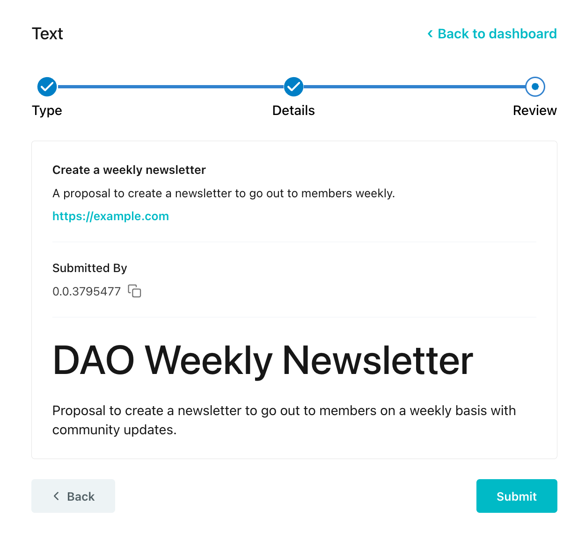
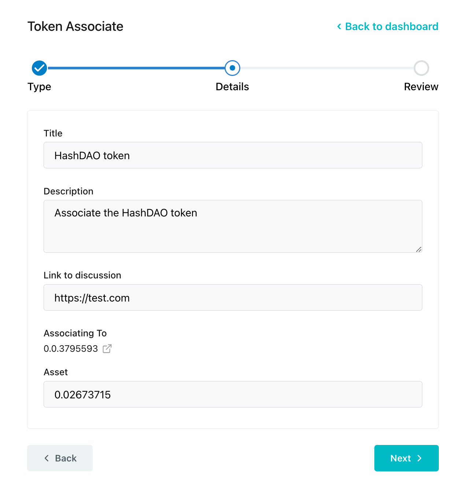

# DAO Proposals

To create a proposal on chain, you must have sufficient voting power. This information can be found on the DAO's **Overview** tab from the [HashioDAO](https://hashiodao.swirldslabs.com/) dashboard.&#x20;


**Note**: There are no snapshots, like Ethereum-based DAOs, instead, your tokens are locked up for the duration of the vote. Your voting power is equal to the amount of tokens you lock up.


Click on **Manage** and lock up tokens to increase your voting powers.

<figure><figcaption></figcaption></figure>

***

## Create a Proposal

From the HashioDAO dashboard, click on the DAO you created in the previous step to manage the DAO and create new proposals. Click **New Proposal** and let's review the different types of proposals and examples. You can create a proposal for various activities like a text, token transfer, token associate, and upgrade DAO proposal.&#x20;

<figure><figcaption></figcaption></figure>

Text Proposal Example

This Text proposal transaction is proposing to create a newsletter to go out to members of the DAO on a weekly basis.&#x20;

1. Click on **New Proposal**
2. Fill out the title, description, link to discussion, and optionally a custom markdown description
3. Click **Submit** and approve the create proposal transaction in your wallet&#x20;

Token Transfer Proposal Example

This Token Transfer proposal is proposing to transfer the specified token to an account.&#x20;

1. Click on **New Proposal**
2. Fill out the title, description, link to discussion, recipient account ID, and select the token to transfer and the amount.
3. Click **Submit** and approve the create proposal transaction in your wallet&#x20;

Token Associate Proposal Example

This Token Associate proposal transaction is proposing the HashioDAO token to be associated with the smart contract. Once the proposal is created, members of the DAO can vote on it to execute or reject the proposal.

1. Click on **New Proposal**
2. Fill out the title, description, link to discussion, and asset/token ID you want to associate
3. Click **Submit** and approve the create proposal transaction in your wallet&#x20;

***

## Vote on Proposals

To vote on a proposal, first ensure that your wallet is connected and have voting powers. Navigate to the **Proposals** tab on the DAO's dashboard and choose one of the active proposals to vote on.

<figure><figcaption></figcaption></figure>

Cast your vote and approve the transaction in your wallet to confirm your vote.&#x20;

<figure><figcaption></figcaption></figure>

***

## Execute Proposal

After the voting period ends, click on a proposal that passed under the **Proposals** tab and click **Execute**.

<figure><figcaption></figcaption></figure>

***

## Conclusion and Additional Resources

Congrats on successfully creating, voting, and executing your first DAO proposal!&#x20;

**➡** [**HashioDAO Repository**](https://github.com/hashgraph/hedera-accelerator-defi-dex-ui)

**➡** [**HashScan Network Explorer**](https://hashscan.io/testnet/dashboard)

➡ [**HashioDAO Web Application**](https://hashiodao.swirldslabs.com/)

