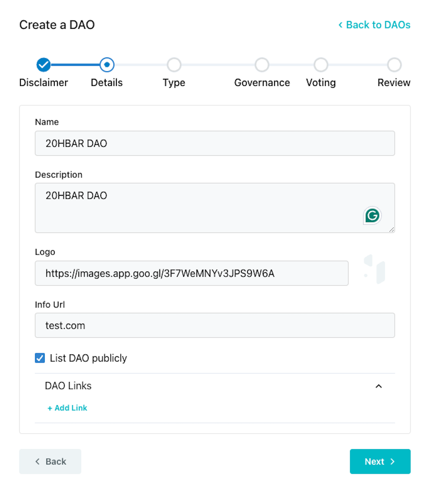

# Multisig DAO

## Multisig DAO Creation

[After creating and funding a Hedera account](./#getting-started-with-hashiodao), navigate to the HashioDAO web application dashboard and connect your wallet. Once your wallet is connected, click **Create a new DAO** and this will guide you through a series of setup steps where you will define the details of your DAO including name and governance type.&#x20;

<figure><figcaption></figcaption></figure>

Read and and accept the disclaimer and click  **Next**.

<figure><figcaption></figcaption></figure>

Define the details of your DAO by filling out each field. These details are important because it creates your DAO's public profile and how the community will be identified.

<figure><figcaption></figcaption></figure>

***

## Governance Models

Choose the governance model that works best with your organizations's goals. There are three models to choose from: governance token, multisig, and NFT.&#x20;

<figure><figcaption></figcaption></figure>

The **`createDAO()`** function is called on the [MultisigDaoFactory](https://github.com/hashgraph/hedera-accelerator-defi-dex/blob/main/contracts/dao/MultisigDAOFactory.sol) factory contract when you create a multisig DAO. This initiates a new DAO treasury smart contract based on the parameters you set for you token. These parameters will be set in the next step.&#x20;

***

## Set Admin Account

Setting an admin account ID designates the account as the primary administrator responsible for initiating transactions and managing the multisig wallet.

<figure><figcaption></figcaption></figure>

***

## Define Threshold

Define the threshold. This is the minimum number of signers required before executing transactions.

<figure><figcaption></figcaption></figure>

***

## Review and Submit to Create DAO

Review the DAO details, governance type, and submit the transaction. Approve the DAO creation transaction in your wallet to proceed.&#x20;

<figure><figcaption></figcaption></figure>

***

## Conclusion and Additional Resources

Congrats on successfully creating your first DAO using the multisig model! In this guide, you defined and customized the details of the new DAO, including specifying the admin account and threshold for authorizing transactions. Happy DAO creating!

➡ [**HashioDAO Repository**](https://github.com/hashgraph/hedera-accelerator-defi-dex-ui)

➡ [**HashScan Network Explorer**](https://hashscan.io/testnet/dashboard)

➡ [**HashioDAO Web Application**](https://hashiodao.swirldslabs.com/)

➡ [**Gnosis Safe Governance Docs**](https://safe.global/governance)

