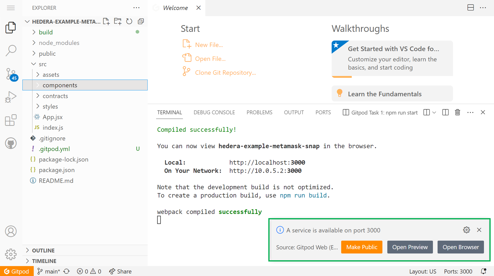
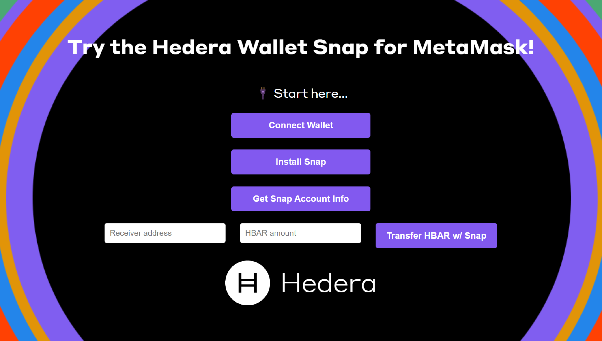
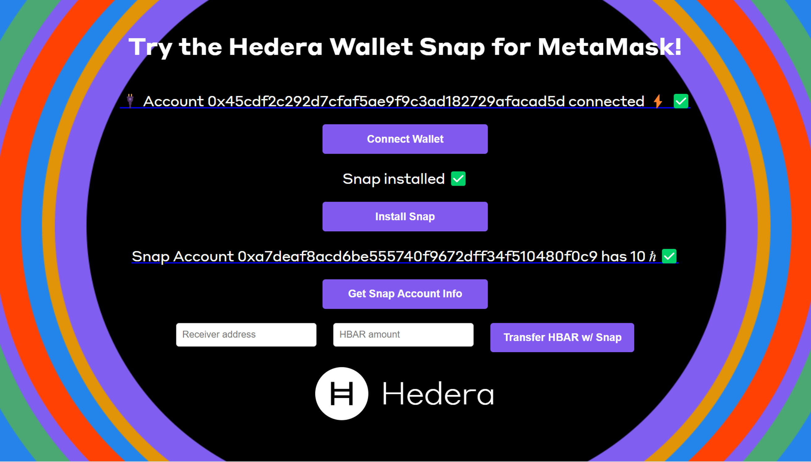
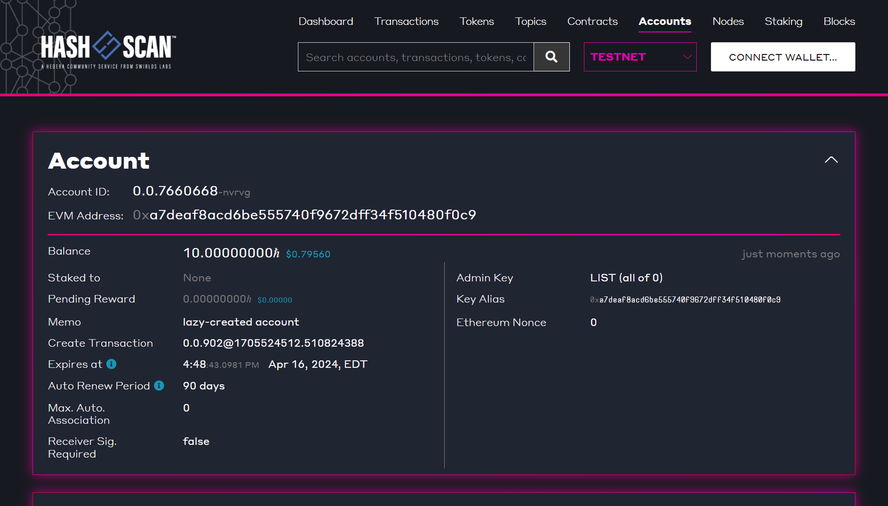

# Tutorial: MetaMask Snaps – What Are They and How to Use Them

## Introduction

MetaMask is a widely used Ethereum wallet and browser extension – MetaMask Snaps is an open-source solution designed to enhance the capabilities of this wallet. Snaps are created by developers using JavaScript and enable users to interact with various blockchains, protocols, and [decentralized applications (dApps)](../../support-and-community/glossary.md#decentralized-application-dapp) that MetaMask does not natively support. To learn more about Snaps, visit the [MetaMask Snap Guide](https://docs.metamask.io/snaps/).

The [Hedera Wallet Snap](https://snaps.metamask.io/snap/npm/hashgraph/hedera-wallet-snap/), developed by [Tuum Tech](https://www.tuum.tech/) and managed by [Hashgraph](https://www.hashgraph.com/), enables users to interact directly with the Hedera network. It offers functionalities like sending HBAR to different accounts and retrieving account information.

**What You Will Learn**

This tutorial will demonstrate how dApp builders and developers can seamlessly integrate and utilize the Hedera Wallet Snap in their applications. You will learn how to:

* Pair dApp with MetaMask
* Install the Hedera Wallet Snap
* Get the Snap Ethereum Virtual Machine (EVM) address
* Create the Snap account and check its balance
* Call other methods in the Hedera Wallet Snap, like: `transferCrypto`

**Tools You Will Use**

* React JS ([Documentation](https://react.dev/))
* MetaMask ([Documentation](https://docs.metamask.io/wallet/))
* Hedera Wallet Snap for MetaMask ([Documentation](https://docs.tuum.tech/hedera-wallet-snap/basics/introduction))
* Hedera JSON-RPC Relay ([Hashio](https://www.hashgraph.com/hashio/))
* Ethers JS ([Documentation](https://docs.ethers.org/v6/))
* Mirror Node REST API ([Learn More](https://hedera.com/blog/how-to-look-up-transaction-history-on-hedera-using-mirror-nodes-back-to-the-basics))
* Mirror Node Explorer ([HashScan](https://hashscan.io/))

***

## Prerequisites

* NodeJS >= 18.13 ([Download](https://nodejs.org/en))
* TypeScript >= 4.7 ([Download](https://www.npmjs.com/package/typescript))
* Git Command Line ([Download](https://git-scm.com/downloads))
* Hedera Testnet Account ([Create](https://portal.hedera.com/))
* MetaMask Wallet Extension ([Download](https://metamask.io/download/))

***

## **Get Familiar with the dApp Structure and UI**

Explore the project files and functions and get a feel for how the sample dApp looks and functions. This will make it easier to follow along as you dive into the technical aspects of the dApp.

For convenience, two options are provided to run the code used in this example:

<details>

<summary>Run in Browser Using GitPod</summary>

This option does not require installing anything on your machine. All you need is a compatible web browser. [Click here to set up the GitPod environment](https://gitpod.io/#https://github.com/ed-marquez/hedera-example-metamask-snap). You will see the following:




</details>

<details>

<summary>Clone the Repository Locally</summary>

If you prefer to have a copy of the code files on your machine and run the application locally, follow these steps.

#### Clone the Repo

To clone the repository, open your terminal and navigate to the directory where you want to place the project. Then, run the following command:

```bash
git clone https://github.com/hedera-dev/hedera-example-metamask-snap.git
```

#### Navigate to Directory

Once the cloning process is complete, navigate to the project folder using:

```bash
cd hedera-example-metamask-snaps
```

**Install Project Dependencies and Start the Application**

After cloning the repo and navigating to the right folder, install all project dependencies. Dependencies are listed in the [`package.json`](https://github.com/ed-marquez/hedera-example-metamask-snap/blob/main/package.json) file, so you can just run the following command:

```bash
npm install
```

To start the application, run:

```bash
npm start
```

</details>

**Project Structure**

The project folder structure should look something like the following.

<div align="left"><figure><figcaption></figcaption></figure></div>

### Overall dApp Structure

The example application has four buttons, which complete different tasks when pressed.

* The first button connects the application to MetaMask.
* The second button installs the Hedera Wallet Snap.
* The third button obtains information about the Snap account.
* The fourth button (and respective input boxes) uses the Hedera Wallet Snap to transfer HBAR.

<figure><figcaption></figcaption></figure>

Now let’s look at the **App.jsx** file (inside the src folder) behind this UI. You can think of the code as three main sections (in addition to the imports):

1. The state management is the part that uses the [**useState()** React Hook](https://react.dev/reference/react/useState).
2. The functions that are executed with each button press; we’ll look at these in the next few sections.
3. The **return** statement groups the elements we see on the page.

<figure><figcaption></figcaption></figure>

The **useState()** hook helps store information about the state of the application. In this case, we store information like the [snapId](https://docs.tuum.tech/hedera-wallet-snap/getting-started/hello-world#javascript-function-to-interact-with-hedera-wallet-snap-api), wallet data, the account that is connected, the network, and the receiver address and HBAR amount, along with text and links presented in the UI. Remember that the first output of **useState()** is the variable of interest (e.g., **walletData**), and the second output is a function to set a new value for that variable (e.g., **setWalletData**).

#### Understanding the React Components

The buttons, text, and input boxes in the UI are a combination of React components in the **return** statement of **App.jsx**. Working with components, we take advantage of React's composability for better organization and readability. The properties for each component instance – like the function that each button executes, the label of the button, the text above the button, and the link for that text – are customized using [React props](https://react.dev/learn/passing-props-to-a-component).

<details>

<summary><strong>MyGroup</strong></summary>

```jsx
import React from "react";
import MyButton from "./MyButton.jsx";
import MyText from "./MyText.jsx";
function MyGroup(props) {
    return (
        <div>
            <MyText text={props.text} link={props.link} />
            <MyButton fcn={props.fcn} buttonLabel={props.buttonLabel} />
        </div>
    );
}
export default MyGroup;
```

**MyGroup** is a functional component that combines a text element with a button and receives props as an argument. These properties include:

* **`text`**: The text to be displayed by the **MyText** component.
* **`link`**: An optional link to be associated with the **MyText** component. If provided, the text will become clickable and redirect to the specified link.
* **`fcn`**: A function to be executed when the button within the **MyButton** component is clicked.
* **`buttonLabel`**: The label for the button in the **MyButton** component.

Inside the component, we return a **div** element that contains both the **MyText** and **MyButton** components. We pass the corresponding props down to these child components, allowing them to render the text, link, and button label and assign the click event handler. Finally, by exporting **MyGroup**, we make it available for use in other parts of the application, enabling us to quickly create reusable groups of text and button elements throughout the dApp. You can find the JSX files for the functional components mentioned under the folder **src/components**.

</details>

<details>

<summary><strong>MyButton</strong></summary>

```jsx
import React from "react";
function MyButton(props) {
    return (
        <div>
            <button onClick={props.fcn} className="cta-button">
                {props.buttonLabel}
            </button>
        </div>
    );
}
export default MyButton;
```

**MyButton** accepts the following props:

* **`fcn`**: A function to be executed when the button is clicked.
* **`buttonLabel`**: The label for the button, which will be displayed as the button's text.

Inside the component, we return a div element that wraps a button element. The button element is assigned the **onClick** event handler with the function **props.fcn**. This allows us to execute a specified function when the button is clicked. The **className** attribute is set to "**cta-button**," which is used for styling the button with CSS. Finally, we display the **props.buttonLabel** as the button's text.

By exporting **MyButton**, we make it available for use in other groups or parts of the application, allowing us to easily create consistent and reusable buttons throughout the dApp with customized functionality and labels.

</details>

<details>

<summary>MyText</summary>

```jsx
import React from "react";
function MyText(props) {
    if (props.link !== "") {
        return (
            <div>
                <a href={props.link} target={"_blank"} rel="noreferrer">
                    <p className="sub-text">{props.text}</p>
                </a>
            </div>
        );
    } else {
        return (
            <div>
                <p className="sub-text">{props.text}</p>
            </div>
        );
    }
}
export default MyText;
```

**MyText** displays text and optionally wraps it in a link. It takes props as an argument, including:

* **`text`**: The text to be displayed.
* **`link`**: An optional link to be associated with the text.

Inside the component, we use a conditional statement to check if **props.link** is provided. If it is, we wrap the text within an **\<a>** element, making it clickable and redirecting to the specified link. If no link is provided, we display the text within a **\<p>** element. Both elements have the **className "sub-text"** for consistent styling. Finally, we export the **MyText** component so it can be used in other parts of the application, allowing for easy creation of text elements with optional links.

</details>

<details>

<summary>MySendGroup</summary>

```typescript
import React from "react";
import MyInputBox from "./MyInputBox";
import MyButton from "./MyButton";
import MyText from "./MyText";
function MySendGroup(props) {
    return (
        <div>
            <MyText text={props.text_app} link={props.link_app} />
            <div className="multi-col-group">
                <MyInputBox fcn={props.fcnI1_app} placeholderTxt={props.placeholderTxt1_app} />
                <MyInputBox fcn={props.fcnI2_app} placeholderTxt={props.placeholderTxt2_app} />
                <MyButton fcn={props.fcnB1_app} buttonLabel={props.buttonLabel_app} />
            </div>
        </div>
    );
}
export default MySendGroup;
```

**MySendGroup** uses a text display, two input boxes, and a button to facilitate data entry and user interaction. The component takes props as an argument, including:

* **`fcnI1`** and **`fcnI2`**: Functions to store the text provided via input fields in the application state.
* **`placeholderTxt1_app`** and **`placeholderTxt2_app`**: Placeholder texts for the input fields.
* The same arguments are mentioned for **MyText** and **MyButton**.

Inside the component, we return a div element that contains the **MyText**, **MyInputBox**, and **MyButton** components. We pass the corresponding props down to these child components. Finally, exporting **MySendGroup** makes it available for use in other parts of the application.

</details>

<details>

<summary>MyInputBox</summary>

```jsx
import React from "react";
function MyInputBox(props) {
    return (
        <div>
            <input type="text" onChange={props.fcn} placeholder={props.placeholderTxt} className="text-input" />
        </div>
    );
}
export default MyInputBox;
```

**MyInputBox** accepts the following props:

* **`fcn`**: A function to store the text provided via input fields in the application state.
* **`placeholderTxt`**: Placeholder texts for the input fields.

Inside the component, we return a **div** that wraps an input element. The input element is assigned the **onChange** event handler with the function **props.fcn**. This triggers the function that stores the inputs (receiver address and HBAR amount) to the state of the application. We display the **props.placeholderTxt** as the box text. The **className** attribute is set to **"text-input,"** which is used for styling the boxes with CSS. Finally, by exporting **MyInputBox**, we make it available for use in other parts of the application.

</details>

***

## Step 1: Pair MetaMask Wallet (select network and account)

In **App.jsx**, we use the **connectWallet()** function (code tab 1), which in turn calls the **walletConnectFcn()** function (code tab 2) that is imported from the file **src/components/hedera/walletConnect.js**.



```jsx
async function connectWallet() {
        if (account !== undefined) {
                setConnectText(`🔌 Account ${account} already connected ⚡ ✅`);
        } else {
                const wData = await walletConnectFcn(network);

                let newAccount = wData[0];
             if (newAccount !== undefined) {
                        setConnectText(`🔌 Account ${newAccount} connected ⚡ ✅`);
                        setConnectLink(`https://hashscan.io/${network}/account/${newAccount}`);
                        setWalletData(wData);
                        setAccount(newAccount);
                        setSnapInstallText();
                        setSnapInfoText();
                        setSnapTransferText();
                }
        }
}
```



```jsx
import { ethers } from "ethers";
async function walletConnectFcn(network) {
    console.log(`\n=======================================`);
    // ETHERS PROVIDER
    const provider = new ethers.providers.Web3Provider(window.ethereum, "any");
    // SWITCH TO HEDERA TEST NETWORK
    console.log(`- Switching network to the Hedera ${network}...🟠`);
    let chainId;
    if (network === "testnet") {
        chainId = "0x128";
    } else if (network === "previewnet") {
        chainId = "0x129";
    } else {
        chainId = "0x127";
    }
    await window.ethereum.request({
        method: "wallet_addEthereumChain",
        params: [
            {
                chainName: `Hedera ${network}`,
                chainId: chainId,
                nativeCurrency: { name: "HBAR", symbol: "HBAR", decimals: 18 },
                rpcUrls: [`https://${network}.hashio.io/api`],
                blockExplorerUrls: [`https://hashscan.io/${network}/`],
            },
        ],
    });
    console.log("- Switched ✅");
    // // CONNECT TO ACCOUNT
    console.log("- Connecting wallet...🟠");
    let selectedAccount;
    await provider
        .send("eth_requestAccounts", [])
        .then((accounts) => {
            selectedAccount = accounts[0];
            console.log(`- Selected account: ${selectedAccount} ✅`);
        })
        .catch((connectError) => {
            console.log(`- ${connectError.message.toString()}`);
            return;
        });
    return [selectedAccount, provider];
}
export default walletConnectFcn;
```



When the  <mark style="background-color:purple;">**Connect Wallet**</mark> button is pressed in the dApp, the **connectWallet()** function is executed. This function checks if an account is already connected. If it is, a message displaying the connected account is shown. If no account is connected, the **walletConnectFcn()** is called to establish a connection.

The **walletConnectFcn()** function performs the following steps:

1. **Creates an ethers provider**: It initializes an ethers provider using the **Web3Provider** from the [**ethers**](https://docs.ethers.org/v6/) library, which connects to MetaMask. An Ethers provider serves as a bridge between your application and the Hedera network. It allows you to perform actions like sending transactions and querying data.
2. **Switches to Hedera Testnet**: It determines the **chainId** based on the chosen Hedera network (testnet, previewnet, or mainnet) and sends a **wallet\_addEthereumChain** request to MetaMask to add the corresponding Hedera network. A chain ID is a unique identifier that represents a blockchain network. This is an important step that includes setting the native currency (HBAR) and providing the JSON-RPC and network explorer URLs. For the JSON-RPC provider, this example uses [Hashio](https://www.hashgraph.com/hashio/), a community-hosted [JSON-RPC relay](https://github.com/hashgraph/hedera-json-rpc-relay) provided by [Hashgraph](https://www.hashgraph.com/) (note that anyone can host their own relay and/or use other commercial providers, like [Arkhia](https://www.arkhia.io/features/#api-services)). For network explorer, [HashScan](https://hashscan.io/) is used. (Keep in mind that HashScan supports [EIP-3091](https://eips.ethereum.org/EIPS/eip-3091), which makes it easy to explore historical data like blocks, transactions, accounts, contracts, and tokens from wallets like MetaMask).
3. **Connects and Pairs Account**: The function sends an **eth\_requestAccounts** request to MetaMask to access the user's Hedera account. Upon successful connection, the selected account is returned.

Finally, the **connectWallet()** function in **App.jsx** updates the React state with the connected testnet account and provider information, allowing the dApp to display the connected testnet account information.

This is what you see when clicking the  <mark style="background-color:purple;">**Connect Wallet**</mark>  button for the first time.


**Note**: The Hedera account selected in MetaMask for this example has ECDSA keys and is created using the [Hedera Portal](https://portal.hedera.com/).


<figure><figcaption></figcaption></figure>

Once the network switches and the account is paired, you should see something like the following in the dApp UI and in HashScan (if you click on the hyperlinked text showing the account address).

<figure><figcaption></figcaption></figure>

<figure><figcaption></figcaption></figure>

***

## Step 2: Install the Hedera Wallet Snap

The **snapInstall()** function (code tab 1) in **App.jsx** calls the **snapInstallFcn()** function (code tab 2). The latter is imported from the file **src/components/hedera/snapInstall.js**.



```jsx
async function snapInstall() {
        if (account === undefined) {
            setSnapInstallText("🛑Connect a wallet first!🛑");
        } else {
            const newSnapInstallText = await snapInstallFcn(snapId);
            setSnapInstallText(newSnapInstallText);
            setSnapInfoText();
```



```jsx
async function snapInstallFcn(snapId) {
    console.log(`\n=======================================`);
    console.log(`- Installing Hedera Wallet Snap...🟠`);
    console.log(`SnapId: ${snapId}`);
    let outText;
    let snaps = await window.ethereum.request({
        method: "wallet_getSnaps",
    });
    console.log("Installed snaps...", snaps);
    try {
        if (!(snapId in snaps)) {
            console.log("Hedera Wallet Snap is not yet installed. Installing now...");
            const result = await window.ethereum.request({
                method: "wallet_requestSnaps",
                params: {
                    [snapId]: {},
                },
            });
            console.log("result: ", result);
            snaps = await window.ethereum.request({
                method: "wallet_getSnaps",
            });
        }
    } catch (e) {
        console.log(`Failed to obtain installed snap: ${JSON.stringify(e, null, 4)}`);
        alert(`Failed to obtain installed snap: ${JSON.stringify(e, null, 4)}`);
    }
    if (snapId in snaps) {
        outText = "Snap installed ✅";
        console.log(`- Snap installed successfully ✅`);
        alert("Snap installed successfully!");
    } else {
        console.log("Could not connect successfully. Please try again!");
        alert("Could not connect successfully. Please try again!");
    }
    return outText;
}
export default snapInstallFcn;
```



The **snapInstallFcn()** function performs the following steps:

1. **Gets Installed Snaps**: The function requests a list of installed Snaps in the user's MetaMask wallet using the **wallet\_getSnaps** method. It logs the currently installed Snaps.
2. **Installs Snaps**: The function checks if the Hedera Wallet Snap (identified by **snapId**) is already installed. If it's not installed, the function attempts to install it by calling **wallet\_requestSnaps** and passing the **snapId**. It then logs the result of this installation attempt. After attempting installation, it checks again for installed Snaps.
3. **Handles Installation Outcome**: If the Snap is successfully installed (i.e., **snapId** is found in the list of installed snaps), it logs and alerts the user that the Snap installation was successful. If the installation fails (i.e., **snapId** is not found in the list), it logs and alerts the user that the connection could not be established successfully.
4. **Returns Result**: Lastly, the function returns a text message indicating whether the Snap was installed successfully.&#x20;

The text output from **snapInstallFcn()** is used by **snapInstall()** in the front end of the application to update the message seen by the user.&#x20;

This is what you see when clicking the  <mark style="background-color:purple;">**Install Snap**</mark>  button for the first time.

<figure><figcaption></figcaption></figure>

<figure><figcaption></figcaption></figure>

***

## Step 3: Get the Snap EVM Address

Before we can start using the functionality of the Hedera Wallet Snap, this step obtains the Snap EVM address. In the next step, we send HBAR to that Snap EVM address to create the corresponding Snap account.

These steps are necessary because Snaps provide a way to create a secure and unique wallet associated with a user's MetaMask account without directly accessing the private key of the account. This separate Snap account is unique to the user's MetaMask account and remains accessible across different browsers or devices as long as the secret recovery phrase remains the same. For more information, read [this section of the Hedera Wallet Snap documentation](https://docs.tuum.tech/hedera-wallet-snap/hedera-wallet-snap/snap-account).

The **snapGetAccountInfo()** function (code tab 1) in **App.jsx** calls the **snapGetAccountInfoFcn()** function (code tab 2). The latter is imported from the file **src/components/hedera/ snapGetAccountInfo.js**.



```jsx
 async function snapGetAccountInfo() {
        if (account === undefined || snapInstallText === undefined) {
            setSnapInfoText("🛑Connect a wallet and install the snap first!🛑");
        } else {
            const [snapAccountAddress, infoText] = await snapGetAccountInfoFcn(network, walletData, snapId);
            setSnapInfoText(infoText);
            setInfoLink(`https://hashscan.io/${network}/address/${snapAccountAddress}`);
            setSnapTransferText();
        }
    }
```



```jsx
async function snapGetAccountInfoFcn(network, walletData, snapId) {
    console.log(`\n=======================================`);
    console.log(`- Invoking GetAccountInfo...🟠`);
    let outText;
    let snapAccountEvmAddress;
    let snapAccountBalance;
    try {
        const response = await window.ethereum.request({
            method: "wallet_invokeSnap",
            params: {
                snapId,
                request: {
                    method: "getAccountInfo",
                    params: {
                        network: network,
                        mirrorNodeUrl: `https://${network}.mirrornode.hedera.com`,
                    },
                },
            },
        });
        snapAccountEvmAddress = response.accountInfo.evmAddress;
        snapAccountBalance = response.accountInfo.balance.hbars;
        outText = `Snap Account ${snapAccountEvmAddress} has ${snapAccountBalance} ℏ ✅`;
    } catch (e) {
        snapAccountEvmAddress = e.message.match(/0x[a-fA-F0-9]{40}/)[0];
        outText = `Go to MetaMask and transfer HBAR to the snap address to activate it: ${snapAccountEvmAddress} 📤`;
    }
    console.log(`- ${outText}}`);
    console.log(`- Got account info ✅`);
    return [snapAccountEvmAddress, outText];
}
export default snapGetAccountInfoFcn;
```



The **snapGetAccountInfoFcn()** function performs the following steps:

1. **Requests Account Information**: The function makes a request to MetaMask using the **wallet\_invokeSnap** method. It sends the **snapId** and a request for the **getAccountInfo** method, along with the network details and the URL of the Hedera mirror node. For more details on this method, read [this section of the Hedera Wallet Snap documentation](https://docs.tuum.tech/hedera-wallet-snap/hedera-wallet-snap/snap-rpc-apis/account-apis/getaccountinfo).
2. **Processes the Response**: If the request is successful, the function extracts the EVM address of the Snap account and its balance in HBAR from the response. It then constructs a message stating the account's EVM address and balance.
3. **Handles Errors**: If there's an error (like the account not being created yet), the function extracts the EVM address from the error message. It then creates a message instructing the user to transfer HBAR to this address to create the Snap account.
4. **Returns Results**: The function logs the outcome message (either the account details or the activation instruction). It then returns the EVM address of the Snap account and the outcome message.

The outputs from **snapGetAccountInfoFcn()** are used by **snapGetAccountInfo()** in the front end of the application to update the message and link seen by the user.&#x20;

This is what you see when clicking the <mark style="background-color:purple;">**Get Snap Account Info**</mark> button for the first time.&#x20;


**Note**: When invoking a Snap method for the first time, MetaMask checks for confirmation before connecting the Hedera Wallet Snap to the account.


<figure><figcaption></figcaption></figure>

Once the Snap is connected to the MetaMask account, you should see something like the following in the dApp UI and in HashScan (if you click on the hyperlinked text showing the Snap account address).

<figure><figcaption></figcaption></figure>

<figure><figcaption></figcaption></figure>

***

## Step 4: Create Snap Account and Check Its Balance

We now know the EVM address for the Snap account. However, this Snap account has not yet been created on the Hedera network (testnet in this case). It’s time to send HBAR to that address to create the actual Hedera account for the snap.

Perform a transfer of _**10 HBAR**_ to the Snap address. In this case, the Snap address is: [`0xa7deaf8acd6be555740f9672dff34f510480f0c9`](https://hashscan.io/testnet/account/0.0.7660668)


**Note**: The Hedera account selected in MetaMask for this example has ECDSA keys and is created using the [Hedera Developer Portal](https://portal.hedera.com/).


<figure><figcaption></figcaption></figure>

Once the transfer is complete, check the balance of the Snap account by clicking on the <mark style="background-color:purple;">**Get Snap Account Info**</mark> button again. You should see something like the following in the dApp UI and in HashScan (if you click on the hyperlinked text showing the snap account address and its balance).

<figure><figcaption></figcaption></figure>

<figure><figcaption></figcaption></figure>

***

## Step 5: Call Other Methods in the Hedera Wallet Snap

The last step in this exercise is to try other methods available in the Hedera Wallet Snap. As of version `0.1.3` of the Snap, the **transferCrypto** method enables transferring HBAR to other Hedera accounts from MetaMask. In this case, we send _**0.2 HBAR**_ from the Snap account to the MetaMask account. Let’s see how this is done in the code.

The **snapTransferHbar()** function (code tab 1) in **App.jsx** calls the **snapTransferHbarFcn()** function (code tab 2). The latter is imported from the file **src/components/hedera/snapTransferHbar.js**.



```jsx
 async function snapTransferHbar() {
        if (account === undefined || snapInstallText === undefined || snapInfoText === undefined) {
            setSnapTransferText("🛑Complete all the steps above first!🛑");
        } else {
            setSnapTransferText(`Transferring...`);
            const transferText = await snapTransferHbarFcn(network, walletData, snapId, [receiverAddress, hbarAmount]);
            setSnapTransferText(`${transferText}`);
        }
    }
```



```jsx
async function snapTransferHbarFcn(network, walletData, snapId, args) {
    console.log(`\n=======================================`);
    console.log(`- Invoking transferCrypto...🟠`);
    let outText;
    const receiverAddress = args[0];
    const hbarAmount = parseFloat(args[1]);
    const maxFee = 0.05;
    const transfers = [
        {
            asset: "HBAR",
            to: receiverAddress,
            amount: hbarAmount, // in Hbar
        },
    ];
    // If you're sending to an exchange account,
    // you will likely need to fill this out
    const memo = "";
    try {
        await window.ethereum.request({
            method: "wallet_invokeSnap",
            params: {
                snapId,
                request: {
                    method: "transferCrypto",
                    params: {
                        network: network,
                        transfers,
                        memo,
                        maxFee: maxFee,
                    },
                },
            },
        });
        outText = `Transfer successful ✅ | Get the snap account info again to see the updated balance!`;
        console.log(`- ${outText}`);
    } catch (e) {
        outText = `Transaction failed. Try again 🛑`;
        console.log(`- Transfer failed 🛑: ${JSON.stringify(e, null, 4)}`);
    }
    return outText;
}
export default snapTransferHbarFcn;
```



The **snapTransferHbarFcn()** function performs the following steps:

* **Sets Transfer Details**: It extracts the recipient's address and the amount of HBAR to be transferred from the arguments (_args_) provided. Note that these inputs are specified in the dApp UI – remember that the receiver address is that of the MetaMask account and the transfer amount is _**0.2 HBAR**_. The function sets a maximum fee for the transaction, which is predefined as _**0.05 HBAR**_ in the code. It also prepares the transfer details, including the asset type (_HBAR_), the receiver's address, and the amount.
* **Executes Transfer Request**: The function sends a **wallet\_invokeSnap** request. This request includes the **snapId**, the **transferCrypto** method, and parameters such as the network, the transfer details, a memo (may be needed for transferring to exchange accounts), and the maximum fee.
* **Handles Transfer Outcome**: If the transfer is successful, the function sets a message indicating success and suggests re-checking the Snap account info for an updated balance. In case of an error or failure, it sets a different message indicating that the transaction failed and prompts trying again.
* **Returns Output**: Finally, the function returns the outcome message, informing whether the transfer was successful or not.

The text output from **snapTransferHbarFcn()** is used by **snapTransferHbar()** in the front end of the application to update the message seen by the user.&#x20;

This is what you see when clicking the <mark style="background-color:purple;">**Transfer HBAR w/ Snap**</mark> button after entering a valid receiver address and HBAR amount in the corresponding input fields.

<figure><figcaption></figcaption></figure>

<figure><figcaption></figcaption></figure>

Once the transfer of HBAR from the Snap account to the MetaMask account is complete, you can check the Snap account balance by clicking on the <mark style="background-color:purple;">**Get Snap Account Info**</mark> button again. You will see something like this:

<figure><figcaption></figcaption></figure>

***

## Summary

This tutorial provides a comprehensive guide on how to use MetaMask Snaps, focusing on the Hedera Wallet Snap.&#x20;

* It starts by covering the dApp's structure and user interface, highlighting the functions of various buttons like connecting to MetaMask, installing the _Hedera Wallet Snap_, obtaining Snap account information, and transferring HBAR using the Snap.&#x20;
* The tutorial also dives into the technical aspects, detailing the _App.jsx_ file, which includes state management, functions for button actions, and the layout of the UI components. It explains the use of React components like _MyGroup_, _MyButton_, and _MyInputBox_ to create an interactive and user-friendly interface.&#x20;
* It then elaborates on MetaMask Snaps, its purpose, and how to use them, specifically focusing on the Hedera Wallet Snap for tasks like pairing the dApp with MetaMask, installing the Snap, managing the Snap account, and executing crypto transfers.

&#x20;**🎉  Congratulations! You have learned about the new Hedera Wallet Snap by MetaMask and how to integrate it into a dApp. Feel free to reach out in** [**Discord**](https://hedera.com/discord) **if you have any questions!**

***

## Additional Resources

**➡** [**Project Repository**](https://github.com/hedera-dev/hedera-example-metamask-snap)

**➡** [**Hedera Wallet Snap**](https://snaps.metamask.io/snap/npm/hashgraph/hedera-wallet-snap/)

**➡** [**MetaMask Snap Guide**](https://docs.metamask.io/snaps/)

**➡** [**Hedera JSON-RPC Relay Repository**](https://github.com/hashgraph/hedera-json-rpc-relay)

**➡ Ask Questions on** [**StackOverflow**](https://stackoverflow.com/questions/tagged/hedera-hashgraph)

<table data-card-size="large" data-view="cards"><thead><tr><th align="center"></th><th data-hidden data-card-target data-type="content-ref"></th></tr></thead><tbody><tr><td align="center"><p>Writer: Ed, Head of Developer Relations</p><p><a href="https://github.com/ed-marquez">GitHub</a> | <a href="https://www.linkedin.com/in/ed-marquez/">LinkedIn</a></p></td><td><a href="https://www.linkedin.com/in/ed-marquez/">https://www.linkedin.com/in/ed-marquez/</a></td></tr><tr><td align="center"><p>Editor: Krystal, Technical Writer</p><p><a href="https://github.com/theekrystallee">GitHub</a> | <a href="https://hashnode.com/@theekrystallee">Hashnode</a></p></td><td><a href="https://github.com/theekrystallee">https://github.com/theekrystallee</a></td></tr></tbody></table>
