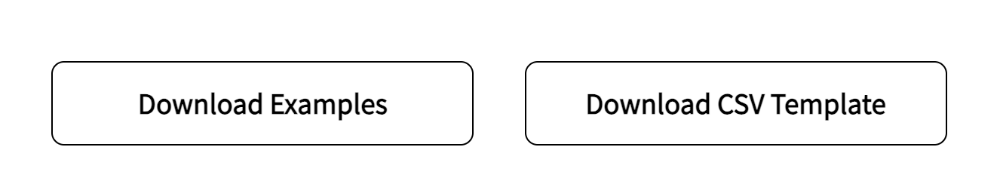
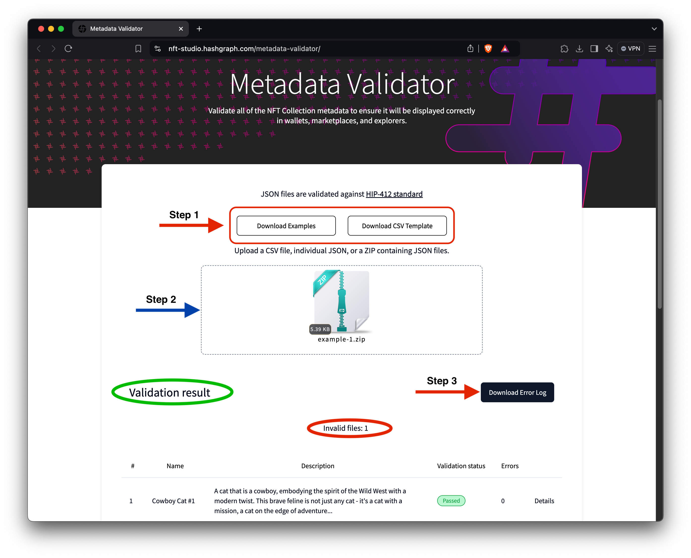

# Metadata Validator

The [Metadata Validator](https://nft-studio.hashgraph.com/metadata-validator/) is built to check your NFT metadata against the [HIP-412](https://hips.hedera.com/hip/hip-412) _(NFT Token Metadata JSON Schema v2)_ standards, ensuring proper representation. You can validate metadata by uploading a CSV file, a single JSON file, or a zip file containing multiple JSON files. The tool identifies errors or missing fields, allowing for easy corrections and ensuring compliance with standards. This tutorial will guide you through uploading, validating, and correcting your NFT metadata for seamless compliance.

<table data-view="cards"><thead><tr><th align="center"></th><th data-hidden data-card-cover data-type="files"></th><th data-hidden data-card-target data-type="content-ref"></th></tr></thead><tbody><tr><td align="center"><a href="https://nft-studio.hashgraph.com/metadata-validator/"><strong>Metadata Validator Web App</strong></a></td><td><a href="../../.gitbook/assets/nft-metadata-validator-icon.png">nft-metadata-validator-icon.png</a></td><td><a href="https://nft-studio.hashgraph.com/metadata-validator/">https://nft-studio.hashgraph.com/metadata-validator/</a></td></tr><tr><td align="center"><a href="https://github.com/hedera-dev/metadata-validator"><strong>Metadata Validator Repo</strong></a></td><td><a href="../../.gitbook/assets/github-cards-icon.png">github-cards-icon.png</a></td><td><a href="https://github.com/hedera-dev/metadata-validator">https://github.com/hedera-dev/metadata-validator</a></td></tr><tr><td align="center"><p><a href="https://hips.hedera.com/hip/hip-412"><strong>HIP-412: Metadata Standard</strong></a></p><p><br></p></td><td><a href="../../.gitbook/assets/nft-studio-hedera-hip-icon.png">nft-studio-hedera-hip-icon.png</a></td><td><a href="https://hips.hedera.com/hip/hip-412">https://hips.hedera.com/hip/hip-412</a></td></tr></tbody></table>

***

## How to Use the NFT Metadata Validator



### Step 1: Download the Example Files

[Download](https://nft-studio.hashgraph.com/metadata-validator/examples/examples.zip) the example files. These files contain sample NFT metadata in various formats (zip, JSON, CSV) and will help you understand how to use the tool to validate your metadata.

<figure><figcaption></figcaption></figure>

### Step 2: Upload Metadata for Validation

If you're validating JSON metadata, drag the zip file with the JSON files into the "upload a file" drop area. Once the zip file is successfully uploaded, the tool will process all the JSON files included in it. &#x20;

<details>

<summary><strong>JSON metadata example</strong></summary>


```json5
{
  "image": "Qma7YUAcUa4WZymcAJduafmpdmy34ZTpJpnbLweVQ6p5cA",
  "type": "image/webp",
  "name": "Cowboy cat #7",
  "description": "A daring blend of the wild west and cyberpunk, this cat is a trailblazer in neon green and silver.",
  "attributes": [
    { "trait_type": "face", "value": "cybernetic eye patch" },
    { "trait_type": "hair", "value": "neon green cowboy hat" },
    { "trait_type": "body", "value": "metallic silver vest" },
    { "trait_type": "background", "value": "digital wild west" },
    { "trait_type": "personality", "value": "adventurous" }
  ]
}

```


</details>

Alternatively, you can upload the example CSV file downloaded earlier. If you are unfamiliar with JSON, using a CSV file can be a simpler way to format your metadata. When you upload the CSV file, the tool provides an option to convert the CSV into JSON files, which is the standard format for NFT metadata. This feature helps you create valid JSON files to use with your NFTs.

<details>

<summary><strong>CSV file example</strong></summary>


```csv
name,creator,creatorDID,description,image,type,properties,,attributes,,,,,
--,--,--,--,--,--,external_url,url,face,hair,body,background,head,personality
Cowboy Cat #1,,,"A cat that is a cowboy, embodying the spirit of the Wild West with a modern twist. This brave feline is not just any cat - it's a cat with a mission, a cat on the edge of adventure.",QmZVVALmDcoqgYmTJAqGUkyosEeMZYUdnar7m2z89QABwa,image/webp,,,holographic beard,white bucket cap,purple sweater with satchel,grey,gradient 2
Cowboy Cat #2,,,"An adventurous cat cowboy in the Wild West.",QmZ7EEZuqCqaxVUJwvbpGb7hXUaBZjUxzpAKk8Ld7ZjJTT,image/webp,,,smirking,black stetson,red bandana and blue jeans,desert,large sombrero
Cowboy Cat #3,,,"A cat ready for a night adventure, dressed in a cowboy outfit.",QmaNUz31TLU2SUgxVb3gPq82ZuQJq9yajMDJdWrWGdaXdP,image/webp,,,mysterious,hidden under a hat,cloaked figure,night desert,wearing a classic cowboy hat
Cowboy Cat #4,,,"A fearless cat cowboy standing boldly against the desert night.",QmXPXQaG27cFW7MS2pAj76njwHg3whfaZ8BY6NENz1ZECQ,image/webp,,,adventurous,visible under the moonlight,dark cloak with sheriff's badge,desert,wearing a cowboy hat with a wide brim
Cowboy Cat #5,,,"Ready for an adventure in the wild, wild west, Cowboy Cat #5 showcases a humorous and colorful style. This feline sheriff is all about fun and games, donning a bright red bandana and a shiny sheriff's badge.",,,,,smirking,brown cowboy hat,sheriff's badge,desert,bright red bandana
Cowboy Cat #6,,,"Embracing the mysteries of the wild west at night, Cowboy Cat #6 is all set for a nocturnal adventure. Dressed in a dark blue cowboy hat adorned with gold stars and a matching vest, this feline explorer is ready to roam the moonlit deserts.",QmSEp5ap1UZMKoYbc7xu7we5HWc9pov8CqJN4TjzTy47ec,image/webp,,,adventurous,dark blue cowboy hat with gold stars,dark blue with gold buttons,night desert,light blue neckerchief
Cowboy Cat #7,,,"A daring blend of the wild west and cyberpunk, this cat is a trailblazer in neon green and silver.",Qma7YUAcUa4WZymcAJduafmpdmy34ZTpJpnbLweVQ6p5cA,image/webp,,,cybernetic eye patch,neon green cowboy hat,metallic silver vest,digital wild west,,adventurous
Cowboy Cat #8,,,"Embodying the spirit of the Wild West, this cat cowboy stands as a symbol of traditional cowboy values, adorned with a wide-brimmed hat and a red bandana.",QmPie2bH6AaNu4xVKdSoQtK6VVM8owfsqojQpApiTddyD4,image/webp,,,welcoming smile,wide-brimmed cowboy hat,brown leather vest,desert landscape,red bandana
Cowboy Cat #9,,,"A confident cat cowboy standing in a desert landscape with cacti and a sunset in the background.",QmQZoDMLtoqrsDBCPy3bALCAfrNbAvNJqSmwBssACX13ya,image/webp,,,wide-brimmed,bandana,sheriff,desert sunset,confident
Cowboy Cat #10,,,"A playful cat cowboy with a calico or tortoiseshell fur pattern, holding a lasso in a typical western town.",QmcMjDcbysgnv9SKy48H7zXQfgEXQZK6QxQMRj9vG19Y8Z,image/webp,,,tilted cowboy,playful smirk,calico/tortoiseshell,western town,nice
Cowboy Cat #11,,,"A futuristic cat cowboy with cybernetic enhancements and neon lights, in a sci-fi western town.",QmcWCoXrXMyLcZ24hn8Wca87RMBEfDwUeE5CTfmhLGgvx5,image/webp,,,high-tech cowboy,cloak,calico/tortoiseshell,neon-lit western town,cybernetic
```



</details>

<figure><figcaption></figcaption></figure>

### Step 3: Review Validation Results

After processing, the tool will return a list of the validation results for each NFT in the file (see the above image in [Step 2](metadata-validator.md#step-2-upload-metadata-for-validation)). It will indicate whether the metadata passes or fails the [HIP-412](https://hips.hedera.com/hip/hip-412)  standards tests.&#x20;

<figure><figcaption></figcaption></figure>

If an NFT fails validation, you can download an [error log](metadata-validator.md#error-log) for a complete list of validation errors.


```
File Name: 7.json
Errors:
- The required "type" field is missing.
- The required "image" field is missing.
```


Or click the [Details](metadata-validator.md#details) link to see the specific errors for each NFT in the validation results list. For example, in the video demo, one NFT fails validation due to a missing **"type"** field and an absent **"image"** field. You will use these results to correct the errors in your NFT's metadata in the next step.

<figure><figcaption></figcaption></figure>

### Step 4: Resolve the Errors in the Metadata File&#x20;

Before proceeding with your NFTs, ensure all required fields are present and meet the HIP-412 standards. Open the CSV file, update the missing "**type**" and "**image**" fields, and save the file. Upload your updated metadata file to the validator tool to confirm that the errors have been resolved.

<figure><figcaption><p>CSV file</p></figcaption></figure>

<details>

<summary><strong>Use Cases</strong></summary>

* Before minting your NFTs on Hedera, use the Metadata Validator to ensure all metadata meets HIP-412 standards, preventing errors during token creation.
* If you have a large collection, you can validate multiple JSON files simultaneously by uploading them as a `.zip` file, saving time in verifying consistency across all NFTs.
* The tool provides a step-by-step report on any errors or missing fields, allowing you to make corrections and re-upload your file until compliance is achieved, ensuring a smooth minting process.

</details>

#### 🎉 Awesome! Your NFT metadata is now fully validated and compliant with HIP-412 standards. Up next, assess the uniqueness of your NFTs with the Rarity Inspector.

***

## Additional Resources

* [**Download Metadata CSV Template**](https://nft-studio.hashgraph.com/metadata-validator/templates/csv-template.csv)
* [**HashScan Network Explorer**](https://hashscan.io/)
* [**Hedera Testnet HBAR Faucet**](https://portal.hedera.com/faucet)&#x20;
* [**Hedera Developer Portal Account**](https://portal.hedera.com/)
* [**Hedera Improvement Proposals (HIPs)**](https://hips.hedera.com/)
* [**Create and Transfer Your First Hedera NFT**](../../tutorials/token/create-and-transfer-your-first-nft.md)
