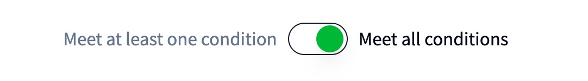

# NFT Token Holders List Builder

The [NFT Token Holders List Builder](https://nft-studio.hashgraph.com/token-holders-list-builder/) streamlines the process of compiling a list of wallet accounts based on specific token ownership criteria, making airdrops and community engagement more targeted and efficient. You can specify one or more token IDs to filter eligible accounts and set conditions like minimum token holdings, duration of ownership, or even a specific start date for holding the NFT. This tool enables you to easily build a tailored list of accounts that qualify for your new token distribution or NFT collection drop.

<table data-card-size="large" data-view="cards"><thead><tr><th align="center"></th><th data-hidden data-card-target data-type="content-ref"></th><th data-hidden data-card-cover data-type="files"></th></tr></thead><tbody><tr><td align="center"><a href="https://nft-studio.hashgraph.com/token-holders-list-builder/"><strong>NFT Token Holders List Builder Web App</strong></a></td><td><a href="https://nft-studio.hashgraph.com/token-holders-list-builder/">https://nft-studio.hashgraph.com/token-holders-list-builder/</a></td><td><a href="../../.gitbook/assets/nft-token-holders-list-builder-icon .png">nft-token-holders-list-builder-icon .png</a></td></tr><tr><td align="center"><a href="https://github.com/hedera-dev/token-holders-list-builder"><strong>NFT Token Holders List Builder Repo</strong></a></td><td><a href="https://github.com/hedera-dev/nft-token-holders-list-builder">https://github.com/hedera-dev/nft-token-holders-list-builder</a></td><td><a href="../../.gitbook/assets/github-cards-icon.png">github-cards-icon.png</a></td></tr></tbody></table>

***

## How to Use the NFT Token Holders List Builder



### Enter the Token ID and Parameters &#x20;

Enter the token ID for the NFT project you want to analyze. For this demo, we'll use the [HANGRY BABOONS](https://www.hangry.net/) collection (ID: [`0.0.1350444`](https://hashscan.io/mainnet/token/0.0.1350444)). Next, set the minimum number of NFTs each account must hold. For example, to identify holders with _at least two_ HANGRY BABOONS NFTs set the token amount to _2_.

<figure><figcaption></figcaption></figure>

### Specify a Holding Duration (Optional)

To refine your results further, you can add a duration filter. Specify the date from which token holders must have held the NFTs or set a holding period (e.g., in days, weeks, or months). If this field is left blank, the list will include all token holders, regardless of how long they have held their NFTs.

<figure><figcaption></figcaption></figure>

<figure><figcaption></figcaption></figure>

### Add Additional Filters

To create a more refined list, you can add additional filters for other NFT projects. For this example, let's add a filter that requires holders to own at least two NFTs from the [Dead Pixels Ghost Club](https://www.deadpixels.club/) collection. By default, the tool is set to meet all conditions, meaning accounts must match all specified criteria to be included in the final list. In this case, an account must own two [HANGRY BABOONS](https://www.hangry.net/) NFTs and two Dead Pixels Ghost Club NFTs to be added to the list.&#x20;

<figure><figcaption></figcaption></figure>

Alternatively, you can toggle the filter to meet at least one condition, returning any accounts that meet at least one of the filters. In this case, the account would only need to own two NFTs from one of the two specified collections.

<figure><figcaption></figcaption></figure>

### Generate List

After setting all your filters, click Build List to generate your list. The tool will then aggregate the account IDs that match your specified criteria. For example, with the filters applied above, the tool might return a list of 140 account IDs that meet all conditions.

<figure><figcaption></figcaption></figure>


#### **Tip: Verify Token Holders for Airdrops**

You can use the compiled list of account IDs in other tools, like the [Airdrop List Verifier](airdrop-list-verifier.md), to check if these accounts are eligible to receive tokens. This helps streamline the process of planning token distribution to your NFT community.


<strong>Understanding the Results</strong>

After building your list, the tool provides a breakdown of eligible accounts, showing:

* The Hedera account IDs that meet your criteria.
* The number of tokens held by each account, confirming their eligibility based on the conditions you set.

<strong>Use Cases &#x26; Best Practices</strong>

1. Before airdropping tokens for a new NFT release, use the Token Holders List Builder to compile a list of eligible accounts that already hold specific NFTs in your ecosystem.
2. Create exclusive airdrops or rewards for accounts that have held tokens for a set duration, building loyalty and community trust.
3. Identify and reward users who own NFTs across multiple collections (e.g., holders of both Token A and Token B) to encourage diverse ownership and participation.

**Best Practices:**

* Always ensure the token IDs entered are correct to avoid including unintended accounts.
* For large airdrops, do a test run with a smaller account list to verify that all criteria and results are working as expected.
* Save the exported results securely, as the eligible list is essential for executing your airdrop accurately.

#### 🎉 Well done! You've compiled a list of your token holders for targeted engagement. Next, evaluate your NFT collection's potential vulnerabilities using the Risk Calculator.

***

## Additional Resources

* [**HashScan Network Explorer**](https://hashscan.io/)
* [**Hedera Testnet HBAR Faucet**](https://portal.hedera.com/)
* [**HANGRY BABOONS Collection**](https://www.hangry.net/)
* [**Dead Pixels Ghost Club Collection**](https://www.deadpixels.club/)
* [**Create and Transfer Your First Hedera NFT**](../../tutorials/token/create-and-transfer-your-first-nft.md)
