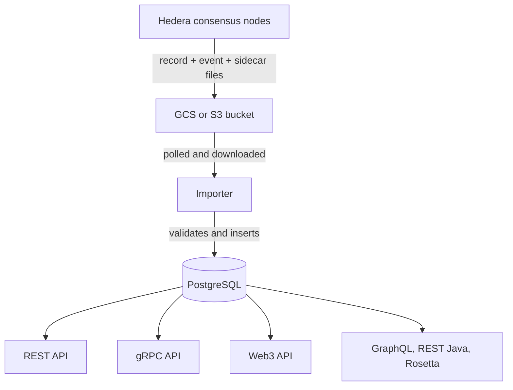

A Hedera mirror node is several services that share a PostgreSQL database. Consensus nodes write record and event files (plus sidecar files for richer smart contract data) to cloud object storage. The mirror node pulls those files down, validates them, populates the database, and exposes the data through several APIs.

Repo: [`hiero-ledger/hiero-mirror-node`](https://github.com/hiero-ledger/hiero-mirror-node). License: Apache-2.0.

## Component overview

## The pieces, by role

### Importer

The data-ingestion service. Polls the configured cloud bucket (GCS for the Hedera-hosted mirror nodes; S3 is also supported), pulls down each new file, verifies signatures match the network's supermajority, parses contents, and writes rows into PostgreSQL.

Implemented in Java with Spring Boot. This is the most resource-intensive component because signature verification and high-volume inserts both happen here. Run it via the project's Gradle target (`./gradlew :importer:run`) or the official Docker image.

### PostgreSQL database

A single Postgres instance (or cluster, in production) holds every parsed transaction, account state snapshot, token, topic message, smart contract event log, and address book change. Schemas track entity history so callers can read state at a specific consensus timestamp. Default port is `5432`.

The Hedera-hosted mainnet database is on the order of several terabytes. Self-hosters typically partition by consensus timestamp and prune older partitions to control disk.

### REST API

Default port `5551`. Exposes the standard Hedera mirror node endpoints documented under the [Mirror Node REST API](/hedera/sdks-and-apis/rest-api): `GET /api/v1/transactions/{id}`, `/accounts/{id}`, `/tokens/{id}`, `/contracts/{id}`, etc. Read-only, no authentication required, no transaction fees. This is the API most application code talks to.

### gRPC API

Default port `5600`. Streams Hedera Consensus Service topic messages as they're imported. Clients subscribe to a topic ID and receive messages in consensus order. SDKs (Java, Go, JavaScript) wrap this through their `TopicMessageQuery` API.

The public Hedera-hosted gRPC mirror endpoints require TLS and apply per-IP throttling.

### Web3 API

Answers the read-side of Ethereum's JSON-RPC: `eth_call`, `eth_getBalance`, `eth_getCode`, `eth_getStorageAt`, `debug_traceTransaction`. The JSON-RPC relay forwards these methods to the Web3 API instead of to consensus nodes, because consensus nodes don't keep historical state.

Together with the JSON-RPC relay, the Web3 API is what makes EVM tooling work against Hedera.

### Other services

The repo also ships GraphQL, REST Java, Rosetta, and Monitor services. They share the same database and are independently deployable; each is its own subdirectory in the repo (`graphql/`, `rest-java/`, `rosetta/`, `monitor/`). Most self-hosters don't run them unless they have a specific reason.

## How data flows for a single transaction

1. A client submits a transaction to a consensus node.
2. Consensus nodes reach agreement, assign a consensus timestamp, and execute the transaction.
3. After the record-file close interval, the consensus node uploads the record file, its signature, and any sidecar files to the cloud bucket.
4. The importer pulls the file, verifies signatures, parses the record, writes rows to PostgreSQL.
5. The transaction is now visible at `GET /api/v1/transactions/{id}` and via the gRPC and Web3 APIs.

End-to-end latency from network consensus to mirror node visibility is usually a few seconds.

## See also

<CardGroup cols={2}>
  <Card title="Mirror Node REST API" icon="code" href="/hedera/sdks-and-apis/rest-api">
    Full endpoint reference for the REST API surface.
  </Card>
  <Card title="Run your own mirror node" icon="server" href="/operators/mirror-node/run-your-own/index">
    GCS- or S3-backed deployment guide for hosting your own mirror node.
  </Card>
</CardGroup>
