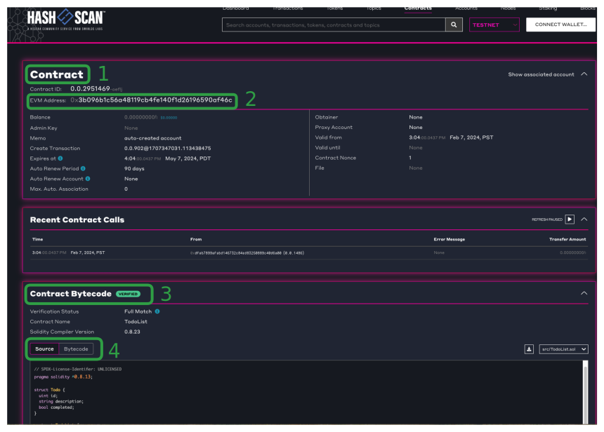

# How to Deploy and Verify a Hedera Smart Contract with Foundry

## What you will accomplish

* [ ] Deploy your smart contract to Hedera Testnet and automatically verify
* [ ] Verify a pre-existing smart contract on Hedera Testnet
* [ ] Check the verification status of a smart contract

## Prerequisites

Before you begin, you should be familiar with the following:

* [JavaScript](https://developer.mozilla.org/en-US/docs/Web/JavaScript)
* [Solidity](https://docs.soliditylang.org/en/latest/)
* [Foundry](https://book.getfoundry.sh/)

<details>

<summary>Also, you should have the following set up on your computer ⬇</summary>

* [x] `git` installed
  * Minimum version: 2.37
  * Recommended: [Install Git (Github)](https://github.com/git-guides/install-git)
* [x] A code editor or IDE
  * Recommended: [VS Code. Install VS Code (Visual Studio)](https://code.visualstudio.com/docs/setup/setup-overview)
* [x] NodeJs + npm installed
  * Minimum version of NodeJs: 18
  * Minimum version of npm: 9.5
  * Recommended for Linux & Mac: [nvm](https://github.com/nvm-sh/nvm)
  * Recommended for Windows: [nvm-windows](https://github.com/coreybutler/nvm-windows)
* [x] foundry `forge` and `cast` installed
  * `forge` Minimum version: 0.2.0 (3cdee82 2024-02-15T00:19:38.655803000Z)
  * `cast` Minimum version: 0.2.0 (3cdee82 2024-02-15T00:19:38.543163000Z)

</details>

<details>

<summary>Check your prerequisites set up ⬇</summary>

Open your terminal, and enter the following commands.

```shell
git --version
code --version
node --version
npm --version
forge --version
cast --version
```

Each of these commands should output some text that includes a version number, for example:

```
git --version
git version 2.39.2 (Apple Git-143)

code --version
1.81.1
6c3e3dba23e8fadc360aed75ce363ba185c49794
arm64

node --version
v20.6.1

npm --version
9.8.1

forge --version
0.2.0 (3cdee82 2024-02-15T00:19:38.655803000Z)

cast --version
0.2.0 (3cdee82 2024-02-15T00:19:38.543163000Z)

```

If the output contains text similar to `command not found`, please install that item.

</details>

***

## Get started

### Set up project

To follow along, start with the `main` branch, which is the _default branch_ of this repository. This gives you the initial state from which you can follow along with the steps as described in the tutorial.

`forge` manages dependencies by using git submodules. Clone the following project and pass `--recurse-submodules` to the `git clone` command to automatically initialize and update the submodule in the repository.

```shell
git clone --recurse-submodules git@github.com:hedera-dev/foundry-deploy-and-verify-smart-contract.git
```

<details>

<summary>Alternative with `git` and HTTPS</summary>

If you haven't [configured SSH](https://docs.github.com/en/authentication/connecting-to-github-with-ssh) to work with `git`, you may wish use this command instead:

```shell
git clone --recurse-submodules https://github.com/hedera-dev/foundry-deploy-and-verify-smart-contract.git
```

</details>

### Install the submodule dependencies

In your terminal, enter the projects root directory

```shell
cd foundry-deploy-and-verify-smart-contract  
```

Next, run the following command to install the dependencies

```shell
forge install
```

### Obtain your ECDSA Hex Encoded Private Key

In order to deploy your smart contract you will need access to your ECDSA hex encoded private key. You can find your ECDSA hex encoded private key by logging into [Hedera Portal](https://portal.hedera.com).

If you need to create a Hedera account, follow the [create a hedera portal profile faucet](https://docs.hedera.com/hedera/getting-started/introduction#create-hedera-portal-profile-faucet) tutorial.


Keep your private key accessible as it will be needed in the following steps.


### Choose your Testnet RPC\_URL

Choose one of the options over at [How to Connect to Hedera Networks Over RPC](https://docs.hedera.com/hedera/tutorials/more-tutorials/json-rpc-connections)


Keep the Testnet RPC\_URL accessible as it will be needed in the next step.


### Deploy and Automatically Verify Your Contract on Hedera Testnet

In your terminal, replace the value of `"HEX_Encoded_Private_Key"` with your `ECDSA` account's private key and replace `"RPC_URL"` with a Testnet URL in the command below:

```shell
forge create --rpc-url "RPC_URL" --private-key "HEX_Encoded_Private_Key" --verify --verifier sourcify --verifier-url https://server-verify.hashscan.io src/TodoList.sol:TodoList
```

<details>

<summary>Example forge create command</summary>

```shell
forge create --rpc-url https://testnet.hashio.io/api --private-key 0x348ce564d427a3317b6536bbcff9290d69395b06ed6c486954e971d960fe87ac --verify --verifier sourcify --verifier-url https://server-verify.hashscan.io src/TodoList.sol:TodoList
```

</details>


Sourcify is a Solidity source code and metadata verification tool.

Hashscan is a Hedera Mirror Node Explorer that integrates with Sourcify to provide a verification service located at `https://server-verify.hashscan.io`.

[Learn more](https://docs.hedera.com/hedera/core-concepts/smart-contracts/verifying-smart-contracts-beta)


You should see output similar to the following:

```
[⠒] Compiling...
[⠔] Compiling 22 files with 0.8.23
[⠘] Solc 0.8.23 finished in 3.43s
Compiler run successful!
Deployer: 0xdfAb7899aFaBd146732c84eD83250889C40d6A00
Deployed to: 0x3b096B1c56A48119CB4fe140F1D26196590aF46C
Transaction hash: 0x32f6a03b569a934d8d1e20bb29a20fe1008f0b3bf9ab41e1f26ed88bb28b3c05
Starting contract verification...
Waiting for sourcify to detect contract deployment...
Start verifying contract `0x3b096B1c56A48119CB4fe140F1D26196590aF46C` deployed on 296

Submitting verification for [TodoList] "0x3b096B1c56A48119CB4fe140F1D26196590aF46C".
Contract successfully verified
```

Open the Hashscan explorer in your browser by copying the **Deployed to** EVM address and replacing `<Deployed_Contract_EVM_Address>` in the link below:

```
https://hashscan.io/testnet/contract/<Deployed_Contract_EVM_Address>
```


Example: `https://hashscan.io/testnet/contract/0x3b096B1c56A48119CB4fe140F1D26196590aF46C`


<figure><figcaption><p>Hashscan shows verified smart contract</p></figcaption></figure>

You should see a page with:

* The title "Contract" **(1)**
* An "EVM Address" field that matches the value of `Deployed To` in the output above. **(2)**
* A section titled "Contract Bytecode" with a green `verified` tag. **(3)**
* Two tabs titled "Source" and "Bytecode". **(4)**

### Verify A Pre-Existing Contract on Testnet

You may have a pre-existing contract that has not been verified yet.


Deploy a contract without verifying by running this command in your terminal:

```shell
forge create --rpc-url "RPC_URL" --private-key "HEX_Encoded_Private_Key" src/TodoList.sol:TodoList
```


In order to verify a pre-existing smart contract you will need:

* the contract EVM address with `0x` prefix
* the contract name or path to the contract
* the chain ID

In your terminal, replace `<CONTRACT_ADDRESS>` with the contract EVM address you wish to verify.

```shell
forge verify-contract --chain-id 296 --verifier sourcify --verifier-url https://server-verify.hashscan.io  <CONTRACT_ADDRESS> src/TodoList.sol:TodoList
```


* The chain ID for Mainnet is `295`.
* The chain ID for Testnet is `296`, which is what you are using.
* The chain ID for Previewnet is `297`.


You should see output similar to the following:

```
Start verifying contract `0xC08d3Cf01739C713BaD1cf65FD4127CB90550568` deployed on 296

Submitting verification for [TodoList] "0xC08d3Cf01739C713BaD1cf65FD4127CB90550568".
Contract successfully verified
```

### Check Contract Verification Status

In your terminal, replace `<CONTRACT_ADDRESS>` with the contract EVM address you wish to verify.

```shell
forge verify-check --chain-id 296 --verifier sourcify --verifier-url https://server-verify.hashscan.io <CONTRACT_ADDRESS>
```

You should see output similar to the following:

```
Checking verification status on 296
Contract successfully verified
```

## Complete

Congratulations, on completing the tutorial on how to verify smart contracts on Hedera Testnet.

You have learned how to:

* [x] Deploy your smart contract to Hedera Testnet and Automatically Verify
* [x] Verify a pre-existing smart contract on Hedera Testnet
* [x] Check a smart contracts verification status

***

<table data-card-size="large" data-view="cards"><thead><tr><th align="center"></th><th data-hidden data-card-target data-type="content-ref"></th></tr></thead><tbody><tr><td align="center"><p>Writer: Abi Castro, DevRel Engineer</p><p><a href="https://github.com/a-ridley">GitHub</a> | <a href="https://linkedin.com/in/abixcastro">LinkedIn</a></p></td><td><a href="https://linkedin.com/in/abixcastro">https://linkedin.com/in/abixcastro</a></td></tr></tbody></table>
