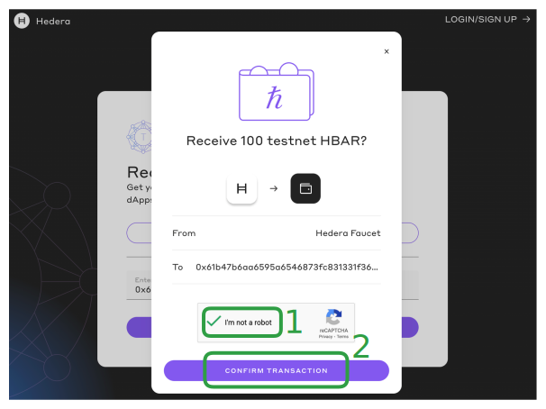
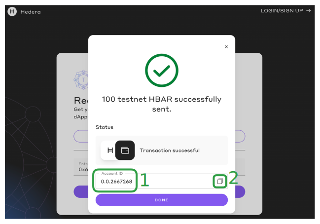

# Create and fund account

## Why you need to create and fund an account

Hedera is a distributed ledger technology (DLT). To interact with it, you will need to send transactions to the network, which will then process them and add them to the ledger if they are deemed to be valid. On most web services (web2), you need to authenticate using usernames and passwords to operate your account. On DLTs such as Hedera, it is similar, except that you will need to use cryptographic keys instead of passwords to operate your account. One key difference is that unlike web2, each interaction needs to be paid for using the native currency of the DLT, which is similar to micro-transactions. On Hedera, this currency is HBAR.

### What you will accomplish

* [ ] Generate cryptographic keys to be used by a Hedera account
* [ ] Use the Hedera Faucet to create and fund a new account with Testnet HBAR

***

## Prerequisites

Before you begin, you should be familiar with the following:

* [x] [JavaScript syntax](https://www.w3schools.com/js/js\_syntax.asp)

<details>

<summary>Also, you should have the following set up on your computer <strong>⬇</strong></summary>

* [x] POSIX-compliant shell
  * For Linux & Mac: The shell that ships with the operating system will work. Either `bash` or `zsh` will work.
  * For Windows: The shells that ship with the operating system (`cmd.exe`, `powershell.exe`) _will not_ work.
    * Recommended: `git-bash` which ships with `git-for-windows`. [Install Git for Windows (Git for Windows)](https://gitforwindows.org/)
    * Recommended (alternative): Windows Subsystem for Linux. [Install WSL (Microsoft)](https://learn.microsoft.com/en-us/windows/wsl/install)
* [x] `git` installed
  * Minimum version: 2.37
  * Recommended: [Install Git (Github)](https://github.com/git-guides/install-git)
* [x] A code editor or IDE
  * Recommended: VS Code. [Install VS Code (Visual Studio)](https://code.visualstudio.com/docs/setup/setup-overview)
* [x] NodeJs + `npm` installed
  * Minimum version of NodeJs: 18
  * Minimum version of `npm`: 9.5
  * Recommended for Linux & Mac: [`nvm`](https://github.com/nvm-sh/nvm)
  * Recommended for Windows: [`nvm-windows`](https://github.com/coreybutler/nvm-windows)

</details>

***

## Get started

### Set up project

To follow along, start with the `main` branch, which is the _default branch_ of this repo. This gives you the initial state from which you can follow along with the steps as described in the tutorial.

```shell
git clone https://github.com/hedera-dev/hello-future-world.git
```

<details>

<summary>Alternative with `git` and SSH</summary>

If you have [configured SSH](https://docs.github.com/en/authentication/connecting-to-github-with-ssh) to work with `git`, you may wish use this command instead:

```shell
git clone git@github.com:hedera-dev/hello-future-world.git
```

</details>

In the terminal, from the `hello-future-world` directory, enter the subdirectory for this sequence.

```shell
cd 00-create-fund-account/
```

Install the dependencies using `npm`.

```shell
npm install
```

### Create your .env file

Make a `.env` file by copying the provided `.env.sample` file. Then open the `.env` file in a code editor, such as VS Code.

```shell
cp .env.sample .env
```

### Checkpoint

<details>

<summary>Check your prerequisites and project set up <strong>⬇</strong></summary>

In your terminal, enter the following command.

```sh
node checkpoint-setup.js
```

This script checks multiple set up related items, and should produce output like this:

```
git check:
OK!
git version check:
OK!
node version check:
OK!
npm version check:
OK!
npm install check:
OK!
.env file check:
OK!
shell check:
OK!
```

If the output contains any errors, please address them before continuing with the rest of this sequence.

</details>

### Generate seed phrase

In the terminal, run the following command:

```shell
npx mnemonics@1.1.3
```

This should output a **seed phrase**, a list of 12 randomly selected dictionary words, for example:

```
artefact gasp crop double silk grid visual gather argue glow melody net
```

<details>

<summary>Alternative way to generate a seed phrase</summary>

* Visit [https://iancoleman.io/bip39/](https://iancoleman.io/bip39/)
* Select `12` from the dropdown next to the _GENERATE_ button
* Press the _GENERATE_ button
* Copy the seed phrase from the text field labelled _BIP39 Mnemonic_.

</details>


Note that [`mnemonics`](https://www.npmjs.com/package/mnemonics/v/1.1.3) is a tool that generates [BIP-39 seed phrases](https://github.com/bitcoin/bips/blob/master/bip-0039.mediawiki), and your seed phrase will be different from above.

If this is your first time running this command, you need to enter `y` to agree to do so:

```
Need to install the following packages:
mnemonics@1.1.3
Ok to proceed? (y)
```

This seed phrase will be used to generate the cryptographic keys for the accounts that you are about to create.


Copy the seed phrase. Replace `SEED_PHRASE` in the `.env` file with it. The file contents should now look similar to this:


```shell
SEED_PHRASE="artefact gasp crop double silk grid visual gather argue glow melody net"
ACCOUNT_PRIVATE_KEY=YOUR_HEX_ENCODED_PRIVATE_KEY
ACCOUNT_ID=YOUR_ACCOUNT_ID
RPC_URL=YOUR_JSON_RPC_URL
```


You do not need to modify the other values in the `.env` file yet.

_**Be sure to save your files before moving on to the next step.**_

***

## Write the script

An almost-complete script has already been prepared for you, and you will only need to make a few modifications (outlined below) for it to run successfully.

Open the script file, `script-create-fund-account.js`, in a code editor.


To follow along in the tutorial, when asked to modify code, look for a comment to locate the specific lines of code which you will need to edit.

For example, the comment for **Step 1** looks like this:

```javascript
    // Step (1) in the accompanying tutorial
```


### Step 1: Derive private key

The `ethersHdNode` module has been imported from [EthersJs](https://docs.ethers.org/v5/). This takes a seed phrase as input, and outputs a private key. To do so, invoke the `fromMnemonic()` method and pass in `process.env.SEED_PHRASE` as the parameter:


```javascript
    const hdNodeRoot = ethersHdNode.fromMnemonic(process.env.SEED_PHRASE);
```



You will need to delete the inline comment that looks like this: `/* ... */`. Replace it with the correct code. For example, in this step, the change looks like this:

```diff
-    const hdNodeRoot = ethersHdNode.fromMnemonic(/* ... */);
+    const hdNodeRoot = ethersHdNode.fromMnemonic(process.env.SEED_PHRASE);
```


The `hdNodeRoot` instance is subsequently used to generate the private keys.

### Step 2: Derive EVM address

A `privateKey` instance has been initialized. This requires no further input to derive an EVM address - read its `publicKey` property, and then invoke its `toEvmAddress` method:


```javascript
    const evmAddress = `0x${privateKey.publicKey.toEvmAddress()}`;
```


***

## Run the script

In the terminal, run the script using the following command:

```shell
node script-create-fund-account.js
```

This should produce output similar to the following:

```
privateKeyHex: 0x0ac20a3c1573ba9a5c6c69349fa51f40bd502cf250e226a7100869338f15aae2
evmAddress: 0x61b47b6aa6595a6546873fc831331f36639c906f
accountExplorerUrl: https://hashscan.io/testnet/account/0x61b47b6aa6595a6546873fc831331f36639c906f
accountId: undefined
accountBalanceHbar: undefined
```

Note that `accountId` and `accountBalanceHbar` are both `undefined`, because generating cryptographic keys alone is not enough to create an account - that only happens upon the first transaction.

Copy the value of `privateKeyHex`. Replace `YOUR_HEX_ENCODED_PRIVATE_KEY` in the `.env` file with it. The file contents should now look similar to this:


```shell
SEED_PHRASE="artefact gasp crop double silk grid visual gather argue glow melody net"
ACCOUNT_PRIVATE_KEY=0x0ac20a3c1573ba9a5c6c69349fa51f40bd502cf250e226a7100869338f15aae2
ACCOUNT_ID=YOUR_ACCOUNT_ID
RPC_URL=YOUR_JSON_RPC_URL
```


Copy the value of `accountExplorerUrl` and visit this in your browser.


You should see a page with:

* The title "Inactive EVM Address" **(1)**
* "Account ID: Assigned upon activation" **(2)**
* "EVM Address:" matching the value of `evmAddress` output earlier **(3)**
* A helpful hint saying "Own this account? Activate it by transferring any amount of ℏ or tokens to ..." **(4)**

This is precisely the next step!

***

## Transfer and activate account

Visit [`portal.hedera.com/faucet`](https://portal.hedera.com/faucet).


The faucet dispenses Testnet HBAR to any account on Hedera Testnet. When it is asked to dispense to an EVM address that does not yet have an account, the account gets created as part of the HBAR transfer transaction.



* Paste the value of `evmAddress` output earlier into the "enter wallet address" field **(1)**
* Press the "receive testnet HBAR" button **(2)**

A confirmation dialog will pop up.



* Complete the ReCaptcha **(1)**
* Press the "confirm transaction" button. **(2)**

A success dialog will pop up.



* The account ID is displayed **(1)**
  * This indicates that the Testnet HBAR has been transferred, and in the process a new account has been created.
  * Note that the EVM address is **not the same** as the account ID - instead the EVM address is **an alias** of the account ID.
* Press the icon to copy the account ID **(2)**

Replace `YOUR_ACCOUNT_ID` in the `.env` file with it. The file contents should now look similar to this:


```shell
SEED_PHRASE="artefact gasp crop double silk grid visual gather argue glow melody net"
ACCOUNT_PRIVATE_KEY=0x0ac20a3c1573ba9a5c6c69349fa51f40bd502cf250e226a7100869338f15aae2
ACCOUNT_ID=0.0.2667268
RPC_URL=YOUR_JSON_RPC_URL
```



You may have noticed that `RPC_URL` is unused throughout. This is intentional - as it will be used in some of the other Hello World sequences, so be sure to check them out after completing this one!


Refresh the Hashscan page in your browser. Note that this is the `accountExplorerUrl` that was output from the previous run of the script. This time you should see:


* The title is "Account" **(1)**
  * instead of "Inactive EVM Address"
* The "Account ID" field should matching the value of `ACCOUNT_ID` above **(2)**
  * instead of "Assigned upon activation"
* The "Create Transaction" field displays a transaction ID **(3)**

***

## Verify account creation and funding

In the terminal, re-run the script using the following command:

```shell
node script-create-fund-account.js
```

This should produce output similar to the following:

```
privateKeyHex: 0x0ac20a3c1573ba9a5c6c69349fa51f40bd502cf250e226a7100869338f15aae2
evmAddress: 0x61b47b6aa6595a6546873fc831331f36639c906f
accountExplorerUrl: https://hashscan.io/testnet/account/0x61b47b6aa6595a6546873fc831331f36639c906f
accountId: 0.0.2667268
accountBalanceHbar: 100.00000000
```

Note that this is almost the same as when you first ran the same script. The difference is that previously both `accountId` and `accountBalanceHbar` were `undefined`; and now `accountId` should now show a value (in the format of `0.0.XYZ`), and `accountBalanceHbar` should now show a number (with 8 decimal places). This is because the account has been created and funded.

***

🎉 _**Now you are ready to start using your Hedera Testnet account from the portal within script files on your computer!**_ 🎉

***

## Complete

Congratulations, you have completed the **create and fund account** Hello World sequence! 🎉🎉🎉

You have learned how to:

* [x] Generate cryptographic keys to be used by a Hedera account
* [x] Use the Hedera Faucet to create and fund a new account with Testnet HBAR

***

## Next Steps

Now that you have an account on Hedera Testnet and it is funded, you can interact with the Hedera network. Continue by following along with [the other Hello World sequences](./).

***

## Cheat sheet

<details>

<summary>Skip to final state</summary>

The repo, [`github.com/hedera-dev/hello-future-world`](https://github.com/hedera-dev/hello-future-world/), is intended to be used alongside this tutorial.

To skip ahead to the final state, use the `completed` branch. You may use this to compare your implementation to the completed steps of the tutorial.

```shell
git fetch origin completed:completed
git checkout completed
```

Alternatively, you may view the `completed` branch on Github: [`github.com/hedera-dev/hello-future-world/tree/completed/00-create-fund-account`](https://github.com/hedera-dev/hello-future-world/tree/completed/00-create-fund-account)

</details>

***

**Writer**: [Brendan](https://blog.bguiz.com/) **Editors**: [Abi](https://github.com/a-ridley), [Michiel](https://www.linkedin.com/in/michielmulders/), [Ryan](https://www.linkedin.com/in/ryaneh/), [Krystal](https://www.linkedin.com/in/theekrystallee/)
