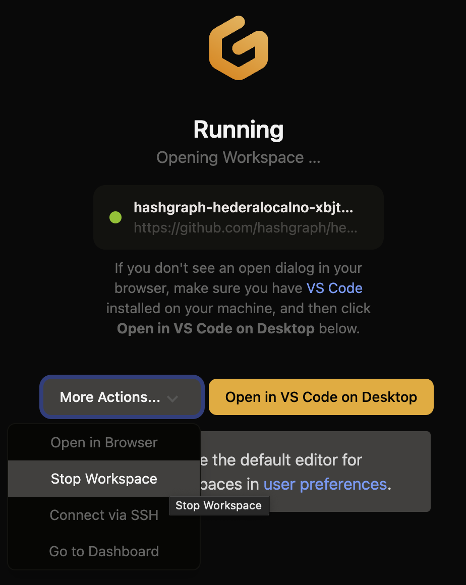

# Run a Local Node in Gitpod

The local network comprises the consensus node, mirror node, [JSON-RPC relay](https://github.com/hashgraph/hedera-json-rpc-relay#readme), and other Hedera services and now be set up without Docker and draining your computer’s resources by using Gitpod. Gitpod provides Cloud Development Environments (CDEs) and allows developers to work from any device without the need to maintain static and brittle local development environments. By the end of this tutorial, you will have your Hedera local node running on Gitpod.

***

## Prerequisites

* Signed into your GitHub account in your browser.
* [Register](https://gitpod.io/login/) a Gitpod account with your GitHub account.
* If this is your first time using Gitpod, please read the [Gitpod getting started](https://www.gitpod.io/docs/introduction/getting-started) guide.
* Install the browser extension: [Gitpod browser extension](https://www.gitpod.io/docs/configure/user-settings/browser-extension).
* The Mirror Node Web Explorer requires [VS Code Desktop](https://www.gitpod.io/docs/references/ides-and-editors/vscode) to be installed, as [VS Code Browser](https://www.gitpod.io/docs/references/ides-and-editors/vscode-browser) has limitations related to communicating with local ports, e.g. `http://127.0.0.1:5551/`.

***

## Set Up Gitpod Permissions

Enable `public_repo` permission for GitHub provider on [Gitpod’s Git integrations page](https://gitpod.io/user/integrations).

<figure><figcaption></figcaption></figure>

<figure><figcaption></figcaption></figure>

***

## Running the Hedera Local Node

The `hedera-local-node` project repository already has a Gitpod configuration file ([`.gitpod.yml`](https://github.com/hashgraph/hedera-local-node/blob/main/.gitpod.yml)), which makes it easy to run it within a workspace on Gitpod. Open the [Hedera Local Node repo](https://github.com/hashgraph/hedera-local-node). Click on the Gitpod `Open` button.

<figure><figcaption></figcaption></figure>

The Gitpod browser extension modifies the Github UI to add this button. This will spin up a new Gitpod workspace with your choice of CDE which will run the Hedera Local Node in your cloud environment.

### **Testing the Setup**

To confirm everything is running smoothly, run the `curl` commands below to query the mirror node for a list of accounts, query the JSON-RPC relay for the latest block, and open the mirror node explorer (HashScan) using the local endpoint ([http://localhost:8080/devnet/dashboard](http://localhost:8080/devnet/dashboard)).

**Mirror Node REST API**

The following command queries the Mirror Node for a list of accounts on your Hedera network.

```bash
curl "http://localhost:5551/api/v1/accounts" \
  -X GET
```

See the [Mirror Node interact API docs](https://testnet.mirrornode.hedera.com/api/v1/docs/) for a full list of available APIs.

**JSON RPC Relay**

The following command queries the RPC Relay for the latest block on your Hedera network.

```bash
curl "<http://localhost:7546>" \\
  -X POST \\
  -H "Content-Type: application/json" \\
  --data '{"method":"eth_getBlockByNumber","params":["latest",false],"id":1,"jsonrpc":"2.0"}'
```

See the [endpoint table](https://github.com/hashgraph/hedera-json-rpc-relay/blob/main/docs/rpc-api.md#endpoint-table) in `hedera-json-rpc-relay` for a full list of available RPCs.

**Mirror Node Explorer (Hashscan)**

Visit the local mirror node explorer endpoint ([http://localhost:8080/devnet/dashboard](http://localhost:8080/devnet/dashboard)) in your web browser. Ensure that `LOCALNET` is selected, as this will show you the Hedera network running within your Gitpod, and not one of the public nodes.

<figure><figcaption></figcaption></figure>

### Shut Down the Gitpod Workspace


**Note**: Gitpod usage is billed by the hour on paid plans, and hours are limited on the free plans. Therefore, once completed, remember to stop the Gitpod workspace.


<figure><figcaption></figcaption></figure>

***

## Conclusion and Additional Resources

Congrats on successfully setting up your Gitpod workspace and running a Hedera Local Node!&#x20;

**➡** [**Hedera Local Node Repository**](https://github.com/hashgraph/hedera-local-node#readme)

**➡** [**Gitpod Documentation**](https://www.gitpod.io/docs/introduction/getting-started)
