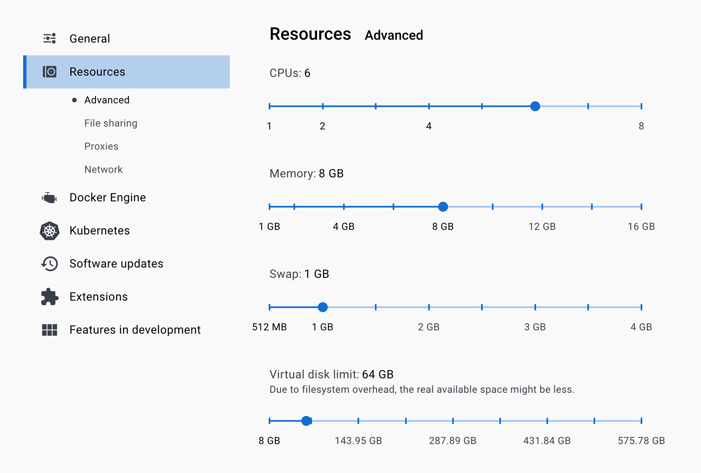
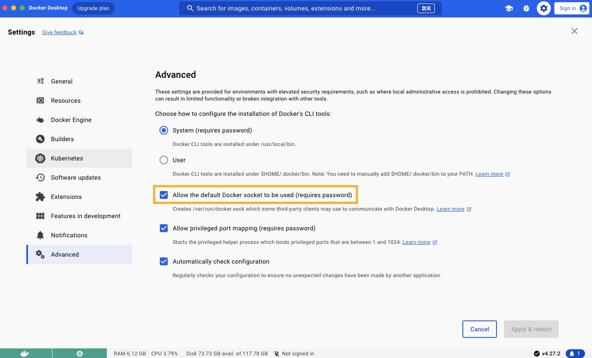

# How to Set Up a Hedera Local Node

The [**Hedera Local Node**](https://github.com/hashgraph/hedera-local-node) project enables developers to establish their own local network for development and testing. The local network comprises the consensus node, mirror node, [JSON-RPC relay](https://github.com/hashgraph/hedera-json-rpc-relay#readme), and other Hedera products, and can be set up using the CLI tool and Docker. This setup allows you to seamlessly build and deploy smart contracts from your local environment.

By the end of this tutorial, you'll be equipped to run a Hedera local node and generate keys, allowing you to test your projects and deploy projects in your local environment.

***

## Prerequisites

* [Node.js](https://nodejs.org/en) >= v14.x
* [NPM](https://docs.npmjs.com/downloading-and-installing-node-js-and-npm) >= v6.14.1&#x37;**\*\***
* Minimum 16GB RAM
* [Docker](https://www.docker.com/) >= v20.10.x
* [Docker Compose](https://docs.docker.com/compose/) >= v2.12.3
* Have Docker running on your machine with the correct configurations.

<details>

<summary><a href="https://github.com/hashgraph/hedera-local-node#requirements">Docker configuration 🛠️</a></summary>

Ensure the **`VirtioFS`** file sharing implementation is enabled in the docker settings.

.png>)

Ensure the following configurations are set at minimum in Docker **Settings** -> **Resources** and are available for use:

* **CPUs:** 6
* **Memory:** 8GB
* **Swap:** 1 GB
* **Disk Image Size:** 64 GB



Ensure the **`Allow the default Docker sockets to be used (requires password)`** is enabled in Docker **Settings -> Advanced**.



**Note:** The image may look different if you are on a different version

</details>

_**\*\***&#x4C;ocal node can be run using Docker or NPM but we will use Docker for this tutorial._ [_Here_](https://github.com/hashgraph/hedera-local-node#official-npm-release) _are the installation steps for NPM._&#x20;

***

## Table of Contents

1. [Start Your Local Network](how-to-set-up-a-hedera-local-node.md#start-your-local-network)
2. [Generate Keys](how-to-set-up-a-hedera-local-node.md#generate-keys)
3. [Stop Your Local Network](how-to-set-up-a-hedera-local-node.md#stop-your-local-network)
4. [Additional Resources](how-to-set-up-a-hedera-local-node.md#additional-resources)

***

## Start Your Local Network

Open a new terminal and navigate to your preferred directory where your Hedera Local Node project will live. Run the following command to clone the repo and install dependencies to your local machine:

```bash
git clone https://github.com/hashgraph/hedera-local-node.git
cd hedera-local-node
npm install
```

For Windows users: You will need to update the file endings of `compose-network/mirror-node/init.sh` by running this in WSL:

```bash
dos2unix compose-network/mirror-node/init.sh
```

Ensure Docker is installed and open on your machine before running this command to get the network up and running:

```bash
// starts and generates the first 30 accounts
npm run start -- -d

or

// will start local node but will not generate the first 30 accounts
docker compose up -d
```

***

## Generate Keys

To generate accounts with random private keys, run the `generate-accounts` command. Specify the number of accounts generated by appending the number to the `hedera generate-account` command. For example, to generate 5 accounts, run `hedera generate-accounts 5`.&#x20;

<details>

<summary><code>hedera generate-accounts 5</code> </summary>

```
Generating accounts in synchronous mode...
|-----------------------------------------------------------------------------------------|
|-----------------------------| Accounts list ( ECDSA  keys) |----------------------------|
|-----------------------------------------------------------------------------------------|
|    id    |                            private key                            |  balance |
|-----------------------------------------------------------------------------------------|
| 0.0.1033 - 0xced34a00d3fff542e350a5e61cb41509812bf23ea581f83a0a862c94d8c69704 - 10000 ℏ |
| 0.0.1034 - 0xa4189ab682ba43925ce654ca09800bba86cf8b1b7f889006d5170d95f4fed365 - 10000 ℏ |
| 0.0.1035 - 0xf9106e9841677136c9cbe8c114dab80470ca62a15bfe9c777006bcb114288c22 - 10000 ℏ |
| 0.0.1036 - 0xe3517a9235971be1e1f95e791f3ffd7d753a652799fa11f1ace626036c4db275 - 10000 ℏ |
| 0.0.1037 - 0x636926cf2f6f9fd0a58043c600390eeef0bbed9d4b8a113ea68a8d67f922d04e - 10000 ℏ |
|-----------------------------------------------------------------------------------------|

|--------------------------------------------------------------------------------------------------------------------------------------|
|------------------------------------------------| Accounts list (Alias ECDSA keys) |--------------------------------------------------|
|--------------------------------------------------------------------------------------------------------------------------------------|
|    id    |               public address               |                             private key                            | balance |
|--------------------------------------------------------------------------------------------------------------------------------------|
| 0.0.1038 - 0xaBE90e20f394629e054Bc1E8F1338Fe8ea94F0b5 - 0x444913bd258f764e62db6c87abde7ca52ec22985db8c91b8c3b2b4f2c51775f0 - 10000 ℏ |
| 0.0.1039 - 0x26d941d8E1f6bF9B0F7e5156fA6ff02acEd0DF3E - 0xea25f427caf7029989669f93926b7902dde5361b176b4bc17b8ec0a967beaa0b - 10000 ℏ |
| 0.0.1040 - 0x64001c2d1f3a8d3574435B4F125944018E2E584D - 0xf2deb678a1e67e288d8a128334f41c890e7600b2a5471ecc9a3af4824e3021b7 - 10000 ℏ |
| 0.0.1041 - 0x6bE22CD9D16b64969683B74897E4EBB30c7c30E8 - 0xb9c2480cdbdddb2ecd6e032b87820c29e8791ad4f53b89f829269d856c835819 - 10000 ℏ |
| 0.0.1042 - 0x992d8aD211b28B23589c0b3Fe30de6C90662C4aB - 0x7e8bb0d85a8d80fa2eb2c9f6bd5c9b1a2c2f9f6992c7fffd201c8e81f0ec0000 - 10000 ℏ |
|--------------------------------------------------------------------------------------------------------------------------------------|

|-----------------------------------------------------------------------------------------|
|-----------------------------| Accounts list (ED25519 keys) |----------------------------|
|-----------------------------------------------------------------------------------------|
|    id    |                            private key                            |  balance |
|-----------------------------------------------------------------------------------------|
| 0.0.1043 - 0xd4917e152ca922b8bfbafffc3486512ae25ec0a75b05c44f517b11cd12fd949b - 10000 ℏ |
| 0.0.1044 - 0xbaeec69382fbb43e4d521b3d8717c9cba610a1fbcaededaaf4408c3138a683ae - 10000 ℏ |
| 0.0.1045 - 0x1f5c4b2efd3c36d29e9d2e16a825abd001f99bff2388bb8c6011cd5f956023c9 - 10000 ℏ |
| 0.0.1046 - 0x1976acdd5e71ce7e8db4cb0aa112fa1c16876155f0f20b9b7029916073f1d67f - 10000 ℏ |
| 0.0.1047 - 0x6e29f48b11ffc77e277f0500d607b35956da58f1ed30aad003fb1846bfffc483 - 10000 ℏ |
|-----------------------------------------------------------------------------------------|
```

</details>


**Please note**: Since the first 10 accounts generated are with predefined private keys, if you need 5 generated with random keys, you will run `hedera start 15`. The same rule applies when you use the `hedera generate-accounts` command.


Grab any of the account private keys generated from the  _**Alias ECDSA keys Accounts list**_. This will be used as the `LOCAL_NODE_OPERATOR_PRIVATE_KEY` environment variable value in your `.env` file of your project.

***

## Stop Your Local Network

To stop your local node, you can run the `hedera stop` command. If you want to keep any files created manually in the working directory, please save them before executing this command.

<details>

<summary><code>hedera stop</code></summary>

```
Stopping the network...
Stopping the docker containers...
Cleaning the volumes and temp files...
```

</details>

Alternatively, run `docker compose down -v; git clean -xfd; git reset --hard` to stop the local node and reset it to its original state.

<details>

<summary><code>docker compose down -v; git clean -xfd; git reset --hard</code></summary>

```bash
[+] Running 27/27
 ✔ Container mirror-node-web3           Removed            3.5s 
 ✔ Container json-rpc-relay-ws          Removed           10.8s 
 ✔ Container mirror-node-monitor        Removed            3.7s 
 ✔ Container relay-cache                Removed            0.9s 
 ✔ Container prometheus                 Removed            0.9s 
 ✔ Container record-sidecar-uploader    Removed            0.0s 
 ✔ Container grafana                    Removed            0.9s 
 ✔ Container hedera-explorer            Removed           10.4s 
 ✔ Container json-rpc-relay             Removed           10.7s 
 ✔ Container account-balances-uploader  Removed            0.1s 
 ✔ Container envoy-proxy                Removed            1.0s 
 ✔ Container mirror-node-grpc           Removed            2.7s 
 ✔ Container mirror-node-rest           Removed           10.4s 
 ✔ Container network-node               Removed           10.8s 
 ✔ Container mirror-node-importer       Removed           10.4s 
 ✔ Container record-streams-uploader    Removed            0.0s 
 ✔ Container haveged                    Removed            0.0s 
 ✔ Container mirror-node-db             Removed            0.3s 
 ✔ Container minio                      Removed            0.0s 
 ✔ Volume prometheus-data               Removed            0.0s 
 ✔ Volume minio-data                    Removed            0.0s 
 ✔ Volume mirror-node-postgres          Removed            0.1s 
 ✔ Volume grafana-data                  Removed            0.2s 
 ✔ Network network-node-bridge          Removed            0.1s 
 ✔ Network hedera-local-node_default    Removed            0.2s 
 ✔ Network cloud-storage                Removed            0.2s 
 ✔ Network mirror-node                  Removed            0.2s 
Removing .husky/_/
Removing network-logs/
Removing node_modules/
HEAD is now at ......
```

</details>

_**📣 Note**: All available commands can be checked out_ [_here_](https://github.com/hashgraph/hedera-local-node/tree/main?tab=readme-ov-file#using-hedera-local)_._

***

## Additional Resources

**➡** [**Hedera Local Node Repository**](https://github.com/hashgraph/hedera-local-node#readme)

**➡** [**Hedera Local Node CLI Tool Commands**](https://github.com/hashgraph/hedera-local-node#using-hedera-local)

**➡** [**Hedera Local Node Docker Setup** ](https://www.youtube.com/watch?v=KOhzu6ftmbY)**\[Video Tutorial]**
