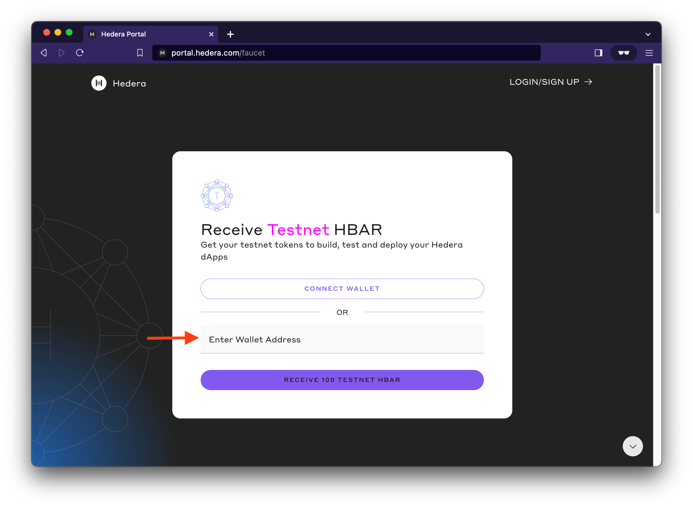
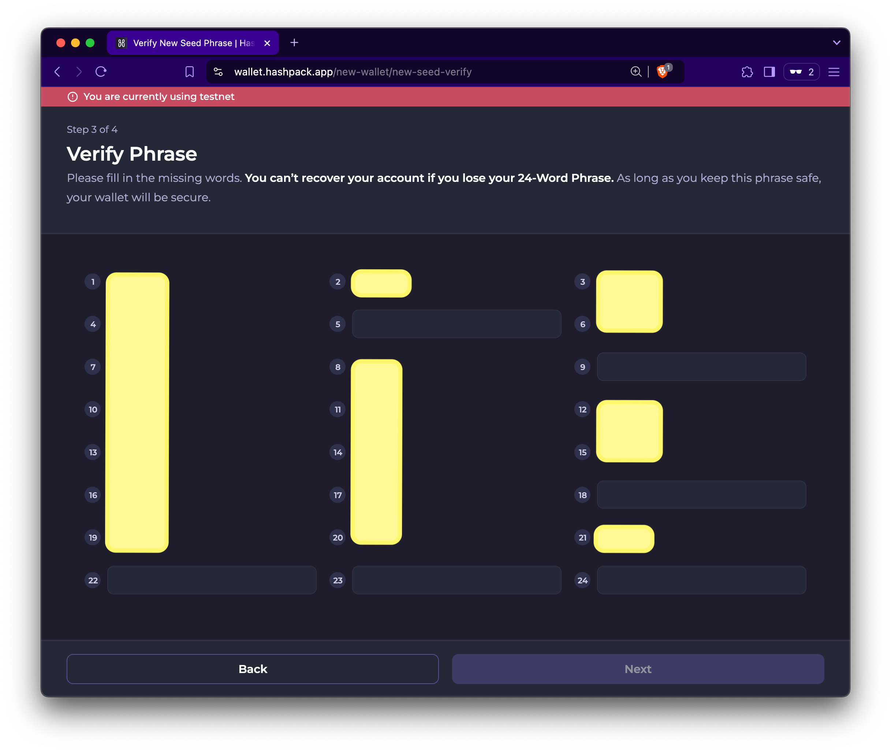

# Create and Fund Your Hedera Testnet Account

To interact with the Hedera network, you’ll need a testnet account funded with HBAR. [Hedera accounts](../../core-concepts/accounts/) are essential for accessing the [Hedera APIs](https://docs.hedera.com/hedera/sdks-and-apis/hedera-api) and paying for transactions and queries with HBAR. This guide outlines three ways to create and fund your testnet account.&#x20;

Explore the options below to choose the one that fits your needs **⬇**:

<table data-view="cards"><thead><tr><th align="center"></th><th></th><th data-hidden data-card-cover data-type="files"></th><th data-hidden data-card-target data-type="content-ref"></th></tr></thead><tbody><tr><td align="center"><a href="create-and-fund-your-hedera-testnet-account.md#option-1-hedera-developer-portal"><strong>Hedera Developer Portal</strong></a></td><td>Login required. Provides the highest initial HBAR balance and advanced account management tools.</td><td><a href="../../.gitbook/assets/testnet access.png">testnet access.png</a></td><td><a href="create-and-fund-your-hedera-testnet-account.md#option-1-hedera-developer-portal">#option-1-hedera-developer-portal</a></td></tr><tr><td align="center"><a href="create-and-fund-your-hedera-testnet-account.md#option-2-hedera-faucet"><strong>Hedera Faucet</strong></a></td><td>Quick and anonymous. Create a testnet account using an EVM wallet address.</td><td><a href="../../.gitbook/assets/token-service-icon.png">token-service-icon.png</a></td><td><a href="create-and-fund-your-hedera-testnet-account.md#option-2-hedera-faucet">#option-2-hedera-faucet</a></td></tr><tr><td align="center"><a href="create-and-fund-your-hedera-testnet-account.md#option-3-hashpack-wallet"><strong>HashPack Wallet</strong></a></td><td>Easy to use. Offers simple account creation with a user-friendly wallet interface.</td><td><a href="../../.gitbook/assets/hashpack-logo-white.png">hashpack-logo-white.png</a></td><td><a href="create-and-fund-your-hedera-testnet-account.md#option-3-hashpack-wallet">#option-3-hashpack-wallet</a></td></tr></tbody></table>

#### **Comparison Table: Portal, Faucet, and HashPack**

Use this table to compare the features of the Hedera Developer Portal, Anonymous Faucet, and HashPack Wallet. Find the option that best matches your workflow and project requirements.

<table><thead><tr><th width="170">Feature</th><th width="197">Developer Portal</th><th>Hedera Faucet</th><th>HashPack Wallet</th></tr></thead><tbody><tr><td><strong>Account Creation</strong></td><td>Email signup/login</td><td>Anonymous signup</td><td>Email signup/login, recovery phrase, hardware wallet</td></tr><tr><td><strong>Initial Balance</strong></td><td>1000 HBAR initial balance at account creation</td><td>100 HBAR initial balance at account creation</td><td>100 HBAR initial balance at account creation</td></tr><tr><td><strong>Supported Key Types</strong></td><td>ED25519, ECDSA</td><td>ED25519, ECDSA </td><td>ED25519, ECDSA</td></tr><tr><td><strong>Dispense Limit</strong></td><td>Up to 1000 HBAR per day</td><td>Up to 100 HBAR per day</td><td>Up to 100 HBAR per day</td></tr><tr><td><strong>User Experience</strong></td><td>Best suited for developers with some technical knowledge</td><td>Simple and anonymous, beginner-friendly</td><td>User-friendly interface with tools for both beginners and advanced users</td></tr><tr><td><strong>Additional Features</strong></td><td>Personal access tokens (API keys), manage accounts, store private keys</td><td>HashPack and Blade wallet integration</td><td>Integrated dApp browser, peer-to-peer NFT secure trade, Ledger integration</td></tr></tbody></table>


**Note**: You will need the private key to input in your `.env` file when completing the coding environment setup. Please store them where you can easily access them.


***

## Option 1: Hedera Developer Portal

The Hedera Developer Portal provides a managed interface for creating a testnet account, funding it with HBAR, and accessing advanced features like API key management.

### Step 1: Sign Up and Create a Developer Portal Login

Visit the [Hedera Developer Portal](https://portal.hedera.com/) and follow the steps to sign up and create your testnet account.

<figure><figcaption></figcaption></figure>

### Step 2: Receive HBAR and Review Account Details

Once your testnet account is created, it will automatically be funded with 1000 HBAR. From the portal dashboard, you can view your account ID and key pair. Copy and securely save your HEX-encoded private key to configure your development environment later.

<figure><figcaption></figcaption></figure>


The portal dashboard also serves as a central location where you can manage your account IDs and private keys, easily access the testnet HBAR, and unlock features like a [personal access token (API key)](how-to-create-a-personal-access-token-api-key-on-the-hedera-portal.md).&#x20;


<figure><figcaption></figcaption></figure>


**Portal Dispense Limit and Manual Refill**

The Developer Portal has a **daily refill limit of 1000 HBAR**. If your account balance falls below this amount, you can manually top it up via the portal dashboard. Note that the refill only adds enough HBAR to restore your balance to 1000 HBAR—not beyond.


***

## Option 2: Hedera Faucet

The Hedera faucet allows you to quickly create a testnet account and fund it with 100 HBAR without creating a developer profile or login. It auto-creates a testnet account when you enter an EVM wallet address.

### Step 1: Visit the Faucet

To use the faucet, first head to the [faucet](https://portal.hedera.com/faucet) landing page.

<figure><figcaption></figcaption></figure>

### Step 2: Testnet Account Creation

Enter your EVM wallet address in the 'Enter Wallet Address' field. This initiates an [auto account creation](../../core-concepts/accounts/auto-account-creation.md) flow that automatically creates a new Hedera Testnet account with 100 testnet HBAR.


**⚠️ Warning**

Export your private key from the wallet where you created the EVM address (e.g., MetaMask), as it’s required to configure your environment variables.&#x20;

For detailed instructions on exporting your private key, refer to [this how-to guide](https://support.metamask.io/managing-my-wallet/secret-recovery-phrase-and-private-keys/how-to-export-an-accounts-private-key/). Keep your private keys secure. Anyone with access to them can control your wallet and any funds.&#x20;

We **highly advise against** using the private key of a wallet with any mainnet funds.


#### EVM wallet address ➡ Hedera account ID

For reference, this is an example of an EVM wallet address:

`0x00000000000000000000000000000000002cd37f`

<figure><figcaption></figcaption></figure> <figure><figcaption></figcaption></figure>


**Faucet Dispense Limit**

This faucet can dispense a maximum of 100 HBAR every 24 hours. If you try to use the faucet before the timer runs out, you'll get the above error message. See the below image for the timer countdown and an example error message.


<figure><figcaption></figcaption></figure> <figure><figcaption></figcaption></figure>

***

## Option 3: HashPack Wallet

The HashPack Wallet makes it easy to create and manage Hedera Testnet accounts through its web app, browser extension, or mobile app. Follow the steps below to create an ECDSA testnet account (ED25519 is also supported). This guide uses the HashPack web app for demonstration.

### Create a New Account

Visit the [HashPack web app](https://wallet.hashpack.app/) and follow these steps:

1. Click **Create a New Wallet**. and create a wallet password.
2. Check the **Testnet Account** box below **Advanced Creation**.&#x20;
3. Choose an account creation method:
   * **One-Click Login**: Quick setup with basic options.
   * **Advanced Creation**: A customizable setup that includes choosing a seed phrase type.\
     &#xNAN;_(This guide uses the Advanced Creation method.)_

<figure><figcaption></figcaption></figure> <figure><figcaption></figcaption></figure>

4. Select **ECDSA Account** to create an ECDSA testnet account.

<figure><figcaption></figcaption></figure> <figure><figcaption></figcaption></figure>

5. Verify your new account seed phrase and save your recovery keys.

<figure><figcaption></figcaption></figure> <figure><figcaption></figcaption></figure>

6. Give your new account a nickname (e.g., DINO SZN 🦖) and click **Create Wallet**.

<figure><figcaption></figcaption></figure> <figure><figcaption></figcaption></figure>

### Step 2: Fund New Account (optional)

When you create a testnet account through HashPack, it’s automatically funded with 100 HBAR. To add another 100 HBAR, use the Hedera Faucet for a total of 200 HBAR. Note that after the first day, faucet funding is limited to 100 HBAR per day.

***

## Next Step: Set Up Your Environment

With your testnet account created and funded, you’re ready for the next step: setting up your development environment. Follow the next guide to configure your tools and start interacting with the Hedera network.


**Have questions?** Join the [Hedera Discord](https://hedera.com/discord) and post them in the [`developer-general`](https://discord.com/channels/373889138199494658/373889138199494660) channel or ask on [Stack Overflow](https://stackoverflow.com/questions/tagged/hedera-hashgraph).

