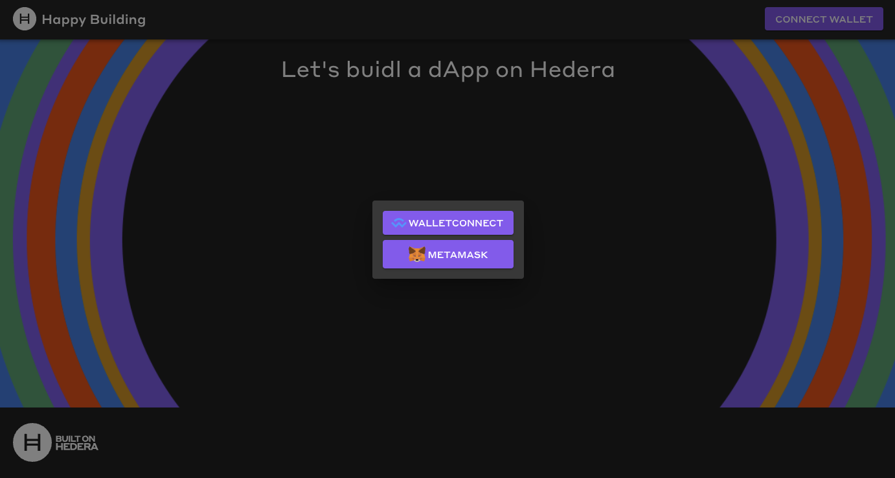
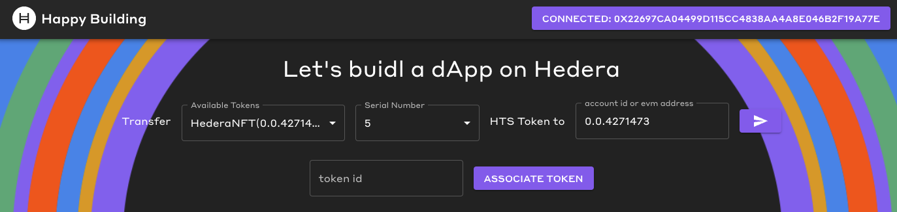

# Create a Hedera DApp Integrated with WalletConnect

Explore DApp development using the Mirror Node API and Hedera Token Service (HTS). Discover how to integrate HTS functionality into your DApp for seamless token management and transactions. This guide uses React, Material UI, Ethers, and TypeScript with the [Create React App (CRA) Hedera DApp template](https://github.com/hedera-dev/cra-hedera-dapp-template) integrated with walletconnect, streamlining your development process.

## What you will accomplish

* [ ] Query the mirror node for account token balance, token information, and Non-fungible information.
* [ ] Query the mirror node to check if the receiver has associated with a token ID
* [ ] Associate an HTS token with HashPack, Kabila, Blade, or MetaMask through a UI
* [ ] Transfer an HTS token through a UI

<figure><figcaption><p>Completed DAPP User Interface</p></figcaption></figure>

## Prerequisites

Before you begin, you should be familiar with the following:

* [JavaScript](https://developer.mozilla.org/en-US/docs/Web/JavaScript)
* [TypeScript](https://www.typescriptlang.org/)
* [React](https://react.dev/)
* [REST API](https://www.geeksforgeeks.org/rest-api-introduction/)

<details>

<summary>Also, you should have the following set up on your computer ⬇</summary>

* [x] `git` installed
  * Minimum version: 2.37
  * Recommended: [Install Git (Github)](https://github.com/git-guides/install-git)
* [x] A code editor or IDE
  * Recommended: [VS Code. Install VS Code (Visual Studio)](https://code.visualstudio.com/docs/setup/setup-overview)
* [x] NodeJs + npm installed
  * Minimum version of NodeJs: 18
  * Minimum version of npm: 9.5
  * Recommended for Linux & Mac: [nvm](https://github.com/nvm-sh/nvm)
  * Recommended for Windows: [nvm-windows](https://github.com/coreybutler/nvm-windows)

</details>

<details>

<summary>Check your prerequisites set up ⬇</summary>

Open your terminal, and enter the following commands.

```shell
git --version
code --version
node --version
npm --version
```

Each of these commands should output some text that includes a version number, for example:

```
git --version
git version 2.39.2 (Apple Git-143)

code --version
1.81.1
6c3e3dba23e8fadc360aed75ce363ba185c49794
arm64

node --version
v20.6.1

npm --version
9.8.1
```

If the output contains text similar to `command not found`, please install that item.

</details>

## Get Started

We choose to scaffold our project by using the [CRA Hedera DApp template](https://github.com/hedera-dev/cra-hedera-dapp-template), as it offers:

* [x] Multi-wallet integration via walletconnect supporting MetaMask and Hedera native wallets
* [x] Mirror Node Client
* [x] State management via React Context
* [x] Material UI
* [x] Choice of TypeScript or JavaScript

This custom template eliminates setup overhead and allows you to dive straight into the core features of your project.

<details>

<summary>Template Project Repos</summary>

The complete TypeScript project can be found on GitHub [here](https://github.com/a-ridley/hbar-faucet-for-metamask).

The complete JavaScript project can be found on GitHub [here](https://github.com/a-ridley/hbar-faucet-for-metamask-JS).

</details>

### 1. Scaffold your project

Open a terminal and run the following command to set up your project structure, replacing `my-app-name` with your desired directory name.

```shell
npx create-react-app <my-app-name> --template git+ssh://git@github.com/hedera-dev/cra-hedera-dapp-template.git
```

<details>

<summary>Scaffolding project expected output</summary>


</details>

Open your newly created react app project with visual studio code. You should see the following file structure.

<figure><figcaption><p>Hedera React DApp File Structure</p></figcaption></figure>

### 2. Fetching Token Data: Writing Mirror Node API Queries

[Mirror nodes](https://docs.hedera.com/hedera/core-concepts/mirror-nodes) offer access to historical data from the Hedera network while optimizing the use of network resources. You can easily retrieve information like transactions, records, events, and balances. Visit the [mirror node API docs](https://testnet.mirrornode.hedera.com/api/v1/docs/#/accounts/getAccountByIdOrAliasOrEvmAddress) to learn more.

In vscode open the file located at `src/services/wallets/mirrorNodeClient.ts`.

This file creates a mirror node client and is used to fetch data from the mirror nodes. We will add new code to help us obtain information about the tokens we currently own.


This client is configured for the Hedera Testnet. For further configuration, go to `src/config/network.ts.`


#### 2.1 Query Account Token Balances by Account ID

We'll use the Mirror Node API to query information about the tokens we currently own and the quantities of those tokens.

Open `src/services/wallets/mirrorNodeClient.ts` and paste the below interface outside of and above the `MirrorNodeClient` class.

```Typescript
export interface MirrorNodeAccountTokenBalance {
  balance: number,
  token_id: string,
}
```


This interface defines the data fields we need for our DApp, filtering out any extra data from the mirror node response.


Paste the below HTTP GET request outside of and below the `MirrorNodeClient` class in the `src/services/wallets/mirrorNodeClient.ts` file.

```Typescript
 // Purpose: get token balances for an account
 // Returns: an array of MirrorNodeAccountTokenBalance
 async getAccountTokenBalances(accountId: AccountId) {
   // get token balances
   const tokenBalanceInfo = await fetch(`${this.url}/api/v1/accounts/${accountId}/tokens?limit=100`, { method: "GET" });
   const tokenBalanceInfoJson = await tokenBalanceInfo.json();

   const tokenBalances = [...tokenBalanceInfoJson.tokens] as MirrorNodeAccountTokenBalance[];

   // because the mirror node API paginates results, we need to check if there are more results
   // if links.next is not null, then there are more results and we need to fetch them until links.next is null
   let nextLink = tokenBalanceInfoJson.links.next;
   while (nextLink !== null) {
     const nextTokenBalanceInfo = await fetch(`${this.url}${nextLink}`, { method: "GET" });
     const nextTokenBalanceInfoJson = await nextTokenBalanceInfo.json();
     tokenBalances.push(...nextTokenBalanceInfoJson.tokens);
     nextLink = nextTokenBalanceInfoJson.links.next;
   }

   return tokenBalances;
 }
```

<details>

<summary>File Checkpoint</summary>

To ensure you're on the right track, your \`src/services/wallets/mirrorNodeClient.ts\` file should look like below.

```Typescript
import { AccountId } from "@hashgraph/sdk";
import { NetworkConfig } from "../../config";

export interface MirrorNodeAccountTokenBalance {
  balance: number,
  token_id: string,
}

export class MirrorNodeClient {
  url: string;
  constructor(networkConfig: NetworkConfig) {
    this.url = networkConfig.mirrorNodeUrl;
  }

 // Purpose: get token balances for an account
 // Returns: an array of MirrorNodeAccountTokenBalance
 async getAccountTokenBalances(accountId: AccountId) {
  // get token balances
  const tokenBalanceInfo = await fetch(`${this.url}/api/v1/accounts/${accountId}/tokens?limit=100`, { method: "GET" });
  const tokenBalanceInfoJson = await tokenBalanceInfo.json();

  const tokenBalances = [...tokenBalanceInfoJson.tokens] as MirrorNodeAccountTokenBalance[];

  // because the mirror node API paginates results, we need to check if there are more results
  // if links.next is not null, then there are more results and we need to fetch them until links.next is null
  let nextLink = tokenBalanceInfoJson.links.next;
  while (nextLink !== null) {
    const nextTokenBalanceInfo = await fetch(`${this.url}${nextLink}`, { method: "GET" });
    const nextTokenBalanceInfoJson = await nextTokenBalanceInfo.json();
    tokenBalances.push(...nextTokenBalanceInfoJson.tokens);
    nextLink = nextTokenBalanceInfoJson.links.next;
  }

  return tokenBalances;
}

  async getAccountInfo(accountId: AccountId) {
    const accountInfo = await fetch(`${this.url}/api/v1/accounts/${accountId}`, { method: "GET" });
    const accountInfoJson = await accountInfo.json();
    return accountInfoJson;
  }
}

```

</details>

#### 2.2 Query Token Information by Token ID

In the previous step we wrote code to obtain the current token balance of an account. Next we will retieve the type of token (Non-Fungible or Fungible), decimal precision, token name and symbol.

Open `src/services/wallets/mirrorNodeClient.ts` and paste the interface outside of and above the `MirrorNodeClient` class.

```Typescript
export interface MirrorNodeTokenInfo {
  type: 'FUNGIBLE_COMMON' | 'NON_FUNGIBLE_UNIQUE',
  decimals: string,
  name: string,
  symbol: string
  token_id: string,
}
```

Paste the below HTTP GET request outside of and below the `getAccountTokenBalances` function in the `src/services/wallets/mirrorNodeClient.ts` file.

```Typescript
// Purpose: get token info for a token
// Returns: a MirrorNodeTokenInfo 
async getTokenInfo(tokenId: string) {
  const tokenInfo = await fetch(`${this.url}/api/v1/tokens/${tokenId}`, { method: "GET" });
  const tokenInfoJson = await tokenInfo.json() as MirrorNodeTokenInfo;
  return tokenInfoJson;
}
```

#### 2.3 Query Account NFT Information by AccountID

In the previous step we wrote code to obtain the token details (token type, decimals, name, and symbol). Next we will retrieve the NFT serial numbers that are owned.

Open `src/services/wallets/mirrorNodeClient.ts` and paste the interface outside of and above the `MirrorNodeClient` class.

```Typescript
export interface MirrorNodeNftInfo {
  token_id: string,
  serial_number: number,
}
```

Paste the below HTTP GET request outside of and below the `getTokenInfo` function in the `src/services/wallets/mirrorNodeClient.ts` file.

```Typescript
// Purpose: get NFT Infor for an account
// Returns: an array of NFTInfo
async getNftInfo(accountId: AccountId) {
  const nftInfo = await fetch(`${this.url}/api/v1/accounts/${accountId}/nfts?limit=100`, { method: "GET" });
  const nftInfoJson = await nftInfo.json();

  const nftInfos = [...nftInfoJson.nfts] as MirrorNodeNftInfo[];

  // because the mirror node API paginates results, we need to check if there are more results
  // if links.next is not null, then there are more results and we need to fetch them until links.next is null
  let nextLink = nftInfoJson.links.next;
  while (nextLink !== null) {
    const nextNftInfo = await fetch(`${this.url}${nextLink}`, { method: "GET" });
    const nextNftInfoJson = await nextNftInfo.json();
    nftInfos.push(...nextNftInfoJson.nfts);
    nextLink = nextNftInfoJson.links.next;
  }
  return nftInfos;
}
```

#### 2.4 Combine Account Token Balances and Token Information via Data Aggregation

We need to combine all of our HTTP response data in order to display our available tokens in our DApp.

Open `src/services/wallets/mirrorNodeClient.ts` and paste the interface outside of and above the `MirrorNodeClient` class.

```Typescript
export interface MirrorNodeAccountTokenBalanceWithInfo extends MirrorNodeAccountTokenBalance {
  info: MirrorNodeTokenInfo,
  nftSerialNumbers?: number[],
}
```

Paste the function outside of and below the `getNftInfo` function in the `src/services/wallets/mirrorNodeClient.ts` file.

```Typescript
// Purpose: get token balances for an account with token info in order to display token balance, token type, decimals, etc.
// Returns: an array of MirrorNodeAccountTokenBalanceWithInfo
async getAccountTokenBalancesWithTokenInfo(accountId: AccountId): Promise<MirrorNodeAccountTokenBalanceWithInfo[]> {
  //1.  Retrieve all token balances in the account
  const tokens = await this.getAccountTokenBalances(accountId);
  //2. Create a map of token IDs to token info and fetch token info for each token
  const tokenInfos = new Map<string, MirrorNodeTokenInfo>();
  for (const token of tokens) {
    const tokenInfo = await this.getTokenInfo(token.token_id);
    tokenInfos.set(tokenInfo.token_id, tokenInfo);
  }

  //3. Fetch all NFT info in account
  const nftInfos = await this.getNftInfo(accountId);

  //4. Create a map of token Ids to arrays of serial numbers
  const tokenIdToSerialNumbers = new Map<string, number[]>();
  for (const nftInfo of nftInfos) {
    const tokenId = nftInfo.token_id;
    const serialNumber = nftInfo.serial_number;

    // if we haven't seen this token_id before, create a new array with the serial number
    if (!tokenIdToSerialNumbers.has(tokenId)) {
      tokenIdToSerialNumbers.set(tokenId, [serialNumber]);
    } else {
      // if we have seen this token_id before, add the serial number to the array
      tokenIdToSerialNumbers.get(tokenId)!.push(serialNumber);
    }
  }

  //5. Combine token balances, token info, and NFT info and return
  return tokens.map(token => {
    return {
      ...token,
      info: tokenInfos.get(token.token_id)!,
      nftSerialNumbers: tokenIdToSerialNumbers.get(token.token_id)
    }
  });
}
```


The `getAccountTokenBalancesWithTokenInfo` combines token balances, token info and, NFT info in order to display our available tokens in our DApp.


<details>

<summary>Complete `mirrorNodeClient.ts` file Checkpoint</summary>

To ensure you're on the right track, your \`src/services/wallets/mirrorNodeClient.ts\` file should look like below.

```Typescript
import { AccountId } from "@hashgraph/sdk";
import { NetworkConfig } from "../../config";

export interface MirrorNodeAccountTokenBalance {
  balance: number,
  token_id: string,
}

export interface MirrorNodeTokenInfo {
  type: 'FUNGIBLE_COMMON' | 'NON_FUNGIBLE_UNIQUE',
  decimals: string,
  name: string,
  symbol: string
  token_id: string,
}

export interface MirrorNodeNftInfo {
  token_id: string,
  serial_number: number,
}

export interface MirrorNodeAccountTokenBalanceWithInfo extends MirrorNodeAccountTokenBalance {
  info: MirrorNodeTokenInfo,
  nftSerialNumbers?: number[],
}

export class MirrorNodeClient {
  url: string;
  constructor(networkConfig: NetworkConfig) {
    this.url = networkConfig.mirrorNodeUrl;
  }


  // Purpose: get token balances for an account
  // Returns: an array of MirrorNodeAccountTokenBalance
  async getAccountTokenBalances(accountId: AccountId) {
    // get token balances
    const tokenBalanceInfo = await fetch(`${this.url}/api/v1/accounts/${accountId}/tokens?limit=100`, { method: "GET" });
    const tokenBalanceInfoJson = await tokenBalanceInfo.json();

    const tokenBalances = [...tokenBalanceInfoJson.tokens] as MirrorNodeAccountTokenBalance[];

    // because the mirror node API paginates results, we need to check if there are more results
    // if links.next is not null, then there are more results and we need to fetch them until links.next is null
    let nextLink = tokenBalanceInfoJson.links.next;
    while (nextLink !== null) {
      const nextTokenBalanceInfo = await fetch(`${this.url}${nextLink}`, { method: "GET" });
      const nextTokenBalanceInfoJson = await nextTokenBalanceInfo.json();
      tokenBalances.push(...nextTokenBalanceInfoJson.tokens);
      nextLink = nextTokenBalanceInfoJson.links.next;
    }

    return tokenBalances;
  }

  // Purpose: get token info for a token
  // Returns: a MirrorNodeTokenInfo 
  async getTokenInfo(tokenId: string) {
    const tokenInfo = await fetch(`${this.url}/api/v1/tokens/${tokenId}`, { method: "GET" });
    const tokenInfoJson = await tokenInfo.json() as MirrorNodeTokenInfo;
    return tokenInfoJson;
  }

  // Purpose: get NFT Infor for an account
  // Returns: an array of NFTInfo
  async getNftInfo(accountId: AccountId) {
    const nftInfo = await fetch(`${this.url}/api/v1/accounts/${accountId}/nfts?limit=100`, { method: "GET" });
    const nftInfoJson = await nftInfo.json();

    const nftInfos = [...nftInfoJson.nfts] as MirrorNodeNftInfo[];

    // because the mirror node API paginates results, we need to check if there are more results
    // if links.next is not null, then there are more results and we need to fetch them until links.next is null
    let nextLink = nftInfoJson.links.next;
    while (nextLink !== null) {
      const nextNftInfo = await fetch(`${this.url}${nextLink}`, { method: "GET" });
      const nextNftInfoJson = await nextNftInfo.json();
      nftInfos.push(...nextNftInfoJson.nfts);
      nextLink = nextNftInfoJson.links.next;
    }
    return nftInfos;
  }

  // Purpose: get token balances for an account with token info in order to display token balance, token type, decimals, etc.
  // Returns: an array of MirrorNodeAccountTokenBalanceWithInfo
  async getAccountTokenBalancesWithTokenInfo(accountId: AccountId): Promise<MirrorNodeAccountTokenBalanceWithInfo[]> {
    //1.  Retrieve all token balances in the account
    const tokens = await this.getAccountTokenBalances(accountId);
    //2. Create a map of token IDs to token info and fetch token info for each token
    const tokenInfos = new Map<string, MirrorNodeTokenInfo>();
    for (const token of tokens) {
      const tokenInfo = await this.getTokenInfo(token.token_id);
      tokenInfos.set(tokenInfo.token_id, tokenInfo);
    }

    //3. Fetch all NFT info in account
    const nftInfos = await this.getNftInfo(accountId);

    //4. Create a map of token Ids to arrays of serial numbers
    const tokenIdToSerialNumbers = new Map<string, number[]>();
    for (const nftInfo of nftInfos) {
      const tokenId = nftInfo.token_id;
      const serialNumber = nftInfo.serial_number;

      // if we haven't seen this token_id before, create a new array with the serial number
      if (!tokenIdToSerialNumbers.has(tokenId)) {
        tokenIdToSerialNumbers.set(tokenId, [serialNumber]);
      } else {
        // if we have seen this token_id before, add the serial number to the array
        tokenIdToSerialNumbers.get(tokenId)!.push(serialNumber);
      }
    }

    //5. Combine token balances, token info, and NFT info and return
    return tokens.map(token => {
      return {
        ...token,
        info: tokenInfos.get(token.token_id)!,
        nftSerialNumbers: tokenIdToSerialNumbers.get(token.token_id)
      }
    });
  }

  async getAccountInfo(accountId: AccountId) {
    const accountInfo = await fetch(`${this.url}/api/v1/accounts/${accountId}`, { method: "GET" });
    const accountInfoJson = await accountInfo.json();
    return accountInfoJson;
  }

}
```

</details>

#### 2.5 Add Token Association Support

Before a user can receive a new token, they must associate with it. This association helps protect users from receiving unwanted tokens.

Open `src/services/wallets/mirrorNodeClient.ts` and paste the function below the `getAccountTokenBalancesWithTokenInfo` function.

```Typescript
// Purpose: check if an account is associated with a token
// Returns: true if the account is associated with the token, false otherwise
async isAssociated(accountId: AccountId, tokenId: string) {
  const accountTokenBalance = await this.getAccountTokenBalances(accountId);
  return accountTokenBalance.some(token => token.token_id === tokenId);
}
```

### 3. Adding in the User Interface

In this step, we'll copy and paste the home.tsx file, which contains all the necessary code for adding UI components that enable token transfers and association with a token.

Open `src/pages/Home.tsx` and replace the existing code by pasting the below code:

<details>

<summary>`Home.tx` file</summary>

```Typescript
import { Button, MenuItem, TextField, Typography } from "@mui/material";
import { Stack } from "@mui/system";
import { useWalletInterface } from "../services/wallets/useWalletInterface";
import SendIcon from '@mui/icons-material/Send';
import { useEffect, useState } from "react";
import { AccountId, TokenId } from "@hashgraph/sdk";
import { MirrorNodeAccountTokenBalanceWithInfo, MirrorNodeClient } from "../services/wallets/mirrorNodeClient";
import { appConfig } from "../config";

const UNSELECTED_SERIAL_NUMBER = -1;

export default function Home() {
  const { walletInterface, accountId } = useWalletInterface();
  const [toAccountId, setToAccountId] = useState("");
  const [amount, setAmount] = useState<number>(0);
  // include all of this necessary for dropdown
  const [availableTokens, setAvailableTokens] = useState<MirrorNodeAccountTokenBalanceWithInfo[]>([]);
  const [selectedTokenId, setSelectedTokenId] = useState<string>('');
  const [serialNumber, setSerialNumber] = useState<number>(UNSELECTED_SERIAL_NUMBER);

  const [tokenIdToAssociate, setTokenIdToAssociate] = useState("");

  // include all of this necessary for dropdown
  // Purpose: Get the account token balances with token info for the current account and set them to state
  useEffect(() => {
    if (accountId === null) {
      return;
    }
    const mirrorNodeClient = new MirrorNodeClient(appConfig.networks.testnet);
    // Get token balance with token info for the current account
    mirrorNodeClient.getAccountTokenBalancesWithTokenInfo(AccountId.fromString(accountId)).then((tokens) => {
      // set to state
      setAvailableTokens(tokens);
      console.log(tokens);
    }).catch((error) => {
      console.error(error);
    });
  }, [accountId])

  // include all of this necessary for dropdown
  // Filter out tokens with a balance of 0
  const tokensWithNonZeroBalance = availableTokens.filter((token) => token.balance > 0);
  // include all of this necessary for dropdown
  // Get the selected token balance with info
  const selectedTokenBalanceWithInfo = availableTokens.find((token) => token.token_id === selectedTokenId);

  // include all of this necessary for dropdown
  // reset amount and serial number when token id changes
  useEffect(() => {
    setAmount(0);
    setSerialNumber(UNSELECTED_SERIAL_NUMBER);
  }, [selectedTokenId]);

  return (
    <Stack alignItems="center" spacing={4}>
      <Typography
        variant="h4"
        color="white"
      >
        Let's buidl a dApp on Hedera
      </Typography>
      {walletInterface !== null && (
        <>
          <Stack
            direction='row'
            gap={2}
            alignItems='center'
          >
            <Typography>
              Transfer
            </Typography>
            <TextField
              label='Available Tokens'
              value={selectedTokenId}
              select
              onChange={(e) => setSelectedTokenId(e.target.value)}
              sx={{
                width: '250px',
                height: '50px',
              }}
            >
              <MenuItem
                value={''}
              >
                Select a token
              </MenuItem>
              {tokensWithNonZeroBalance.map((token) => {
                const tokenBalanceAdjustedForDecimals = token.balance / Math.pow(10, Number.parseInt(token.info.decimals));
                return (
                  <MenuItem
                    key={token.token_id}
                    value={token.token_id}
                  >
                    {token.info.name}({token.token_id}): ({tokenBalanceAdjustedForDecimals})
                  </MenuItem>
                );
              }
              )}
            </TextField>
            {selectedTokenBalanceWithInfo?.info?.type === "NON_FUNGIBLE_UNIQUE" && (
              <TextField
                label='Serial Number'
                select
                value={serialNumber.toString()}
                onChange={(e) => setSerialNumber(Number.parseInt(e.target.value))}
                sx={{
                  width: '190px',
                  height: '50px',
                }}
              >
                <MenuItem
                  value={UNSELECTED_SERIAL_NUMBER}
                >
                  Select a Serial Number
                </MenuItem>
                {selectedTokenBalanceWithInfo.nftSerialNumbers?.map((serialNumber) => {
                  return (
                    <MenuItem
                      key={serialNumber}
                      value={serialNumber}
                    >
                      {serialNumber}
                    </MenuItem>
                  );
                }
                )}
              </TextField>
            )}
            {selectedTokenBalanceWithInfo?.info?.type === "FUNGIBLE_COMMON" && (
              <TextField
                type='number'
                label='amount'
                value={amount}
                onChange={(e) => setAmount(parseInt(e.target.value))}
                sx={{
                  maxWidth: '100px'
                }}
              />
            )}
            {/* not included in the dropdown stage. this is in the association/send stage */}
            <Typography>
              HTS Token
              to
            </Typography>
            <TextField
              value={toAccountId}
              onChange={(e) => setToAccountId(e.target.value)}
              label='account id or evm address'
            />
            <Button
              variant='contained'
              onClick={async () => {
                if (selectedTokenBalanceWithInfo === undefined) {
                  console.log(`Token Id is empty.`)
                  return;
                }
                
                // check if receiver has associated
                const mirrorNodeClient = new MirrorNodeClient(appConfig.networks.testnet);
                const isAssociated = await mirrorNodeClient.isAssociated(AccountId.fromString(toAccountId), selectedTokenId);
                if (!isAssociated) {
                  console.log(`Receiver is not associated with token id: ${selectedTokenId}`);
                  return;
                }
                if (selectedTokenBalanceWithInfo.info.type === "NON_FUNGIBLE_UNIQUE") {
                  await walletInterface.transferNonFungibleToken(
                    AccountId.fromString(toAccountId),
                    TokenId.fromString(selectedTokenId),
                    serialNumber);
                } else {
                  const amountWithDecimals = amount * Math.pow(10, Number.parseInt(selectedTokenBalanceWithInfo.info.decimals));
                  await walletInterface.transferFungibleToken(
                    AccountId.fromString(toAccountId),
                    TokenId.fromString(selectedTokenId),
                    amountWithDecimals);
                }
              }}
            >
              <SendIcon />
            </Button>
          </Stack>
          <Stack
            direction='row'
            gap={2}
            alignItems='center'
          >
            <TextField
              value={tokenIdToAssociate}
              label='token id'
              onChange={(e) => setTokenIdToAssociate(e.target.value)}
            />
            <Button
              variant='contained'
              onClick={async () => {
                if (tokenIdToAssociate === "") {
                  console.log(`Token Id is empty.`)
                  return;
                }
                await walletInterface.associateToken(TokenId.fromString(tokenIdToAssociate));
              }}
            >
              Associate Token
            </Button>
          </Stack>
        </>
      )}
    </Stack>
  )
}
```

</details>


The crucial part of the code is found within the following code:

```Typescript
// include all of this necessary for dropdown
  // Purpose: Get the account token balances with token info for the current account and set them to state
  useEffect(() => {
    if (accountId === null) {
      return;
    }
    const mirrorNodeClient = new MirrorNodeClient(appConfig.networks.testnet);
    // Get token balance with token info for the current account
    mirrorNodeClient.getAccountTokenBalancesWithTokenInfo(AccountId.fromString(accountId)).then((tokens) => {
      // set to state
      setAvailableTokens(tokens);
      console.log(tokens);
    }).catch((error) => {
      console.error(error);
    });
  }, [accountId])

```

This code fetches and updates the list of tokens a user owns providing the available tokens to the dropdown menu.


### 4. Testing DApp Functionality

The application is ready to be started and tested. You will be testing:

* [ ] Connect to a DApp with a Hedera native wallet through WalletConnect
* [ ] Associate a token
* [ ] Transfer a token to a receiver account

#### 4.1 Test Setup

You'll be creating four Hedera Testnet accounts, each with a balance of 10 HBAR. Two of these accounts will come pre-loaded with their own fungible tokens, and four accounts will come pre-loaded with their own non-fungible tokens (NFTs).

Open a new terminal window and create a new directory and change into that directory

```shell
mkdir hedera-test-accounts && cd hedera-test-accounts
```

Open `hedera-test-accounts` folder in a new visual studio code window.

Create a new file and name it `.env` with the following contents. Remember to enter your account ID and your private key.

```shell
MY_ACCOUNT_ID=<enter your account id>
MY_PRIVATE_KEY=<enter your DER private key>
```

Within the `hedera-test-accounts` home directory, execute the following command in the terminal,

```shell
npx github:/hedera-dev/hedera-create-account-and-token-helper
```


Keep this terminal open for the remainder of the tutorial, as you will refer back to it.


<details>

<summary>Test Accounts Sample Output</summary>

```JSON
{
  "ed25519": {
    "sender": {
      "accountId": "0.0.xxxxxxxx",
      "privateKey": "302...",
      "FungibleTokenId": "0.0.xxxxxxxx",
      "NftTokenId": "0.0.xxxxxxxx"
    },
    "receiver": {
      "accountId": "0.0.xxxxxxxx",
      "privateKey": "302..."
    }
  },
  "ecdsaWithAlias": {
    "sender": {
      "accountId": "0.0.xxxxxxxx",
      "privateKey": "...hexadecimal string of length 64...",
      "FungibleTokenId": "0.0.xxxxxxxx",
      "NftTokenId": "0.0.xxxxxxxx"
    },
    "receiver": {
      "accountId": "0.0.xxxxxxxx",
      "privateKey": "...hexadecimal string of length 64..."
    }
  }
}
```

</details>

#### 4.2 Import Sender and Receiver accounts

Import the sender and receiver accounts that were just outputted into your preferred wallet application. ([MetaMask](https://metamask.io/download/), [HashPack](https://www.hashpack.app/get-started), [Blade](https://helpcenter.bladewallet.io/en/articles/6672314-how-to-install-blade-wallet-google-chrome-extension), or [Kabila](https://www.kabila.app/wallet))

For assistance on how to import a Hedera account into MetaMask refer to our documentation [here](https://docs.hedera.com/hedera/tutorials/smart-contracts/deploy-by-leveraging-ethereum-developer-tools-on-hedera#import-hedera-account-into-metamask).


Rename your imported accounts within your preferred wallet to keep track which is the sender and receiver account.


#### 4.3 Start the DApp

Navigate back to your application in Visual Studio Code, and in the terminal, run the following command

```shell
npm run start
```

<figure><figcaption><p>DApp homepage</p></figcaption></figure>

#### 4.4 Connect to DApp as the Receiver

Click the `Connect Wallet` button in the upper right and select MetaMask and select the Sender account.

<figure><figcaption><p>Select your wallet</p></figcaption></figure>

<figure><figcaption><p>Connect with receiver account</p></figcaption></figure>

<figure><figcaption><p>Successfully connected to dapp view</p></figcaption></figure>

<details>

<summary>WalletConnect Instructions</summary>

Open HashPack and unlock your wallet

Go back to the DApp homepage and click 'Connect Wallet'

Choose WalletConnect

Copy the connection string


Open HashPack and connect to DApp by clicking on the world in the upper right


Paste the walletconnect string into HashPack pairing string textbox


Select the Receiver account to connect with the DApp


✅ You're connected!

</details>

#### 4.5 Associate Receiver Account with Sender Account NFT

Open the output of the test accounts you created earlier and copy the `ecdsaWithAlias` Sender's account `NftTokenId`

Paste the `NftTokenId` in the DApps associate token textbox and click the button `Associate`

<figure><figcaption><p>Associate textbox</p></figcaption></figure>

MetaMask will prompt you to sign the transaction. If the extension does not automatically open, you will need to manually click on the MetaMask extension.

<figure><figcaption><p>Sign the Associate transaction</p></figcaption></figure>

Confirm the transaction


The react template uses the Hashio JSON RPC Relay URL to work with MetaMask. If you are experiencing degraded performance, follow this [guide](https://docs.hedera.com/hedera/tutorials/more-tutorials/json-rpc-connections) to switch to Arkhia or set up your own JSON RPC Relay. Edit the `src/config/networks.ts` with the new JSON RPC Relay URL.


#### 4.6 Transfer NFT to Receiver Account

Disconnect as the Receiver account and reconnect with the Sender account. To do this, open the MetaMask extension, click on the three dots in the upper right, select "Connected Sites," and then disconnect the Receiver account. All other wallets disconnect by clicking on your account ID in the upper right of the DApp homepage.

Connect to the DApp as the Sender Account.

As the Sender,

* Select from available tokens the HederaNFT
* Select the NFT with serial number 5 from the drop-down menu.
* Enter the account ID or EVM address of the Receiver account.
* Click the "send" button.
* Sign the transaction on MetaMask to complete the transfer of the NFT from the Sender to the receiver account.

<figure><figcaption><p>Transfer NFT to Receiver Account</p></figcaption></figure>

#### 4.7 Verify Receiver Account Receieved the NFT

Disconnect as the Sender account and reconnect as the Receiver account.

Check the dropdown menu and ensure the Receiver account has NFT serial number 5.

<figure><figcaption><p>Transfer NFT to Receiver Account Success</p></figcaption></figure>

### Try with HashPack, Blade or Kabila

Optionally, import your accounts into any of the above Hedera native wallets and test out transferring more tokens.

### Complete

🎉 Congratulations! You have successfully walked through creating a Hedera DApp that transfers HTS tokens using MetaMask, HashPack, Blade, or Kabila.

You have learned how to:

* [x] Query the mirror node for account token balance, token information, and Non-fungible information.
* [x] Query the mirror node to check if the receiver has associated with a token ID
* [x] Associate an HTS token with HashPack, Kabila, Blade, or MetaMask through a UI
* [x] Transfer an HTS token through a UI

***

<table data-card-size="large" data-view="cards"><thead><tr><th align="center"></th><th data-hidden data-card-target data-type="content-ref"></th></tr></thead><tbody><tr><td align="center"><p>Writer: Abi Castro, DevRel Engineer</p><p><a href="https://github.com/a-ridley">GitHub</a> | <a href="https://linkedin.com/in/abixcastro">LinkedIn</a></p></td><td><a href="https://linkedin.com/in/abixcastro">https://linkedin.com/in/abixcastro</a></td></tr></tbody></table>
