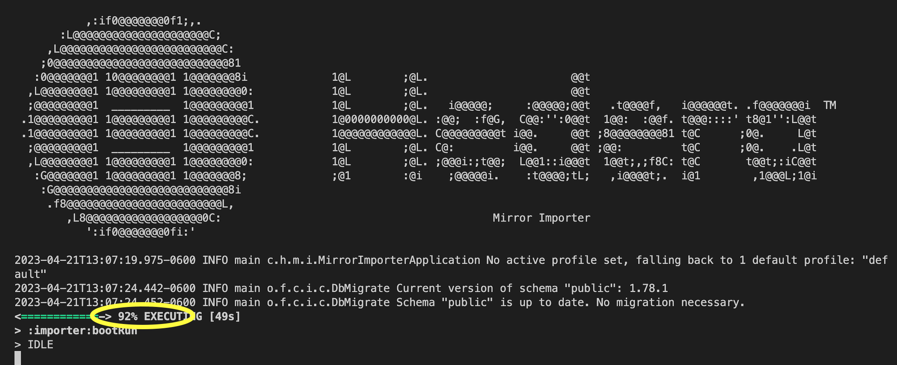

# How to Configure a Mirror Node and Query Data

Hedera Mirror Node is a useful tool that lets developers and users access past transaction data on the Hedera network. You can view and analyze network data such as transactions, transfers, balances, and events from the past in a reliable, scalable, and efficient way. The best feature is the capability to configure your mirror node to query only data that meet your tailored specifications.

This guide provides step-by-step instructions on how to configure and use a Hedera Mirror Node to access past transaction data on the Hedera network. You will learn how to configure your mirror node to store only the latest 90 days of data or data for a specific entity (account, smart contract, etc.) and how to use basic SQL queries to analyze the data.

***

## Prerequisites

* Basic understanding of Hedera Mirror Nodes.
* Basic understanding of terminal commands and SQL.
* [Java](https://www.java.com/en/) (openjdk@17: Java version 17), [Gradle](https://gradle.org/install/) (the latest version), and [PostgreSQL](https://www.postgresql.org/) (the latest version) are installed on your machine.
* [Docker](https://www.docker.com/) (`>= v20.10.x)` installed and open on your machine. Run `docker -v` in your terminal to check the version you have installed.

***

## Table of Contents

1. [Set Up Mirror Node](how-to-configure-a-mirror-node-and-query-specific-data.md#set-up-mirror-node)
2. [Configure Mirror Node](how-to-configure-a-mirror-node-and-query-specific-data.md#configure-mirror-node)
3. [Start Mirror Node](how-to-configure-a-mirror-node-and-query-specific-data.md#start-mirror-node)
4. [Query Mirror Node](how-to-configure-a-mirror-node-and-query-specific-data.md#query-output-verification)
5. [Additional Resources](how-to-configure-a-mirror-node-and-query-specific-data.md#additional-resources)

***

## Set Up Mirror Node

Clone the Hedera mirror node repository and navigate to the project directory:

```bash
git clone https://github.com/hashgraph/hedera-mirror-node.git
cd hedera-mirror-node
```


**Note:** Cloning the mirror node repository could require some time to complete.


***

## Configure Mirror Node

In this example, we will configure the mirror node to store the last 90 days of data or data for a specific account ID (entity). To achieve this, we will need to create and modify an `application.yml` file. This file contains configuration settings for the mirror node, such as which data to store and how long to store it.

First, create a new configuration folder and file inside the `hedera-mirror-importer` directory. The Mirror Node importer directory contains the source code for the importer tool, which allows users to import data from the Hedera Mainnet, Testnet, or Previewnet. This creates and imports a _read-only_ instance of the Hedera network data stored in its own database.

Run the following command to create the right folder and file:

```bash
mkdir hedera-mirror-importer/config
touch hedera-mirror-importer/config/application.yml
```

#### Transaction and entity filtering

The mirror node may be configured only to store a subset of data for entities and/or transaction types of interest — essentially, which rows of data to retain.

In this example, we'll use the `application.yml` format for demonstration purposes. This configuration retains transaction and crypto transfer data for 90 days, excludes data for entity `0.0.111478`, and includes specific transactions for entities `0.0.111710` and `0.0.111734`. Furthermore, it prevents the storage of topic data. You can check out the other two alternative formats [here](how-to-configure-a-mirror-node-and-query-specific-data.md#there-are-two-alternative-configuration-formats) if you don't like working with the YAML format.

#### Breaking down application.yml configuration

Here's an overview the `application.yml` file. Copy the following lines into `application.yml` and save it.


```yaml
hedera:
  mirror:
    importer:
      network: DEMO
      retention:
        period: 90D
        frequency: 60S
        enabled: true
        include:
          - transaction
          - crypto_transfer
      parser:
        exclude:
          - entity: [0.0.111478]
        include:
          - transaction: [CRYPTOTRANSFER, CRYPTOCREATEACCOUNT]
          - entity: [0.0.111710]
            transaction: [CONTRACTCREATEINSTANCE]
          - entity: [0.0.111734]
        record:
          entity:
            persist:
              topics: false
```


Here's a breakdown of what each section of the configuration file does:

* **`behaviorhedera`**: This is the root section of the configuration file, indicating that the settings apply to the Hedera network.
* **`mirror`**: This is a sub-section that pertains specifically to the Mirror node.
* **`importer`**: This sub-section defines settings for the Mirror node's importer, which is responsible for retrieving transaction data from the network and storing it in a local database for querying.
* **`importer.network: DEMO`**: This specifies that the importer should connect to a bucket with demo data. It's the easiest way to experiment with the mirror node and importer. If you want to connect to the `TESTNET`, `MAINNET`, or `PREVIEWNET`, you need to follow this [tutorial](../../core-concepts/mirror-nodes/run-your-own-beta-mirror-node/).
* **`importer.retention`**: This sub-section specifies the retention period and frequency for importing data. In this case, the importer will clean data that is older than 90 days every 60 seconds. If you omit the `frequency` key, the default behavior for cleaning data is once a day.&#x20;
* **`importer.retention.include`**: This specifies the database tables that should be included in the imported data. The tables specified are **`transaction`** and **`crypto_transfer`**. You can find all tables in the [GitHub repository](https://github.com/hashgraph/hedera-mirror-node/blob/main/hedera-mirror-importer/src/main/resources/db/migration/v2/V2.0.0__create_tables.sql) for the mirror node.
* **`parser`**: This sub-section defines settings for the data parser, which determines the data that gets stored in the database or the data that should be filtered.
* **`parser.exclude`**: This specifies the entities or transaction types that should be excluded from the imported data. In this case, the **`parser.exclude.entity`** with ID **`0.0.111478`** is excluded.
* **`parser.include`**: This specifies the entities or transaction types that should be included from the imported data. In this case, the **`parser.include.entity`** with ID **`0.0.111478`** is included, and two specific transaction types (**`CRYPTOTRANSFER`** and **`CRYPTOCREATEACCOUNT`**) are included via **`parser.include.transaction`**.\
  You can also combine **`entity`** and **`transaction`** fields. In our example, we only want to store **`CONTRACTCREATEINSTANCE`** transactions for the entity with ID **`0.0.111710`**.
* **`parser.record`**: This sub-section specifies how the imported data should be recorded. In this case, the **`entity`** object is specified, which means that data should be recorded for each unique entity (account) involved in the transactions. The **`persist`** setting is set to **`false`**, which means that topic data for entities should not be persisted.
* **`period: 90D`**: This indicates that the importer should retain the imported data for a period of 90 days. After this period, the data will be deleted.


**Note:** The `parser.exclude` properties take priority over the `parser.include` properties. If you list the same value in both lists, it will be excluded.\
\
In addition, the various boolean `hedera.mirror.importer.record.entity.persist` properties may be specified to control which additional fields get stored (which additional tables get recorded).

_See the `hedera.mirror.importer.parser.include.*` and `hedera.mirror.importer.parser.exclude.*` properties listed in_ [_this table_](https://github.com/hashgraph/hedera-mirror-node/blob/main/docs/configuration.md#importer)_._


<details>

<summary>Alternative configuration formats</summary>

**application.properties**

To configure the above scenario via `application.properties` file, include the following lines:

```properties
hedera.mirror.importer.network=DEMO
hedera.mirror.importer.retention.period=90D
hedera.mirror.importer.retention.frequency=60S
hedera.mirror.importer.retention.enabled=true
hedera.mirror.importer.retention.include=transaction,crypto_transfer
hedera.mirror.importer.parser.exclude.entity=0.0.111478
hedera.mirror.importer.parser.include.transaction=CRYPTOTRANSFER,CRYPTOCREATEACCOUNT
hedera.mirror.importer.parser.include.entity.0.0.111710.transaction=CONTRACTCREATEINSTANCE
hedera.mirror.importer.parser.include.entity=0.0.111734
hedera.mirror.importer.record.entity.persist.topics=false
```

**environment variables**

To configure the above scenario via environmental variables, set the following:

```
HEDERA_MIRROR_IMPORTER_NETWORK=DEMO
HEDERA_MIRROR_IMPORTER_RETENTION_PERIOD=90D
HEDERA_MIRROR_IMPORTER_RETENTION_FREQUENCY=60S
HEDERA_MIRROR_IMPORTER_RETENTION_ENABLED=true
HEDERA_MIRROR_IMPORTER_RETENTION_INCLUDE=transaction,crypto_transfer
HEDERA_MIRROR_IMPORTER_PARSER_EXCLUDE_ENTITY=0.0.111478
HEDERA_MIRROR_IMPORTER_PARSER_INCLUDE_TRANSACTION=CRYPTOTRANSFER,CRYPTOCREATEACCOUNT
HEDERA_MIRROR_IMPORTER_PARSER_INCLUDE_ENTITY_0_0_111710_TRANSACTION=CONTRACTCREATEINSTANCE
HEDERA_MIRROR_IMPORTER_PARSER_INCLUDE_ENTITY=0_0_111734
HEDERA_MIRROR_IMPORTER_RECORD_ENTITY_PERSIST_TOPICS=false
```

</details>

More details about retention [here](https://github.com/hashgraph/hedera-mirror-node/blob/main/docs/database.md#retention) and transaction and entity filtering [here](https://github.com/hashgraph/hedera-mirror-node/blob/main/docs/configuration.md#transaction-and-entity-filtering).

***

## Start Mirror Node

The PostgreSQL container is responsible for creating the database for the mirror node instance, and the REST API container allows you to use the REST APIs to query the mirror node instance. The database stores the transaction data retrieved by the importer component of the mirror node, and the REST API provides an interface for accessing that data using HTTP requests. The importer component is responsible for retrieving the transaction data from the Hedera network and storing it in the database. Let's start up the database!

#### 1. Start the database

Open Docker and start the PostgreSQL and REST API containers in the root directory:

```bash
docker compose up -d db rest && docker logs hedera-mirror-node-db-1 --follow
```

Wait until you see the _"database system is ready to accept connections"_ message in the console log, then `control + c` to terminate the current process.

<figure><figcaption><p>Console output after starting both containers.</p></figcaption></figure>

#### 2. Run the importer

Now the database is ready, let's import demo data. Run the importer in the same root directory:

```bash
./gradlew :importer:bootrun
```

This process may take some time, but once you see this in your console and the process is at 92%, you kill the process with `control + c`. If you let the process run, it will import more data that you don't need for this tutorial.

<figure><figcaption><p>Mirror Importer process console</p></figcaption></figure>


**Note:** Should you encounter an error during this step or if the command doesn't execute successfully, it's recommended to run the command again.


#### 3. Connect to the PostgreSQL database

To connect the PostgreSQL database, we need to retrieve the database credentials. Open a new terminal window and run the following command in the root directory. Copy the database password that your console returns. You need this for the next step.

```bash
cat docker-compose.yml | grep OWNER
```

In the same directory, run the following command that will connect the database:

```bash
psql -U mirror_node -h 127.0.0.1
```

Enter the database password when prompted. If you successfully connect to the PostgreSQL database, your console should be ready to execute queries and look something like this:

```
hedera-mirror-node % psql -U mirror_node -h 127.0.0.1
Password for user mirror_node: 
psql (14.6 (Homebrew), server 14.7)
Type "help" for help.

mirror_node=> <ENTER YOUR SQL QUERIES GO HERE>
```

***

## Query Mirror Node

In this section, you can try out multiple queries that show you how to retrieve data from the PostgreSQL database. You need a basic understanding of SQL queries to craft your own queries.


Most queries include the field **`type`** which refers to a transaction type, e.g. **11** refers to`CRYPTOCREATEACCOUNT`and **14** refers to`CRYPTOTRANSFER`. The most common transaction types are:

* Type 7: `CONTRACTCALL`
* Type  11: `CRYPTOCREATEACCOUNT`
* Type 14: `CRYPTOTRANSFER`
* Type 24: `CONSENSUSCREATETOPIC`
* Type 27: `CONSENSUSSUBMITMESSAGE`
* Type 29: `TOKENCREATION`
* Type 37: `TOKENMINT`
* Type 40: `TOKENASSOCIATE`

Check out the complete list of transaction types in the [`TransactionTypes.java` file](https://github.com/hashgraph/hedera-mirror-node/blob/main/hedera-mirror-common/src/main/java/com/hedera/mirror/common/domain/transaction/TransactionType.java).


Execute the following queries to analyze the data stored in your local database.

```sql
-- 1. query counts transactions based on their type and filters out 
-- types 11 (CRYPTOCREATEACCOUNT) and 14 (CRYPTOTRANSFER)
SELECT count(*), payer_account_id, entity_id, type
FROM transaction WHERE type not in (11, 14)
GROUP by payer_account_id, entity_id, type order by type;

-- 2. query counts transactions based on their payer account ID or entity ID 
-- and filters for the value 111478
SELECT count(*), payer_account_id, entity_id, type 
FROM transaction WHERE payer_account_id=111478 OR entity_id=111478
GROUP by payer_account_id, entity_id, type ORDER by type;

-- 3. query only type 8 -> CONTRACTCREATEINSTANCE (CRYPTOCREATEACCOUNT, CRYPTOTRANSFER)
SELECT * FROM transaction WHERE type=8;

-- 4. query count for each transaction type
SELECT count(*), type
FROM transaction
GROUP by type;

-- 5. query shows different fields for the transaction table
SELECT payer_account_id, node_account_id, result, type, charged_tx_fee, transaction_hash 
FROM transaction 
WHERE type not in (11, 14);
```

<details>

<summary>Query output verification ✅</summary>

Note that your output might differ depending on how much data you have imported into your database with the `./gradlew :importer:bootrun` command.

<pre><code>-- Query 1:
 count | payer_account_id | entity_id | type
-------+------------------+-----------+------
     5 |             1117 |     61457 |    7
    71 |           111699 |    111704 |    7
     2 |           111721 |    111728 |    7
     2 |           111749 |    111757 |    7
     2 |           111478 |    111482 |    7
     1 |           111749 |    111757 |    8
(...)

-- Query 2:
 count | payer_account_id | entity_id | type
-------+------------------+-----------+------
     2 |           111478 |    111482 |    7
     1 |           111478 |    111482 |    8
     1 |           111478 |    111482 |    9
     1 |           111478 |    111595 |   11
     1 |           111478 |    111647 |   11
     1 |           111478 |    111644 |   11
(...)

-- Query 3:
 consensus_timestamp | type | result | payer_account_id |   valid_start_ns    | valid_duration_seconds | node_account_id | entity_id | initial_balance |  max_fee   | charged_tx_fee |              memo              |                                          transaction_hash                                          | transaction_bytes | scheduled | nonce | parent_consensus_timestamp | errata | index
---------------------+------+--------+------------------+---------------------+------------------------+-----------------+-----------+-----------------+------------+----------------+--------------------------------+----------------------------------------------------------------------------------------------------+-------------------+-----------+-------+----------------------------+--------+-------
 1570800945787190002 |    8 |     22 |           111152 | 1570800933439239200 |                     30 |               3 |    111157 |               0 | 5000000000 |     3581540281 | \x637265617465436f6e7472616374 | \xd226f8dd7922f9024331c5bf00da8e5bae6ade0db24fa4283e925ef9f06b4b4cdbbf1ff6511e552fe1a669a9b9cbaca8 |                   | f         |     0 |                            |        |     8
 1570801009263126000 |    8 |     22 |           111158 | 1570800996904028800 |                     30 |               3 |    111164 |               0 | 9000000000 |     1991432867 | \x637265617465436f6e7472616374 | \xcb04329381668a481a0734cabfeac28b56f74cd9e3db42af031a47a6c98a598555d6d502623d237c679e00ee9b61dfc2 |                   | f         |     0 |                            |        |    14
(...)

-- Query 4:
 count | type
-------+------
    30 |   12
  6676 |   14
    34 |   17
    13 |    8
   572 |   11
    10 |    9
    82 |    7
   146 |   19
     7 |   18
     4 |   16
   894 |   15
<strong>(...)
</strong>
-- Query 5:
 payer_account_id | node_account_id | result | type | charged_tx_fee |                                          transaction_hash
------------------+-----------------+--------+------+----------------+----------------------------------------------------------------------------------------------------
           111146 |               3 |     22 |   17 |      608622391 | \x9a8f13e9989462a2028bc5e3946d0f3d556d4ccfc65f2afa55b94c535823ea8a27caf630de85ae22303a73b7a0ded98d
           111146 |               3 |     22 |   17 |      653540869 | \xd4964bfe66d311c60717c733e39c1e4b4aae38138e0f583fef9ae3844eb95772862f5f467ebb96efd06e80ba0b0059da
           111146 |               3 |     22 |   15 |        1256006 | \x1c2b27dbf2d093fa353fc444e0a3ed1ac932518a37d2b03509f8a06039d454df82aeba5f35d7a1fea5babaca298a4288
(...)
</code></pre>

</details>


The PostgreSQL database is not an end product; the Hedera Mirror Node REST API is. Hence, SQL queries might fail when the engineering team updates the underlying database model in new releases. This tutorial has been tested with [release v0.79.1](https://github.com/hashgraph/hedera-mirror-node/releases).


To exit the `psql` console, run the quit command:

```bash
\q
```

Lastly, run the following command to stop and remove the created containers:

```bash
docker compose down
```

**Congratulations! 🎉 You have successfully learned how to configure the Hedera Mirror Node to query specific data. Feel free to reach out on** [**Discord**](https://hedera.com/discord) **if you have any questions!**

***

## Additional Resources

**➡** [**Mirror Node Repository**](https://github.com/hashgraph/hedera-mirror-node)

<table data-card-size="large" data-view="cards"><thead><tr><th align="center"></th><th data-hidden data-card-target data-type="content-ref"></th><th data-hidden data-card-cover data-type="files"></th></tr></thead><tbody><tr><td align="center"><p>Writer: Krystal, Technical Writer</p><p><a href="https://github.com/theekrystallee">GitHub</a> | <a href="https://hashnode.com/@theekrystallee">Hashnode</a></p></td><td><a href="https://twitter.com/theekrystallee">https://twitter.com/theekrystallee</a></td><td></td></tr><tr><td align="center"><p>Editor: Michiel, Developer Advocate</p><p><a href="https://github.com/michielmulders">GitHub</a> | <a href="https://www.linkedin.com/in/michielmulders/">LinkedIn</a></p></td><td><a href="https://www.linkedin.com/in/michielmulders/">https://www.linkedin.com/in/michielmulders/</a></td><td></td></tr></tbody></table>
