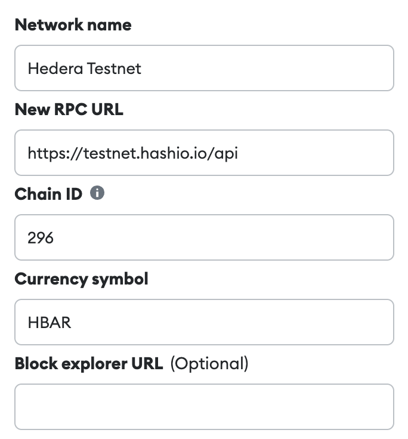
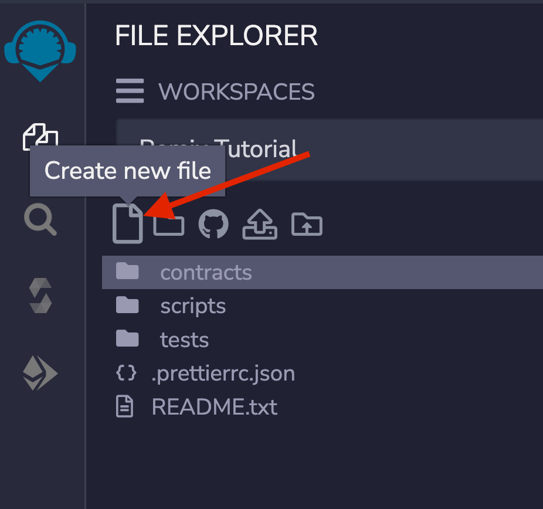
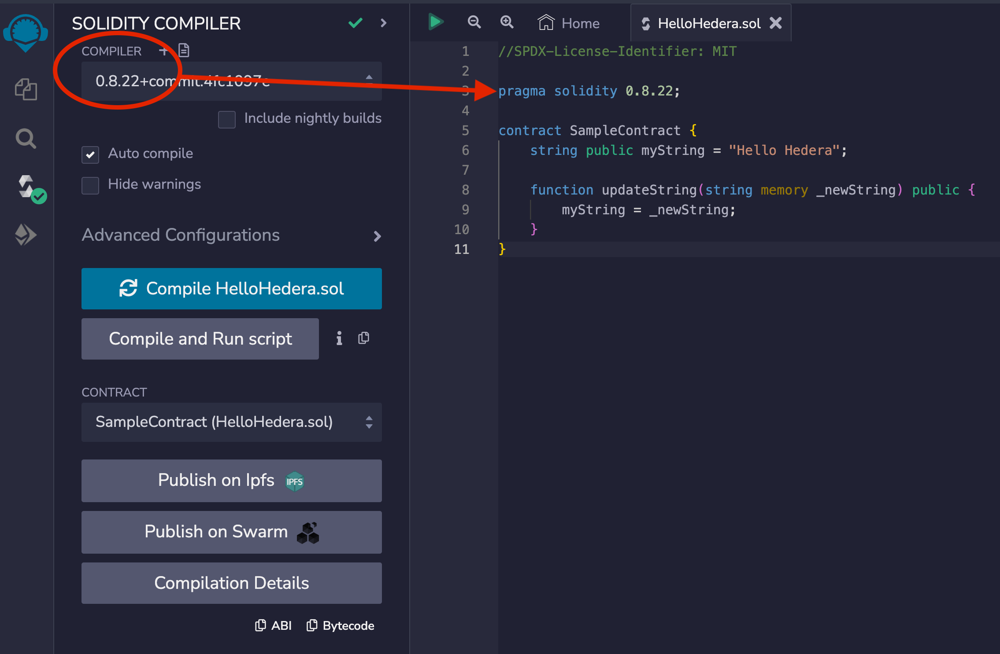
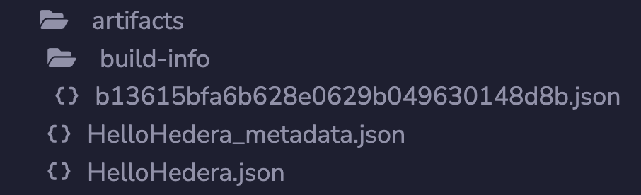
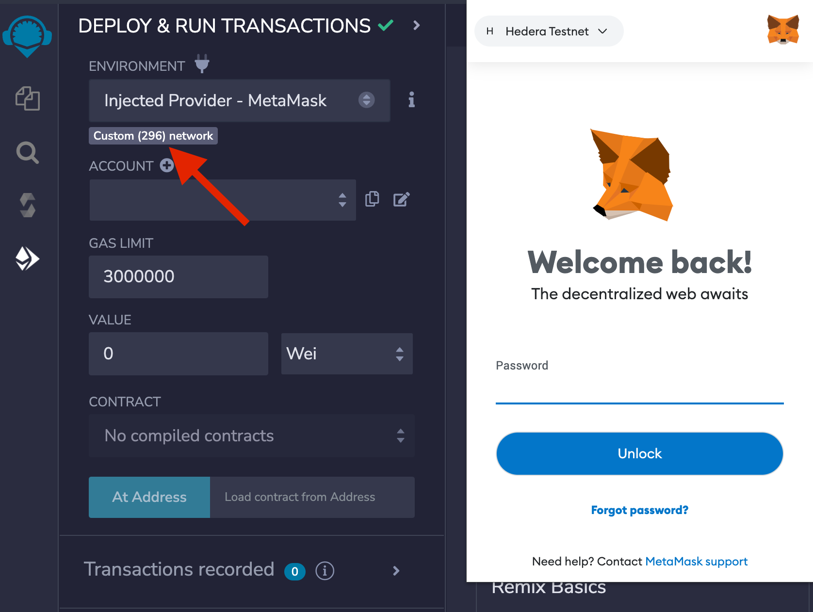
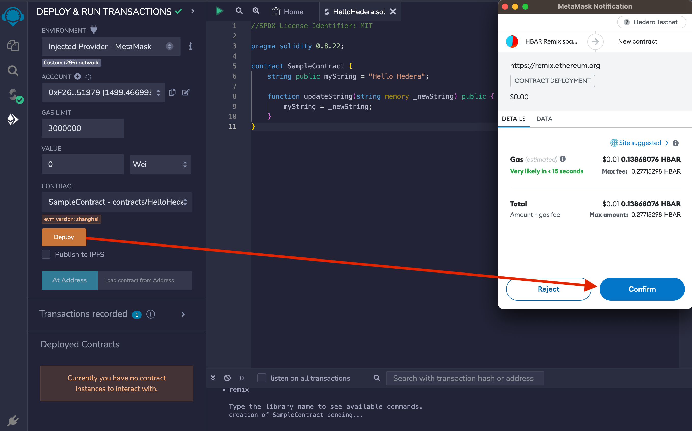
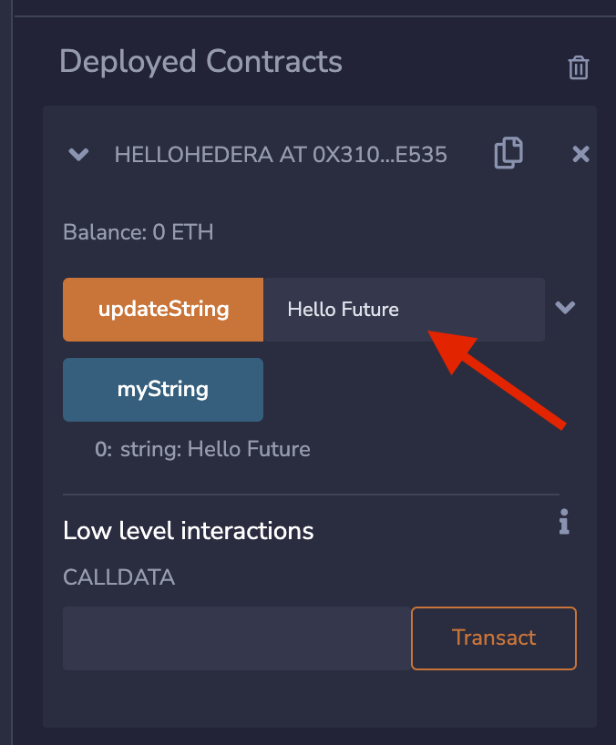
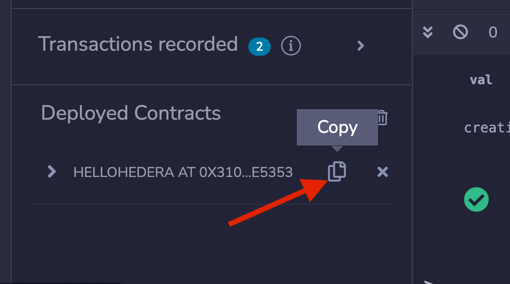
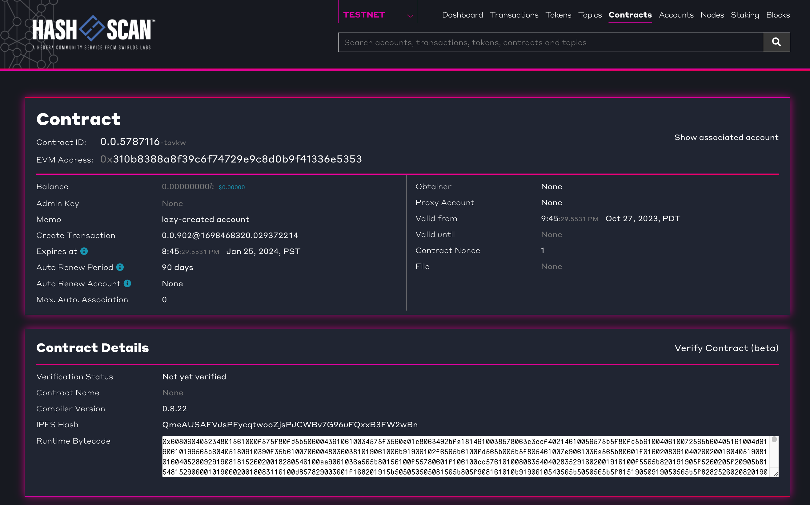

# Deploy a Smart Contract Using Remix

## Introduction to Remix

Remix IDE is an open-source tool for developing smart contracts in Solidity for the Ethereum network. It offers built-in compiling, debugging, and deploying features, streamlining the development process. This tutorial will leverage Remix IDE to create and deploy a simple smart contract on the Hedera network.

***

## Prerequisites

* Web browser with access to [Remix IDE](https://remix.ethereum.org/).
* [Create](../more-tutorials/create-and-fund-your-hedera-testnet-account.md) a Hedera ECDSA testnet account.
* [Download](https://metamask.io/download/) the MetaMask wallet browser extension.&#x20;

***

## Add Hedera Testnet to your MetaMask

Before deploying a smart contract to the Hedera network using Remix, add Hedera Testnet as a custom network to MetaMask.

1. Open the MetaMask wallet extension and navigate to **Settings > Networks > Add a Network > Add a network manually** then add the Hedera Testnet details:

<figure><figcaption></figcaption></figure>

2. Switch the network to **Hedera Testnet** and add your account by importing your hex-encoded ECDSA private key to MetaMask.

<figure><figcaption></figcaption></figure>

**➡** [Here](https://docs.hedera.com/hedera/tutorials/smart-contracts/deploy-by-leveraging-ethereum-developer-tools-on-hedera#import-hedera-account-into-metamask) is a more comprehensive guide on importing a Hedera account into MetaMask.

***

## Create a Smart Contract

Open your web browser and navigate to [Remix IDE](https://remix.ethereum.org/). Click on the file icon in the **File Explorer** tab to create a new file and name it `HelloHedera.sol` .&#x20;

<figure><figcaption></figcaption></figure>

Copy and paste this sample contract to the new file you created:

```solidity
//SPDX-License-Identifier: MIT

pragma solidity 0.8.22;

contract SampleContract {
    string public myString = "Hello Hedera";

    function updateString(string memory _newString) public {
        myString = _newString;
    }
}
```

***

## Compile the Contract

Navigate to the **Solidity Compiler** tab in the left sidebar and check that your compiler version is within the versions specified in the `pragma solidity` statement. Then, compile your `HelloHedera.sol` contract.&#x20;

<figure><figcaption></figcaption></figure>

When a compilation for a Solidity file succeeds, Remix creates three JSON files for each compiled contract. Files can be seen in the `File Explorers plugin` as:

1. `artifacts/<contractName>.json`: contains the link to the libraries, the bytecode, the deployed bytecode, the gas estimation, the method identifiers, and the ABI. It is used for linking a library address to the file.
2. `artifacts/<contractName_metadata>.json`: contains the metadata from the output of Solidity compilation.
3. `artifacts/build-info/<dynamic_hash>.json`: contains info about `solc` compiler version, compiler input and output. This file is generated similar to the files generated through Hardhat compilation. You can also try [Hardhat compilation](https://remix-ide.readthedocs.io/en/latest/hardhat.html#enable-hardhat-compilation) from Remix.

<figure><figcaption></figcaption></figure>

Please note that to generate these artifact files, the **Generate contract metadata** box in the **General settings** section of the **Settings** module needs to be checked. By default, it is checked.

***

## Deploy to Hedera Testnet

Go to the **Deploy & Run Transactions** tab and select **Injected Provider - MetaMask** as the environment. A window will pop up if you're not signed into your MetaMask account. Sign in and make sure you're on Hedera Testnet and verify that the network is configured properly to **Custom (296) network**.&#x20;

<figure><figcaption></figcaption></figure>

Once you click **Deploy** in the **Deploy & Run Transactions** tab, hit **Confirm** in the MetaMask notification window to approve and pay for the contract deployment transaction.&#x20;

<figure><figcaption></figcaption></figure>

***

## Interact with the Smart Contract on Hedera

Once the transaction is successful, you can interact with the smart contract through Remix. Select the dropdown on the newly deployed contract at the bottom of the left panel to view the contract's functions under **Deployed Contracts**. Write a new message to the `updateString` function using the input and confirm the write transaction in the MetaMask window to pay.&#x20;

<figure><figcaption></figcaption></figure>

***

## View Contract Details

Copy the contract address from the Deployed Contracts window.&#x20;

<figure><figcaption></figcaption></figure>

Navigate to the [HashScan](https://hashscan.io/) network explorer and use the contract address to search for your contract to view the details.

<figure><figcaption></figcaption></figure>

### Next Steps: Verify Your Smart Contract

If you're up for it, you can verify your deployed contract using the HashScan Smart Contract Verifier tool. Learn how:


[how-to-verify-a-smart-contract-on-hashscan.md](how-to-verify-a-smart-contract-on-hashscan.md)


**Congratulations! 🎉 You have successfully deployed a smart contract on the Hedera network using Remix IDE. Feel free to reach out in** [**Discord**](https://hedera.com/discord) **if you have any questions!**

***

## Additional Resources

**➡** [**Remix IDE Documentation**](https://remix-ide.readthedocs.io/en/latest/index.html)

**➡** [**HashScan Network Explorer**](https://hashscan.io/)

**➡** [**Deploy Leveraging EVM Dev Tools** ](deploy-by-leveraging-ethereum-developer-tools-on-hedera.md)

<table data-card-size="large" data-view="cards"><thead><tr><th align="center"></th><th data-hidden data-card-target data-type="content-ref"></th></tr></thead><tbody><tr><td align="center"><p>Writer: Krystal, Technical Writer</p><p><a href="https://github.com/theekrystallee">GitHub</a> | <a href="https://hashnode.com/@theekrystallee">Hashnode</a></p></td><td><a href="https://hashnode.com/@theekrystallee">https://hashnode.com/@theekrystallee</a></td></tr><tr><td align="center"><p>Editor: Abi, DevRel Engineer</p><p><a href="https://github.com/a-ridley">GitHub</a> | <a href="https://www.linkedin.com/in/a-ridley/">LinkedIn</a></p></td><td><a href="https://www.linkedin.com/in/a-ridley/">https://www.linkedin.com/in/a-ridley/</a></td></tr><tr><td align="center"><p>Editor: Logan, Software Engineering Intern</p><p><a href="https://github.com/quiet-node">GitHub</a> | <a href="https://www.linkedin.com/in/logann131/">LinkedIn</a></p></td><td><a href="https://github.com/quiet-node">https://github.com/quiet-node</a></td></tr></tbody></table>
