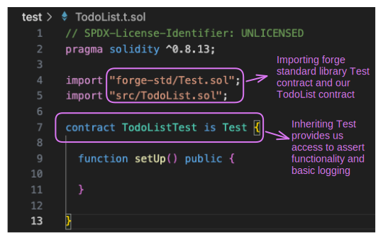
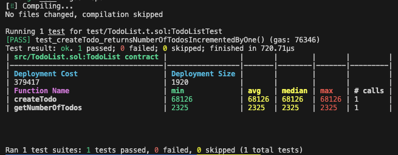

# How to Setup Foundry and Write a Basic Unit Test

## What you will accomplish

* [ ] Configure Foundry and Forge with a Hedera Project
* [ ] Write unit tests in Solidity
* [ ] Run your tests using Foundry `forge` command
* [ ] Create a Forge Gas Report

***

## Prerequisites

Before you begin, you should be familiar with the following:

* [JavaScript](https://developer.mozilla.org/en-US/docs/Web/JavaScript)
* [Solidity](https://docs.soliditylang.org/en/latest/)
* [Foundry](https://book.getfoundry.sh/)

<details>

<summary>Also, you should have the following set up on your computer ⬇</summary>

* [x] git installed
  * Minimum version: 2.37
  * Recommended: [Install Git (Github)](https://github.com/git-guides/install-git)
* [x] A code editor or IDE
  * Recommended: [VS Code. Install VS Code (Visual Studio)](https://code.visualstudio.com/docs/setup/setup-overview)
* [x] NodeJs + npm installed
  * Minimum version of NodeJs: 18
  * Minimum version of npm: 9.5
  * Recommended for Linux & Mac: [nvm](https://github.com/nvm-sh/nvm)
  * Recommended for Windows: [nvm-windows](https://github.com/coreybutler/nvm-windows)

</details>

<details>

<summary>Check your prerequisites set up ⬇</summary>

Open your terminal, and enter the following commands.

```shell
git --version
code --version
node --version
npm --version
```

Ensure these versions meet or exceed the minimum requirements:

```
git --version
git version 2.39.2 (Apple Git-143)

code --version
1.81.1
6c3e3dba23e8fadc360aed75ce363ba185c49794
arm64

node --version
v20.6.1

npm --version
9.8.1

```

</details>

***

## Get started

### Set up project

To follow along, start with the `main` branch, which is the _default branch_ of this repository. This gives you the initial state from which you can follow along with the steps as described in the tutorial.

```shell
git clone git@github.com:hedera-dev/setup-foundry-and-write-basic-unit-test.git
```

### Add a submodule

Forge manages dependencies by using [git submodules](https://git-scm.com/book/en/v2/Git-Tools-Submodules). Run the steps below to add and install the git submodules necessary to use Forge.

Next, add the Forge Standard Library to your project:

```shell
cd setup-foundry-and-write-basic-unit-test
```

```shell
git submodule add https://github.com/foundry-rs/forge-std lib/forge-std
```

This command will add the forge standard library to our project by creating a folder named `lib`. The forge standard library is the preferred testing library when working with Foundry.

### Install Foundryup

Foundryup represents Foundry's tool management approach. Executing this command will install `forge` and other essential Foundry CLI tools.

```shell
curl -L https://foundry.paradigm.xyz | bash
```

You should see output similar to the following:

```shell
  % Total    % Received % Xferd  Average Speed   Time    Time     Time  Current
                                 Dload  Upload   Total   Spent    Left  Speed
  0     0    0     0    0     0      0      0 --:--:-- --:--:-- --:--:--     0
100  1942  100  1942    0     0   3336      0 --:--:-- --:--:-- --:--:--     0
Installing foundryup...
######################################################################## 100.0%

Detected your preferred shell is zsh and added foundryup to PATH. Run 'source /Users/abi/.zshenv' or start a new terminal session to use foundryup.
Then, simply run 'foundryup' to install Foundry.

```


You may need to add foundry to PATH and open a new terminal to make the `foundryup` command available. Then run `foundryup` to install Foundry.


<details>

<summary>Once you've installed foundry you should get a similar output</summary>

```
xOx.xOx.xOx.xOx.xOx.xOx.xOx.xOx.xOx.xOx.xOx.xOx.xOx.xOx.xOx.xOx.xOx.xOx
 ╔═╗ ╔═╗ ╦ ╦ ╔╗╔ ╔╦╗ ╦═╗ ╦ ╦         Portable and modular toolkit
 ╠╣  ║ ║ ║ ║ ║║║  ║║ ╠╦╝ ╚╦╝    for Ethereum Application Development
 ╚   ╚═╝ ╚═╝ ╝╚╝ ═╩╝ ╩╚═  ╩                 written in Rust.
.xOx.xOx.xOx.xOx.xOx.xOx.xOx.xOx.xOx.xOx.xOx.xOx.xOx.xOx.xOx.xOx.xOx.xOx
Repo       : https://github.com/foundry-rs/
Book       : https://book.getfoundry.sh/                      
Chat       : https://t.me/foundry_rs/                         
Support    : https://t.me/foundry_support/
Contribute : https://github.com/orgs/foundry-rs/projects/2/
.xOx.xOx.xOx.xOx.xOx.xOx.xOx.xOx.xOx.xOx.xOx.xOx.xOx.xOx.xOx.xOx.xOx.xOx
foundryup: installing foundry (version nightly, tag nightly)
foundryup: downloading latest forge, cast, anvil, and chisel
######################################################################### 100.0%
foundryup: downloading manpages
######################################################################### 100.0%
foundryup: installed - forge 0.2.0 (5ea2c5e 2024-01-22T00:24:09.322705000Z)
foundryup: installed - cast 0.2.0 (5ea2c5e 2024-01-22T00:24:09.341247000Z)
foundryup: installed - anvil 0.2.0 (5ea2c5e 2024-01-22T00:24:09.359481000Z)
foundryup: installed - chisel 0.2.0 (5ea2c5e 2024-01-22T00:24:09.377345000Z)
foundryup: done!
```

</details>

### Install the submodule dependencies

```shell
forge install
```

### Remap dependencies

In order to make the import of the forge standard library easier to write, we will remap the dependency.

**Open the project `setup-foundry-and-write-basic-unit-test`, in a code editor.**

Create a new text file under the root directory named `remappings.txt`

Paste in the following line of code

```
forge-std/=lib/forge-std/src/
```

When we want to import from `forge-std` we will write: `import "forge-std/Contract.sol"`

***

## Setup the test

A test file named `TodoList.t.sol` has been provided to you under the `test` folder.

On line 7, we see our `TodoListTest` contract inherits Forge Standard Library's Test contract, which provides us access to the necessary functionality to test our smart contracts.

<figure><figcaption><p>TodoList Test Contract</p></figcaption></figure>

### **Step 1: Create your test instance**

Create an instance of the contract `TodoList.sol` in `TodoList.t.sol` order to be able to test it.

```solidity
TodoList public todoList;
```


Look for a comment in the code to locate the specific lines of code that you will need to edit. For example, in this step, look for this: // Step (1) in the accompanying tutorial. You will need to delete the inline comment that looks like this: /\* ... \*/. Replace it with the correct code.


***

## Write a test

### **Step 2: Deploy a new contract every time you run a test**

The `setup()` function is invoked before each test case is run and is optional. Have the `TodoList.t.sol` test contract deploy a new TodoList contract by adding the following code in the `setUp()` function.

```solidity
todoList = new TodoList();
```

### **Step 3: Confirm that the number of todos increases by one after calling `createTodo()`**

Assert that the `numberOfTodosAfter` executing `createTodo()` is equal to the `numberOftodosBefore` + 1.

```solidity
     assertEq(numberOfTodosAfter, (numberOfTodosBefore + 1), "create todo test");
```

***

## Build and run your test

Foundry expects the `test` keyword as a prefix to distinguish a test. Therefore, all tests you want to run must be prefixed with the `test` keyword.

Foundry expects the `test` keyword as a prefix to distinguiash a test. Therefore, all tests that you want to run must be prefixed with the `test` keyword.

In the terminal, ensure you are in the root project directory and build the project.

```shell
forge build
```

You should see output similar to the following:

```
[⠒] Compiling...
[⠔] Compiling 22 files with 0.8.23
[⠑] Solc 0.8.23 finished in 3.44s
Compiler run successful!
```

After a successful build, run your test.

```shell
forge test
```

You should see output similar to the following:

```
[⠢] Compiling...
No files changed, compilation skipped

Running 1 test for test/TodoList.t.sol:TodoListTest
[PASS] test_createTodo_returnsNumberOfTodosIncrementedByOne() (gas: 76346)
Test result: ok. 1 passed; 0 failed; 0 skipped; finished in 1.12ms
 
Ran 1 test suites: 1 tests passed, 0 failed, 0 skipped (1 total tests)
```

By default `forge test` only displays a minimal summary of a test, whether it failed or passed. You can display more detailed information by using the `-v` flag and increasing the verbosity.

In the terminal, re-run your test but include a verbosity level 4. This will display stack traces for all tests, including the setup.

```shell
forge test -vvvv
```

<details>

<summary>Level 4 verbosity output</summary>


</details>

***

## Forge Gas Reports

Forge has functionality built in to give you [gas reports](https://book.getfoundry.sh/forge/gas-reports) of your contracts. You can specify which contract should generate a gas report in the `foundry.toml` file.

The `foundry.toml` file is a configuration file that is used to configure forge.

Create a new file in the root directory named `foundry.toml`. Paste the following contents.

```toml
[profile.default]
src = 'src'
out = 'out'
libs = ['lib']

# Step 4 - Configure foundry to produce a gas report for `TodoList.sol`
#/* ... */

[rpc_endpoints]
h_testnet = "https://testnet.hashio.io/api"
h_mainnet = "https://mainnet.hashio.io/api"

# See more config options https://github.com/foundry-rs/foundry/tree/master/config
```

### Step 4: Configure foundry to produce a gas report for `TodoList.sol`

Replace the comment `#/* ... */` with the line below:

```toml
gas_reports = ["TodoList"]
```

In the terminal, generate a gas report.

```shell
forge test --gas-report
```

You should see output similar to the following:

<figure><figcaption><p>Test Contract Gas Report</p></figcaption></figure>

Your output will show you an estimated gas average, median, and max for each contract function used in a test and total deployment cost and size.

***

## Complete

Congratulations, you have completed how to setup Foundry and write a basic unit test.

You have learned how to:

* [x] Configure Foundry and forge with a hedera project
* [x] Write unit tests in Solidity
* [x] Run your tests using Foundry `forge` command
* [x] Create a forge gas report

***

<table data-card-size="large" data-view="cards"><thead><tr><th align="center"></th><th data-hidden data-card-target data-type="content-ref"></th></tr></thead><tbody><tr><td align="center"><p>Writer: Abi Castro, DevRel Engineer</p><p><a href="https://github.com/a-ridley">GitHub</a> | <a href="https://twitter.com/ridley___">Twitter</a></p></td><td><a href="https://twitter.com/ridley___">https://twitter.com/ridley___</a></td></tr><tr><td align="center"><p>Editor: Brendan, DevRel Engineer</p><p><a href="https://github.com/bguiz">GitHub</a> | <a href="https://blog.bguiz.com">Blog</a></p></td><td><a href="https://blog.bguiz.com">https://blog.bguiz.com</a></td></tr></tbody></table>
