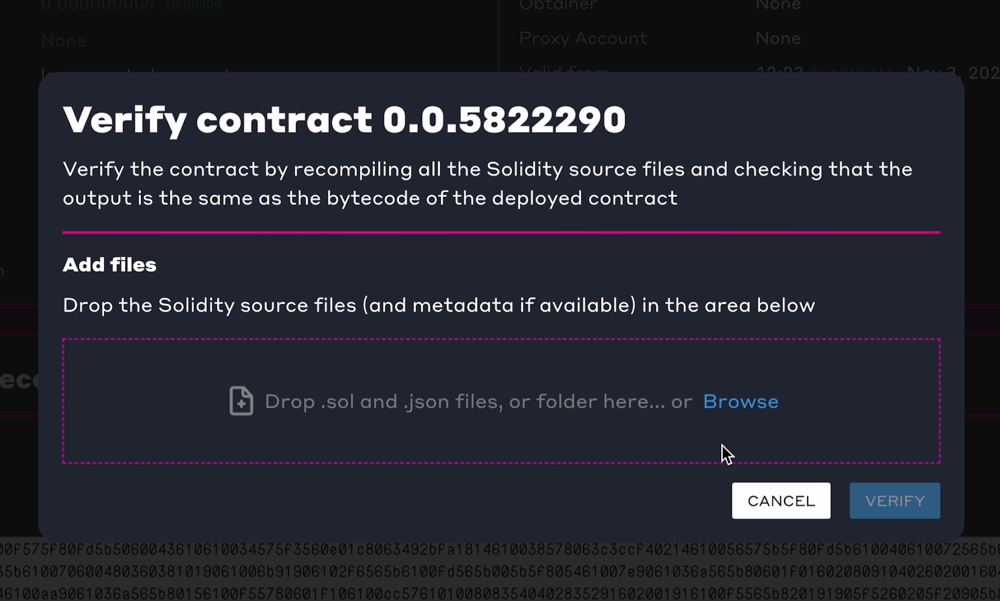
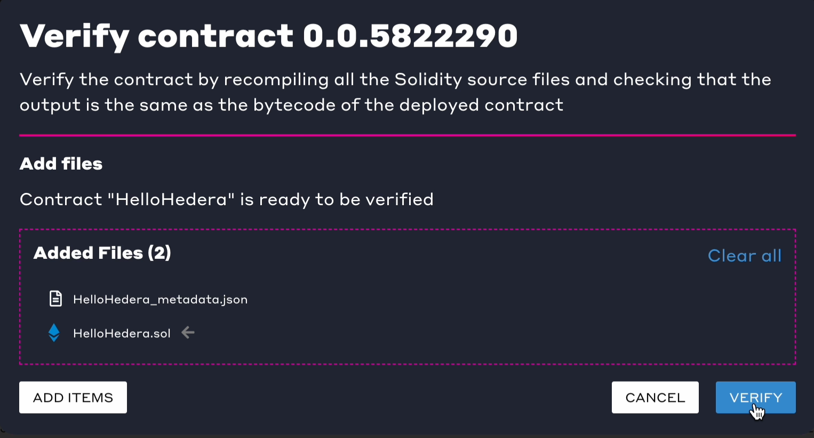
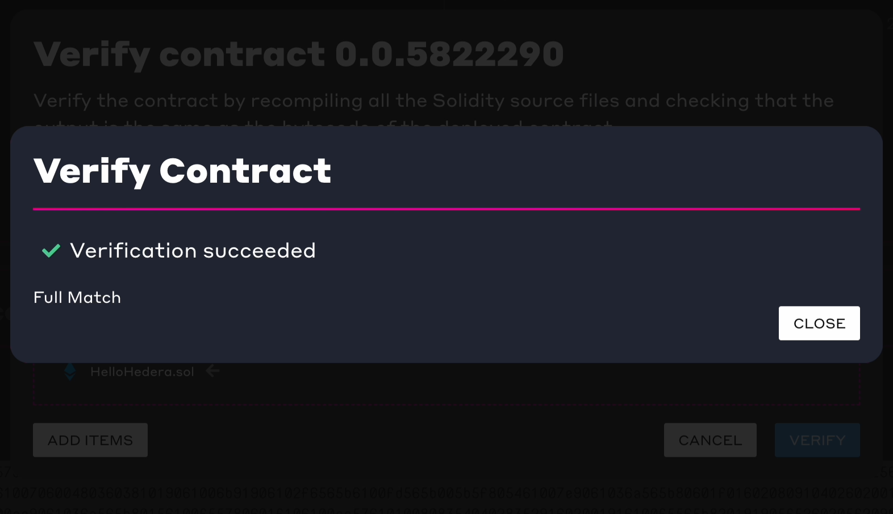
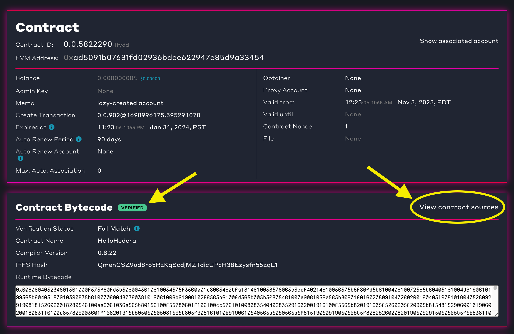
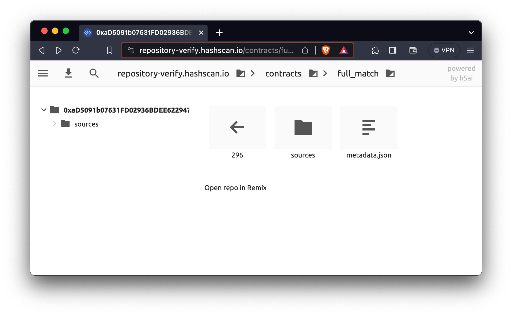
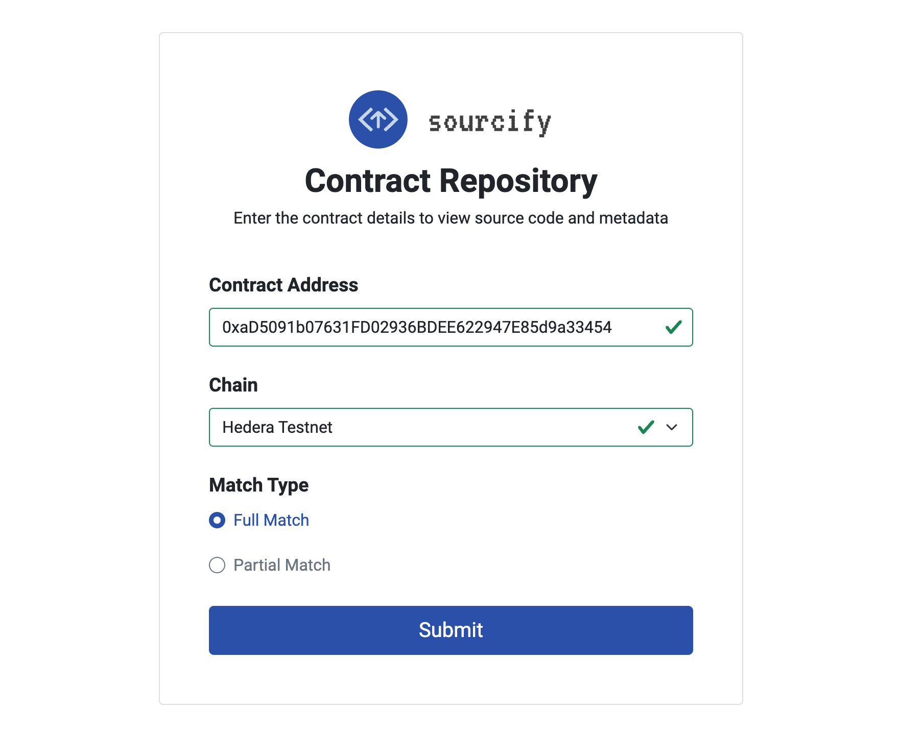
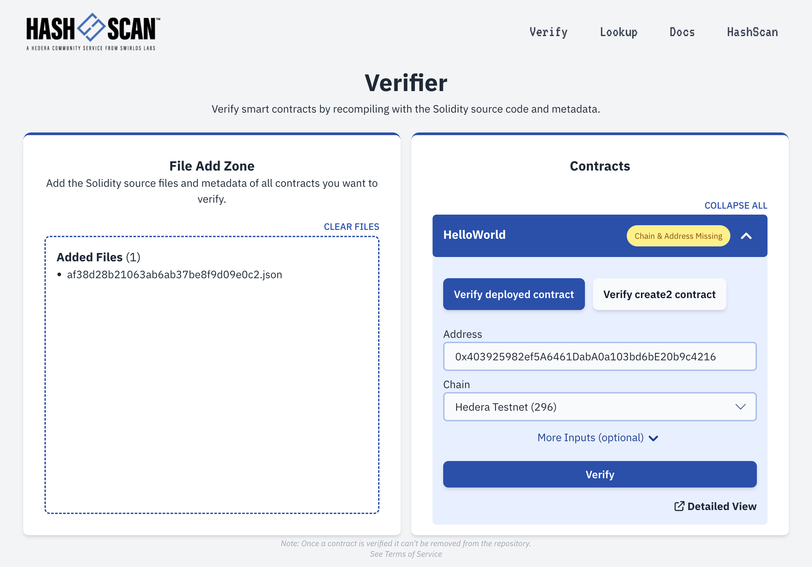
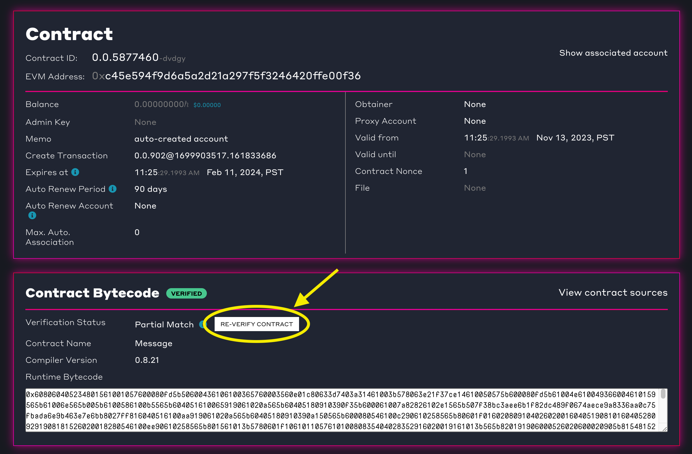

# How to Verify a Smart Contract on HashScan

Verifying smart contracts helps ensure the deployed bytecode matches the expected source files. [HashScan](https://hashscan.io/) Smart Contract Verifier is a tool that simplifies this process. This guide will walk through the basic steps of smart contract verification using the HashScan Smart Contract Verifier tool.&#x20;

<figure><figcaption>
Smart Contract Verification Flow
</figcaption></figure>


_**📣 Note**: This is an initial release. API functionalities will see enhancements in upcoming updates of the_ [_https://github.com/hashgraph/hedera-sourcify_](https://github.com/hashgraph/hedera-sourcify) _repository._


***

## Prerequisites&#x20;

* Solidity [source code file](../../core-concepts/smart-contracts/verifying-smart-contracts-beta.md#smart-contract-source-code) of the deployed smart contract.
* Solidity [JSON (metadata) file](../../core-concepts/smart-contracts/verifying-smart-contracts-beta.md#the-metadata-file) of the deployed smart contract.
* EVM address of the smart contract deployed on the Hedera network.

***

## Table of Contents

1. [Find the Contract](how-to-verify-a-smart-contract-on-hashscan.md#step-1-find-the-contract-on-hashscan)
2. [Import Source Files](how-to-verify-a-smart-contract-on-hashscan.md#step-2-import-source-files)
3. [Verify Contract](how-to-verify-a-smart-contract-on-hashscan.md#step-3-verify-contract)
4. [Verification Match](how-to-verify-a-smart-contract-on-hashscan.md#step-4-verification-match)
5. [View Verified Contract](how-to-verify-a-smart-contract-on-hashscan.md#step-5-view-verified-contract)
6. [Re-Verify Smart Contract](how-to-verify-a-smart-contract-on-hashscan.md#step-6-re-verify-smart-contract)
7. [Additional Resources](how-to-verify-a-smart-contract-on-hashscan.md#additional-resources)

***

## Step 1: Find the Contract on HashScan

Open a web browser and navigate to [HashScan](https://hashscan.io/). Make sure you are on the correct Hedera network (Mainnet, Testnet, or Previewnet), and search for the deployed contract address in the search bar at the top of the page. In the _**Contract Bytecode**_ section click on _**Verify Contract**_. The source code file importer popup window will open.

<figure><figcaption></figcaption></figure>

***

## Step 2: Import Source Files

Add your Solidity source code files in the source file importer popup. Source files include the smart contract (`.sol`) [source code file](../../core-concepts/smart-contracts/verifying-smart-contracts-beta.md#smart-contract-source-code) and [metadata](../../core-concepts/smart-contracts/verifying-smart-contracts-beta.md#the-metadata-file) (`.json` ) file. The metadata file can be found in the `artifacts/` directory of your smart contract project and its name correlates with the smart contract. For example, the metadata for the `HelloHedera.sol` contract would be called `HelloHedera.json`.

<figure><figcaption>
HashScan Verification Source File Importer Popup
</figcaption></figure>

📣 Different compiling tools require specific verification source files. Here's a brief outline of what is needed for popular tools: 

1. **Remix**:
   * **Required for Full Match Verification**: Both the metadata file found in the `contracts/artifacts/` folder and the smart contract's Solidity file. More details [here](../../core-concepts/smart-contracts/verifying-smart-contracts-beta.md#remix-ide-beginner).&#x20;
2. **Hardhat**:
   * **Required for Full Match Verification**: Only the output of the compilation JSON file found in the `/artifacts/build-info/` folder. More details [here](../../core-concepts/smart-contracts/verifying-smart-contracts-beta.md#hardhat-intermediate).
3. **Solidity Compiler (solc)**:&#x20;
   * **Required for Full Match Verification**: Both the metadata file (generated by `solc --metadata`) and the smart contract's Solidity file. More details [here](../../core-concepts/smart-contracts/verifying-smart-contracts-beta.md#solidity-compiler-advanced).&#x20;
4. **Foundry**:
   * **Required for Full Match Verification**: Both the metadata file (generated by `forge-build`) and the smart contract's Solidity file.&#x20;

_**Note**: Uploading only the Solidity file without the metadata file will result in a Partial Match._

***

## Step 3: Verify Contract

After importing the source files, if you get the "_Contract \<contract name> is ready to be verified"_ message, click **VERIFY** to initiate the verification process. Sourcify will then compare the deployed contract bytecode to the source files you imported in the previous step.

<figure><figcaption></figcaption></figure>

***

## Step 4: Verification Match

If your verification is successful, the verifier will return either a [<mark style="color:green;">Full Match</mark>](https://docs.sourcify.dev/docs/full-vs-partial-match/#full-perfect-matches) or [<mark style="color:green;">Partial Match</mark>](https://docs.sourcify.dev/docs/full-vs-partial-match/#partial-matches) status. Let's review each verification status and what they mean:

* **Full Match**: Indicates the bytecode is a full (perfect) match, including all the metadata. The contract source code and metadata settings are identical to the deployed version.
* **Partial Match**: Indicates the bytecode _mostly_ (partially) matches with the deployed contract, except for the metadata hash like comments or variable names. It is usually sufficient for most verification purposes.

<figure><figcaption></figcaption></figure>

To learn more about each verification match status, head over to the official Sourcify documentation [here](https://docs.sourcify.dev/docs/full-vs-partial-match/).&#x20;

***

## Step 5: View Verified Contract

To view the verified contract repository, click _**View Contract Sources**_ in the _**Contract Bytecode**_ section on HashScan. This will open a verified contract repository search page window.

<figure><figcaption></figcaption></figure>

A summary of your contract's verification details will be displayed in the new window. Verification details include the contract address, source code files, match type, chain ID, metadata, and an option to open the repository in Remix.&#x20;

<figure><figcaption>
Verified contract repository
</figcaption></figure>

To be directed to the Sourcify Contract Repository search page, click on `⬅ 296`.

<figure><figcaption>
Sourcify Contract Repository search page
</figcaption></figure>

**Congratulations! 🎉 You have successfully learned how to verify a smart contract.  Feel free to reach out on** [**Discord**](https://hedera.com/discord) **if you have any questions!**

***

## Step 6: Re-Verify Smart Contract

If you change your contract or want to upgrade your contract from a **Partial Match** to a **Full Match**, there are two options for re-verification:

#### Option 1

Head to the smart contract verifier [page](https://verify.hashscan.io/) and import your new updated source files.

<figure><figcaption></figcaption></figure>

Enter the smart contract address and chain, then click _**Verify**_.

<figure><figcaption></figcaption></figure>

#### Option 2

Revisit [**Step 1**](how-to-verify-a-smart-contract-on-hashscan.md#step-1-find-the-contract-on-hashscan) and use the _**Re-verify Contract**_ flow. Then proceed to Steps 2 through 5.

<figure><figcaption></figcaption></figure>

***

## Video Tutorial



***

## Additional Resources

**➡** [**HashScan Network Explorer**](https://hashscan.io/)

**➡** [**Smart Contract Verifier Page**](https://verify.hashscan.io/)

**➡** [**Verified Contract Repository**](https://repository-verify.hashscan.io/select-contract/)&#x20;

**➡** [**Sourcify Documentation**](https://docs.sourcify.dev/docs/intro)

**➡** [**Smart Contract Documentation**](../../core-concepts/smart-contracts/verifying-smart-contracts-beta.md)

<table data-card-size="large" data-view="cards"><thead><tr><th align="center"></th><th data-hidden data-card-target data-type="content-ref"></th></tr></thead><tbody><tr><td align="center">
Writer: Krystal, Technical Writer

<a href="https://github.com/theekrystallee">GitHub</a> | <a href="https://twitter.com/theekrystallee">Twitter</a>
</td><td><a href="https://twitter.com/theekrystallee">https://twitter.com/theekrystallee</a></td></tr><tr><td align="center">
Editor: Nana, Sr. Software Manager

<a href="https://github.com/Nana-EC">GitHub</a> | <a href="https://www.linkedin.com/in/nconduah/">LinkedIn</a>
</td><td><a href="https://www.linkedin.com/in/nconduah/">https://www.linkedin.com/in/nconduah/</a></td></tr><tr><td align="center">
Editor: Ed, DevRel Engineer

<a href="https://github.com/ed-marquez">GitHub</a> | <a href="https://www.linkedin.com/in/ed-marquez/">LinkedIn</a>
</td><td></td></tr><tr><td align="center">
Editor: Logan, Software Engineer Intern

<a href="https://github.com/quiet-node">GitHub</a> | <a href="https://www.linkedin.com/in/logann131/">LinkedIn</a>
</td><td><a href="https://github.com/quiet-node">https://github.com/quiet-node</a></td></tr></tbody></table>
