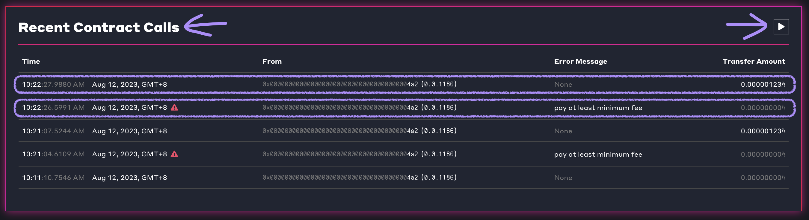
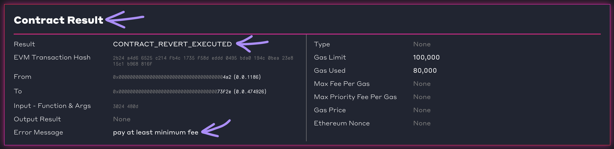
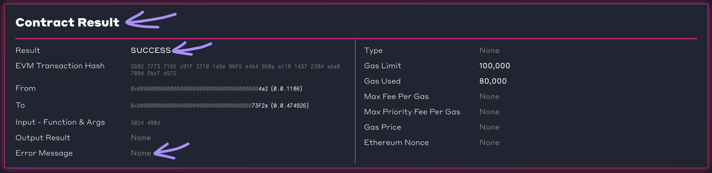
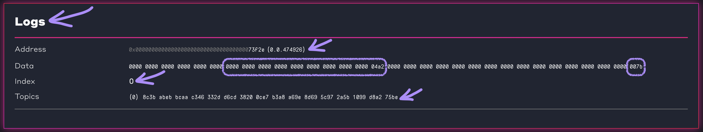

# Hedera SDK JS

## Video


Hedera Smart Contract Service Workshop Part 4/6 | Hedera SDK


## Hedera SDK JS

The Hedera network offers multiple services:

* Hedera Smart Contract Service (HSCS)
* Hedera File Service (HFS)
* Hedera Token Service (HTS)
* Hedera Consensus Service (HCS)

Each service defines a number of different ways you can interact with it as a developer, and these comprise the Hedera Application Programming Interfaces (HAPIs). However, HAPIs are very close to the metal, and a developer needs to handle gRPCs and protocol buffers (among other things) to work with them successfully. Thankfully there are Hedera SDKs, which abstract these low-level complexities away. These SDKs allow you to interact with the various Hedera services via APIs exposed in a variety of different programming languages.

<details>

<summary>Available Hedera SDKs</summary>

At the time of writing, July 2023, these Hedera SDKs are available in the following languages:

* [Hedera SDK JavaScript/ TypeScript](https://github.com/hashgraph/hedera-sdk-js)
* [Hedera SDK Java](https://github.com/hashgraph/hedera-sdk-java)
* [Hedera SDK Go](https://github.com/hashgraph/hedera-sdk-go)
* [Hedera SDK Swift](https://github.com/hashgraph/hedera-sdk-swift)

Please refer to [SDKs](https://github.com/hashgraph/hedera-docs/blob/master/hedera/sdks-and-apis/sdks/README.md) for an up to date list of SDKs, including additional community-maintained SDKs.

</details>

In this tutorial, you will be using Hedera SDK JS to interact with HSCS. Specifically, you will use it to deploy a smart contract, query its state by invoking functions, and modify its state by invoking other functions.

## Prerequisites

* ✅ Complete the [Setup](setup.md) section of this same tutorial.
* ✅ Complete the [Solidity](solidity.md) section of this same tutorial.

## Set up the project

To follow along, enter the `hederasdkjs` directory within the [accompanying tutorial GitHub repository](https://github.com/hedera-dev/hedera-smart-contracts-workshop), which you should already have cloned in the [Intro section](../) earlier.

```shell
cd ./hederasdkjs
npm install
```

## Compiling smart contracts

### Step D1: Copy smart contract

We have already written the smart contract in the Intro section of this tutorial. Let's copy that into this directory so that we may continue working on it.

```shell
cp ../intro/trogdor.sol ./trogdor.sol
```

### Using `solc` to compile smart contracts

Let's install the Solidity compiler, `solc` from npm.

```shell
npm install --global solc@0.8.17
```

You can verify that it has installed successfully by asking it to output its version. Note that while the package name on npm is `solc`, the executable present on `PATH` is spelled slightly differently: `solcjs`.

```shell
solcjs --version
```

If it does not error, and outputs its version, you know it has installed successfully.

```
0.8.17+commit.8df45f5f.Emscripten.clang
```

Let's explore its command line interface:

```shell
solcjs --help
```

There are relatively few flags and options. In this tutorial, you will only be using `--bin`, and `--abi`.

```
Usage: solcjs [options]

Options:
  -V, --version                        output the version number
  --version                            Show version and exit.
  --optimize                           Enable bytecode optimizer. (default: false)
  --optimize-runs <optimize-runs>      The number of runs specifies roughly how often each opcode of the deployed code
                                       will be executed across the lifetime of the contract. Lower values will optimize
                                       more for initial deployment cost, higher values will optimize more for
                                       high-frequency usage.
  --bin                                Binary of the contracts in hex.
  --abi                                ABI of the contracts.
  --standard-json                      Turn on Standard JSON Input / Output mode.
  --base-path <path>                   Root of the project source tree. The import callback will attempt to interpret
                                       all import paths as relative to this directory.
  --include-path <path...>             Extra source directories available to the import callback. When using a package
                                       manager to install libraries, use this option to specify directories where
                                       packages are installed. Can be used multiple times to provide multiple
                                       locations.
  -o, --output-dir <output-directory>  Output directory for the contracts.
  -p, --pretty-json                    Pretty-print all JSON output. (default: false)
  -v, --verbose                        More detailed console output. (default: false)
  -h, --help                           display help for command
```

Let's compile the Solidity file.

```shell
solcjs --bin --abi ./trogdor.sol
ls
```

Those flags instruct `solcjs` to output both EVM bytecode and ABI. The `ls` command lists the files that are in the directory, and the following files should be present.

```
# input file
trogdor.sol

# output files
trogdor_sol_Trogdor.abi
trogdor_sol_Trogdor.bin
```

### Examine the EVM bytecode output

The binary file contains the EVM bytecode: `trogdor_sol_Trogdor.bin`. This is _not_ intended to be human-readable.

```
608060405234801561001057600080fd5b506104fe806100206000396000f3fe60806040526004361061003f5760003560e01c80633024480d1461004457806355a3b2c11461004e57806376c7a3c71461008b578063966ff650146100b6575b600080fd5b61004c6100e1565b005b34801561005a57600080fd5b50610075600480360381019061007091906102e3565b61025b565b6040516100829190610329565b60405180910390f35b34801561009757600080fd5b506100a0610273565b6040516100ad9190610329565b60405180910390f35b3480156100c257600080fd5b506100cb610278565b6040516100d89190610329565b60405180910390f35b600073ffffffffffffffffffffffffffffffffffffffff163373ffffffffffffffffffffffffffffffffffffffff1603610150576040517f08c379a0000000000000000000000000000000000000000000000000000000008152600401610147906103a1565b60405180910390fd5b6064341015610194576040517f08c379a000000000000000000000000000000000000000000000000000000000815260040161018b9061040d565b60405180910390fd5b346000803373ffffffffffffffffffffffffffffffffffffffff1673ffffffffffffffffffffffffffffffffffffffff168152602001908152602001600020546101de919061045c565b6000803373ffffffffffffffffffffffffffffffffffffffff1673ffffffffffffffffffffffffffffffffffffffff168152602001908152602001600020819055507f8c3babebbcaac346332dd6cd38200ce7b3a8a69e8d695c972a5b1099d8a275be333460405161025192919061049f565b60405180910390a1565b60006020528060005260406000206000915090505481565b606481565b600047905090565b600080fd5b600073ffffffffffffffffffffffffffffffffffffffff82169050919050565b60006102b082610285565b9050919050565b6102c0816102a5565b81146102cb57600080fd5b50565b6000813590506102dd816102b7565b92915050565b6000602082840312156102f9576102f8610280565b5b6000610307848285016102ce565b91505092915050565b6000819050919050565b61032381610310565b82525050565b600060208201905061033e600083018461031a565b92915050565b600082825260208201905092915050565b7f7a65726f2061646472657373206e6f7420616c6c6f7765640000000000000000600082015250565b600061038b601883610344565b915061039682610355565b602082019050919050565b600060208201905081810360008301526103ba8161037e565b9050919050565b7f706179206174206c65617374206d696e696d756d206665650000000000000000600082015250565b60006103f7601883610344565b9150610402826103c1565b602082019050919050565b60006020820190508181036000830152610426816103ea565b9050919050565b7f4e487b7100000000000000000000000000000000000000000000000000000000600052601160045260246000fd5b600061046782610310565b915061047283610310565b925082820190508082111561048a5761048961042d565b5b92915050565b610499816102a5565b82525050565b60006040820190506104b46000830185610490565b6104c1602083018461031a565b939250505056fea264697066735822122018cb5f7072c3a79275ac6b6b70b93ee8cc4ad1a06554315aa3687c3d3a24b1b964736f6c63430008130033
```

Nothing much we can glean by looking at this really!

This bytecode is used to deploy the smart contract onto the Hedera network.

<details>

<summary>EVM bytecode categories</summary>

The EVM bytecode that is output by the Solidity compiler is not the same as the EVM bytecode that is stored and executed on the network after it has been deployed.

The Solidity compiler's output bytecode is _creation bytecode_, sometimes also referred to as _init bytecode_.

The bytecode that is stored on the network is _runtime bytecode_, sometimes also referred to as _deployed bytecode_.

* [Ref: Stackoverflow: What is the difference between bytecode, init code, deployed bytecode, creation bytecode, and runtime bytecode?](https://ethereum.stackexchange.com/a/76335/48984)

</details>

### Examine the ABI output

Open `trogdor_sol_Trogdor.abi`

If you are using a POSIX-compliant shell, and have `jq` installed, you can view the ABI output like so.

```shell
jq < ./trogdor_sol_Trogdor.abi
```

The ABI essentially tells any user/ developer who wishes to interact with the EVM bytecode, what the exposed interface is. In fact ABI stands for Application Binary Interface. This interface will include any functions and events, which are needed by any clients (e.g. DApps), or other smart contracts, to be able to interact with it.


* [Ref: Solidity - Contract ABI specification](https://docs.soliditylang.org/en/latest/abi-spec.html)


```json
[
  {
    "anonymous": false,
    "inputs": [
      {
        "indexed": false,
        "internalType": "address",
        "name": "who",
        "type": "address"
      },
      {
        "indexed": false,
        "internalType": "uint256",
        "name": "amount",
        "type": "uint256"
      }
    ],
    "name": "Burnination",
    "type": "event"
  },
  {
    "inputs": [],
    "name": "MIN_FEE",
    "outputs": [
      {
        "internalType": "uint256",
        "name": "",
        "type": "uint256"
      }
    ],
    "stateMutability": "view",
    "type": "function"
  },
  {
    "inputs": [
      {
        "internalType": "address",
        "name": "",
        "type": "address"
      }
    ],
    "name": "amounts",
    "outputs": [
      {
        "internalType": "uint256",
        "name": "",
        "type": "uint256"
      }
    ],
    "stateMutability": "view",
    "type": "function"
  },
  {
    "inputs": [],
    "name": "burninate",
    "outputs": [],
    "stateMutability": "payable",
    "type": "function"
  },
  {
    "inputs": [],
    "name": "totalBurnt",
    "outputs": [
      {
        "internalType": "uint256",
        "name": "",
        "type": "uint256"
      }
    ],
    "stateMutability": "view",
    "type": "function"
  }
]
```

This is extremely useful, because by examining the bytecode, which is what is deployed onto the Hedera network, you are likely to have _no idea_ what it does, or how to interact with it. If you have the corresponding ABI in hand, however, you will have a _very good idea_ of how you can interact with this smart contract, and perhaps can infer what it does as well.

## Deploying smart contracts

Let's edit the `deploy-sc.js` file. In this script, you'll use Hedera SDK JS to deploy your smart contract onto Hedera Testnet.

### Step E1: Initialise operator account

This script has already been set up to read in environment variables from the `.env` file that you have set up in the [Intro section](../) of this tutorial via the `dotenv` npm package, and they are now accessible using `process.env`.

We will use the `OPERATOR_ID` and `OPERATOR_KEY` environment variables to initialise an operator account, connect to Hedera Testnet.

```js
const operatorId = AccountId.fromString(process.env.OPERATOR_ID);
const operatorKey = PrivateKey.fromString(process.env.OPERATOR_KEY);
const client = Client.forTestnet();
client.setOperator(operatorId, operatorKey);
```

### Step E2: Read the EVM bytecode from file

One of the outputs from running `solc` earlier was the binary file, which contains EVM bytecode. Let's read this from disk into memory.

```js
  const evmBytecode = await fs.readFile(
    './trogdor_sol_Trogdor.bin', { encoding: 'utf8' });
```

### Step E3: Use HFS to store EVM bytecode on network

Next, write the EVM bytecode onto Hedera Testnet using HFS. In order to do so, you will need to use `FileCreateTransaction`.


Note that you can use `FileCreateTransaction` for any type of file that is up to 1024KB in size. You are not restricted to only EVM bytecode.


```js
  const fileCreate = new FileCreateTransaction()
    .setContents(evmBytecode.toString());
  const fileCreateTx = await fileCreate.execute(client);
  const fileCreateReceipt = await fileCreateTx.getReceipt(client);
  console.log('HFS FileCreateTransaction', fileCreateReceipt);
  const fileId = fileCreateReceipt.fileId;
```

In the final line above, obtain the file ID from the `FileCreateTransaction`'s receipt, as `fileId` - you will need it later.

### Step E4: Deploy a smart contract on HSCS by referencing the bytecode on HFS

Now we're finally able to deploy the smart contract onto HSCS. In order to do so, you will need to use `ContractCreateTransaction`.

```js
  const scDeploy = new ContractCreateTransaction()
    .setBytecodeFileId(fileId)
    .setGas(100_000);
  const scDeployTx = await scDeploy.execute(client);
  const scDeployReceipt = await scDeployTx.getReceipt(client);
  console.log('HSCS ContractCreateTransaction', scDeployReceipt);
  const scId = scDeployReceipt.contractId;
```

The `fileId` that you obtained in the previous step references the EVM bytecode stored on HFS. The `ContractCreateTransaction` references this file on HFS during the deployment process.

In the final line above, obtain the smart contract ID from the `ContractCreateTransaction`'s receipt, as `scId` - you will need it later.

The smart contract is now deployed, and ready to be interacted with.

Run the script.

```shell
node ./deploy-sc.js
```

You should see output similar to the following, which contains:

* `HFS FileCreateTransaction TransactionReceipt`
* `HSCS ContractCreateTransaction TransactionReceipt`
* `Deployed to`

```
HFS FileCreateTransaction TransactionReceipt {
  status: Status { _code: 22 },
  accountId: null,
  fileId: FileId {
    shard: Long { low: 0, high: 0, unsigned: false },
    realm: Long { low: 0, high: 0, unsigned: false },
    num: Long { low: 474925, high: 0, unsigned: false },
    _checksum: null
  },
  contractId: null,
  topicId: null,
  tokenId: null,
  scheduleId: null,
  exchangeRate: ExchangeRate {
    hbars: 30000,
    cents: 169431,
    expirationTime: 2023-08-12T03:00:00.000Z,
    exchangeRateInCents: 5.6477
  },
  topicSequenceNumber: Long { low: 0, high: 0, unsigned: false },
  topicRunningHash: Uint8Array(0) [],
  totalSupply: Long { low: 0, high: 0, unsigned: false },
  scheduledTransactionId: null,
  serials: [],
  duplicates: [],
  children: []
}
HSCS ContractCreateTransaction TransactionReceipt {
  status: Status { _code: 22 },
  accountId: null,
  fileId: null,
  contractId: ContractId {
    shard: Long { low: 0, high: 0, unsigned: false },
    realm: Long { low: 0, high: 0, unsigned: false },
    num: Long { low: 474926, high: 0, unsigned: false },
    evmAddress: null,
    _checksum: null
  },
  topicId: null,
  tokenId: null,
  scheduleId: null,
  exchangeRate: ExchangeRate {
    hbars: 30000,
    cents: 169431,
    expirationTime: 2023-08-12T03:00:00.000Z,
    exchangeRateInCents: 5.6477
  },
  topicSequenceNumber: Long { low: 0, high: 0, unsigned: false },
  topicRunningHash: Uint8Array(0) [],
  totalSupply: Long { low: 0, high: 0, unsigned: false },
  scheduledTransactionId: null,
  serials: [],
  duplicates: [],
  children: []
}
Deployed to 0.0.474926
```

For both of the `TransactionReceipt` check that their `status` is `{ _code: 22 }`, which means that the transaction was successful.

The `Deployed to` outputs the account ID of the smart contract that you have just deployed.

### Check smart contract deployment using Hashscan

* Copy the output smart contract account ID, e.g. `0.0.15388539`.
* Visit [Hashscan](https://hashscan.io/testnet/dashboard)
* Paste the copied account ID into the search box.
* You should get redirected to a "Contract" page, e.g. `https://hashscan.io/testnet/contract/0.0.15388539`.
* In it you can see the EVM address, e.g. `0x0000000000000000000000000000000000eacf7b`.
* Under "Contract Bytecode", you can see "Runtime Bytecode".

## Interacting with smart contacts

Let's edit the `interact-sc.js` file. In this script, you'll use Hedera SDK JS to interact with your smart contract on Hedera Testnet.

### Step F1: Specify deployed contract ID

Copy the smart contract ID, obtained during the previous step, and add paste this into this file, where the `main` function is invoked (at the bottom of the file).

```js
  contractId: '0.0.15388539',
```

### Step F2: Initialise operator account

Similar to what we did in the deployment script, we will use the `OPERATOR_ID` and `OPERATOR_KEY` environment variables to initialise an operator account, connect to Hedera Testnet.

```javascript
const operatorId = AccountId.fromString(process.env.OPERATOR_ID);
const operatorPrivateKey = PrivateKey.fromString(process.env.OPERATOR_KEY);
const client = Client.forTestnet();
client.setOperator(operatorId, operatorPrivateKey);
```

### Step F3: Invoke payable function with zero value

The `burninate` function in this smart contract is `public` and `payable`. This means that the function may be invoked with a transaction that has a value (HBAR) attached to it - accessible as `msg.value` in Solidity. The value will be added to this smart contracts balance if this function is executed successfully.

Recall that when you implemented the `burninate` function in the Intro section of this tutorial, that there is this require statement:

```solidity
require(msg.value >= MIN_FEE, "pay at least minimum fee");
```

This essentially specifies that the function will error, and therefore not execute successfully, when the value sent with the transaction is anything less than 100 tinybar (`MIN_FEE`).

Now we're going to invoke this function with a zero value transaction, i.e. Invoke `burninate` with `msg.value = 0`. This is done on purpose, to trip up this require statement, so that we can witness the rejection.

To do so, use `ContractExecuteTransaction`.

```javascript
  const scWrite1 = new ContractExecuteTransaction()
    .setContractId(contractId)
    .setGas(100_000)
    .setFunction(
      'burninate',
      new ContractFunctionParameters(),
    );
  const scWrite1Tx = await scWrite1.execute(client);
```

This will send a transaction to Hedera Testnet, which contains a request to HSCS to (potentially) modify the state of this smart contract.

When this is run, we expect the transaction to fail, with a `CONTRACT_REVERT_EXECUTED` error. The reason for this is the `require` statement in this function, as described above - we need to send some HBAR!

### Step F4: Invoke payable function with non-zero value

Next invoke the same `burninate` function once again, with only one change: the transaction will contain a value of 123 tinybars, i.e. `msg.value = 123`.

This time, the function invocation will succeed, as it passes that `require` statement.

```js
  const scWrite2 = new ContractExecuteTransaction()
    .setContractId(contractId)
    .setGas(100_000)
    .setPayableAmount(new Hbar(123, HbarUnit.Tinybar))
    .setFunction(
      'burninate',
      new ContractFunctionParameters(),
    );
  const scWrite2Tx = await scWrite2.execute(client);
```

### Step F5: Invoke view function with no parameters

The `burninate` function is one that can (and does) modify the persisted state of the smart contract. However there are other functions which do not do so, and instead merely read (query) the currently persisted state of the smart contract. These functions have the `view` modifier.


There are also other functions which neither read the currently nor modify the persisted state of the smart contract. These functions have the `pure` modifier.

These are typically used as utility functions, intended to be invoked by other functions within a smart contract.


The `totalBurnt` is a `view` function, and to invoke that, let's use `ContractCallQuery`.


* `ContractExecuteTransaction`: Use for modifying state
* `ContractCallQuery`: Use for reading state


```js
  const scRead1 = new ContractCallQuery()
    .setContractId(contractId)
    .setGas(100_000)
    .setFunction(
      'totalBurnt',
      new ContractFunctionParameters(),
    )
    .setQueryPayment(new Hbar(2));
  const scRead1Tx = await scRead1.execute(client);
  const scRead1ReturnValue = scRead1Tx.getUint256();
```

Once the `ContractCallQuery` is executed, extract the its return value using the getter function with the appropriate type. Since the `totalBurnt` function specifies `returns(uint256)` in its signature, use `getUint256()` to extract that return value.


The `ContractCallQuery` has `setQueryPayment`, which is to pay for the costs of querying the data. Note that this is different from other EVM-compatible networks, which allow you to query smart contract state without paying any fee.\\

* [Ref: Hedera - Get the cost of requesting the query](https://docs.hedera.com/hedera/getting-started/query-data#get-the-cost-of-requesting-the-query)


### Step F6: Convert account ID to EVM address

In the subsequent step, we will use the operator account as an input parameter in a function invocation. However, we need to convert this from an _Account ID_ format, which looks like `0.0.3996280`, to an _EVM address_ format, which looks like `0x7394111093687e9710b7a7aeba3ba0f417c54474`. This is because the EVM (and by extension Solidity), does not understand Hedera-native accounts. Instead it only understands EVM accounts.

To do so, we start with the private key of the operator account, from that we derive its public key, and finally from that we derive its EVM account. Thankfully Hedera SDK JS has utility functions for these, and the conversion can be performed quite easily.

```javascript
  const operatorPublicKey = operatorPrivateKey.publicKey;
  const operatorEvmAddress = operatorPublicKey.toEvmAddress();
```

### Step F7: Invoke auto-generated view function with parameters

In this smart contract `amounts` is a `view` function, and to invoke that, let's use `ContractCallQuery`. There are a couple of key differences though:

* The `amounts` function requires an input parameter, or type `address`
* The `amounts` function was not written using Solidity code, But instead was auto-generated by the Solidity compiler for the `public` state variable with the same name.

<details>

<summary>Auto-generated getter function</summary>

This is the actual code for `amounts` in the Solidity file:

```solidity
    mapping(address => uint256) public amounts;
```

This is what the auto-generated function for `amounts` _would have_ looked like, if you needed to write it manually.

```solidity
    function amounts(address account)
        public
        view
        returns(uint256) {
        // implementation goes here
    }
```

</details>

Let's send a `ContractCallQuery` to the `amounts` function. Use the `operatorEvmAddress` obtained in the previous step as the input parameter.

There is a `ContractFunctionParameters`, which we've used in the previous smart contract invocations, but it was always "empty", in the sense that there were no parameters. Since `amounts` requires a single parameter of type `address`, use `addAddress()` to specify its value.

```js
  const scRead2 = new ContractCallQuery()
    .setContractId(contractId)
    .setGas(100_000)
    .setFunction(
      'amounts',
      new ContractFunctionParameters()
        .addAddress(operatorEvmAddress),
    )
    .setQueryPayment(new Hbar(2));
  const scRead2Tx = await scRead2.execute(client);
  const scRead2ReturnValue = scRead2Tx.getUint256();
```

Once the `ContractCallQuery` is executed, extract the its return value using the getter function with the appropriate type. The `amounts` mapping specifies `uint256` as its value type, this is equivalent to a function specifying `returns(uint256)` in its signature. Use `getUint256()` to extract that return value.

Run the script.

```shell
node ./interact-sc.js
```

You should get output similar to the following:

* `ContractExecuteTransaction #1 ReceiptStatusError`
* `ContractExecuteTransaction #2 TransactionReceipt`
* `ContractCallQuery #1 ContractFunctionResult`
* `return value`

```
ContractExecuteTransaction #1 ReceiptStatusError: receipt for transaction 0.0.1186@1691806933.486622108 contained error status CONTRACT_REVERT_EXECUTED
    at new ReceiptStatusError (/Users/user/code/hedera/hedera-smart-contracts-workshop/hederasdkjs/node_modules/@hashgraph/sdk/lib/ReceiptStatusError.cjs:43:5)
    at TransactionReceiptQuery._mapStatusError (/Users/user/code/hedera/hedera-smart-contracts-workshop/hederasdkjs/node_modules/@hashgraph/sdk/lib/transaction/TransactionReceiptQuery.cjs:276:12)
    at TransactionReceiptQuery.execute (/Users/user/code/hedera/hedera-smart-contracts-workshop/hederasdkjs/node_modules/@hashgraph/sdk/lib/Executable.cjs:671:22)
    at process.processTicksAndRejections (node:internal/process/task_queues:95:5)
    at async TransactionResponse.getReceipt (/Users/user/code/hedera/hedera-smart-contracts-workshop/hederasdkjs/node_modules/@hashgraph/sdk/lib/transaction/TransactionResponse.cjs:86:21)
    at async main (/Users/user/code/hedera/hedera-smart-contracts-workshop/hederasdkjs/interact-sc.js:48:29) {
  status: Status { _code: 33 },
  transactionId: TransactionId {
    accountId: AccountId {
      shard: [Long],
      realm: [Long],
      num: [Long],
      aliasKey: null,
      evmAddress: null,
      _checksum: null
    },
    validStart: Timestamp { seconds: [Long], nanos: [Long] },
    scheduled: false,
    nonce: null
  },
  transactionReceipt: TransactionReceipt {
    status: Status { _code: 33 },
    accountId: null,
    fileId: null,
    contractId: ContractId {
      shard: [Long],
      realm: [Long],
      num: [Long],
      evmAddress: null,
      _checksum: null
    },
    topicId: null,
    tokenId: null,
    scheduleId: null,
    exchangeRate: ExchangeRate {
      hbars: 30000,
      cents: 169431,
      expirationTime: 2023-08-12T03:00:00.000Z,
      exchangeRateInCents: 5.6477
    },
    topicSequenceNumber: Long { low: 0, high: 0, unsigned: false },
    topicRunningHash: Uint8Array(0) [],
    totalSupply: Long { low: 0, high: 0, unsigned: false },
    scheduledTransactionId: null,
    serials: [],
    duplicates: [],
    children: []
  }
}
ContractExecuteTransaction #2 TransactionReceipt {
  status: Status { _code: 22 },
  accountId: null,
  fileId: null,
  contractId: ContractId {
    shard: Long { low: 0, high: 0, unsigned: false },
    realm: Long { low: 0, high: 0, unsigned: false },
    num: Long { low: 474926, high: 0, unsigned: false },
    evmAddress: null,
    _checksum: null
  },
  topicId: null,
  tokenId: null,
  scheduleId: null,
  exchangeRate: ExchangeRate {
    hbars: 30000,
    cents: 169431,
    expirationTime: 2023-08-12T03:00:00.000Z,
    exchangeRateInCents: 5.6477
  },
  topicSequenceNumber: Long { low: 0, high: 0, unsigned: false },
  topicRunningHash: Uint8Array(0) [],
  totalSupply: Long { low: 0, high: 0, unsigned: false },
  scheduledTransactionId: null,
  serials: [],
  duplicates: [],
  children: []
}
ContractCallQuery #1 ContractFunctionResult {
  _createResult: false,
  contractId: ContractId {
    shard: Long { low: 0, high: 0, unsigned: false },
    realm: Long { low: 0, high: 0, unsigned: false },
    num: Long { low: 474926, high: 0, unsigned: false },
    evmAddress: null,
    _checksum: null
  },
  bytes: <Buffer 00 00 00 00 00 00 00 00 00 00 00 00 00 00 00 00 00 00 00 00 00 00 00 00 00 00 00 00 00 00 00 7b>,
  errorMessage: '',
  bloom: <Buffer 00 00 00 00 00 00 00 00 00 00 00 00 00 00 00 00 00 00 00 00 00 00 00 00 00 00 00 00 00 00 00 00 00 00 00 00 00 00 00 00 00 00 00 00 00 00 00 00 00 00 ... 206 more bytes>,
  gasUsed: Long { low: 80000, high: 0, unsigned: true },
  logs: [],
  createdContractIds: [],
  evmAddress: null,
  stateChanges: [],
  gas: Long { low: 0, high: 0, unsigned: false },
  amount: Long { low: 0, high: 0, unsigned: false },
  functionParameters: <Buffer >,
  senderAccountId: null
}
return value 123
```

Note that the first `ContractExecuteTransaction` fails, and this is expected. On the other hand, the second `ContractExecuteTransaction` passes, because this time we sent the `payable` the required number of HBAR.

The `ContractFunctionResult` has queried the data, and `return value` simply extracts the relevant value from it.

## Check smart contract interactions using Hashscan

* Visit the "Contract" page for your previously deployed smart contract, e.g. `https://hashscan.io/testnet/contract/0.0.15388539`
* Scroll down to the "Recent Contract Calls" section
* If you see "REFRESH PAUSED" at the top right of this section, press the "play" button next to it to unpause (otherwise it does not load new transactions)
* You should see a list of transactions, with most recent at the top

<figure><figcaption><p>Screenshot showing Recent Contract Calls - Smart Contract (on hashscan.io).</p></figcaption></figure>

* There should be a failed transaction, denoted by an exclamation mark in a red triangle, e.g. `https://hashscan.io/testnet/transaction/1689235951.444001003`
* Click on the row for that failed transaction to navigate to its "Transaction" page
* Scroll down to the "Contract Result" section
* You should see "Result" as `CONTRACT_REVERT_EXECUTED`
* You should also see "Error Message" as `pay at least minimum fee`

<figure><figcaption><p>Screenshot showing Contract Result CONTRACT_REVERT_EXECUTED - Transaction (on hashscan.io).</p></figcaption></figure>

* Go back to the "Contract" page
* Scroll down to the "Recent Contract Calls" section
* There should be a successful transaction, denoted by the absence of an exclamation mark in a red triangle, e.g. `https://hashscan.io/testnet/transaction/1689235952.436013392`
* Scroll down to the "Contract Result" section
* You should see "Result" as `SUCCESS`
* You should also see "Error Message" as `None`

<figure><figcaption><p>Screenshot showing Contract Result SUCCESS - Transaction (on hashscan.io).</p></figcaption></figure>

* Scroll down to the "Logs" section
* You should see a single log entry (address, data, index, and topics)
  * The "Address" field matches that of the smart contract
  * The "Index" field should be `0` since there was only a single event that was emitted
  * The "Topics" field corresponds to the hash of the signature of the event that was emitted, e.g. `Burnination(address,uint256)`
  * The "Data" field corresponds to the values of the event parameters, e.g. `0x00000000000000000000000000000000000000000000000000000000000004a2000000000000000000000000000000000000000000000000000000000000007b` is:
  * `0x00000000000000000000000000000000000004a2` (your address) and
  * `0x007b` is the amount (`123` when converted to decimal)

<figure><figcaption><p>Screenshot showing Logs - Transaction (on hashscan.io).</p></figcaption></figure>
