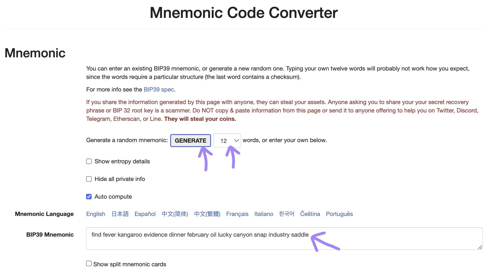
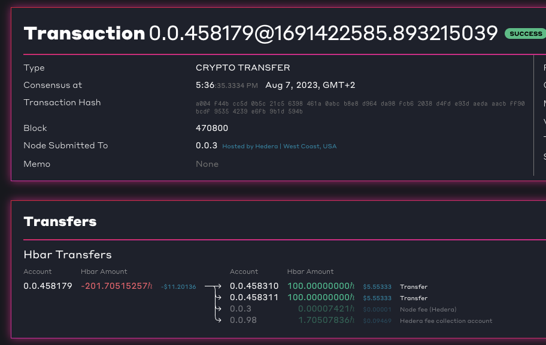

# Setup

## Video


Hedera Smart Contract Service Workshop Part 2/6 | Setup


## Set up the project

The setup has already been (mostly) done. All that's left for you to do is clone the [accompanying tutorial GitHub repository](https://github.com/hedera-dev/hedera-smart-contracts-workshop) and install the dependencies:

```sh
git clone -b main git@github.com:hedera-dev/hedera-smart-contracts-workshop.git
cd hedera-smart-contracts-workshop
```


If you do not have SSH available on your system, or are unable to configure it for GitHub, you may wish to try this git command instead:

`git clone -b main https://github.com/hedera-dev/hedera-smart-contracts-workshop.git`


## Configuration

### Step B1: Environment variables file

In the root directory of the repo, you will find a file named `.env.example`. Make a copy of this file, and name it `.env`.

```shell
cp .env.example .env
```

### Step B2: Operator account

An operator account is used to obtain an initial sum of HBAR on Hedera Testnet, and then use that to pay for various Hedera network operations. This includes everything from basic transactions, to gas fees for HSCS interactions.

Visit the [Hedera Portal](https://portal.hedera.com/) to get started.

(1) Create a Testnet account.

<figure><figcaption><p>Hedera Portal - Create Testnet Account</p></figcaption></figure>

(2) Copy-paste the confirmation code sent to your email.

<figure><figcaption><p>Hedera Portal - Email Verification</p></figcaption></figure>

(3) Fill out this form with details for your profile.

<figure><figcaption><p>Hedera Portal - Profile Details</p></figcaption></figure>

(4) In the top-left there is a drop down menu, select between Hedera Testnet (default) and Previewnet:

<figure><figcaption><p>Hedera Portal - Select Network</p></figcaption></figure>

(5) From the next screen that shows your accounts, copy the value of the "**DER-encoded private key**" and replace `OPERATOR_KEY` in the `.env` file with it.

<figure><figcaption><p>Hedera Portal - Account Details</p></figcaption></figure>

(6) From the same screen, copy the value of "**Account ID**" and replace the value of the `OPERATOR_ID` variable in the `.env` file with it.


Note that private keys should be stored and managed securely. For the purposes of a tutorial, secure key management has been skipped, and you are storing your private keys in plain text on disk. Do **not** do this in production applications.


### Step B3: Seed phrase

When developing smart contracts, you often need more than 1 account to do so. Thankfully we do not need to go through the somewhat cumbersome process of creating multiple accounts via the Hedera Portal - you only really need to do that once for the operator account.

Any subsequent accounts that you wish to create can be generated programmatically, and funded with HBAR from your operator account.

To do so, we will utilise something called a **seed phrase**, which is a sequence of selected dictionary words chosen at random. This process is defined in [BIP-39](https://github.com/bitcoin/bips/blob/master/bip-0039.mediawiki).

Subsequently, we will use that seed phrase as an input and generate multiple accounts; each of which consists of a private key, a public key, and an address. This process is defined in [BIP-44](https://github.com/bitcoin/bips/blob/master/bip-0044.mediawiki).

<details>

<summary>BIP, EIP, and HIP</summary>

* "BIP" stands for Bitcoin Improvement Proposal.
* "EIP" stands for Ethereum Improvement Proposal, and was preceded by "ERC" which stands for Ethereum Request for Comments.
* "HIP" stands for Hedera Improvement Proposal.

</details>

Interestingly these 2 BIPs were never adopted by the Bitcoin community, but are almost de-facto used by everyone in the Ethereum community. On Hedera, you can use these 2 BIPs to generate Hedera EVM accounts, but this is not possible for Hedera-native accounts (as they use a different type of public key algorithm).

<details>

<summary>ECDSA and EdDSA</summary>

ECDSA (Elliptic Curve Digital Signing Algorithm) is a public key algorithm, and secp256k1 is a particular configuration that may be used by the ECDSA algorithm.

EdDSA (Edwards Digital Signing Algorithm) is another public key algorithm, and Ed25519 is a particular configuration that may be used by the EdDSA algorithm.

Both Bitcoin and Ethereum use ECDSA with secp256k1 for their accounts.

Hedera native accounts use EdDSA with Ed25519, and Hedera EVM accounts use ECDSA with secp256k1.

</details>

Enough theory - let's generate a seed phrase!

Visit [`iancoleman.io/bip39`](https://iancoleman.io/bip39/), and you can generate a BIP39 seed phrase there: \`

<figure><figcaption></figcaption></figure>

\`

* Locate the line that is labelled "Generate a random mnemonic"
* Select any number from the dropdown that is more than or equal to `12`
* Press "GENERATE"
* Locate the section that is labelled "BIP39 Mnemonic"
* Copy these words from the text box - this will be your BIP39 seed phrase

Replace the value of the `BIP39_SEED_PHRASE` variable in the `.env` file with this phrase.


* [Ref: BIP-39 Mnemonic code for generating deterministic keys](https://github.com/bitcoin/bips/blob/master/bip-0039.mediawiki)
* [Ref: BIP-44: Multi-Account Hierarchy for Deterministic Wallets](https://github.com/bitcoin/bips/blob/master/bip-0044.mediawiki)


### Step B4: Fund several Hedera EVM accounts

At this point, you have an operator account, which is already funded with HBAR, and you have a seed phrase. Let's generate more accounts based on the seed phrase , and then transfer HBAR to them from the operator account.

First switch to the `intro` directory, and install dependencies using npm.

```
cd ./intro
npm install
```

Next, let's use a script already prepared for you. We want this script to generate 2 Hedera EVM accounts, and transfer 100 HBAR to each of them, so let's set those values in `generate-evm-accounts.js`.

```javascript
const NUM_ACCOUNTS = 2;
const AMOUNT_PER_ACCOUNT = 100;
const HD_PATH = "m/44'/60'/0'/0";
```

<details>

<summary>Choice of derivation path</summary>

Above, we're using `m/44'/60'/0'/0` as the derivation path. This value is the Ethereum derivation path, and we need to use this because Metamask does not allow it to be configured.

</details>

Run this script.

```shell
node ./generate-evm-accounts.js
```

This should output something similar to the following:

```
EVM account #0 generated.
#0     HD path: m/44'/60'/0'/0/0
#0 Private key: 3030020100300706052b8104000a04220420fb11afc5d508036ac7a9df9f1eb7cea551e4a7b738c2c70da099fe5f379f3364
#0  Public key: 302d300706052b8104000a032200027a753c29cc9f0ea0b6ccf0614676daeba3da0dbd5f54ef9850ad3878ded4e077
#0 EVM address: 07ffaadfe3a598b91ee08c88e5924be3eff35796
EVM account #1 generated.
#1     HD path: m/44'/60'/0'/0/1
#1 Private key: 3030020100300706052b8104000a042204206e3ff9f1f1ae58248a5838ec877acc55d103009586224d76ab74a652d408cf12
#1  Public key: 302d300706052b8104000a03220002c4c2ed7a682a601c9c61dec42e87442b63893a6e5efdf6dc327a4b3bcc62aba9
#1 EVM address: 1c29e31d241f0d06f3763221f5224a6b82f09cce
Transfer transaction ID: 0.0.3996280@1690161480.080071857
HashScan URL: https://hashscan.io/testnet/transaction/0.0.3996280@1690161480.080071857
```

### Check funding of EVM accounts on Hashscan

Copy the HashScan URL, paste it into a browser, and you will see a "Transaction" page on HashScan.

<figure><figcaption><p>Screenshot showing a single transaction with multiple recipients transferring HBAR (on hashscan.io).</p></figcaption></figure>

Scroll down to the "Transfers" section, which should show the flow of HBAR between various accounts. In this case `-200` (and a fractional amount of `-0.00185217`) from the operator account, `+100.00000000` to each of the 2 EVM accounts, and fractional amounts to a couple of other accounts to pay for transaction processing. (Note that the fractional amounts may vary, they won't necessarily be `0.00185217` as above.)

Now you should have 1 Hedera-native account (previously funded), plus 2 new EVM accounts (freshly funded).

### Address formats

Hedera networks have a native account address format, called the _Account ID_. An example of this would be: `0.0.3996280`.

Hedera also supports EVM account address formats. This has 2 variants:

The _EVM Address Alias_. An example of this would be: `0x7394111093687e9710b7a7aeba3ba0f417c54474`. This is sometimes referred to as the _non-long-zero_ address.

The _Account Num Alias_. An example of this would be: `0x00000000000000000000000000000000003cfa78`. This is sometimes referred to as the _long-zero_ address.

Finally Hedera also supports a _Key Alias_, and this is something that you're unlikely to encounter in most situations.

While you may choose to interact with the Hedera network using any of the address formats, when interacting with smart contracts, the _EVM Address Alias_ is the most useful, as that is what is visible and understood by smart contracts when they are invoked.


* [Ref: Hedera - Account Properties](https://docs.hedera.com/hedera/core-concepts/accounts/account-properties)
* [Ref: HIP-583 - Expand alias support in CryptoCreate & CryptoTransfer Transactions](https://hips.hedera.com/hip/hip-583)
* [Ref: hedera-code-snippets - Convert address from Hedera-native (`S.R.N`) format to EVM (`0x...`) format](https://github.com/hedera-dev/hedera-code-snippets/tree/main/convert-hedera-native-address-to-evm-address)
* [Ref: Stackoverflow - How to convert a Hedera native address into a non-long-zero EVM address?](https://stackoverflow.com/q/76680532/194982)


### Step B5: RPC endpoint

For this step, you have a choice:

* Run your own Hedera RPC Relay server: [Configuring Hedera JSON-RPC Relay endpoints](https://docs.hedera.com/hedera/tutorials/more-tutorials/json-rpc-connections/hedera-json-rpc-relay)
* Use an RPC service provider, Arkhia: [Configuring Arkhia RPC endpoints](https://docs.hedera.com/hedera/tutorials/more-tutorials/json-rpc-connections/arkhia)

Whichever method you choose, obtain the JSON-RPC URL for Hedera Testnet, and replace the value of the `RPC_URL_HEDERATESTNET` variable in the `.env` file with this.
